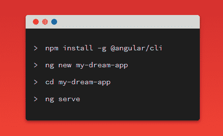

# 如何在 Windows 上安装 Angular:Angular CLI、Node.js 和构建工具指南

> 原文：<https://www.freecodecamp.org/news/how-to-install-angular-on-windows-a-guide-to-angular-cli-node-js-and-build-tools/>



在本教程中，我们将学习如何在 Windows 中安装 Angular CLI 并使用它来创建 Angular 项目。

## 什么是 Angular CLI？

Angular CLI 是用于初始化和使用 Angular 项目的官方工具。它将您从复杂的配置和构建工具(如 TypeScript、Webpack 等)中解放出来。

安装 Angular CLI 后，您需要运行一个命令来生成一个项目，并使用本地开发服务器运行另一个命令来处理您的应用程序。

像当今大多数现代前端工具一样，Angular CLI 构建在 Node.js 之上。

Node.js 是一种服务器技术，允许您在服务器上运行 JavaScript 并构建服务器端 web 应用程序。但是，Angular 是一种前端技术，所以即使需要在开发机器上安装 Node.js，也只是为了运行 CLI。

一旦你为生产构建了你的应用，你就不需要 Node.js 了，因为最终的包只是静态的 HTML、CSS 和 JavaScript，可以由任何服务器或 CDN 提供服务。

也就是说，如果你正在用 Angular 构建一个全栈 [web 应用，如果你喜欢用 JavaScript 做前端和后端，你可能需要 Node.js 来创建后端部分。](https://shabang.dev/question/how-to-create-a-new-angular-9-project-using-npm/)

看看 MEAN stack——这是一个包括 MongoDB、Express(一个构建在 Node.js 之上的 web 服务器和 REST API 框架)和 Angular 的架构。如果你想一步一步地开始学习，你可以阅读这篇文章。

在这种情况下，Node.js 用于构建应用程序的后端部分，并且可以替换为您想要的任何服务器端技术，如 PHP、Ruby 或 Python。但是 Angular 不依赖 Node.js，除了它的 CLI 工具和从 npm 安装包。

NPM 代表节点包管理器。这是一个用于托管节点包的注册表。近年来，它还被用于发布前端包和库，如 Angular、React、Vue.js 甚至 Bootstrap。

**注**:你可以免费下载我们的 **[Angular 8 书:用 Angular 8](https://www.techiediaries.com/angular-book-build-your-first-web-apps/)** 构建你的第一个 web 应用。

## 在 Windows 上安装 Angular CLI

首先，您需要在开发机器上安装 Node 和 npm。有许多方法可以做到这一点，例如:

*   使用 NVM(节点版本管理器)在系统中安装和使用多个版本的节点
*   使用操作系统的官方软件包管理器
*   从官网安装。

简单点用官网吧。只需访问[下载页面](https://nodejs.org/en/download/)并获取 Windows 的二进制文件，然后按照安装向导进行操作。

您可以通过在命令提示符下运行以下命令来确保系统上安装了 Node，该命令应显示 Node 的安装版本:

```
$ node -v 
```

接下来，运行以下命令安装 Angular CLI:

```
$ npm install @angular/cli 
```

命令成功完成后，您应该已经安装了 Angular CLI。

## 角度 CLI 快速指南

安装 Angular CLI 后，您可以运行许多命令。让我们从检查安装的 CLI 版本开始:

```
$ ng version 
```

您可能需要运行的第二个命令是`help`命令，以获得完整的使用帮助:

```
$ ng help 
```

CLI 提供了以下命令:

`add`:为您的项目添加对外部库的支持。

`build (b)`:在给定的输出路径下，将 Angular app 编译到名为`dist/`的输出目录下。必须从工作区目录中执行。

`config`:检索或设置角度配置值。

`doc (d)`:在浏览器中打开 Angular 官方文档( [angular.io](https://angular.io/) )，搜索给定关键字。

`e2e (e)`:构建并提供一个 Angular 应用程序，然后使用量角器运行端到端测试。

`generate (g)`:根据原理图生成和/或修改文件。

`help`:列出可用的命令及其简短描述。

`lint (l)`:对给定项目文件夹中的 Angular app 代码运行林挺工具。

`new (n)`:创建一个新的工作空间和一个初始的 Angular app。

`run`:运行项目中定义的自定义目标。

构建和服务你的应用，在文件改变的基础上重建。

`test (t)`:在项目中运行单元测试。

`update`:更新应用程序及其依赖项。参见[https://update.angular.io/](https://update.angular.io/)

`version (v)`:输出角度 CLI 版本。

`xi18n`:从源代码中提取 i18n 消息。

## 生成项目

通过在命令行界面中运行以下命令，可以使用 Angular CLI 快速生成角度项目:

```
$ ng new frontend 
```

*注:* **前端** *是项目名称。当然，您可以为您的项目选择任何有效的名称。因为我们将创建一个全栈应用程序，所以我使用* frontend *作为前端应用程序的名称。*

如前所述，CLI 将询问您*是否要添加角度路由？*，输入`y`(是)或`n`(否)即可回答，默认选项。它还会询问您想要使用的样式表格式(比如 CSS)。选择您的选项并点击`Enter`继续。


之后，您将创建一个带有目录结构和一堆配置和代码文件的项目。它主要是 TypeScript 和 JSON 格式的。让我们看看每个文件的作用:

*   `/e2e/`:包含网站端到端(模拟用户行为)测试
*   `/node_modules/`:使用`npm install`将所有第三方库安装到该文件夹
*   `/src/`:包含应用程序的源代码。大多数工作将在这里完成
*   `/app/`:包含模块和组件
*   `/assets/`:包含静态资产，如图像、图标和样式
*   `/environments/`:包含环境(生产和开发)特定的配置文件
*   `browserslist`:autoprefixer 需要 CSS 支持
*   `favicon.ico`:最喜欢的图标
*   `index.html`:主 HTML 文件
*   `karma.conf.js`:Karma(一个测试工具)的配置文件
*   `main.ts`:启动*应用模块*的主启动文件
*   `polyfills.ts`:角度需要的多孔填料
*   `styles.css`:项目的全局样式表文件
*   这是 Karma 的一个配置文件
*   `tsconfig.*.json`:TypeScript 的配置文件
*   `angular.json`:包含 CLI 的配置
*   `package.json`:包含项目的基本信息(名称、描述和依赖关系)
*   `README.md`:包含项目描述的降价文件
*   `tsconfig.json`:TypeScript 的配置文件
*   `tslint.json`:ts lint(静态分析工具)的配置文件

## 为您的项目服务

Angular CLI 为在本地机器上开发前端应用程序提供了完整的工具链。因此，您不需要安装本地服务器来服务您的项目——您可以简单地从您的终端使用`ng serve`命令来本地服务您的项目。

首先在项目文件夹中导航，并运行以下命令:

```
$ cd frontend
$ ng serve 
```

您现在可以导航到 [http://localhost:4200/](http://localhost:4200/) 地址，开始使用您的前端应用程序。如果您更改任何源文件，该页面将自动重新加载。

## 产生角度伪影

Angular CLI 提供了一个`ng generate`命令，帮助开发人员生成基本的 Angular 构件，如模块、组件、指令、管道和服务:

```
$ ng generate component my-component 
```

`my-component`是组件的名称。Angular CLI 将自动在`src/app.module.ts`文件中添加对`components`、`directives`和`pipes`的引用。

如果要将组件、指令或管道添加到另一个模块(除了主应用程序模块`app.module.ts`)中，只需在组件名称前加上模块名称和斜杠:

```
$ ng g component my-module/my-component 
```

`my-module`是现有模块的名称。

## 结论

在本教程中，我们看到了如何在我们的 Windows 机器上安装 Angular CLI，并使用它从头开始初始化一个新的 Angular 项目。

我们还看到了各种命令，您可以在整个项目开发过程中使用这些命令来生成有角度的工件，比如模块、组件和服务。

查看我们的其他[角度教程](https://www.techiediaries.com/angular/)。

你可以通过作者的[个人网站](https://www.ahmedbouchefra.com/contact)、[推特](https://twitter.com/ahmedbouchefra)、 [LinkedIn](https://www.linkedin.com/in/mr-ahmed/) 和 [Github](https://github.com/techiediaries) 联系或关注作者。