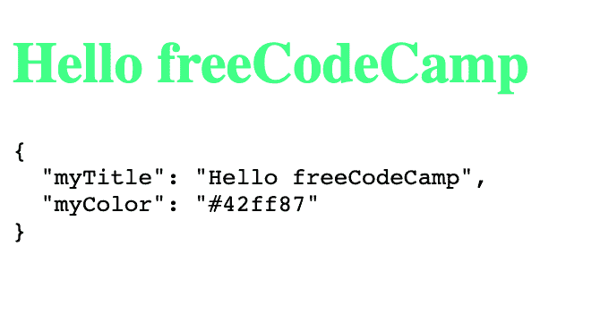

# 如何使用 Webpack 在 HTML、CSS 和 JavaScript 之间共享变量

> 原文：<https://www.freecodecamp.org/news/how-to-share-variables-across-html-css-and-javascript-using-webpack/>

本周早些时候，我读了[一篇文章](https://calendar.perfplanet.com/2019/the-unseen-performance-costs-of-css-in-js-in-react-apps/)解释 CSS-in-JS 如何降低一些 React 应用程序的渲染速度，以及静态 CSS 如何更快。但是 CSS-in-JS 非常受欢迎，因为除了其他特性之外，您可以使用 JavaScript 变量动态地设计样式。

在本教程中，我将向您展示如何在 Webpack 的帮助下在您的任何 web 项目中重新创建这一特权(我假设您知道如何使用它)。首先，我们希望 Webpack 将我们的源文件捆绑到一个静态的`dist/`文件夹中。

你可以在这里查看源代码。

## 1.设置我们的应用程序

### 无聊的部分

为本教程创建一个文件夹，打开您的终端，并初始化一个项目:

```
npm init -y 
```

首先，如果还没有完成，安装 [node.js](https://nodejs.org/en/) 和 [Webpack](https://webpack.js.org/) :

```
npm install webpack webpack-cli --save-dev 
```

让我们在`package.json`中创建一个脚本，告诉 Webpack 使用我们的配置文件:

```
 "scripts": {
    "build": "webpack --config webpack.config.js"
  } 
```

在您的文件夹的根目录下，创建一个`globals.js`文件，我们的共享变量将存储在这里:

```
module.exports = {
  myTitle: 'Hello freeCodeCamp!',
  myColor: '#42ff87',
}; 
```

Webpack 配置文件如下所示(`webpack.config.js`)。在文件夹的根目录下创建它:

```
module.exports = {
  entry: __dirname + '/app/index.js',
  output: {
    path: __dirname + '/dist',
    filename: 'index_bundle.js'
  },
}; 
```

我们的源代码将位于一个`app`文件夹中。像这样创建它:

```
mkdir app && cd app 
```

此时，您将需要`index.html`和`index.js`文件。在`app`文件夹中创建这些文件:

```
touch index.html index.js 
```

完美！你都准备好了。？

您的文件夹应该如下所示:

```
|-- node_modules/
|-- package.json
|-- webpack.config.js
|-- globals.js
|-- app/
	|-- index.html
	|-- index.js 
```

## 2.用`html-webpack-plugin`渲染我们的 HTML 文件

这个`app/index.html`是空的。让我们在其中添加一些标记，然后添加一个自定义变量:

```
<html lang="en">
<head>
  <title>Webpack shared variables!</title>
</head>
<body>
  <h1><%= myTitle %></h1>
</body>
</html> 
```

如您所见，我们正试图在 HTML 中打印一个变量...这是不可能的！为了让它工作，我们将使用 [html-webpack-plugin](https://github.com/jantimon/html-webpack-plugin) ，它让我们能够使用 [EJS](https://ejs.co/) 语法和**将数据注入其中**。

该插件将生成一个有效的 HTML 文件。同时，您应该将您的`app/index.html`文件重命名为`app/index.ejs`。

```
npm install --save-dev html-webpack-plugin 
```

让我们回到我们的配置文件。`html-webpack-plugin`有一个有趣的`templateParameters`选项，允许我们传递一个对象作为参数。在`webpack.config.js`中启用插件，如下所示:

```
const HtmlWebpackPlugin = require('html-webpack-plugin');
const globals = require('./globals.js')

module.exports = {
	// ... previous config, entry, output...
  plugins: [
    new HtmlWebpackPlugin({
      template: 'app/index.ejs',
      templateParameters: globals,
    })
  ]
}; 
```

跑`npm run build`和*ta-daaaaa*% = my title %>成了 Hello freeCodeCamp！这项工作是由 Webpack 在编译期间运行`html-webpack-plugin`时完成的。

看到了吗？使用正确的工具，这非常简单:HTML ✅

## 3.在 JavaScript 中使用我们的变量

唷，这么多行只是为了打印一个变量！？有了 Webpack，事情往往会变得复杂。这个非常简单:在 JavaScript 中，只需导入文件。在你的`app/index.js`:

```
import globals from '../globals.js'

document.write(
'<pre>' +
  JSON.stringify(globals, null, 2) +
'</pre>'
); 
```

这将在页面上打印我们的全局对象。现在让我们继续讨论 CSS。

## 4.在我们的 CSS 中使用共享变量

这是我们最后的老板？

好吧，伙计们，你们抓到我了…我撒谎了。我们不能在 CSS 中直接使用全局变量——我们必须使用预处理器。在这个例子中，我们将使用 [SASS](https://sass-lang.com/) 。

在 Webpack 方面，一个插件是不够的。我们必须使用一个[加载器](https://webpack.js.org/loaders/)将 SASS 转换成 CSS。在这种情况下，我们需要 [sass-loader](https://github.com/webpack-contrib/sass-loader) 包，所以按照文档安装它:

```
npm install sass-loader node-sass css-loader style-loader --save-dev 
```

回到编码。现在我们有了 SASS，创建您的样式表文件，`app/style.scss`:

```
h1 {
  color: $myColor;
} 
```

我们的 SASS 已经设置好了——现在我们如何将数据注入其中呢？`sass-loader`包有一个[前置数据](https://github.com/webpack-contrib/sass-loader#prependdata)选项！但是它以一个字符串作为参数，也就是说你的数据应该是这样的:`"$myColor: red; myTitle: '...'";`。

我们必须将它自动化，并将 JavaScript 对象转换成字符串。我在`npm`上没有找到让我满意的包，所以我写了[我自己的转换器](https://gist.github.com/adrienZ/0257e37bf4788b903ba76fa82dac1ed1)。下载文件并将其添加到您的项目中(在我的例子中是`utils/jsToScss.js`)。

您的最终`webpack.config.js`应该是这样的:

```
const globals = require("./globals.js");
const HtmlWebpackPlugin = require("html-webpack-plugin");
const jsToScss = require("./utils/jsToScss.js");

module.exports = {
  entry: __dirname + "/app/index.js",
  output: {
    path: __dirname + "/dist",
    filename: "index_bundle.js"
  },
  plugins: [
    new HtmlWebpackPlugin({
      template: "app/index.ejs",
      templateParameters: globals
    })
  ],
  module: {
    rules: [
      {
        test: /\.s[ac]ss$/i,
        use: [
          // Creates `style` nodes from JS strings
          "style-loader",
          // Translates CSS into CommonJS
          "css-loader",
          // Compiles Sass to CSS
          {
            loader: "sass-loader",
            options: {
              prependData: jsToScss(globals)
            }
          }
        ]
      }
    ]
  }
}; 
```

以下是您应该看到的内容:



[https://glitch.com/edit/#!/shared-variables-webpack?path=webpack.config.js](https://glitch.com/edit/#!/shared-variables-webpack?path=webpack.config.js)

如果你还在读这篇教程，感谢你的关注。希望对你有帮助！Webpack 是一个非常强大的工具，你应该深入研究？

注意:在你的`dist/`文件夹中，你可以看到没有生成任何 CSS。这是因为我使用了`style-loader`来保持这个演示的简单性。要生成 CSS 文件，请看一下[迷你 css-extract-plugin](https://webpack.js.org/plugins/mini-css-extract-plugin/) 。