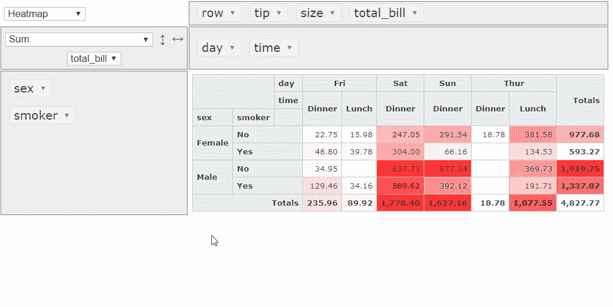
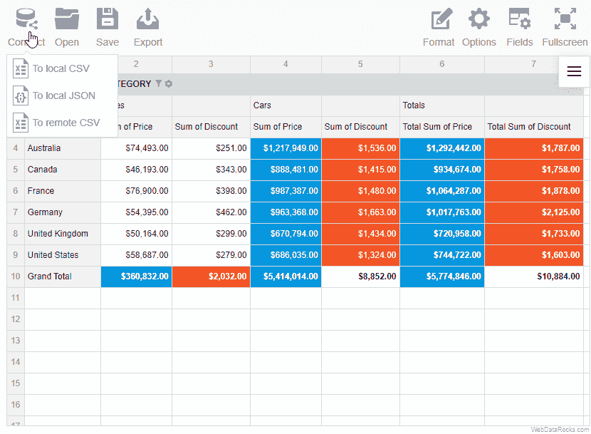
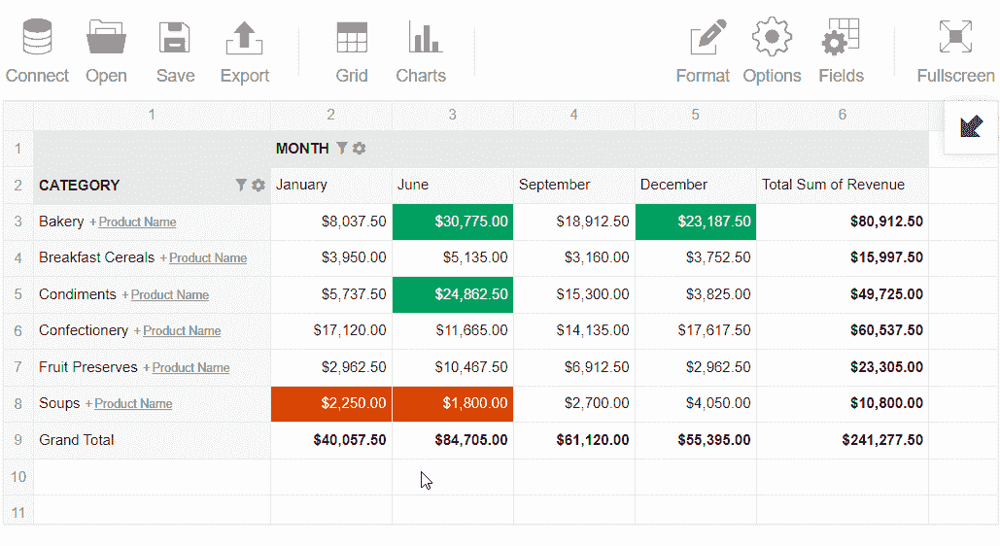
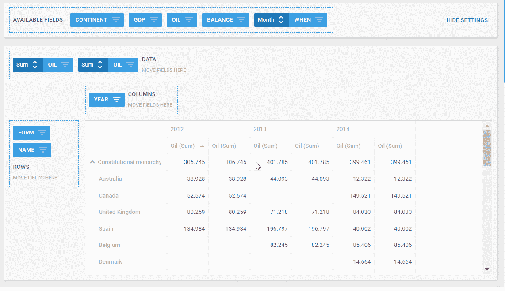

# 为您的 BI 解决方案提供最佳的数据可视化和 web 报告工具

> 原文：<https://www.freecodecamp.org/news/4-data-visualization-and-web-reporting-tools-for-your-bi-solution-35503cc8b7e3/>

### **通过智能数据分析让复杂变得简单**

如今，很难高估有洞察力的分析的价值。所有业务流程都变成了数据驱动:营销、会计、人力资源、客户服务、金融。

为了说服决策者，你需要恰当地传达数据的含义。一种可能的技术是编写一个分析性的 web 报告。它的另一个重要部分是高性能的数据可视化，这有助于您了解公司的业务趋势。

我做了一些研究，现在我将向您全面介绍四种流行的网络报告和数据分析工具。前两个是免费的，后面两个比较高级。这些工具对**开发人员** 和**数据分析师**都很有用。

### **免费工具**

以下选项为基本 web 报告提供了机会。

#### **PivotTable.js**

[PivotTable.js](https://pivottable.js.org/?r=m4) 是一个开源的 JavaScript 数据透视表。它旨在提供数据分析的功能，并要求对 JavaScript 有很好的了解，以发挥其全部潜力。

1.  内置网络报告功能:

*   **的支持。csv** 和 **JSON** 数据源
*   **聚合**、**过滤**、**排序**、**、**分组可用。共有 **22 个函数**，其中包括用于统计研究的函数。
*   借助于**拖放**功能，你可以将字段从列移动到行，反之亦然。
*   自定义**单元格格式**
*   **TSV 渲染器**用于导出到 TSV 格式
*   能够定义**多个聚合器**
*   一个**热图**渲染选项

2.查看定制功能:

*   用于触摸设备的支持移动的渲染器是可用的。
*   网格的单元格可以被**着色。**
*   有一个类似 Excel 的布局:每个层次结构显示在单独的列或行中。
*   [定制格式](https://pivottable.js.org/examples/montreal_2014.html)是可能的，也可以定制热图色阶。
*   **语言本地化**:数据透视表有**英语**和**法语**、两种版本，还可以用 JavaScript 编写自己的“语言包”。

3.集成和兼容性:

*   有一款 [React 版本](https://react-pivottable.js.org/)集成了 Plotly 图表。
*   它与 Python/Jupyter 和 R/RStudio 兼容。

4.限制:

*   处理多达 100K 行
*   不幸的是，小计只能通过一个额外的插件。
*   用于导出到 CSV 和 Excel 的内置渲染器不可用。
*   要保存报告的配置，您需要自己实现该功能。然而，PivotTable.js 提供了定制的自由度。

5.创建图表:

您可以使用渲染器来集成 **C3 图表**、 **D3.js** 、 **Plotly** 、和**谷歌图表**。在第三方插件的帮助下，可以将 **Highcharts** 与数据透视表一起使用。

**了解更多:**

*   [从 GitHub 下载](https://github.com/nicolaskruchten/pivottable)

**js fiddle 上的演示:**

*   [主演示](https://jsfiddle.net/nicolaskruchten/kn381h7s/)
*   [R 数据集分析](https://pivottable.js.org/examples/rcsvs.html)

#### WebDataRocks

[**web data rocks**](https://www.webdatarocks.com/?r=m4)**是一个用 JavaScript 编写的可嵌入的 **web 透视表**。它是一个轻量级组件。您可以在 web 应用程序中使用它，并基于您的数据构建交互式报表。可以在移动设备和桌面客户端上查看。它适用于技术含量较低的最终用户，但为开发人员提供了高级定制选项。**

**1.内置网络报告功能:**

*   **支持**本地和远程** **JSON** 和**。csv** 数据源**
*   **主要功能可通过数据透视表的特殊额外部分——**工具栏来访问。****
*   **通过 UI，聚合、多重过滤、排序、T2 分组都很容易。有 13 个聚合函数和创建自定义计算值的能力。**
*   **通过**字段列表**配置字段，并借助**拖放**功能将它们从列移动到行，反之亦然**
*   **创建**多级层级****
*   **网格的每个单元都可以钻取。**
*   **与同事分享您的成果:您可以保存报告并将其导出为 **PDF、Excel、**和 **HTML** 格式，或**打印**格式。**

**2.查看定制功能:**

*   **可以改变报告工具的外观。有四个预定义的主题可能符合你的口味，也有可能由 T2 创建你自己的主题。**
*   **您可以使用**条件格式**特性来**高亮显示**基于特定值的数据透视表中最重要的单元格。**
*   **数字格式**
*   **如果你需要**改变布局**，你可以选择一个经典的，紧凑的，或者平面形式的透视表。对我来说，紧凑的形式具有最简洁的风格。**
*   ****语言本地化** — 您可以在可用的语言中进行选择，或者使用一个简单的模板 JSON 文件将数据透视表翻译成所需的语言。**

**3.集成和兼容性:**

*   **WebDataRocks 可以嵌入 AngularJS、Angular 和 React 应用程序中。**

**4.限制:**

*   **最大数据大小为 1Mb。**

**5.创建图表:**

**很容易将 WebDataRocks 与 Google Charts、Highcharts 或任何其他图表库集成。文档中有教程。**

****了解更多:****

*   **[快速启动](https://www.webdatarocks.com/doc/how-to-start-online-reporting/?r=m4)**
*   **[3 个安装选项](https://www.webdatarocks.com/doc/download/?r=m4)**

****CodePen 演示:****

*   **[具有类型的多级层次结构](https://codepen.io/webdatarocks/pen/jvJKoY)**
*   **[带有高图表的仪表板](https://codepen.io/webdatarocks/pen/dqdvmg)**

### ****高级解决方案****

**让我们转到功能更强大的工具**嵌入式 BI 工具**并提供更高级的 web 报告体验。**

**这两款工具都有 30 天的免费试用期。**

#### ****Flexmonster****

****

**[**Flexmonster 透视表&图表**](https://www.flexmonster.com/?r=m4) 是一个 JavaScript 透视表组件。它非常适合对表格和多维数据进行深度分析，并基于这些数据构建可视化报告。与免费选项的主要区别是 OLAP 立方体支持和更多的集成选项。**

**1.内置网络报告功能:**

*   **支持的数据格式有 **CSV，JSON** ，来自 **SQL** 和 **NoSQL** 数据库的数据，以及 **OLAP 立方体** — 如微软 Analysis Services 和 Pentaho Mondrian 立方体)。**
*   **您可以使用**多个聚合**来汇总数字数据。有 **16 个聚合函数**可用，并且能够创建计算值。**
*   **数据的**排序**和**分组****
*   ****过滤**可以通过值进行**—显示前/后 N 条记录— **成员名称**和/或应用于整个**报表。******
*   **您可以通过使用**事件处理程序为数据透视表添加交互性。****
*   **最终报告可以保存在****JSON 文件**中，并应用所有配置和格式。您可以稍后加载它以进行进一步的工作。****
*   ****将报告**导出为 HMTL、Image、CSV、Excel** 或 **PDF** 格式，无需连接任何第三方插件。****

****2.查看定制功能****

*   ****可以选择五种 **主题风格**中的一种或创建一个自定义风格。****
*   ****[网格定制](https://www.flexmonster.com/blog/grid-customization-and-styling-beyond-css/?r=m4)功能允许创建**热图**可视化。****
*   ******单元格的条件格式******
*   ******数字格式******
*   ******日期**值可以以用户定义的格式显示。****
*   ****组件**本地化**包括七种语言。您可以在模板 JSON 文件的帮助下自己翻译数据透视表。****
*   ****便于移动的设计****

****3.集成和兼容性****

*   ****Flexmonster 可以包含在简单的网页中，也可以集成到 **AngularJS、**或 **React** 应用中。官网上也有关于集成 **jQuery** 和 **Webpack 的教程。******
*   ******MongoDB 数据分析**对于那些在文档中存储了大量数据的人来说是特别感兴趣的。通过 Node.js 支持到 MongoDB 的连接。****

****4.限制:****

****处理多达 100 万行，因此大数据集没有问题。****

****5.创建图表:****

******Flexmonster** 拥有 [**透视表**](https://www.flexmonster.com/demos/pivot-charts/?r=m4) 作为组件的一部分。要访问其他图表，您可以使用与 Google Charts、Highcharts、FusionCharts 或任何其他第三方图表库集成的指南。所有这些方法都有助于创建交互式仪表板。****

******了解更多:******

*   ****[快速启动](https://www.flexmonster.com/doc/how-to-create-js-pivottable/?r=m4)****
*   ****[下载选项](https://www.flexmonster.com/download-page/?r=m4)****

******演示:******

*   ****[主演示](https://www.flexmonster.com/demos/pivot-table-js/?r=m4)****
*   ****[热图](https://www.flexmonster.com/demos/heatmap/?r=m4)****

#### ******DHTML pivot******

********

****[**DhtmlxPivot**](https://dhtmlx.com/docs/products/dhtmlxPivot/)**是一个用于创建分析报表的 JavaScript 透视网格。它是 dhtmlxSuite 的一部分，但是可以从捆绑包中单独购买。它提供了一个现代化的用户界面，并集成了不同的服务器端技术。******

******1.内置网络报告功能:******

*   ******支持连接到 **JSON** 、**。csv** ，和 **XML** 数据源。可以从 JavaScript 数组和 HTML 表中加载数据。******
*   ****只有四个内置的聚合函数——最大值、最小值、总和以及计数。可以创建自定义的。****
*   ****数据的**分组**、**搜索**、**T5、**排序********
*   ****过滤**使用 UI 或预定义的字符串、数字和日期过滤器。此外，您可以定义全局过滤器，并设置网格上每页显示的行数。**
*   ****拖放**功能**
*   **可以编辑单元格并用自定义内容填充**
*   **内置模块，用于将报告导出到 Excel 文件，并保存所有配置**

**2.查看定制功能:**

*   **布局可以调整。例如，您可以更改列的宽度、左边距，打开数据透视表的“只读”模式。**
*   ****单元格的条件格式**和**自定义 CSS****
*   **手机友好的设计**
*   **通过特殊方法可以实现接口的本地化。**

**3.集成和兼容性:**

*   **支持多种技术的集成，如 PHP、Java、.NET、Node.js、Ruby on Rails、ASP.NET、ColdFusion 和 Typescript 等技术。**

**4.限制:**

**官网上没有关于一个数据大小的信息。测试表明，数据透视表最多可呈现 10K 行。**

**5.创建图表:**

**要在 web 报表中使用图表，最好的选择是使用 dhtmlxChart。如果您购买了 **dhtmlxSuite** ，它们已经包含在套装中。但是，您可以单独购买。**

****了解更多:****

*   **[样本](https://docs.dhtmlx.com/pivot/samples/)**
*   **[下载软件包](https://dhtmlx.com/docs/download.shtml)**

### ****总结****

**在我看来，完美的工具包含一系列内置功能，例如:**

*   **CSV、JSON 和多维数据的加载**
*   **通过 UI 支持聚合管道**
*   **能够在图表中显示数据，并与任何服务器端和前端技术集成**
*   **导出也应该很容易，不需要包含任何第三方模块。**

**此外，工具应该不断发展，以满足最终用户的新需求。为您的项目选择哪一个取决于您，我希望它将有助于改进您处理数据的方式。**