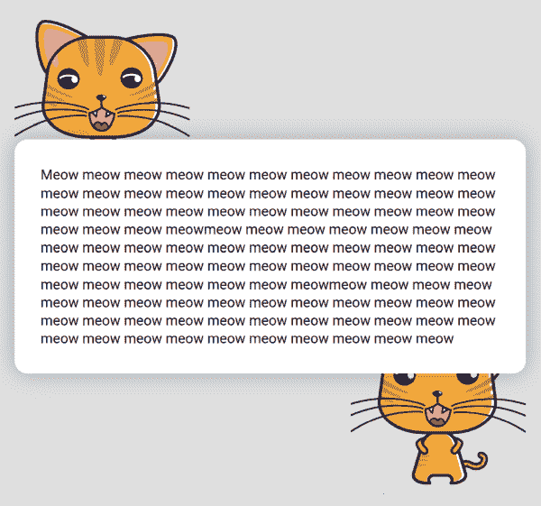
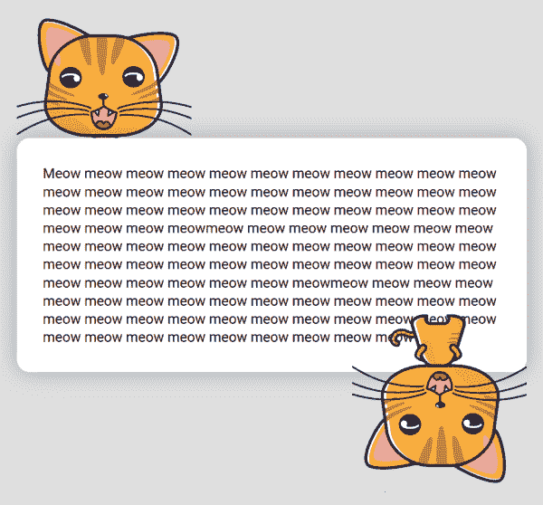

# z 索引不起作用的 4 个原因(以及如何修复)

> 原文：<https://www.freecodecamp.org/news/4-reasons-your-z-index-isnt-working-and-how-to-fix-it-coder-coder-6bc05f103e6c/>

Z-index 是一个 CSS 属性，允许您将层中的元素放置在彼此之上。它非常有用，老实说，是知道如何在 CSS 中使用的一个非常重要的工具。

不幸的是，z-index 是那些不总是以直观方式表现的属性之一。乍一看似乎很简单——较高的 z 索引号意味着该元素将位于 z 索引号较低的元素之上。但是有一些额外的规则使事情变得更加复杂。而且你不能总是通过设置 z-index 为 999999 来解决问题！？

本文将详细解释 z-index 对您不起作用的四个最常见的原因，以及如何修复它。

我们将浏览一些实际的代码示例并解决它们的问题。阅读完本文后，您将能够理解并避免那些常见的 z 索引陷阱！

[https://www.youtube.com/embed/qYi-OLf5q5g?feature=oembed](https://www.youtube.com/embed/qYi-OLf5q5g?feature=oembed)

Check out the video version of this roadmap on my YouTube channel, Coder Coder.

让我们来看看第一个原因:

### 1.相同堆叠上下文中的元素将按出现的顺序显示，后面的元素在前面的元素之上。

在我们的第一个例子中，我们有一个相对简单的布局，包括 3 个主要元素:

*   一只猫的形象
*   带有文本的白色块
*   同一只猫的另一张照片

这是它的 HTML 标记:

```
<div class="cat-top"></div> 

<div class="content__block"> Meow meow meow... </div> 

<div class="cat-bottom"></div>
```

在这个布局中，我们希望白色的文本块在两只猫的上面。

为了实现这一点，我们在两个猫图像的 CSS 中添加了一些负边距，以便它们与白色块重叠一点:

```
.cat-top { 
   margin-bottom: -110px; 
} 

.cat-bottom { 
   float: right; 
   margin-top: -120px; 
}
```

然而，它看起来是这样的:

[//codepen.io/thecodercoder/embed/XQEyeX/?height=265&theme-id=0&default-tab=css,result](//codepen.io/thecodercoder/embed/XQEyeX/?height=265&theme-id=0&default-tab=css,result)

See the Pen [Z-index: #1: set position, #2: natural stacking order, #3: CSS properties](https://codepen.io/thecodercoder/pen/XQEyeX/) by Jessica ([@thecodercoder](https://codepen.io/thecodercoder)) on [CodePen](https://codepen.io).

正如我们所希望的那样，第一只猫确实位于白色内容块的下面。但是第二个猫图像被定位在块的顶部！

为什么会这样？

这种行为的原因是由于网页上的**自然堆叠顺序**。这些指导原则基本上决定了哪些元素在顶部，哪些元素在底部。

即使元素没有它们的 z-index 集合，也有一个韵律和理由来决定哪些元素会在上面。

在我们的例子中，没有一个元素有 z 索引值。所以它们的堆叠顺序是由它们出现的顺序决定的。根据这一规则，标记中后面的元素将位于前面的元素之上。

(你可以在 Mozilla 开发者网络[这里](https://developer.mozilla.org/en-US/docs/Web/CSS/CSS_Positioning/Understanding_z_index/The_stacking_context)阅读更多的堆叠顺序指南。)

在我们的猫和白色方块的例子中，它们遵守这条规则。这就是为什么第一只猫在白色块元素下面，白色块在第二只猫下面。

好了，堆叠顺序很好，但是我们如何修正 CSS，使第二只猫在白色方块下面呢？

让我们看看第二个原因:

### 2.该元素没有设置其位置

决定堆叠顺序的另一个准则是元素是否设置了位置。

要设置元素的位置，将 CSS `position`属性添加到除了`static`之外的任何位置，如`relative`或`absolute`。(你可以在我写的[这篇文章](https://coder-coder.com/css-position-layout/)中了解更多信息。)

根据此规则，已定位的元素将显示在未定位的元素之上。

因此，将白色块设置为`position: relative`，并且不放置两个 cat 元素，会将白色块放在堆叠顺序中 cat 的顶部。

这就是它看起来的样子——你也可以用上面的代码笔来玩。



Woohoo!

现在，我们要做的下一件事是颠倒旋转底部的猫，使用`transform`属性。这样，两只猫都会在白色积木下面，只有它们的头伸出来。

但是这样做会导致更多与`z-index`相关的混乱。我们将在下一部分讨论这个问题和解决方案。

### 3.设置一些 CSS 属性，如不透明度或变换，会将元素放在一个新的堆叠上下文中。

就像我们刚刚提到的，我们要把底部的猫颠倒过来。为了实现这一点，我们将添加`transform: rotate(180deg)`。

```
.cat-bottom { 
   float: right; 
   margin-top: -120px; 
   transform: rotate(180deg); 
}
```

但这会导致底部的猫再次显示在白色块的顶部！



这里到底发生了什么事？？

您可能不会经常遇到这个问题，但是堆叠顺序的另一个方面是，一些 CSS 属性，如`transform`或`opacity`，会将元素放入它自己的新的[堆叠上下文](https://www.w3.org/TR/css-color-3/#transparency)。

这意味着将`transform`添加到`.cat-bottom`元素会使其表现得好像其`z-index`为 0 一样。即使它根本没有设置`position`或`z-index`！(works 有一些信息丰富但[相当密集的文档](https://www.w3.org/TR/css-color-3/#transparency)关于如何与`opacity`属性一起工作)

记住，我们从来没有给白块加一个`z-index`值，只有`position: relative`。这足以将白色块放置在未放置的猫的顶部。

但是由于`.bottom-cat`元素的行为就好像它与`z-index: 0`相对定位一样，所以变换它会将其定位在白色块的顶部。

对此的解决方案是设置`position: relative`并至少在白色块上显式设置`z-index`。你可以更进一步，在 cat 元素上设置`position: relative`和一个更低的`z-index`，只是为了更加安全。

```
.content__block { 
   position: relative; 
   z-index: 2; 
} 

.cat-top, .cat-bottom { 
   position: relative; z-index: 1; 
}
```

在我看来，这样做会解决大多数(如果不是全部)更基本的 z 索引问题。

现在，让我们继续讨论你的`z-index`不起作用的最后一个原因。这个有点复杂，因为它涉及到父元素和子元素。

### 4.由于其父元素的 z 索引级别，该元素处于较低的堆叠上下文中

让我们来看看我们的代码示例:

[//codepen.io/thecodercoder/embed/qwYdZw/?height=265&theme-id=0&default-tab=html,result](//codepen.io/thecodercoder/embed/qwYdZw/?height=265&theme-id=0&default-tab=html,result)

See the Pen [Z-index: #4 different stacking contexts](https://codepen.io/thecodercoder/pen/qwYdZw/) by Jessica ([@thecodercoder](https://codepen.io/thecodercoder)) on [CodePen](https://codepen.io).

这是我们所拥有的:一个简单的网页，有常规的内容，和一个粉红色的侧标签，上面写着“发送反馈”,位于内容的顶部。

然后，当你点击猫的照片时，一个带有透明灰色背景覆盖的模态窗口就会打开。

然而，即使当模式窗口打开时，侧标签仍然在灰色覆盖层之上。我们希望覆盖显示在一切，包括侧标签。

让我们来看看 CSS 中有问题的元素:

```
.content { 
   position: relative; 
   z-index: 1; 
} 

.modal { 
   position: fixed; 
   z-index: 100; 
} 

.side-tab { 
   position: fixed; 
   z-index: 5; 
}
```

所有的元素都有它们的位置设置，侧标签的`z-index`为 5，它位于内容元素的顶部，内容元素位于`z-index: 1`。

然后，模态有`z-index: 100`哪一个*应该*在`z-index: 5`将它放在侧标签的顶部。但是，模态叠加在侧标签的下面。

为什么会这样？

之前，我们讨论了进入堆栈上下文的一些因素，比如元素是否设置了位置，以及它在标记中的顺序。

但是堆叠上下文的另一个方面是子元素被限制在其父元素的堆叠上下文中。

让我们仔细看看这三个要素。

下面是我们的标记:

```
<section class="content">            
    <div class="modal"></div>
</section>

<div class="side-tab"></div>
```

查看标记，我们可以看到内容和侧标签元素是兄弟。也就是说，它们存在于标记中的同一级别(这不同于 z 索引级别)。模态元素是内容元素的子元素。

因为 modal 在 content 元素内部，所以它的`z-index`100 只对它的父元素 content 元素内部有影响。例如，如果有其他的子元素是模态的兄弟元素，它们的`z-index`值会把它们放在彼此的上面或下面。

但是这些子元素的`z-index`值并不意味着父元素之外的任何东西，因为父内容元素的`z-index`被设置为 1。

所以它的孩子，包括情态，都无法突破那个`z-index`层次。

(你可以用这个略显压抑的比喻来记住:一个孩子可以被父母限制，又无法挣脱父母。)

这个问题有几种解决方案:

### 解决方案:将模态移出内容父级，并移入页面的主堆栈上下文中。

更正后的标记将如下所示:

```
<section class="content"></section>

<div class="modal"></div>

<div class="side-tab"></div>
```

现在，模态元素是另外两个元素的兄弟元素。这将所有三个元素置于相同的堆叠上下文中，因此它们的每个 z 索引级别现在将相互影响。

在这个新的堆叠上下文中，元素将按照从上到下的顺序显示:

*   莫代尔(`z-index: 100`)
*   侧标签(`z-index: 5`)
*   内容(`z-index: 1`)

### 替代解决方案:从内容中移除定位，这样就不会限制模态的 z 索引。

如果您不想或不能更改标记，可以通过从 content 元素中删除`position`设置来解决这个问题:

```
.content { 
   // No position set 
} 

.modal { 
   position: absolute; 
   z-index: 100; 
} 

.side-tab { 
   position: absolute; 
   z-index: 5; 
}
```

因为内容元素现在是未定位的，它将不再限制模态的`z-index`值。因此，由于其较高的`z-index`100，开放模态将被定位在侧标签元素的顶部。

虽然这确实可行，但我个人会选择第一种解决方案。

因为如果将来由于某种原因你必须定位内容元素，它将再次限制模态在堆叠上下文中的顺序。

### 总之

我希望这篇教程对你有所帮助！总而言之，z-index 的大多数问题都可以通过遵循以下两条准则来解决:

1.  检查元素的位置集和 z 索引号的顺序是否正确。
2.  确保没有父元素限制其子元素的`z-index`级别。

#### 想要更多吗？

我正在创建一门反应式设计的课程！[在这里注册](https://coder-coder.com/responsive-design-beginners/)当它出版时，你会收到电子邮件。

我在博客 c[oder-coder.com](https://coder-coder.com)上写网页开发教程，在 [Instagram](https://www.instagram.com/thecodercoder/) 上发布小提示，在 [YouTube](https://www.youtube.com/c/codercodertv) 上发布编码教程。