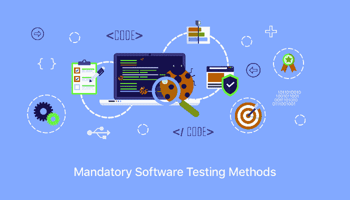

# 这些测试方法对于任何软件都应该是强制性的

> 原文：<https://www.freecodecamp.org/news/4-testing-methods-which-are-mandatory-for-any-software-7731ad194fb3/>

作者:瑞秋·雷

# **这些测试方法对于任何软件都应该是强制性的**

**4 Testing Methods Which Are Mandatory For Any Software**

软件测试是一种以系统的方式调查软件的艺术，目的是发现软件中根深蒂固的缺陷。除此之外，软件测试还检查软件的质量和正确性。在错误被识别之后，开发一个没有错误的和用户友好的软件就变得容易了。

现在，如你所知，即使是一个小的缺陷也会导致整个软件崩溃。如果一个软件崩溃，它会造成巨大的损失。正确的测试方法可以防止这种情况。

测试过程可以识别任何缺陷、bug 或错误。最好从软件开发周期的初始阶段就引入软件测试。所有成功的软件开发公司都坚持这一点。他们认为测试是开发周期的重要部分。此外，自动化测试比手工测试更受欢迎。与手工测试相比，自动化测试更快更准确。

但是，在我们继续之前，有三个软件测试案例你应该知道:

1.  **黑盒测试**—在这种测试方法中，用户/测试人员没有任何软件内部结构的工作知识。它验证软件的功能。黑盒测试是特别有益的，因为黑盒测试人员发现了在程序执行过程中无法追踪的错误。黑盒测试中使用的测试方法有边界值分析、等价划分、基于模型的测试、所有对测试和模糊测试等。
2.  **白盒测试** —在白盒测试中，用户/测试人员具有算法和测试软件结构的专业知识。使用的测试方法有突变测试方法、应用程序编程接口、静态测试、代码语句、代码分支、路径和条件。它通常由软件开发人员执行。
3.  **灰箱测试** —在这种方法中，用户/测试人员可以访问内部算法和数据结构来设计测试用例。灰盒测试有点类似于黑盒测试。如果您的软件需要两个或更多模型的联合输出，那么就部署这种类型的集成测试。

现在，您对这些术语有了清晰的理解，让我们继续讨论各种类型的软件测试。

### 你的软件应该经历的 4 种强制性测试方法

嗯， [**软件公司**](https://www.goodfirms.co/directory/languages/top-software-development-companies) 使用的测试有很多种。每种测试类型都有自己的特点、优点和缺点。但是，在所有的测试方法中，有四种强制性的测试方法对你的软件开发过程至关重要。

#### **1。阿尔法测试**

当软件差不多完成 60-80%时，Alpha 测试就完成了。没有固定的测试周期。每个周期可能长达两周。Alpha 测试包括黑盒测试和白盒测试。

通常，alpha 测试用于现成的软件开发，并且在 beta 测试之前完成。

阿尔法测试有两个阶段:

*   第一阶段:内部开发团队测试软件。测试是在调试软件和基于硬件的调试器的帮助下完成的。
*   第二阶段:QA 团队处理测试，并在一个与其预期用途非常相似的环境中对软件进行测试。因此，为 alpha 测试创建了一个内部虚拟用户环境。

因此，alpha 测试是一种验收测试，在产品投放市场之前进行，以识别缺陷。作为 alpha 测试的结果，有可能做出微小的改变。

#### **2。测试版测试**

Beta 测试也称为预发布测试。这是测试的第二步，在应用程序向公众商业发布之前进行。通常，该软件的测试版只向有限数量的用户发布。

Beta 测试只涉及一到两个周期，每个测试周期大约持续三到六周。Beta 测试确保了软件中没有重大的失败，也让开发人员从最终用户的角度了解它是否满足业务需求。

测试有两个版本:

*   **开放测试版:**该软件面向广大受众开放。任何感兴趣的人都可以报告错误，也可以提出额外的功能来改进软件的最终版本。
*   **封闭测试版:**软件发布给一组选定的最终用户，并且只接受邀请。

beta 测试的最大优势是产品失败率大大降低，因为软件是经过客户验证的。

#### **3。后端测试**

后端测试或数据库测试发生在服务器端。使用的数据库有 MYSQL、DB2、Oracle、SQL 等等。如果不进行数据库测试，会导致严重的并发症，如死锁、数据丢失和磁盘损坏。数据库测试包括以下过程:

*   避免数据重复
*   验证键和索引
*   验证模式表
*   数据库服务器批准

此外，请记住后端测试与黑盒测试非常不同。后端测试可以完全控制软件中的算法。它还允许通过日志文件进行调试。

#### **4。GUI 测试**

图形用户界面测试的主要目的是根据客户的要求和需要批准 GUI。

用户的第一印象将是应用程序或软件的设计和外观。如果对他们没有吸引力，他们将永远不会回到应用程序或软件。这就是 GUI 测试发挥作用的地方。

它包括验证用户界面方面，如主菜单、图标、工具栏、对话框、菜单栏、窗口等等。最流行的 GUI 测试工具是 Selenium、Cucumber、SilkTest、QTP 和 TestComplete。

### **尾注**

软件开发和软件测试齐头并进。无论你的软件开发得多好，测试都是不可避免的。软件测试检查软件的可靠性，消除潜在的错误，使软件更加用户友好，并确保最终产品符合客户的要求。

软件测试会为你节省很多钱，最终产品会完全符合你的要求。因此，没有测试的软件开发项目是不完整的。