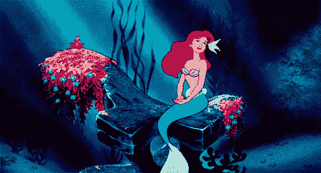
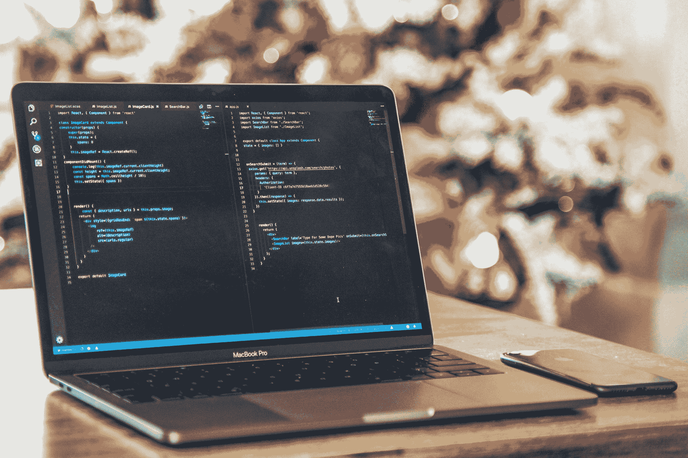
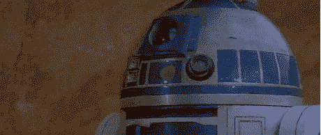
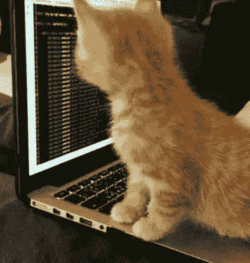

# 编码美人鱼——我如何从海洋生物学家变成前端开发人员

> 原文：<https://www.freecodecamp.org/news/the-coding-mermaid-from-marine-biology-to-code-development/>

我想分享我的故事已经有一段时间了，但我不知道如何开始，甚至不知道给它取什么名字。

但是最近我在和一个我年轻时认识的人聊天(当时我在学生物)。这么多年过去了，我现在作为一名网站开发人员和他一起工作。我请求帮助写这篇文章，他给了我这个标题的想法。我立刻喜欢上了它。谢谢你。现在我有地方开始了。

我希望我的故事能激励你去追求你想要的。

## 开始

整整一年前，在我 30 岁的时候，我在 web 开发领域开始了我的故事。但首先要做的是。

几年前，我获得了海洋生物学的学位。我有船上驾驶执照，我是一名潜水者，我热爱一切与海洋有关的事物。但生活并不总是如我们所愿，有时我们会遇到挫折。

我遭遇了一场非常严重的车祸，让我很长一段时间不能走路。我在医院的病床上呆了两个月，又在家呆了一个月。当我最终开始做物理治疗以能够再次行走时，这不是一个让我立即感到痊愈的过程。

多年来，我饱受痛苦。我无法完成某些动作或行走任何长度的时间。我觉得我没有能力为自己做事。我甚至不认为我可以尝试去寻找一份与我的领域相关的工作(或者至少是户外工作)，这是我真正想做的。

giphy.com

## 开关

然后，2 年前，我开始思考我还喜欢什么。我总是喜欢在 blogger 或 tumblr 上做些小改动，插入脚本等等。所以，我研究了类似的课程。经过大量的调查和与技术人员的交谈，我最终决定参加一个网页设计课程。

### 我是如何决定课程的

在与技术部门的几个人交谈后，我选择了一门课程。从从事类似工作多年的人那里获得意见和建议是很重要的。我和一名开发人员、一名平面设计师以及我在 LinkedIn 上感兴趣的人进行了交谈。这个阶段对我决定自己想做什么非常重要。

我在里斯本设计学院学习了网页设计课程。一个朋友推荐它做设计相关的认证。我最终意识到，创意部分是我最喜欢的部分，而不是营销或宣传领域。

这门课程涵盖了很多内容。以下是我们了解到的一些主题:

*   如何做好简报
*   如何组织想法
*   关于 UX 和 UI 的一切
*   网页设计工具和概念
*   如何交付一个完整的网站设计及其原型
*   数字营销。

在课程的最后一部分，我们的任务是使用 HTML、CSS、JQuery、JavaScript、PHP 和 SQL，基于我们的原型构建我们自己的网站。

该课程从 2017 年 10 月持续到 2018 年 7 月。我在一家商店兼职，每个月一半的工资用来支付课程费用。

完成课程后，我继续学习，专注于前端开发。我甚至减少了我的工作时间，因为我非常致力于学习。我告诉自己，那一年我要转行了。我唯一关注点变成了主要目标。没有杂念，没有“但是这个”或者“但是那个”。

[https://unsplash.com/](https://unsplash.com/)

### 并非一切都很容易

在整个过程中，我遇到了两个主要问题。一个在家里。我爸从来不相信，不去考大学，去上专业课，是一条正经的路。他总是说，这只是一些公司从像我这样的人那里偷钱的一种方式——这些人相信他们可以像这样改变职业。

课程非常昂贵，我既没有得到他的帮助，也没有得到他的一句好话。事实上，恰恰相反。但我相信自己，还是报了名。

第二个问题是，在开始的时候，在网页设计阶段，我们不得不使用大量的 Photoshop 和 Adobe Creative 来设计我们的网站和标志。其他人似乎都已经对这些设计工具有了一些了解，他们很容易就能开始让东西出现。对我来说，这需要更多的时间，我觉得有点傻。

我开始在家看教程来跟上课程。有时候我觉得我不会成功，也许我爸爸是对的。但是在那些不确定的时刻之后，也有一些时刻我完成了新的事情，我为自己感到非常自豪。所以，我继续前进。

## 求职过程

完成课程后，我立即开始寻找前端工作，因为这是课程中我最喜欢的部分。

我做的第一件事是更新我的 LinkedIn 个人资料。我更改了我的标题、描述，添加了我所学的课程和技能。然后我改变了我的设置，这样招聘人员就会知道我可以接受工作邀请。我还开始添加更多来自不同公司的我觉得有趣的人。最后，我写了一份我想去工作的公司的名单，并附上我更新的简历发了邮件(我用 Photoshop 做了一份，保存为 PDF 格式)。

在我更新 LinkedIn 个人资料后的两周内，我参加了两次面试，但都不是我想要的。但我还是去练习了面试技巧。与此同时，我开始编写自己的作品集，并把它放在 GitHub 上。我认为这对于一个编码的人来说是非常重要的。

当我在调查公司的时候，我发现我的一个朋友在一家咨询公司工作。我问她他们是否需要前端开发人员，她说是的。她向我要了我的简历，这样她就可以在内部分享了。一周后，我被叫去面试。

面试那天，等了一会儿后，一位非常友好的女士(后来成了我的经理)介绍了自己，并把我带到一个会议室。在那里，我被介绍给一位业务经理和一位高级前端开发人员。他们问了我几个关于我那年旅程的问题以及一些技术问题。

我当时对庞大的编码世界了解不多，但对学习和进化表现出了很大的兴趣。比起我的知识，他们更喜欢我对转行的奉献和承诺。一周后，公司打电话给我，告诉我一个好消息:我得到了那份工作！

这就是我如何得到我的第一份技术工作。我简直不敢相信，我太高兴了。就在我完成课程后的两个月。我没想到会这样。

> 提示:在这个领域建立关系网是非常重要的。我的两份工作都是通过网络获得的。
> 
> 当你有机会去看一场科技盛会时，千万不要错过。与人交谈。提问。对他们的工作表现出兴趣。交换联系方式。

### 开始我的第一份工作

当我得到第一份工作时，感觉几乎不真实。我是坐在办公桌后才相信的。与此同时，我觉得我现在的位置是我应得的，所有的努力都有回报。但我还是感到很害怕。

我参与的第一个项目是与营销团队一起创建 A/B 测试。他们有想法，我让他们活了起来。

不过，当时我身边没有资深的前端开发人员。这有点令人沮丧，因为我需要一些高级的 JavaScript 和 CSS 来在我使用的工具的限制范围内进行更改。我向我的同事寻求帮助，但这很困难，因为没有一个大的开发团队。

在那之后，我开始为另一个项目学习 Vue.js，我将成为这个项目的一部分。我开始觉得，在第一份工作中，我没有进步。它没有给我提供增长知识所需要的成长，很可能是因为没有一个高级职位的人支持我或培训我。

## 游戏规则改变者:邀请

不管是不是巧合，几天前，我去参加了一个朋友的生日聚会。在那里，我建立了一些联系，并遇到了一个一直信任我的好朋友。他邀请我参加另一个聚会，在那里我见到了我未来工作的公司的老板，我现在就在那里工作。那一天我立刻爱上了办公室和公司。

### 第二次工作面试

过了一段时间，我的新朋友让我投递简历。我没有抱太大的希望——我觉得我在那里工作好得难以置信，因为我才三年级。但是我被叫去面试了。一开始只有我和一个高级前端开发人员。

面试进行得很顺利。这更像是一次技术性的采访，帮助他们了解我目前所知道的。面试官很随和，他给了我一些我应该重点学习的提示。

之后，我通过 Skype 被叫去参加两位经理的第二轮面试。这有点吓人，因为 Surface Hub 很大，让我觉得自己很小。除此之外，面试是用英语进行的，我已经很多年没有每天说英语了，所以我很生疏。第二次面试更多的是关于团队、如何处理冲突、软技能、我的个人目标和我的意图。

## 我的第二份(也是目前的)工作

我想我面试后才过了一周。但对我来说，那感觉像是永恒。然后他们给我回电话，说这份工作是我的。

那真是梦想成真了！

突然间，上这门课的所有努力似乎都得到了回报。我加入了一个由几个开发人员组成的团队，有一个已经非常稳定且构建良好的项目。这是一个很好的开始，因为我不需要构建任何新的东西，只需要做一些小的改变。

这很好，因为我能够看到一个大项目的结构，并了解敏捷开发。每当我需要帮助的时候，我身边都有一个高级前端开发人员，这太棒了。

过了一段时间，我被要求改变项目。我一个人去了一个组织不太好的项目(虽然我们从来没有真正靠自己。每当我们需要帮助时，总会有人来帮忙。

这实际上很棒，因为它让我发展了我的软技能。我必须与客户建立更紧密的联系，以便为新事物找到解决方案或想法。我甚至不得不在这个项目中利用我的网页设计和 UX 知识。很高兴能够向客户提出几个想法，这样我们就能得出最好的结果。这太棒了，帮助我走出了自我。

## 我现在在做什么

过了一段时间，我又被要求改变项目，我目前正在做这个新项目。这一次，我必须从头开始构建——不仅是项目结构，还有新功能。

我是一个伟大团队的一员，我有很多很酷的同事。我在成长，学到了很多，就像我一直想要的那样。它始于样式，典型的 CSS(Less/Sass)，但现在我得到了更多我想要的东西。

同时，我害怕总是尝试做更复杂的事情。我还必须负责我们应用程序的后台/管理区域的内容管理，并帮助进行测试。

## 我学到了什么

### 软技能确实很重要

重要的是，我们不仅仅是优秀的开发人员。当我们处在一个与许多不同的人一起工作的环境中时，举办人们可以参与的活动也很重要。

在这种情况下，我发现自己是完美的匹配，因为我知道，如果我们想要发生的事情，我们必须去做。因此，只要有可能，我总是努力跟上各种活动、慈善活动和会议。这是我真正喜欢做的事情，我也擅长推动别人去做新的事情。我喜欢主动给同事带来新的体验。我试着把自己看成一个支持者。

### 可转移的技能

对于来自另一个领域的我，我注意到的一件事是我的适应能力。当我从一个项目转移到另一个项目时，当我必须学习新的东西时，当我遇到意想不到的事情时，我总是在想办法克服那些障碍。有时这意味着要跳出框框思考，或者适应我无法控制的事情。但是我发现我可以找到另一种方法。

另一件对我有帮助的事情是，我总是试图把积极传递给我的同事。正如我之前讨论的，当你和一群人一起工作时，软技能非常重要。你的心情影响着别人，你总能把它用在好的方面。

### 编码帮助了我的自我成长和自信

能够改变职业生涯并完成我为自己确立的目标让我感到更加自信。在技术部门工作了几个月后，我决定实现我的一个梦想:去日本旅行。我要一个人去旅行。一次远行，远离家乡。走出我的舒适区。但是我觉得我现在可以轻松做到。

在我们的道路上总会有艰难的时刻——事情并不容易，有时我们会觉得想要放弃，或者我们没有能力。那些日子不过是:日子。我们不应该把我们的生活建立在那些日子里。但是，我们应该创造机会过上更好的日子。专注于你的目标，永不放弃。

我对我的工作感到不舒服，因为来自不同的领域让我觉得我总是必须更加努力工作或学习更多。但秘密是永远不要让我们的恐惧战胜我们的梦想。环顾四周，与你的朋友和同事交流想法——在艰难时刻，他们能给你很多帮助。

我现在 31 岁了，我很高兴我没有放弃。我很高兴我决定寻找新的挑战，设定目标，并完成它们。

> 提示:给自己留点时间。相信自己永远不会太晚。你有梦想吗？那就去做吧！