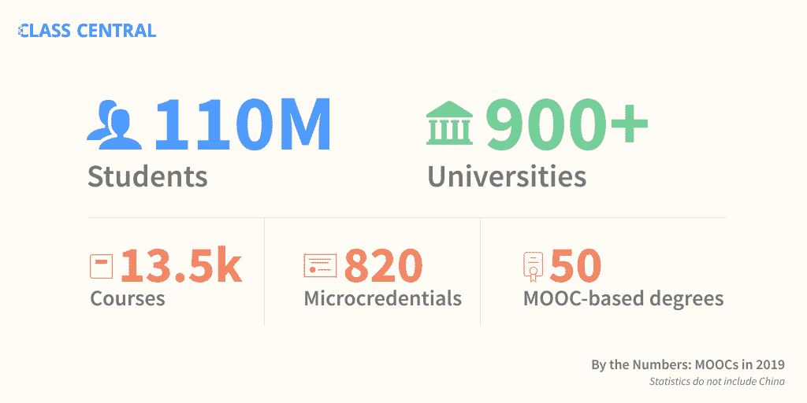

# 2019 年最受欢迎的 100 门免费在线课程

> 原文：<https://www.freecodecamp.org/news/100-popular-free-online-courses-2019/>

自从一些斯坦福大学的教授决定在网上免费提供他们的课程以来，已经有八年了。这些课程现在通常被称为 MOOCs 或大规模开放在线课程。

自那以后，900 多所大学推出了 13500 门在线课程。这些课程已经被[1.1 亿学习者](https://www.classcentral.com/report/mooc-stats-2019/)学习过。

并非所有这些课程都像以前一样免费。有些现在对认证收费，或者要求你付费才能获得完整的课程材料。但是你仍然可以免费审核它们。

自从免费在线课程兴起以来，我一直在 [Class Central](https://www.classcentral.com/) 跟踪这些课程。从[我创办中央课堂](https://www.classcentral.com/report/class-central-8th-anniversary/)到现在已经 8 年了，已经帮助超过 2000 万的学习者决定参加哪些在线课程。

## 方法:我们如何确定 2019 年前 100 名免费课程

首先，我们浏览了 Class Central 的数据库，列出了 2019 年首次开设的所有课程。我们发现，目前全球有 450 所大学推出了 2500 多门课程。

然后 [Suparn](https://www.linkedin.com/in/suparnpatra/) 编写了 scrapers 从三个不同的课程提供商那里收集注册人数:Coursera、edX 和 Swayam。每个提供商都在其课程页面上显示有多少学生注册。仅这三家提供商就为 2019 年推出的课程注册了约 500 万人。

除此之外，我们还探索了来自用户的数据。最重要的是，一门课程在中央课堂上被书签标记了多少次。

使用提供商的注册数据和我们自己的书签数据，我们得出了一份 2019 年最受欢迎的 100 门课程的列表[-来自 68 所大学的广泛分类。](https://www.classcentral.com/list/2019-s-most-popular-online-courses-free-d1twvlv)

你也可以在 Class Central 上找到这个[列表，它是我使用 Class Central 的自定义列表特性构建的。并非此列表中的所有课程都可用，但如果您在 Class Central 上为某个课程添加了书签，我们会通知您下次课程的时间。](https://www.classcentral.com/list/2019-s-most-popular-online-courses-free-d1twvlv)

## 如今，现在...2019 年最受欢迎的在线课程

以下是 2019 年最受欢迎的免费网络大学课程(不按人气排序)。

*   [了解多发性硬化症](https://www.classcentral.com/course/independent-understanding-multiple-sclerosis-ms-13338)来自*塔斯马尼亚大学*★★★★(246)
*   [工程师微分方程](https://www.classcentral.com/course/differential-equations-engineers-13258)来自*香港科技大学*★★★★(32)
*   [教英语:如何策划一堂精彩的课](https://www.classcentral.com/course/teaching-english-great-lesson-13115)来自*英国文化协会*★★★★(125)
*   [了解雅思:口语](https://www.classcentral.com/course/understanding-ielts-speaking-17037)来自*英国文化协会*★★★★(26)
*   [结构工程的艺术:拱顶](https://www.classcentral.com/course/edx-the-art-of-structural-engineering-vaults-12040)来自*普林斯顿大学*★★★★(17)
*   [提高你的学习技巧](https://www.classcentral.com/course/improving-study-techniques-13420)来自*格罗宁根大学*★★★★(20)
*   [数理经济学](https://www.classcentral.com/course/swayam-mathematical-economics-14187)来自*敦大学，德拉敦*★★★★(75)
*   [宪法解释](https://www.classcentral.com/course/edx-constitutional-interpretation-13427)来自*普林斯顿大学*★★★★(16)
*   [更快乐的员工和投资回报课程](https://www.classcentral.com/course/edx-happier-employees-and-return-on-investment-course-17121)来自*德克萨斯大学奥斯丁分校*★★★★(10)
*   [性别与性:社会应用](https://www.classcentral.com/course/edx-gender-and-sexuality-applications-in-society-12333)来自*不列颠哥伦比亚大学*★★★★(48)
*   [IB 扩展短文:管理你的研究项目](https://www.classcentral.com/course/ib-extended-essay-12702)来自*利兹大学*★★★★(32)
*   [敏捷领导原则](https://www.classcentral.com/course/edx-agile-leadership-principles-11920)来自*马里兰大学系统*★★★★(124)
*   [动画](https://www.classcentral.com/course/swayam-animations-13880)来自*巴纳拉斯印度教大学*★★★☆(61)
*   [Python 和面向财务分析的统计](https://www.classcentral.com/course/python-statistics-financial-analysis-12648)来自*香港科技大学* ★★★★☆(58)
*   [解锁信息安全:第一部分](https://www.classcentral.com/course/edx-unlocking-information-security-part-16964)来自*特拉维夫大学*★★★★(2)
*   [数字安全与人权](https://www.classcentral.com/course/edx-digital-security-and-human-rights-12842)来自*大赦国际*★★★★(1)
*   [统计学基础](https://www.classcentral.com/course/edx-fundamentals-of-statistics-11482)来自*麻省理工*★★★★(1)
*   [来自*明尼苏达大学的草药*](https://www.classcentral.com/course/herbalmedicine-12872)★★★★(1)
*   [更美好世界的想法:通过政策制定引领变革](https://www.classcentral.com/course/ideas-better-world-13689)来自*英国文化协会*★★★★(1)
*   [道德黑客](https://www.classcentral.com/course/swayam-ethical-hacking-14045)来自*印度理工学院，哈拉格普尔*★★★★(1)
*   [数据分析:绝对初学者实用入门](https://www.classcentral.com/course/edx-data-analysis-a-practical-introduction-for-absolute-beginners-12635)来自*微软*★★★☆(1)
*   [来自*罗汉普顿大学的都铎王朝*](https://www.classcentral.com/course/the-tudors-12832)★★★☆(1)
*   [C for Everyone:编程基础](https://www.classcentral.com/course/c-for-everyone-16909)来自*加州大学圣克鲁斯分校*★★★☆(1)
*   [健身运动。令人惊讶的新健身科学。](https://www.classcentral.com/course/hacking-exercise-health-16911)来自*麦克马斯特大学*★★★☆(2)
*   [数据科学的 Python 和来自 *IBM 的 AI*](https://www.classcentral.com/course/python-for-applied-data-science-ai-14403)★★★☆☆(1)
*   [批判性思维:理性决策](https://www.classcentral.com/course/edx-critical-thinking-reasoned-decision-making-17197)来自*蒙特雷科技* ★★☆☆☆(1)
*   [品牌身份和战略](https://www.classcentral.com/course/brand-identity-strategy-13108)来自 *IE 商学院*
*   [体重管理:超越平衡卡路里](https://www.classcentral.com/course/weight-management-beyond-balancing-calor-13200)来自*埃默里大学*
*   [人工智能简介](https://www.classcentral.com/course/introduction-to-ai-13848)来自 *IBM*
*   [人工智能、机器学习、深度学习 TensorFlow 简介](https://www.classcentral.com/course/introduction-tensorflow-13287)来自 *deeplearning.ai*
*   [在营销中应用数据分析](https://www.classcentral.com/course/applying-data-analytics-business-in-mark-16865)来自*伊利诺伊大学香槟分校*
*   [AWS 机器学习入门](https://www.classcentral.com/course/aws-machine-learning-16924)来自*亚马逊网络服务*
*   [设计的语言:形式与意义](https://www.classcentral.com/course/design-language-16927)来自*加州艺术学院*
*   [发展系统思维](https://www.classcentral.com/course/systems-mindset-17004)来自*科罗拉多大学博尔德分校*
*   [安卓图形介绍](https://www.classcentral.com/course/intro-android-graphics-16943)来自*伦敦帝国理工*
*   [神经营销工具箱](https://www.classcentral.com/course/neuromarketing-toolbox-17148)来自*哥本哈根商学院*
*   [在后真相世界中赋予自己力量](https://www.classcentral.com/course/empowering-yourself-post-truth-world-15225)来自*纽约州立大学*
*   [自我决定理论简介:激励、发展和健康的方法](https://www.classcentral.com/course/self-determination-theory-13094)来自*罗彻斯特大学*
*   [咨询实践与研究](https://www.classcentral.com/course/edx-counseling-practice-and-research-12756)来自*首尔国立大学*
*   中国的政治和知识基础:从圣王到孔子来自*哈佛大学*
*   [区块链和金融科技:基础、应用和限制](https://www.classcentral.com/course/edx-blockchain-and-fintech-basics-applications-and-limitations-11393)来自*香港大学*
*   [英语@工作:基本求职面试技巧](https://www.classcentral.com/course/edx-english-work-basic-job-interview-skills-14432)来自*香港理工大学*
*   [儿童保护:理论和实践中的儿童权利](https://www.classcentral.com/course/edx-child-protection-children-s-rights-in-theory-and-practice-12686)来自*哈佛大学*
*   [全球化时代的言论和信息自由:来自*哥伦比亚大学*的基础课程](https://www.classcentral.com/course/edx-freedom-of-expression-and-information-in-the-time-of-globalization-foundational-course-15198)
*   [CS50 给律师](https://www.classcentral.com/course/edx-cs50-for-lawyers-16857)来自*哈佛大学*
*   [创造历史的女人:十件物品，许多故事](https://www.classcentral.com/course/edx-women-making-history-ten-objects-many-stories-12269)来自*哈佛大学*
*   来自*谷歌*的
*   [阿诺尔德·勋伯格钢琴音乐的新世界](https://www.classcentral.com/course/stanford-openedx-the-new-world-of-arnold-schonberg-s-piano-music-17139)来自*史丹福大学*
*   [探索 GraphQL:来自 *Linux 基金会*的 API 查询语言](https://www.classcentral.com/course/edx-exploring-graphql-a-query-language-for-apis-17144)
*   [修辞学:说服性写作和公开演讲的艺术](https://www.classcentral.com/course/edx-rhetoric-the-art-of-persuasive-writing-and-public-speaking-16993)来自*哈佛大学*
*   [工作的未来:为中断做准备](https://www.classcentral.com/course/edx-the-future-of-work-preparing-for-disruption-13702)来自*世界银行*
*   [离散行业的研发](https://www.classcentral.com/course/opensap-research-and-development-in-discrete-industries-15182)
*   [后院气象学:天气科学](https://www.classcentral.com/course/edx-backyard-meteorology-the-science-of-weather-12108)来自*哈佛大学*
*   [清晰明了的学术写作](https://www.classcentral.com/course/edx-academic-writing-for-clarity-and-meaning-15218)来自*威特沃特斯兰德大学*
*   [气候变化对健康的影响](https://www.classcentral.com/course/edx-the-health-effects-of-climate-change-12106)来自*哈佛大学*
*   [工作中的正念和抗压能力](https://www.classcentral.com/course/edx-mindfulness-and-resilience-to-stress-at-work-10286)来自*加州大学伯克利分校*
*   [用 Python 进行机器学习:从线性模型到深度学习](https://www.classcentral.com/course/edx-machine-learning-with-python-from-linear-models-to-deep-learning-11483)来自*麻省理工*
*   [全纳教育:成功的必备知识](https://www.classcentral.com/course/inclusive-education-16951)来自*昆士兰科技大学*
*   [用于决策的数据分析](https://www.classcentral.com/course/edx-data-analysis-for-decision-making-11673)来自*马里兰大学系统*
*   [加密和密码学简介](https://www.classcentral.com/course/encryption-and-cryptography-17172)来自*树莓派基金会*
*   [来自多伦多*大学*的自动驾驶汽车介绍](https://www.classcentral.com/course/intro-self-driving-cars-13140)
*   [大麻、精神健康和大脑紊乱](https://www.classcentral.com/course/mentalhealth-cannabis-cbd-thc-13819)来自*科罗拉多大学博尔德分校*
*   [在学校管理多动症、自闭症、学习障碍和脑震荡](https://www.classcentral.com/course/managing-adhd-autism-learning-disabiliti-12821)来自*科罗拉多大学系统*
*   [在金融中应用数据分析](https://www.classcentral.com/course/applying-data-analytics-business-in-fina-15161)来自*伊利诺伊大学香槟分校*
*   [应用机器学习简介](https://www.classcentral.com/course/machine-learning-applied-15163)来自*阿尔伯塔机器智能研究所*
*   [气候变化与健康介绍](https://www.classcentral.com/course/introduction-climate-change-health-16878)来自*耶鲁大学*
*   [用于资产管理的 Python 和机器学习](https://www.classcentral.com/course/python-machine-learning-for-investment-m-16888)来自 *EDHEC 商学院*
*   [谈判技巧:谈判和解决冲突](https://www.classcentral.com/course/negotiation-skills-conflict-16974)来自*麦考瑞大学*
*   [健康沟通的基本技巧](https://www.classcentral.com/course/foundational-skills-communicating-health-16914)来自*密执安大学*
*   [假设驱动开发](https://www.classcentral.com/course/uva-darden-agile-testing-16940)来自*弗吉尼亚大学*
*   [探索可再生能源方案](https://www.classcentral.com/course/exploring-renewable-energy-17025)来自*宾夕法尼亚大学*
*   [改善您的统计问题](https://www.classcentral.com/course/improving-statistical-questions-17049)来自*埃因霍温理工大学*
*   [用 MATLAB 进行探索性数据分析](https://www.classcentral.com/course/exploratory-data-analysis-matlab-17125)来自 *MathWorks*
*   [机器学习](https://www.classcentral.com/course/edx-machine-learning-15170)来自*德克萨斯大学奥斯丁分校*
*   [个人成长基础(针对健康能力有限的人)](https://www.classcentral.com/course/edx-personal-growth-basics-for-people-with-limited-health-abilities-17068)来自*乌拉尔联邦大学*
*   [金融发展和金融包容性](https://www.classcentral.com/course/edx-financial-development-and-financial-inclusion-16971)来自*国际货币基金组织*
*   [来自*早稻田大学*的日语入门步骤 1 Part1](https://www.classcentral.com/course/edx-steps-in-japanese-for-beginners1-part1-16922)
*   [GMBA824 了解你的客户](https://www.classcentral.com/course/gmba824-17107)来自*麦考瑞大学*
*   [营养:吃才能活得好](https://www.classcentral.com/course/eating-while-enjoying-life-15172)来自*台北医科大学*
*   [食物和情绪:通过饮食和营养改善心理健康](https://www.classcentral.com/course/food-and-mood-17020)来自*迪肯大学*
*   [c++](https://www.classcentral.com/course/swayam-an-introduction-to-programming-through-c-13892)编程入门，来自*印度理工学院孟买*
*   [解决问题的人工智能搜索方法](https://www.classcentral.com/course/swayam-artificial-intelligence-search-methods-for-problem-solving-13903)来自*印度理工学院马德拉斯*
*   [Java 编程](https://www.classcentral.com/course/swayam-programming-in-java-12930)来自*印度理工学院，哈拉格普尔*
*   [使用 Python 计算的乐趣](https://www.classcentral.com/course/swayam-the-joy-of-computing-using-python-12931)来自*印度理工学院 Ropar*
*   [机器学习入门(IITM)](https://www.classcentral.com/course/swayam-introduction-to-machine-learning-iitkgp-14153) 来自*印度理工学院马德拉斯*
*   [来自*钦奈数学学院*的使用 Python](https://www.classcentral.com/course/swayam-programming-data-structures-and-algorithms-using-python-14260) 的编程、数据结构和算法
*   [用于数据科学的 Python](https://www.classcentral.com/course/swayam-python-for-data-science-14266)来自*印度理工学院马德拉斯*
*   [发展软技能和个性](https://www.classcentral.com/course/swayam-developing-soft-skills-and-personality-14001)来自*印度理工学院坎普尔*
*   [关爱独自行动的儿童:保护无人陪伴和失散的儿童](https://www.classcentral.com/course/caring-for-children-moving-alone-13484)来自*斯特拉斯克莱德大学*
*   [管理人:了解个体差异](https://www.classcentral.com/course/managing-people-understanding-differences-12717)来自*雷丁大学*
*   [课堂中的数字化转型](https://www.classcentral.com/course/digital-transformation-classroom-15185)来自*挪威科技大学*
*   [从数据库到大数据](https://www.classcentral.com/course/france-universite-numerique-from-data-base-to-big-data-16958)来自*蔚蓝大学*
*   [21 世纪的外交](https://www.classcentral.com/course/diplomacy-in-the-21st-century-12313)来自*开放大学*
*   [了解性别不平等](https://www.classcentral.com/course/understanding-gender-inequality-15219)来自*埃克塞特大学*
*   [成功谈判:必备策略和技巧](https://www.classcentral.com/course/successful-negotiation-16936)来自*密西根大学*
*   [科学传播与公众参与](https://www.classcentral.com/course/science-communication-for-researchers-15231)来自 *EIT 食品*
*   [全球化世界中的英语发音](https://www.classcentral.com/course/english-pronunciation-12603)来自*阿姆斯特丹大学*
*   [美国阿片类药物的流行:从证据到影响](https://www.classcentral.com/course/opioid-epidemic-america-17128)来自*约翰·霍普金斯大学*
*   [了解 ADHD:当前的研究和实践](https://www.classcentral.com/course/understanding-adhd-13328)来自*伦敦国王学院*
*   [临终关怀:挑战与创新](https://www.classcentral.com/course/end-of-life-care-16932)来自*格拉斯哥大学*