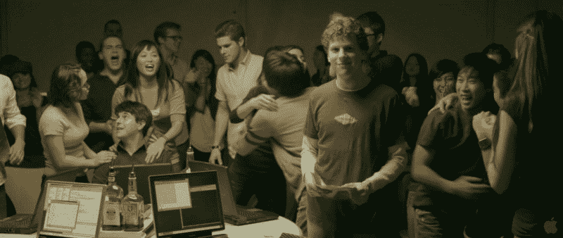

# 300 名开发人员的故事，他们在 30 多岁、40 多岁和 50 多岁时获得了第一份技术工作

> 原文：<https://www.freecodecamp.org/news/stories-from-300-developers-who-got-their-first-tech-job-in-their-30s-40s-and-50s-64306eb6bb27/>

*   上周末，我列出了 300 名开发人员的名单，他们的第一份技术工作是在 30 多岁、40 多岁甚至更大年纪。
*   我们用标签 [#DevAfter30](https://twitter.com/search?f=tweets&vertical=default&q=%23devafter30&src=tyah) 分享故事。
*   **因此，如果你在晚年才开始你的软件开发生涯，[加入并分享你的故事](https://twitter.com/intent/tweet?hashtags=DevAfter30)。**

### 这就是我做这一切的原因

每天，我都会收到来自世界各地有抱负的开发人员的电子邮件，他们问了同一个基本问题:

> “我 ____ 岁了。我是不是太老了，不能被聘为开发人员了？”

这是整个软件开发领域中最常见的问题之一。

为了让你了解有多少有抱负的开发人员担心他们的年龄，我在 Quora 上寻找了这个问题的变体。

不出所料，我发现所有年龄段的人都担心自己“太老”了，无法学习编码，也无法被聘为开发人员:

*   [**60**是不是太老了？](https://www.quora.com/Can-a-60-year-old-learn-to-program-and-make-a-living-at-it)
*   [59 是不是太老了？](https://www.quora.com/I-am-59-1-2-years-old-and-female-I-started-coding-about-4-months-ago-When-I-finish-my-classes-will-anyone-hire-me)
*   [是不是 **58** 太老了？](https://www.quora.com/Is-58-too-old-to-become-a-programmer)
*   [57 是不是太老了？](https://www.quora.com/I-am-considering-enrolling-in-a-coding-bootcamp-here-in-Minneapolis-I-will-be-57-years-old-by-the-time-the-course-is-finished-How-likely-is-it-that-I-will-find-a-job)
*   [是不是 **56** 太老了？](https://www.quora.com/Is-56-too-old-for-a-tech-job)
*   [是不是 **55** 太老了？](https://www.quora.com/Am-I-insane-for-starting-a-programming-career-at-55)
*   [54 是不是太老了？](https://www.quora.com/At-54-still-actively-programming-in-JavaScript-and-HTML5-Am-I-too-old)
*   [53 是不是太老了？](https://www.quora.com/Is-a-53-years-old-too-old-to-learn-programming)
*   [52 是不是太老了？](https://www.quora.com/Can-a-52-year-old-learn-Web-building)
*   [是不是 **51** 太老了？](https://www.quora.com/Can-coding-be-learnt-at-the-age-of-51-Is-it-going-to-be-necessary-for-everyone-to-know-coding)
*   [**50**是不是太老了？](https://www.quora.com/I-turn-50-this-year-Am-I-too-old-to-pursue-a-career-in-computer-programming)
*   [49 是不是太老了？](https://www.quora.com/At-49-am-I-too-old-to-become-a-junior-web-developer)
*   [48 是不是太老了？](https://www.quora.com/How-can-I-become-a-programmer-if-I-am-48-years-old)
*   [是 **47** 太老了吗？](https://www.quora.com/Am-I-too-old-if-I-am-47-years-of-age-to-start-training-to-become-a-web-designer-developer)
*   [46 是不是太老了？](https://www.quora.com/Is-46-years-old-too-old-to-start-a-software-developer-career)
*   [是 **45** 太老了吗？](https://www.quora.com/Is-it-too-late-at-45-to-learn-to-code-and-become-a-successful-software-engineer)
*   [44 是不是太老了？](https://www.quora.com/Is-it-too-late-to-start-coding-at-the-age-of-44)
*   [43 是不是太老了？](https://www.quora.com/Being-a-43-year-old-inspiring-Web-Developer-will-my-age-be-an-obstacle-in-competing-for-employment-within-the-technology-industry)
*   [42 是不是太老了？](https://www.quora.com/Can-a-42-year-old-get-into-cyber-security-without-an-IT-background)
*   [41 是不是太老了？](https://www.quora.com/Is-41-too-old-to-work-as-programmer)
*   [**40**是不是太老了？](https://www.quora.com/Is-40-too-old-to-become-a-programmer)
*   [39 是不是太老了？](https://www.quora.com/Is-39-too-old-to-get-a-programming-job-after-getting-a-BS-in-computer-science-15-years-ago-and-an-MS-in-computer-science-7-years-ago)
*   [38 是不是太老了？](https://www.quora.com/Is-it-too-late-to-learn-software-development-programming-at-38-yrs-old-and-get-a-job-in-the-tech-industry)
*   [是 **37** 太老了吗？](https://www.quora.com/Is-37-too-old-to-work-as-a-programmer)
*   [**36**是不是太老了？](https://www.quora.com/Is-36-too-late-to-try-to-start-a-programming-or-web-developer-career)
*   [**35**是不是太老了？](https://www.quora.com/Is-it-worth-learning-programming-at-35-years-old)
*   [34 是不是太老了？](https://www.quora.com/Is-34-too-old-to-become-a-software-engineer-at-Google)
*   [33 是不是太老了？](https://www.quora.com/I-am-33-years-old-Is-it-too-late-to-learn-programming-and-get-a-job)
*   [32 是不是太老了？](https://www.quora.com/Is-32-too-old-for-shifting-my-career-to-be-a-programmer?no_redirect=1#!n=12)
*   [31 是不是太老了？](https://www.quora.com/Is-31-too-old-to-start-learning-hacking)
*   [30 岁的**是不是太老了？**](https://www.quora.com/Is-30-years-old-too-old-to-learn-computer-programming)
*   **[29 是不是太老了？](https://www.quora.com/Is-29-to-old-to-learn-coding-for-a-career)**
*   **[28 是不是太老了？](https://www.quora.com/Is-it-too-late-for-me-to-be-a-programmer-if-I-am-already-28-and-have-no-CS-background-I-have-an-MS-in-applied-science-but-I-want-to-become-a-programmer-and-learn-software-engineering-Do-I-have-to-start-as-an-undergrad-in-computer-science)**
*   **[27 是不是太老了？](https://www.quora.com/Is-27-too-old-to-master-programming)**
*   **[26 是不是太老了？](https://www.quora.com/Is-26-years-old-too-late-to-learn-web-development-and-if-not-should-I-start-learning-full-stack-web-development)**
*   **[25 是不是太老了？](https://www.quora.com/Is-25-too-late-to-start-programming-when-people-from-the-new-generation-know-how-to-do-it-since-they-are-7-13-years-old)**
*   **[24 是不是太老了？](https://www.quora.com/I-am-24-years-old-and-just-started-learning-coding-I-want-to-be-a-programmer-Am-I-too-late-in-the-game)**
*   **[23 是不是太老了？](https://www.quora.com/Im-23-and-just-starting-to-learn-programming-Am-I-too-late)**
*   **[22 是不是太老了？](https://www.quora.com/Am-I-too-late-to-start-Programming-at-22)**
*   **[21 是不是太老了？](https://www.quora.com/Is-starting-to-learn-to-code-at-age-21-too-late-to-enter-corporate-world)**
*   **[**20**是不是太老了？](https://www.quora.com/I-am-20-and-just-started-learning-coding-Is-it-too-late-to-be-a-professional-developer)**
*   **[19 是不是太老了？](https://www.quora.com/At-19-years-of-age-am-I-starting-too-late-to-be-a-world-class-programmer)**
*   **[18 是不是太老了？](https://www.quora.com/Is-18-years-old-too-late-to-start-coding)**
*   **[17**17**是不是太老了？](https://www.quora.com/Is-it-too-late-to-start-programming-at-17-if-you-want-to-be-a-top-programmer)**
*   **[16 是不是太老了？](https://www.quora.com/Im-16-years-old-is-it-too-late-to-start-programming)**
*   **[15**15**是不是太老了？](https://www.quora.com/Is-the-age-of-15-too-old-to-start-learning-code-If-not-where-can-I-begin-to-learn-code)**
*   **[14 是不是太老了？](https://www.quora.com/Is-it-too-late-to-start-programming-at-14-if-I-want-to-work-at-Google)**

**那么，对于那些担心对他们来说“太晚了”的人，你该怎么说呢？大多数人只是说一些华特·迪士尼老话的变体:“如果你能梦想，你就能做到！”**

**当然，我同意这种观点。**

**我 20 多岁的时候是一名教师。我直到 30 岁才学会编程。**

**在此之前，我不会写基本的 JavaScript。我无法编写 SQL 查询。我无法安装 Linux。见鬼，没有我妻子的帮助，我甚至不能设置我的 WiFi 路由器。**

**31 岁时，我得到了第一份软件开发工作。**

**所以我当然相信年龄只是一个数字。任何付出努力的人都可以很好地学习编程，从而被雇佣。**

**但是我怎么能说服这些每天都在问同样问题的人呢？因为说“不要停止相信”没用。**

### **我收集证据，这样我就可以说服人们对他们的年龄冷静下来**

**我认识几个人，他们在获得第一份开发工作时，年龄都比我大很多。**

**例如，我的一个朋友是一位 50 多岁的高中法语老师。在参加了一些免费的在线大学课程后，她在苹果公司找到了一份软件工程师的工作。**

**所以我知道这是可能的。**

**但是我的一些轶事不足以说服人们停止担心他们的年龄。他们在看好莱坞电影，30 岁以下的人是电脑天才，而所有 30 岁以上的人对科技一无所知。**

**

A scene from the 2010 movie “The Social Network” that reinforced the worst stereotypes about developers.** 

**因此，一个星期五的晚上，在第一千次试图安抚一个有抱负的开发人员的焦虑之后，我重新考虑了我的方法。**

**我想:“也许我可以找到一份在 30 多岁、40 多岁甚至更大年纪找到第一份工作的开发人员名单。然后我可以利用这一点说服人们不要太担心自己的年龄。”**

**有一些年长的开发人员——他们中的许多人都有几十年的编码经验。**

**但是我找不到任何一份后来找到第一份开发工作的人的名单。**

**所以我发了微博。**

### **事实证明，很多开发人员在 30 多岁、40 多岁和 50 多岁时找到了他们的第一份技术工作。**

**以下是一些开发者的故事，他们回应道:**

> **在做了几年歌剧演员/声乐老师/酒保之后，我在 30 岁开始学习编程。在我第一次看代码的一年后，我完成了 3 个月的实习，并被全职雇佣。我再高兴不过了！[#拆卸器 30](https://twitter.com/hashtag/DevAfter30?src=hash&ref_src=twsrc%5Etfw)**
> 
> **— Alexandra Roth (@alexandraroth) [January 12, 2018](https://twitter.com/alexandraroth/status/951676816497967104?ref_src=twsrc%5Etfw)**