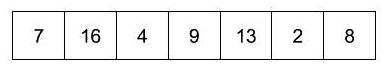
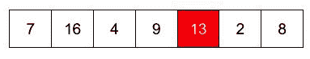
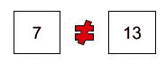
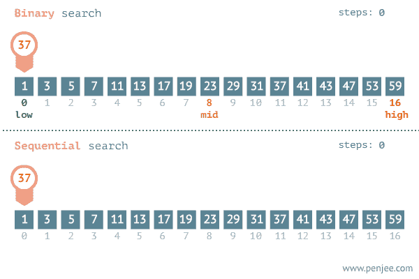
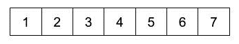
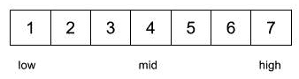
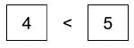
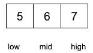
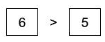
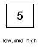

# 用 Java、Python 和 C++的例子解释搜索算法

> 原文：<https://www.freecodecamp.org/news/search-algorithms-explained-with-examples-in-java-python-and-c/>

## 什么是搜索算法？

这种算法着眼于按升序重新排列一个项目数组的问题。两个最经典的例子是二分搜索法和合并排序算法。

## 指数搜索

指数搜索，也称为 finger search，通过在每次迭代中跳转`2^i`个元素来搜索排序数组中的一个元素，其中 I 表示循环控制变量的值，然后验证在最后一次跳转和当前跳转之间是否存在搜索元素。

### 复杂性最坏情况

O(log(N))常因名字而混淆，该算法如此命名并不是因为时间复杂度。这个名字是由于算法以等于指数 2 的步长跳跃元素而产生的

### 步伐

1.  一次跳转数组`2^i`元素，搜索条件`Array[2^(i-1)] < valueWanted < Array[2^i]`。如果`2^i`大于数组长度，则设置数组长度的上限。
2.  在`Array[2^(i-1)]`和`Array[2^i]`之间做二分搜索法

# 密码

```
// C++ program to find an element x in a
// sorted array using Exponential search.
#include <bits/stdc++.h>
using namespace std;

int binarySearch(int arr[], int, int, int);

// Returns position of first ocurrence of
// x in array
int exponentialSearch(int arr[], int n, int x)
{
    // If x is present at firt location itself
    if (arr[0] == x)
        return 0;

    // Find range for binary search by
    // repeated doubling
    int i = 1;
    while (i < n && arr[i] <= x)
        i = i*2;

    //  Call binary search for the found range.
    return binarySearch(arr, i/2, min(i, n), x);
}

// A recursive binary search function. It returns
// location of x in  given array arr[l..r] is
// present, otherwise -1
int binarySearch(int arr[], int l, int r, int x)
{
    if (r >= l)
    {
        int mid = l + (r - l)/2;

        // If the element is present at the middle
        // itself
        if (arr[mid] == x)
            return mid;

        // If element is smaller than mid, then it
        // can only be present n left subarray
        if (arr[mid] > x)
            return binarySearch(arr, l, mid-1, x);

        // Else the element can only be present
        // in right subarray
        return binarySearch(arr, mid+1, r, x);
    }

    // We reach here when element is not present
    // in array
    return -1;
}

int main(void)
{
   int arr[] = {2, 3, 4, 10, 40};
   int n = sizeof(arr)/ sizeof(arr[0]);
   int x = 10;
   int result = exponentialSearch(arr, n, x);
   (result == -1)? printf("Element is not present in array")
                 : printf("Element is present at index %d", result);
   return 0;
} 
```

## 搜索链表和数组

假设你必须在一个*未排序的*链表和数组中搜索一个元素。在这种情况下，你需要做一个线性搜索(记住，不排序)。在任一数据结构中对元素进行线性搜索都是 O(n)运算。

现在，如果你有一个*排序的*链表和数组，你仍然可以使用二分搜索法在 O(log n)时间内搜索这两个数据结构。虽然，用链表编码会有点繁琐。

在频繁插入操作的情况下，链表通常比数组更受青睐。在链表中插入更容易，因为只有一个指针会改变。但是要在数组中插入(中间或开头)，需要将所有元素移动到插入的元素之后。你应该使用链表的另一个地方是大小不确定的地方(当你开始的时候你不知道大小)，因为数组有固定的大小。

与链表相比，数组确实有一些优势:

1.  随机存取
2.  与链表相比，内存更少
3.  阵列具有更好的缓存局部性，从而提供更好的性能

数组和链表哪个更好完全取决于用例。

## 线性搜索

假设给你一个列表或一组项目。您正在搜索特定的项目。你是怎么做到的？

在给定的列表中找出数字 13。



你只要看看名单就知道了！



现在，你如何告诉计算机找到它。

计算机在给定的时间内只能看到数值。因此，它从数组中取出一个项目，并检查它是否与您正在寻找的项目相同。



第一项不匹配。所以继续下一个。


等等...

这样做，直到找到一个匹配，或者直到所有的项目都被检查过。


在这种算法中，当找到项目时，您可以停止，然后没有必要进一步寻找。

那么进行线性搜索操作需要多长时间呢？在最好的情况下，你可能很幸运，你看到的东西可能在数组的第一个位置！但是在最坏的情况下，在你找到最后一个位置的项之前，或者在你意识到该项不在数组中之前，你必须查看每一项。

因此，线性搜索的复杂度是 O(n)。

如果要搜索的元素位于第一个存储块，则复杂度为 O(1)。

JavaScript 中线性搜索函数的代码如下所示。这个函数返回我们在数组中寻找的项目的位置。如果数组中不存在该项，函数将返回 null。

```
int linearSearch(int arr[], int num)
{
        int len = (int)( sizeof(arr) / sizeof(arr[0]);
        int *a = arr;
        for(int i = 0; i < len; i++)
        {
                if(*(a+i) == num) return i;
        }
        return -1;
} 
```

### JavaScript 中的示例

```
function linearSearch(arr, item) {
  // Go through all the elements of arr to look for item.
  for (var i = 0; i < arr.length; i++) {
    if (arr[i] === item) { // Found it!
      return i;
    }
  }

  // Item not found in the array.
  return null;
} 
```

### Ruby 中的示例

```
def linear_search(target, array)
  counter = 0

  while counter < array.length
    if array[counter] == target
      return counter
    else
      counter += 1
    end
  end
  return nil
end 
```

### C++中的示例

```
int linear_search(int arr[],int n,int num)
{
	for(int i=0;i<n;i++){
		if(arr[i]==num)
			return i;
   }
   // Item not found in the array
   return -1; 
} 
```

### Python 中的示例

```
def linear_search(array, num):
	for index, element in enumerate(array):
		if element == num:
			return index
	return -1 
```

### Swift 中的示例

```
func linearSearch(for number: Int, in array: [Int]) -> Int? {
    for (index, value) in array.enumerated() {
        if value == number { return index } // return the index of the number
    }
    return nil // the number was not found in the array
} 
```

### Java 中的示例

```
int linearSearch(int[] arr, int element)
{
        for(int i=0;i<arr.length;i++)
        {
                if(arr[i] == element)
                        return i;
        }
        return -1;
} 
```

### PHP 中的示例

```
function linear_search($arr=[],$num=0)
{
     $n = count($arr);   
     for( $i=0; $i<$n; $i++){
           if($arr[$i] == $num)
                return $i;
      }
      // Item not found in the array
      return -1; 
}

$arr = array(1,3,2,8,5,7,4,0);
print("Linear search result for 2: ");
echo linear_search($arr,2); 
```

### 全局线性搜索

如果您正在搜索一个元素的多次出现会怎样？例如，你想知道一个数组中有多少个 5。

目标= 5

Array = [ 1，2，3，4，5，6，5，7，8，9，5]

这个数组中有 3 个 5，我们想返回所有 5 的索引(它们在数组中的位置)。这被称为全局线性搜索。您需要调整代码以返回一个索引点数组，在该数组中找到目标元素。当您找到与目标匹配的索引元素时，索引点(计数器)将被添加到结果数组中。如果不匹配，代码将继续移动到数组中的下一个元素，计数器加 1。

```
def global_linear_search(target, array)
  counter = 0
  results = []

  while counter < array.length
    if array[counter] == target
      results << counter
      counter += 1
    else
      counter += 1
    end
  end

  if results.empty?
    return nil
  else
    return results
  end
end 
```

### 为什么线性搜索效率不高

毫无疑问，线性搜索是简单的，但是因为它逐个比较每个元素，所以它很耗时，因此效率不高。如果我们必须从 1000000 个数字中找出一个数字，并且这个数字位于最后一个位置，那么线性搜索技术将变得非常乏味。所以，也要学习二分搜索法，指数搜索等等。这比线性搜索效率高得多。

## 二进位检索

二分搜索法通过重复地将搜索间隔一分为二来定位排序数组中的项目。

你如何在电话号码簿中查找一个名字？

一种方法是从第一页开始，查看电话簿中的每个名字，直到找到我们要找的。但这将是一种极其费力且低效的搜索方式。

因为我们知道电话簿中的名字是按字母顺序排列的，所以我们可以按照以下步骤进行:

1.  打开电话簿的中间一页
2.  如果它有我们要找的名字，我们就完了！
3.  否则，扔掉电话簿中不包含姓名的那一半
4.  重复此操作，直到您找到该姓名或电话簿中没有剩余的页面

[



]

时间复杂度:由于我们在二分搜索法的每一步都处理掉搜索案例的一部分，而在另一半上执行搜索操作，这导致最坏情况下的时间复杂度为 *O* ( *log2N* )。最好的情况是当要查找的元素位于列表中间时。最佳案例时间复杂度为 *O* ( *1* )。

空间复杂度:二分搜索法取常量或 *O* ( *1* )空间意味着我们不做任何输入大小相关的变量定义。

对于较小的集合，线性搜索更好，但是在较大的集合中，使用二分搜索法更有效。

详细来说，你能把 N 除以 2 多少次，直到你有 1？这基本上是说，做一个二分搜索法(一半的元素)，直到你找到它。在公式中应该是这样的:

```
1 = N / 2^x 
```

乘以 2 倍:

```
2^x = N 
```

现在做日志 2:

```
log2(2^x)   = log2 N
x * log2(2) = log2 N
x * 1       = log2 N 
```

这意味着您可以将 log 划分 N 次，直到所有内容都被划分。这意味着你必须划分 log N(“做二分搜索法步骤”)直到你找到你的元素。

*O* ( *log2N* )之所以如此，是因为在每一步，数据集中的一半元素都消失了，这由对数函数的基来证明。

这是二分搜索法算法。它优雅而高效，但要正确工作，数组必须经过排序。

使用二分搜索法在给定的数字数组中找出 5。



标记阵列中的低、高和中间位置。



将您正在寻找的项目与中间元素进行比较。



扔掉左半边，看看右半边。



再次与中间元素进行比较。



现在，移到左半边。



中间的元素就是我们要找的东西！

二分搜索法算法采用分而治之的方法，不断分割数组，直到找到项目或没有元素需要检查为止。因此，这个算法可以递归定义，以产生一个优雅的解决方案。

递归的两种基本情况是:

*   数组中没有更多的元素
*   找到项目

数据系统中二分搜索法的威力(B+树):二分搜索法树非常强大，因为它们的搜索时间为 O(log n)，仅次于使用散列关键字在 O(1)中搜索数据的 hashmap 数据结构。了解 log n 运行时间如何来自二叉查找树的高度非常重要。如果每个节点分成两个节点(二进制)，那么树的深度是 log n(以 2 为底)..为了提高数据系统的速度，我们使用 B+树，因为它们有更大的分支因子，因此更高。我希望这篇短文有助于扩展您对二分搜索法在实际系统中如何使用的理解。

递归二分搜索法的代码如下所示:

### JavaScript 实现

```
function binarySearch(arr, item, low, high) {
    if (low > high) { // No more elements in the array.
        return null;
    }

    // Find the middle of the array.
    var mid = Math.ceil((low + high) / 2);

    if (arr[mid] === item) { // Found the item!
        return mid;
    }

    if (item < arr[mid]) { // Item is in the half from low to mid-1.
        return binarySearch(arr, item, low, mid-1);
    }

    else { // Item is in the half from mid+1 to high.
        return binarySearch(arr, item, mid+1, high);
    }
}

var numbers = [1,2,3,4,5,6,7];
print(binarySearch(numbers, 5, 0, numbers.length-1)); 
```

下面是 JavaScript 的另一个实现:

```
function binary_search(a, v) {
    function search(low, high) {
        if (low === high) {
            return a[low] === v;
        } else {
            var mid = math_floor((low + high) / 2);
            return (v === a[mid])
                   ||
                   (v < a[mid])
                   ? search(low, mid - 1)
                   : search(mid + 1, high);
        }
    }
    return search(0, array_length(a) - 1);
} 
```

### Ruby 实现

```
def binary_search(target, array)
  sorted_array = array.sort
  low = 0
  high = (sorted_array.length) - 1

  while high >= low
    middle = (low + high) / 2

    if target > sorted_array[middle]
      low = middle + 1
    elsif target < sorted_array[middle]
      high = middle - 1
    else
      return middle
    end
  end
  return nil
end 
```

### C 中的示例

```
int binarySearch(int a[], int l, int r, int x) {
   if (r >= l){
        int mid = (l + (r - l))/2;
        if (a[mid] == x)
            return mid;
        if (arr[mid] > x)
            return binarySearch(arr, l, mid-1, x);
        return binarySearch(arr, mid+1, r, x);
   }
   return -1;
} 
```

### Python 实现

```
def binary_search(arr, l, r, target):
    if r >= l:
        mid = (l + (r - l))/2
        if arr[mid] == target:
            return mid
        elif arr[mid] > target:
            return binary_search(arr, l, mid-1, target)
        else:
            return binary_search(arr, mid+1, r, target)
    else:
        return -1 
```

### C++中的示例

递归方法！

```
// Recursive approach in C++
int binarySearch(int arr[], int start, int end, int x)
{
   if (end >= start)
   {
        int mid = (start + (end - start))/2;
        if (arr[mid] == x)
            return mid;

        if (arr[mid] > x)
            return binarySearch(arr, start, mid-1, x);

        return binarySearch(arr, mid+1, end, x);
   }
   return -1;
} 
```

迭代方法！

```
int binarySearch(int arr[], int start, int end, int x)
{
    while (start <= end)
    {
        int mid = (start + (end - start))/2;
        if (arr[mid] == x)
            return mid;
        if (arr[mid] < x)
            start = mid + 1;
        else
            end = mid - 1;
    }
    return -1;
} 
```

### Swift 中的示例

```
func binarySearch(for number: Int, in numbers: [Int]) -> Int? {
    var lowerBound = 0
    var upperBound = numbers.count
    while lowerBound < upperBound {
        let index = lowerBound + (upperBound - lowerBound) / 2
        if numbers[index] == number {
            return index // we found the given number at this index
        } else if numbers[index] < number {
            lowerBound = index + 1
        } else {
            upperBound = index
        }
    }
    return nil // the given number was not found
} 
```

### Java 中的示例

```
// Iterative Approach in Java
int binarySearch(int[] arr, int start, int end, int element)
{
    while(start <= end)
    {
        int mid = start + ( end - start ) / 2;
        if(arr[mid] == element)
            return mid;
        if(arr[mid] < element)
            start = mid+1;
        else
            end = mid-1;
    }
   return -1;
} 
```

```
// Recursive Approach in Java
int binarySearch(int[] arr, int start,int end , int element)
{
  if (end >= start)
  {
    int mid = start + ( end - start ) / 2;
    if(arr[mid] ==  element)
        return mid;
    if(arr[mid] < element)
        return binarySearch( arr , mid + 1 , end , element );
    else
        return binarySearch( arr, start, mid - 1 , element);
  }
  return -1;
} 
```