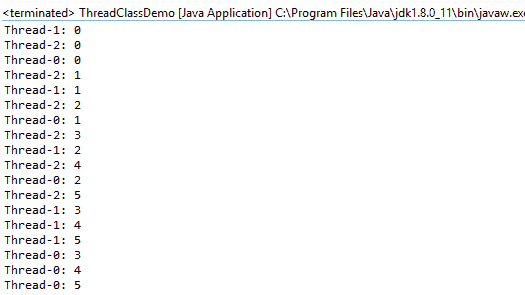
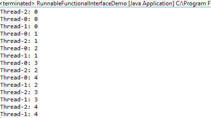

# Java 中的多线程:如何开始使用线程

> 原文：<https://www.freecodecamp.org/news/how-to-get-started-with-multithreading-in-java/>

# 什么是线程？

线程是一个轻量级的进程。任何进程都可以有多个线程在其中运行。

例如，在 web 浏览器中，我们可以用一个线程加载用户界面，用另一个线程实际检索所有需要在界面中显示的数据。

# 什么是多线程？

多线程使我们能够同时运行多个线程。

例如，在 web 浏览器中，我们可以用一个线程处理用户界面，同时我们可以用另一个线程获取要显示的数据。

因此多线程提高了系统的响应能力。

# 什么是并发？

线程环境中的并发性使我们能够同时运行多个线程。

但是线程真的同时运行吗？

## 单核系统

JVM 提供的**线程调度器**决定在任何给定的时间运行哪个线程。调度器给每个线程一个小的时间片。

所以在任何给定的时间，我们只有一个线程在处理器中运行。但是由于时间片，我们感觉多个线程同时运行。

## 多核系统

即使在多核系统中，也涉及到线程调度器。但是由于我们有多个内核，我们实际上可以同时运行多个线程。

例如，如果我们有一个双核系统，那么我们可以同时运行两个线程。第一个线程将在第一个内核中运行，第二个线程将在第二个内核中运行。

# 为什么需要多线程？

多线程使我们能够提高系统的响应能力。

例如，在 web 浏览器中，如果所有东西都在一个线程中运行，那么无论何时获取数据进行显示，系统都将完全没有响应。例如，如果获取数据需要 10 秒钟，那么在这 10 秒钟内，我们将无法在 web 浏览器中做任何其他事情，例如打开新标签，甚至关闭 web 浏览器。

因此，在不同的线程中同时运行程序的不同部分有助于提高系统的响应能力。

# 如何用 Java 编写多线程程序

我们可以使用以下代码在 Java 中创建线程

*   扩展线程类
*   实现 runnable 接口
*   实现可调用接口
*   通过使用 executor 框架以及可运行和可调用的任务

我们将在另一篇博客中讨论 callables 和 executor 框架。在这篇文章中，我将主要关注扩展 thread 类和实现 runnable 接口。

## 扩展线程类

为了创建一段可以在线程中运行的代码，我们创建一个类，然后扩展 **thread** 类。这段代码执行的任务需要放在 **run()** 函数中。

在下面的代码中你可以看到 **worker** 是一个扩展了 **thread** 类的类，打印数字 0 到 5 的任务是在 **run()** 函数内部完成的。

```
class Worker extends Thread {

	@Override
	public void run() {
		for (int i = 0; i <= 5; i++) {
			System.out.println(Thread.currentThread().getName() + ": " + i);
		}
	}

} 
```

在上面的代码**中 Thread.currentThread()。getName()** 用于获取运行代码的当前线程的名称。

为了创建一个**线程**，我们只需要创建一个 worker 类的实例。然后我们可以使用 **start()** 函数来启动线程。

```
public class ThreadClassDemo {
	public static void main(String[] args) {
		Thread t1 = new Worker();
		Thread t2 = new Worker();
		Thread t3 = new Worker();
		t1.start();
		t2.start();
		t3.start();

	}
} 
```

在上面的代码中，我们从 worker 类创建了 3 个线程(t1、t2 和 t3)。然后我们使用 **start()** 函数启动线程。

下面是通过扩展线程类来创建线程的最终代码:

```
class Worker extends Thread {

	@Override
	public void run() {
		for (int i = 0; i <= 5; i++) {
			System.out.println(Thread.currentThread().getName() + ": " + i);
		}
	}

}

public class ThreadClassDemo {
	public static void main(String[] args) {
		Thread t1 = new Worker();
		Thread t2 = new Worker();
		Thread t3 = new Worker();
		t1.start();
		t2.start();
		t3.start();

	}
} 
```

下面是我们通过运行上面的代码得到的输出:



你可以看到所有的 3 根线都打印了从 0 到 5 的数字。

**您还可以从输出中清楚地看到，3 个线程没有以任何特定的顺序运行**

## 实现 Runnable 接口

为了创建一段可以在线程中运行的代码，我们创建了一个类，然后实现了 **runnable** 接口。这段代码执行的任务需要放在 **run()** 函数中。

在下面的代码中你可以看到 **RunnableWorker** 是一个实现 **runnable** 接口的类，打印数字 0 到 4 的任务是在 **run()** 函数内部完成的。

```
class RunnableWorker implements Runnable{

	@Override
	public void run() {
		for (int i = 0; i <= 4; i++) {
			System.out.println(Thread.currentThread().getName() + ": " + i);
		}
	}

} 
```

为了创建一个线程，首先我们需要创建一个 **RunnableWorker** 的实例，它实现了 **runnable** 接口。

然后我们可以创建一个新的线程，方法是创建一个 **thread** 类的实例，并将 **RunnableWorker** 的实例作为参数传递。这显示在下面的代码中:

```
public class RunnableInterfaceDemo {

	public static void main(String[] args) {
		Runnable r = new RunnableWorker();
		Thread t1 = new Thread(r);
		Thread t2 = new Thread(r);
		Thread t3 = new Thread(r);

		t1.start();
		t2.start();
		t3.start();

	}

} 
```

上面的代码创建了一个可运行的实例 r。然后它创建了 3 个线程(t1、t2 和 t3)并将 **r** 作为参数传递给这 3 个线程。然后使用 **start()** 函数来启动所有 3 个线程。

下面是通过实现 runnable 接口创建线程的完整代码:

```
class RunnableWorker implements Runnable{

	@Override
	public void run() {
		for (int i = 0; i <= 4; i++) {
			System.out.println(Thread.currentThread().getName() + ": " + i);
		}
	}

}

public class RunnableInterfaceDemo {

	public static void main(String[] args) {
		Runnable r = new RunnableWorker();
		Thread t1 = new Thread(r);
		Thread t2 = new Thread(r);
		Thread t3 = new Thread(r);

		t1.start();
		t2.start();
		t3.start();

	}

} 
```

运行上面的代码，我们将得到下面的输出。每次运行代码时，输出的顺序都会改变。



实现 runnable 接口是比扩展 thread 类更好的选择，因为我们只能扩展一个类，但是我们可以用 Java 实现多个接口。

## Java 8 中的可运行接口

在 Java 8 中，runnable 接口变成了一个 **FunctionalInterface** ，因为它只有一个函数 **run()** 。

下面的代码展示了我们如何在 Java 8 中创建一个可运行的实例。

```
public class RunnableFunctionalInterfaceDemo {

	public static void main(String[] args) {

		Runnable r = () -> {
			for (int i = 0; i <= 4; i++) {
				System.out.println(Thread.currentThread().getName() + ": " + i);
			}
		};

		Thread t1 = new Thread(r);
		Thread t2 = new Thread(r);
		Thread t3 = new Thread(r);

		t1.start();
		t2.start();
		t3.start();
	}

} 
```

这里，我们可以直接使用 lambda 表达式创建一个 runnable 实例，而不是创建一个类，然后实现 runnable 接口，如下所示:

```
Runnable r = () -> {
        for (int i = 0; i <= 4; i++) {
            System.out.println(Thread.currentThread().getName() + ": " + i);
        }
    }; 
```

# 密码

本文中的代码可以在下面的 GitHub repo 中找到:[https://github.com/aditya-sridhar/basic-threads-demo](https://github.com/aditya-sridhar/basic-threads-demo)

# 恭喜你。

您现在知道了如何通过扩展 thread 类和实现 runnable 接口来创建线程。

我将在下一篇博文中讨论线程的生命周期和使用线程时的挑战。

**我的网站**:https://adityasridhar.com/

### 请随时在 LinkedIn 上与我联系，或者在 T2 的 Twitter 上关注我