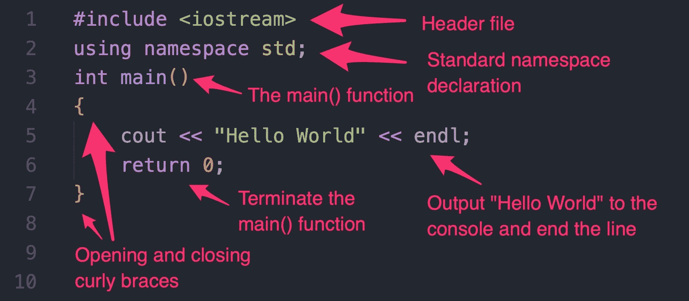

# C++编程语言

> 原文：<https://www.freecodecamp.org/news/the-c-plus-plus-programming-language/>

C++是一种通用编程语言，最早开发于 20 世纪 80 年代。这种语言是由比雅尼·斯特劳斯特鲁普设计的，名为“带类的 C”。

C++是一个包含面向对象元素的 C 版本，包括类和函数。

它被认为是使用最广泛的编程语言之一，如下图所示:


Source: GitHub

## C++中的 Hello World

```
#include <iostream>
using namespace std;
int main()
{
    cout << "Hello World" << endl;
    return 0;
}
```

这个程序的输出将是:

```
Hello World!
```

现在，让我们分解代码。

### 1 号线和 2 号线

```
#include <iostream>
using namespace std;
```

第一行告诉计算机使用这个特定程序的`iostream`头文件。头文件是一个包含预先编写的 C++代码的独立文件。一个特定的程序要正常运行，还需要许多其他的头文件。其中一些是`math`、`vector`和`string`。头文件通常由一个`.h`扩展名表示(当包含 C++标准库文件时，不需要添加`.h`)

`iostream`代表“输入输出流”。`iostream`文件包含允许计算机使用 C++语言获取输入并生成输出的代码。

第二行，`using namespace std;`，告诉计算机使用标准名称空间，它包含了标准 C++的特性。你可以不用这一行写这个程序，但是你必须在第 4 行用 T1 代替 T2，用 T3 代替 T4。但是第二行让代码更易读，也让我们程序员的生活更轻松。

### 第 3 和第 4 行

```
int main()
{
```

C++从用`int main()`声明的全局`main()`函数开始执行程序。在执行过程中，计算机开始运行每一行的代码，从开始的花括号`{`，到结束的花括号`}`。

注:每个功能都以`{`开始，以`}`结束。

第 4 行用左花括号表示了`main()`函数的开始。

### 第 5、6 和 7 行

```
 cout << "Hello World" << endl;
    return 0;
}
```

`cout`代表“字符输出”，是在屏幕上显示输出的对象。

`cout`后面是`<<`，是一个插入操作符。插入操作符将数据发送给它们前面的流操作符。

接下来是双引号(`"`)包围的短语`Hello World`。双引号之间的任何内容都是字符串。这是一个带有标准字符的简单字符串，但是某些特殊字符对于 print 语句有不同的语法。

因此插入操作符`<<`将字符串`"Hello World"`传递给`cout`对象。

但是如果你看看行尾，有另一个插入操作符和`endl`。

`endl`是 C++语言中的保留字，代表“结束行”。在 C++中，可以使用`endl`对象结束当前行，刷新流，并转到输出中的下一行。

最后，该行以分号`;`结束。

所以看第 5 行，字符串`"Hello World"`和`endl`都用插入操作符传递给了`cout`，这一行以分号结束。

在第 6 行，`return 0;`安全地终止当前函数，`main()`。由于`main()`之后没有任何功能，整个程序终止。

最后在第 7 行，`main()`函数以一个右花括号`}`结束。如果你没有用花括号结束一个函数，你将会遇到一个执行错误。

## 回顾

同样，您的代码应该如下所示:



恭喜你！你已经编写了第一个 C++程序，并且迈出了学习 C++的第一步。

要实际编译和运行您的 C++程序，请查看这些教程:

*   [C++编译器讲解:编译器是什么，怎么用？](https://www.freecodecamp.org/news/c-compiler-explained-what-is-the-compiler-and-how-do-you-use-it/)
*   [如何在 Visual Studio 代码中编译你的 C++代码](https://www.freecodecamp.org/news/how-to-compile-your-c-code-in-visual-studio-code/)