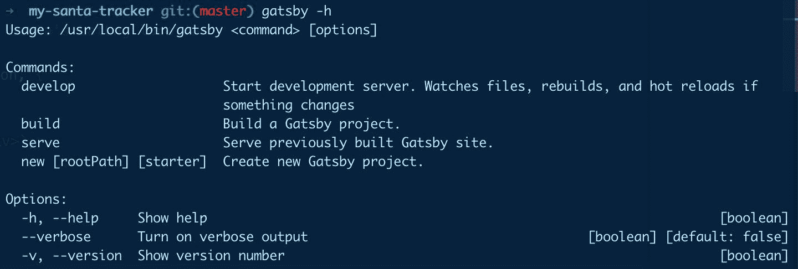
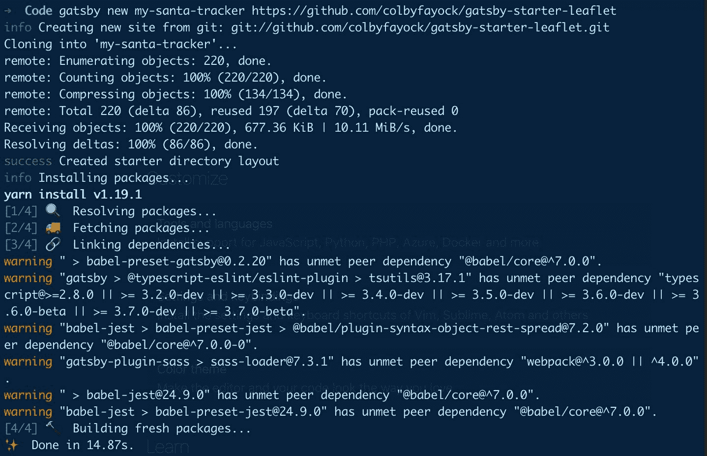
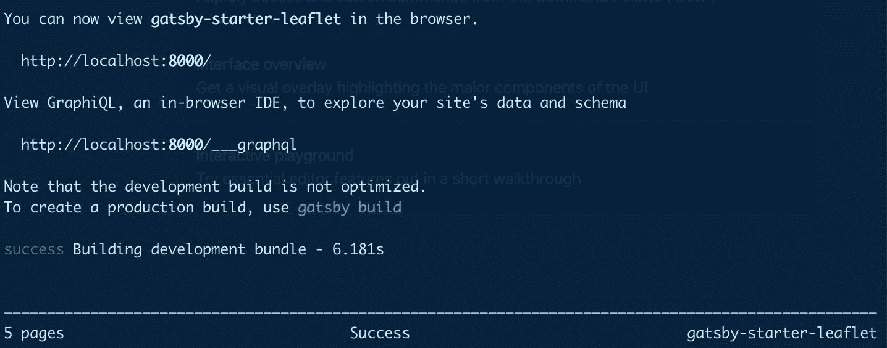
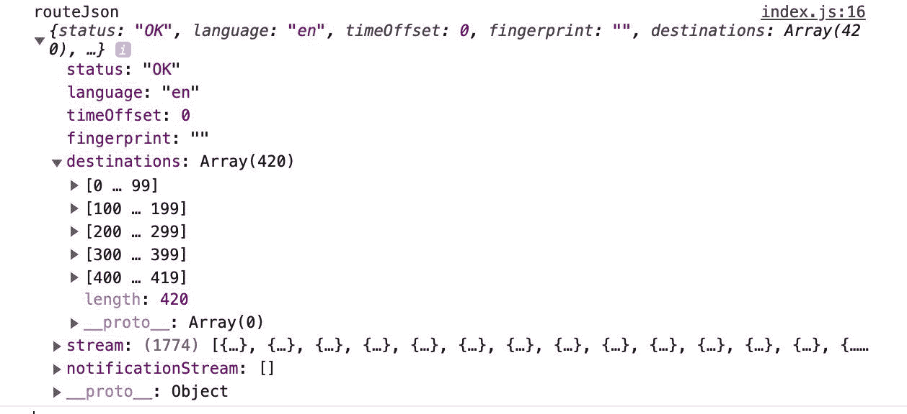
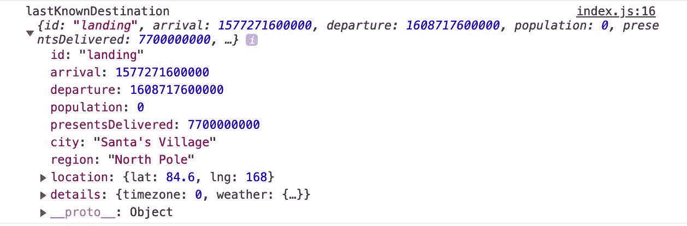
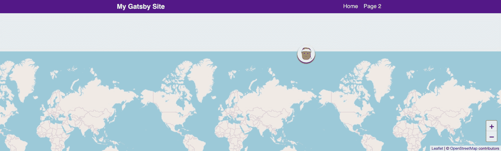
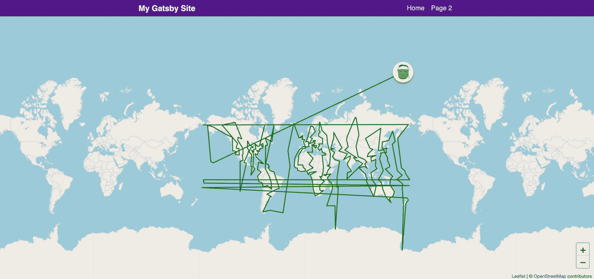
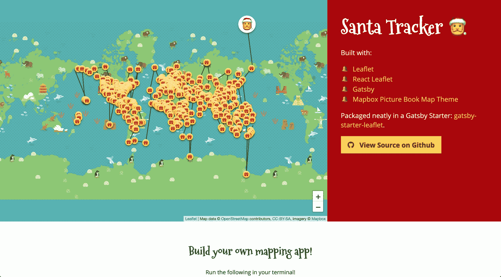

# 如何用盖茨比和 React 传单创建自己的圣诞老人追踪器

> 原文：<https://www.freecodecamp.org/news/create-your-own-santa-tracker-with-gatsby-and-react-leaflet/>

圣诞节是一年中神奇的时刻。在我们一年一度与家人和朋友团聚的时候，我们让圣诞老人飞来飞去传播快乐，让小精灵在纽约四处游荡。


Buddy the Elf waving

为了体现这种精神，我们将开发一个网络应用程序，其中包括一张追踪圣诞老人的地图！

*Edit 12/23:更新了应用程序以直接请求圣诞老人的路线，以防原来的 API 不能如最初预期的那样工作。*

## 我们要建造什么？

我们将通过建立一个地图应用程序来跟踪圣诞老人的路线和他的当前位置。

为了实现这一点，我们将旋转一个预制的盖茨比启动器，它将为我们提供一个地图的基本基础，利用谷歌的非官方 API 来获取圣诞老人的路线，并用传单将他的位置和路线覆盖在地图上。

## **Woah，一款地图应用？**


Ay Caramba

没错。如果你之前没有玩过地图，也不要气馁！这并不像你想象的那么糟糕。如果你更愿意从映射基础开始，你可以先[阅读更多关于映射如何工作的信息](https://www.freecodecamp.org/news/easily-spin-up-a-mapping-app-in-react-with-leaflet/)。

## 开始之前我们需要什么？

在这个练习中，我将假设您已经安装了[节点](https://nodejs.org/en/)或[纱线](https://yarnpkg.com/en/)。对于每个例子，我将使用纱线，但使用您选择的工具。

你也会想在全球范围内安装 [Gatsby 的 CLI](https://www.gatsbyjs.org/docs/gatsby-cli/) ，这将允许我们使用他们的[启动工具](https://www.gatsbyjs.org/docs/starters/)。

要设置 Gatsby 的 CLI，请运行以下命令:

```
yarn global add gatsby-cli
```

之后，您应该能够运行`gatsby -h`来查看可用的命令，这意味着它已经成功安装。



Running gatsby -h to verify install

要了解关于 Gatsby CLI 的更多信息，您可以[查看他们的文档](https://www.gatsbyjs.org/docs/gatsby-cli/)。

## **开始使用我们的地图基础**

一旦我们的命令行工具设置好了，我们要做的第一件事就是使用我做的一个传单启动器创建一个新的 Gatsby 项目。它为我们提供了带有[传单](https://leafletjs.com/)和[反应传单](https://react-leaflet.js.org/)的基本设置。

从您的项目目录开始，让我们安装项目:

```
gatsby new [directory] https://github.com/colbyfayock/gatsby-starter-leaflet 
```

确保将`[directory]`替换为您想要设置项目的位置。

一旦您运行了这个命令，Gatsby 将在没有任何 git 引用的情况下克隆这个项目，并安装启动所需的包。



Installing Gatsby Starter Leaflet

为了确保它能够工作，您现在可以导航到该目录，启动您的服务器，并在浏览器中测试它:

```
cd [directory]
yarn develop 
```

在你看到上面的`[directory]`的地方，确保在建立新的 Gatsby 项目时使用和你之前一样的路径。



Running Gatsby Starter Leaflet

如果一切按计划进行，您的服务器应该启动，现在您应该能够在浏览器中看到您的基本地图应用程序！


Gatsby Starter Leaflet in the browser

## **收拾东西**

这个初学者附带了一个我们如何与地图互动的快速示例。对于我们的目的来说，我们根本不需要这个，所以我们可以继续进行清理。

首先，我们将打开我们的`index.js`文件，即主页文件，并删除`mapEffect`函数中的所有内容，这样我们就有了:

```
// In src/pages/index.js

async function mapEffect({ leafletElement } = {}) {
  // Get rid of everything in here
} 
```

现在，让我们移除嵌套在我们的`Map`中的`Marker`组件，这样我们最后得到:

```
<Map {…mapSettings} />
```

既然我们不再使用该功能，我们可以删除文件顶部的变量和引用，因此您可以继续删除:

*   useRef
*   承诺飞翔
*   getCurrentLocation
*   标记
*   盖茨比 _ 宇航员
*   嗡嗡声
*   时间工作室
*   timeToOpenPopupAfterZoom
*   timeToUpdatePopupAfterZoom
*   popupContentHello
*   popupContentGatsby
*   markerRef

[跟随提交。](https://github.com/colbyfayock/my-santa-tracker/commit/58106bad98ff7491f56d580d01f70f1400120fce)

## **寻找圣诞老人**

现在我们在一个好地方，让我们弄脏我们的手并且找到圣诞老人。为了做到这一点，我们将使用谷歌的非官方的，未记录的 API。这意味着这个 API 可能在这个 get 发布的第二天就不可用了，但是让我们乐观一点。

此外，在撰写本文时，它仍然显示去年的目的地，所以我们真正要在这里可视化的是圣诞老人前一年的路线，尽管希望这将在 24 日重置，我们都将快乐！

在我们得到圣诞老人之前，让我们先给我们的`mapEffect`函数添加一行代码:

```
async function mapEffect({ leafletElement } = {}) {
  if ( !leafletElement ) return;
} 
```

这样做的目的是在地图还没有准备好的情况下，防止其余的代码运行。正如您在`Map`组件中看到的，`mapEffect`函数本身运行在`useEffect`的一个实例内部，将一个`ref`的参数传递给地图，允许我们在组件呈现后运行一些代码。

所以一旦我们有了这条线，现在让我们在我们的`mapEffect`函数中获取圣诞老人的路线:

```
async function mapEffect({ leafletElement } = {}) {
  if ( !leafletElement ) return;
  let route, routeJson;
  try {
    route = await fetch('https://firebasestorage.googleapis.com/v0/b/santa-tracker-firebase.appspot.com/o/route%2Fsanta_en.json?alt=media&2018b');
    routeJson = await route.json();
  } catch(e) {
    console.log(`Failed to find Santa!: ${e}`);
  }
  console.log(‘routeJson’, routeJson);
}
```

让我们来分解一下:

*   我们通过 API 端点获取圣诞老人的路线
*   一旦我们有了他的路线，我们就以 JSON 格式获取响应，以便更容易处理
*   这些都包含在 try/catch 中，因此我们可以安全地处理任何响应错误
*   最后，我们只是暂时给出我们的回应



Santa's route object in the web console

现在我们有了圣诞老人和他的路线，这意味着我们可以看到他路线上的所有目的地。如果你仔细研究一下回复，你会发现一些有趣的事情，比如每个地点收到了多少礼物，以及当时的天气情况！

[跟随提交。](https://github.com/colbyfayock/my-santa-tracker/commit/f42c48fb0f0d70b4d20f1c2a1410bde1a4f27e84)

## **把大头针放在他的位置**

我们找到圣诞老人了！？现在让我们把他放在地图上。

出于我们的目的，我们需要找到圣诞老人的纬度和经度。问题是，我们没有在任何地方定义这个确切的值，我们只是得到他的目的地。

由于我们没有指定他的位置，我们可以利用他最后一次收到礼物的位置。在`mapEffect`函数中的最后一个代码片段后添加以下内容:

```
const { destinations = [] } = routeJson || {};
    const destinationsVisited = destinations.filter(({arrival}) => arrival < Date.now());
    const destinationsWithPresents = destinationsVisited.filter(({presentsDelivered}) => presentsDelivered > 0);
const lastKnownDestination = destinationsWithPresents[destinationsWithPresents.length - 1]
```

在我们的请求代码下面，我们:

*   破坏`routeJson`将`destinations`抓取到一个常量中，为一个空对象添加一个回退
*   使用 route 对象中的到达时间过滤结果，仅查找他访问过的目的地
*   过滤结果以仅查找有礼物的位置
*   最后从数组中获取最后一项，这显示了他最后的已知位置

在这个时间点，12 月 23 日，我们实际上没有任何目的地，因为圣诞老人仍然在北极。在任何时候，我们都可以通过将`destinationsVisited`中的`Date.now()`替换为未来的日期来模拟未来的日期，例如`1577188980000`，这将是东部时间 12 月 24 日晚上 7 点左右。有了这个改变，我们就可以看到圣诞老人的路线实际上是什么样子了！

## 处理一个失踪的圣诞老人

现在快到圣诞节了，圣诞老人还是会在北极，那我们就来处理没有位置的情况吧。

在我们设置`lastKnownDestination`的那一行上面，让我们加上:

```
if ( destinationsWithPresents.length === 0 ) {
  // Create a Leaflet Market instance using Santa's LatLng location
  const center = new L.LatLng( 0, 0 );
  const noSanta = L.marker( center, {
    icon: L.divIcon({
      className: 'icon',
      html: `<div class="icon-santa">?</div>`,
      iconSize: 50
    })
  });
  noSanta.addTo( leafletElement );
  noSanta.bindPopup( `Santa's still at the North Pole!` );
  noSanta.openPopup();
  return;
}
```

好吧，那我们在这里做什么？

*   首先，我们检查我们是否有任何带礼物的目的地，在这里我们没有
*   我们首先创建一个地图的中心
*   我们创建了一个传单标记，使用该中心，带有一个自定义的圣诞老人图标
*   接下来，我们将圣诞老人标记添加到 leafletElement，这是我们的地图
*   为了显示消息，我们首先用自定义消息绑定一个弹出窗口并打开它
*   最后我们返回，这样剩下的代码就不会运行了，因为此时我们还没有圣诞老人

这是在发布后添加的一个部分，用于处理 API 重置，但是您仍然可以在其余代码的上下文中遵循我添加的代码。

遵循代码。

## 钉圣诞老人

编辑 12/23:这一部分最初是用前一年的 API 编写的，但这仍然是一个很好的例子，说明了您对响应的期望，所以您可以继续跟进。

正如我们看到的，因为我们在看去年的数据，圣诞老人回到了北极的家。



Santa's last known location in the web console

有了他的位置，我们就可以把它拆开，建立一个传单标记实例，并把我们的老朋友添加到地图上。在`mapEffect`函数中的最后一个代码片段后添加以下内容:

```
const santaLocation = new L.LatLng( lastKnownDestination.location.lat, lastKnownDestination.location.lng );

const santaMarker = L.marker( santaLocation, {
  icon: L.divIcon({
    className: ‘icon’,
    html: `<div class=“icon-santa”>?</div>`,
    iconSize: 50
  })
});

santaMarker.addTo(leafletElement);
```

我们在此:

*   用他的位置创建一个传单 LatLng 实例
*   用我们新创建的标记实例创建一个标记实例
*   将我们的新标记添加到地图上

如果我们刷新页面，你必须缩小并向上平移一点，但我们会在地图上看到圣诞老人！


Santa on the map

在我们继续之前，让我们给圣诞老人一点节日的欢呼，让他更容易被找到。找到你的`application.scss`文件，把这些风格放进:

```
// In src/assets/stylesheets/application.scss

.icon {

  & > div {

    display: flex;
    justify-content: center;
    align-items: center;
    overflow: hidden;
    border-radius: 100%;
    box-shadow: 0 3px 4px rgba(0,0,0,.4);
    border: none;
    transition: all .2s;

    &:hover {
      box-shadow: 0 4px 8px rgba(0,0,0,.6);
    }

  }

}

.icon-santa {
  width: 50px;
  height: 50px;
  font-size: 3em;
  background: white;
} 
```

这只是在他周围增加了一个白色的圆圈，一点阴影，并增加了一点大小，使他更容易在地图上找到。



Santa styled on the map

[跟随提交。](https://github.com/colbyfayock/my-santa-tracker/commit/1b636107078fce64068ce661903892c095cb4668)

## **画他的路线**

这里我们要做的最后一件事是在地图上画一条显示他路线的路径，这样我们就可以跟着走了。

首先，让我们更新我们的代码，并将这最后一点添加到`mapEffect`函数中的最后一个代码片段之后:

```
// Create a set of LatLng coordinates that make up Santa's route

const santasRouteLatLngs = destinationsWithPresents.map(destination => {
  const { location } = destination;
  const { lat, lng } = location;
  return new L.LatLng( lat, lng );
});

// Utilize Leaflet's Polyline to add the route to the map

const santasRoute = new L.Polyline( santasRouteLatLngs, {
  weight: 2,
  color: 'green',
  opacity: 1,
  fillColor: 'green',
  fillOpacity: 0.5
});

// Add Santa to the map!

santasRoute.addTo(leafletElement); 
```

我们正在做的事情:

*   创建一系列传单 LatLng 实例，组成圣诞老人的路线
*   使用该路线阵列创建传单折线(多点线)
*   将折线设为绿色
*   将我们的折线添加到地图中

我们得到的…是一堆弯弯曲曲的线条！


Santa's route on the map

这是意料之中的。这变得技术非常快，但传单默认只能理解地图的 1“部分”,因为它在我们的浏览器中环绕。这实际上意味着，当坐标到达国际日期变更线时，坐标认为它从世界的一端到另一端，而不是围绕地球画一条线。这有点超出了本教程的范围，但是你可以查看一下[传单。Antimeridian](https://github.com/briannaAndCo/Leaflet.Antimeridian) 了解更多信息，看看你是否能实现它的解决方案。

[跟随提交。](https://github.com/colbyfayock/my-santa-tracker/commit/3b0c08f066212ff32c82d3df2a13d1419da8ac41)

## **一些快速的风格调整**

最后一件事！这是完全可选的。让我们把地图放大一点，设置背景颜色来匹配我们的海洋，并缩小一点。所以让我们做一些改变:

```
// In src/pages/index.js

const DEFAULT_ZOOM = 1; 
```

我们将默认缩放设置为`1`而不是`2`，以允许地图缩小一点。

```
// In src/assets/stylesheets/pages/_home.scss

.page-home {

  .map,
  .map-base {
    height: 80vh;
  }

}
```

我们将地图的高度设置为`80vh`而不是`50vh`,以使它占据更多的屏幕空间。

```
// In src/assets/stylesheets/components/_map.scss
.map {

  &,
  .map-base {
    background: #acd3de;
  }

}
```

我们将地图的背景颜色设置为`#acd3de`而不是`$blue-grey-50`，这样我们就可以在地图上匹配海洋的颜色。

这实现的是能够看到圣诞老人的完整路线和圣诞老人在第一个视图。此外，由于地图只覆盖屏幕的一部分，设置地图的背景颜色可以让我们没有一点点奇怪的截止。



Santa's route zoomed out

[跟随提交。](https://github.com/colbyfayock/my-santa-tracker/commit/882ea5c0b1b48da86d81494b8b4ad5db7bc1bae6)

## 想要挑战吗？

为了更进一步，按照我们在地图上添加路线和圣诞老人的方法，尝试看看是否可以在每个目的地位置添加一个标记，以显示所有停靠点的位置。额外的好处是，在每个地方添加一个弹出窗口，显示有多少礼物被送到了那个地方！

要通过一些代码组织和我如何添加礼物标记来查看答案，请查看最终版本的[圣诞老人跟踪器演示](https://github.com/colbyfayock/santa-tracker)。



Final Santa Tracker demo

当你在那里的时候，你也可以看到我是如何利用传单的。反子午线来确定我们的地图路线。

## 我们学到了什么？

用地图构建基础应用远没有我们想象的那么糟糕！我们学习了如何从 API 获取一些数据，获取我们需要的数据，并在地图上绘制这些数据的表示。

下次你想在你的登陆页面上添加一个地图插件，试试传单。在 [Twitter](https://twitter.com/colbyfayock) 上分享你的创作！很想看看你有什么发现。

我希望你和你的家人有一个美妙的假期！


Happy Holidays from Dunder Mifflin

## 想了解更多关于地图的知识？

您可以查看我的一些其他资源来开始:

*   [谁都会地图！灵感和对地图世界的介绍](https://www.colbyfayock.com/2020/03/anyone-can-map-inspiration-and-an-introduction-to-the-world-of-mapping)
*   [如何创建冠状病毒(新冠肺炎)仪表盘&地图 App in React with Gatsby 和传单](https://www.colbyfayock.com/2020/03/how-to-create-a-coronavirus-covid-19-dashboard-map-app-with-gatsby-and-leaflet)
*   [如何使用 React 传单和传单 Gatsby Starter 设置自定义地图框底图样式](https://www.colbyfayock.com/2020/04/how-to-set-up-a-custom-mapbox-basemap-style-with-react-leaflet-and-leaflet-gatsby-starter/)
*   [如何用盖茨比和传单创建一个夏季公路旅行地图应用](https://www.colbyfayock.com/2020/03/how-to-create-a-summer-road-trip-mapping-app-with-gatsby-and-leaflet)
*   [如何使用传单以简单的方式创建地图应用](https://www.freecodecamp.org/news/easily-spin-up-a-mapping-app-in-react-with-leaflet/)

[](https://twitter.com/colbyfayock)

*   [？在 Twitter 上关注我](https://twitter.com/colbyfayock)
*   [？️订阅我的 Youtube](https://youtube.com/colbyfayock)
*   [✉️注册我的简讯](https://www.colbyfayock.com/newsletter/)

想看看我的其他文章吗？查看我的博客:[https://www . colbyfayock . com/2019/12/create-your-own-Santa-tracker-with-Gatsby-and-react-leaflet/](https://www.colbyfayock.com/2019/12/create-your-own-santa-tracker-with-gatsby-and-react-leaflet/)