# 如何在 VirtualBox 上安装 Ubuntu

> 原文：<https://www.freecodecamp.org/news/how-to-install-ubuntu-with-oracle-virtualbox/>

## 什么是 VirtualBox？

Oracle VM VirtualBox 是由 Oracle 公司开发的跨平台虚拟化应用程序。它允许用户在虚拟硬盘上安装操作系统，如 Windows、macOS、Solaris 和 Linux。

例如，您可以在 Mac 上运行 Windows 和 Linux，在 Linux 服务器上运行 Windows server，或者在 Windows PC 上运行 Linux，同时运行其他现有应用程序。

安装多个虚拟机时，磁盘空间和内存是您将面临的唯一问题。

## 为什么你会需要它

*   Oracle 的 VirtualBox 易于安装和使用
*   它是免费的
*   您可以安全地运行和体验任何操作系统
*   如果您是一名开发人员，VirtualBox 可以作为一种工具，用于在多种操作系统环境中安全地测试您自己的开发项目
*   它可以在从小型嵌入式系统到笔记本电脑的任何地方运行
*   它有利于测试和灾难恢复，因为它可以方便地拷贝、备份和在主机之间传输

## VirtualBox 安装

可以在这里下载 VirtualBox:[VirtualBox 下载](https://www.virtualbox.org/wiki/Downloads)

## 为什么是 Ubuntu？

*   它是免费的
*   轻松定制:GNOME 桌面环境帮助您轻松定制
*   很安全
*   Ubuntu 是开源的
*   友好和支持的社区
*   低系统要求
*   据[fosbytes](https://fossbytes.com/best-linux-distros-for-programming-developers/)报道，Ubuntu 是编程和开发者第二好的 Linux 发行版【2019 版】
*   这是初学者友好的

## Ubuntu 的设置

首先，打开 VirtualBox，然后单击“新建”创建一个虚拟机。

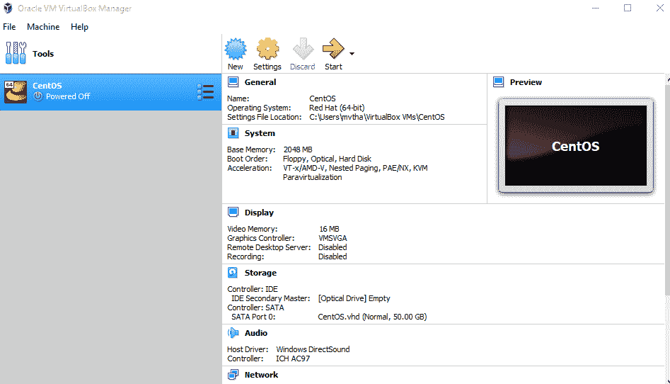

输入“Ubuntu”作为名称，选择“Linux”作为类型，选择 Ubuntu (64 位)作为版本。

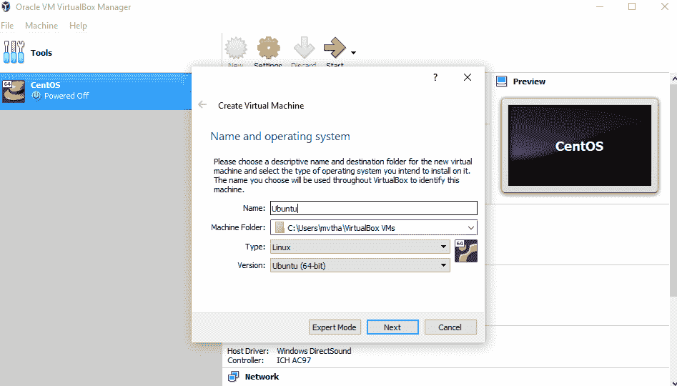

**注意**:选择你想要的任何数量的内存，但是不要增加超过你总内存的 50%。

选中“立即创建虚拟硬盘”选项，以便我们以后可以定义我们的 Ubuntu OS 虚拟硬盘大小。


现在，我们要选择“VHD(虚拟硬盘)”。

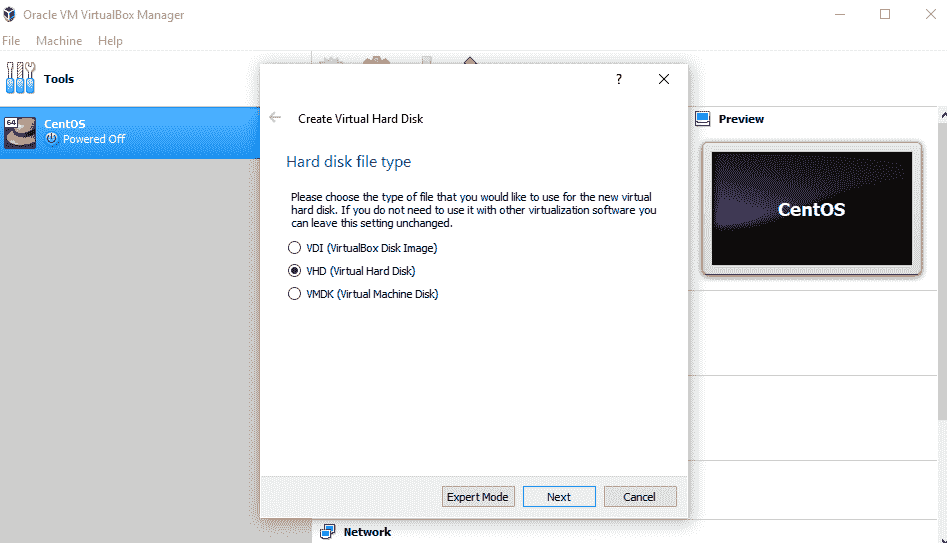

接下来，我们将在物理硬盘上动态分配存储。

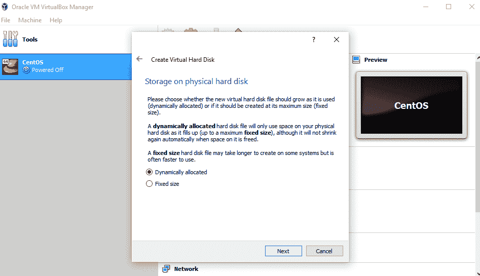

我们想指定我们的 Ubuntu 操作系统的大小。建议大小为 10 GB，但如果您愿意，也可以增加大小。


创建虚拟硬盘后，你会在仪表盘上看到 Ubuntu。

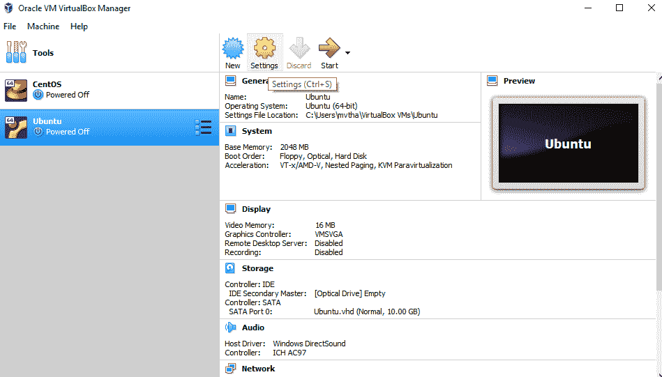

现在，我们要设置 Ubuntu 磁盘镜像文件(。iso)。

Ubuntu 磁盘镜像文件可以在这里下载: [Ubuntu OS 下载](https://ubuntu.com/#download)

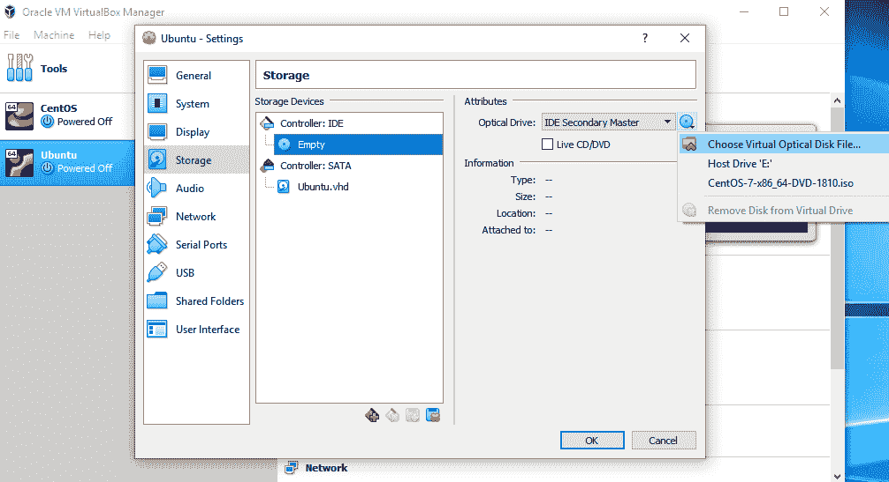

要设置 Ubuntu 磁盘映像文件，请转到“设置”,然后按照以下步骤操作:

1.  点击“存储”
2.  在存储设备中，单击“清空”
3.  在“属性”中，点按磁盘映像并“选取虚拟光盘文件”
4.  选择 Ubuntu 磁盘镜像文件并打开它


单击确定。

你的 Ubuntu 操作系统已经可以安装到 VirtualBox 了。开始吧！

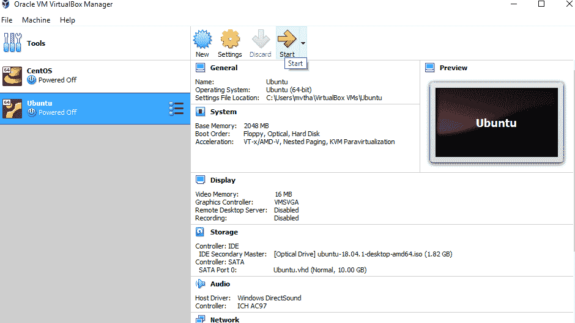

**注意:** Ubuntu VirtualBox 安装和实际操作系统安装步骤可能会有所不同。本指南仅帮助您在 VirtualBox 中安装 Ubuntu。

## 让我们安装 Ubuntu 吧！

点击安装 Ubuntu。

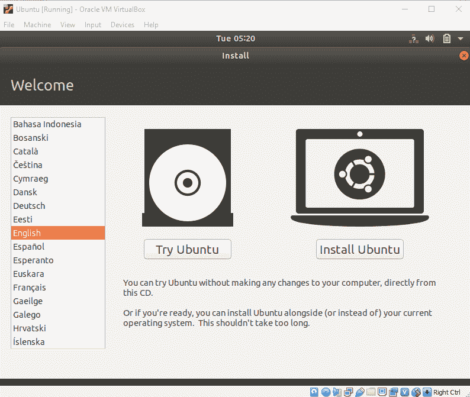

选择您的键盘布局。

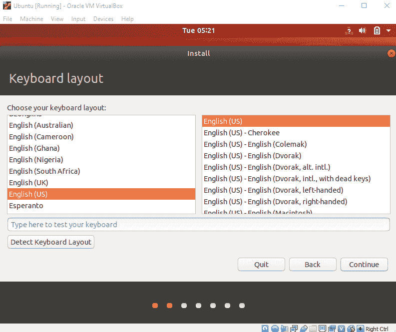

在“更新和其他软件”部分，选中“正常安装”并继续。

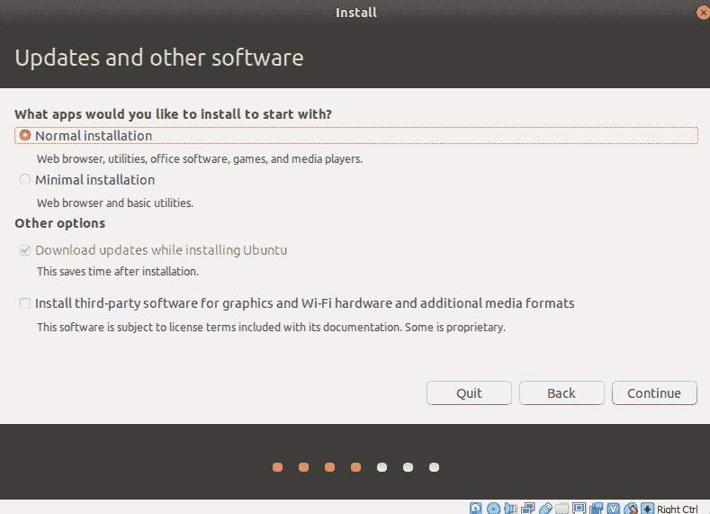

在“安装类型”中，勾选“擦除磁盘并安装 Ubuntu”。

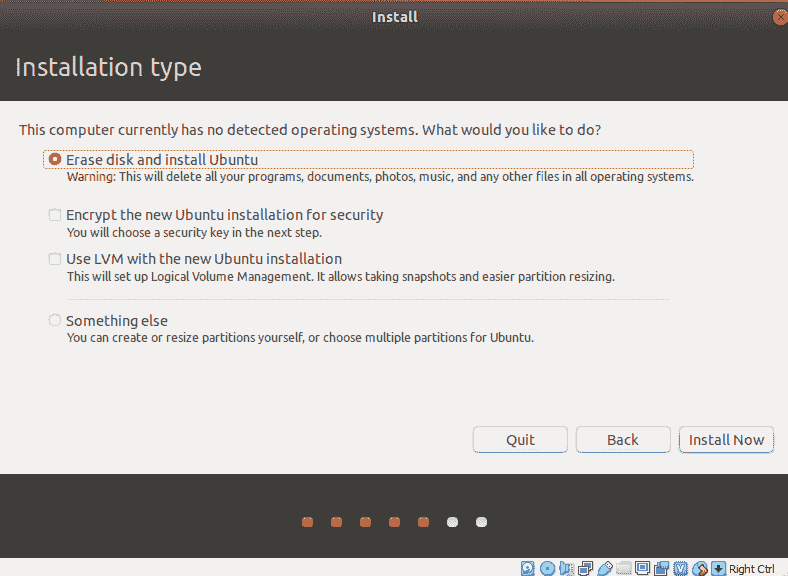

点击“继续”。

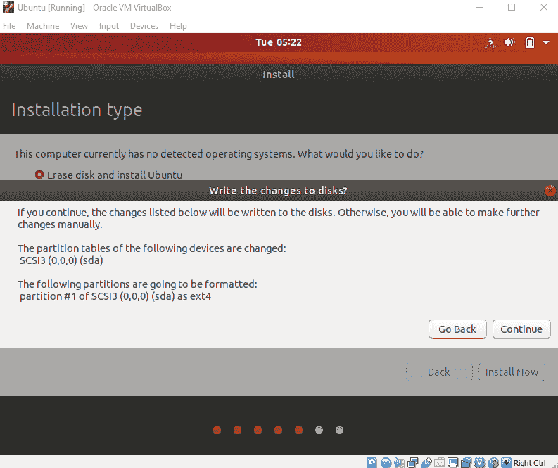

选择您当前的位置。

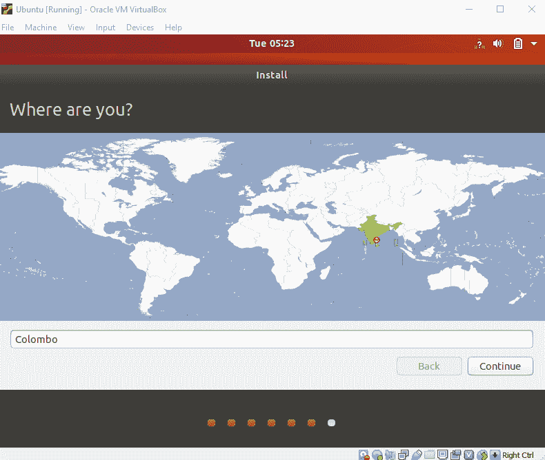

现在，设置您的个人资料。

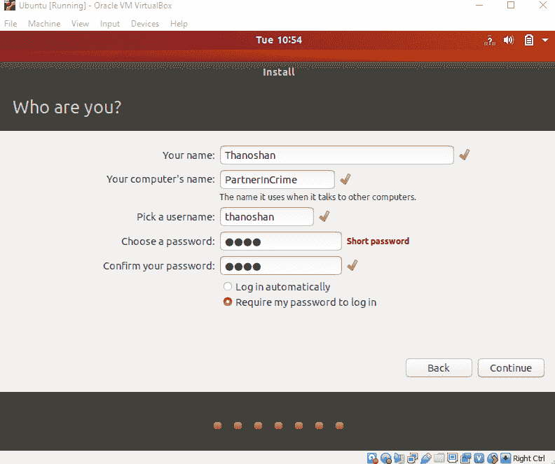

你会看到 Ubuntu 正在安装。

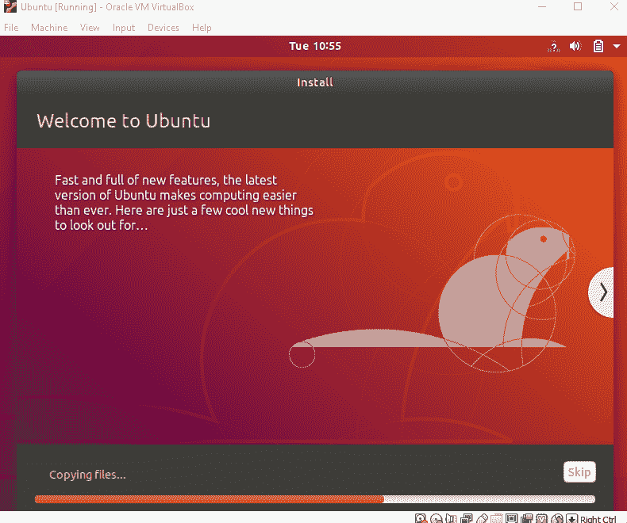

安装后，重新启动它。

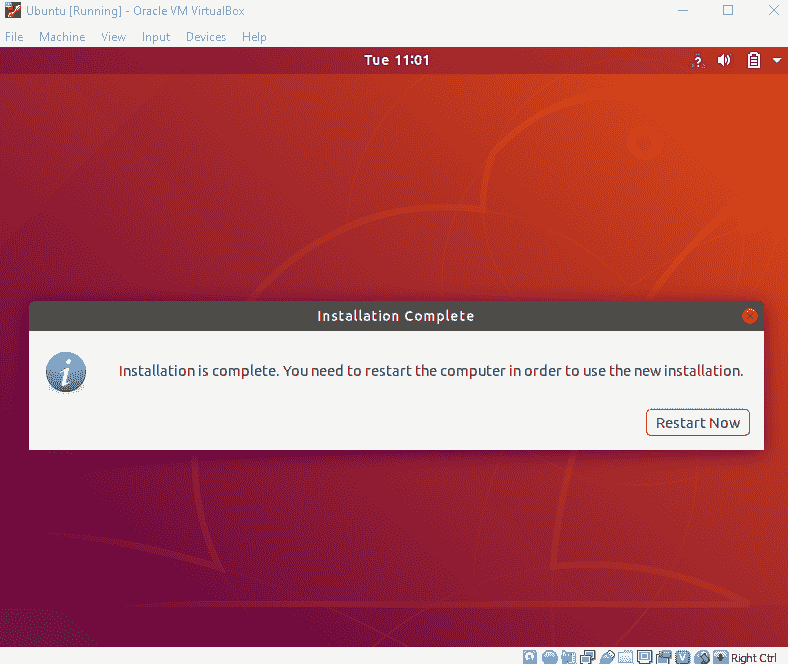

登录后，你会看到 Ubuntu 桌面。

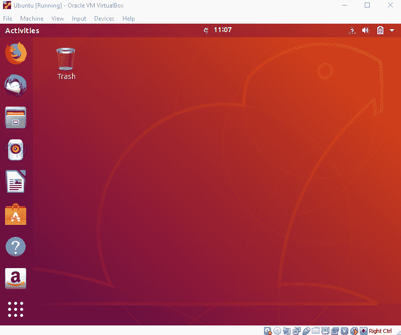

我们已经成功地在 VirtualBox 中安装了 Ubuntu。它可以用于您未来的开发项目。

## 让我们验证安装。

打开您的终端(按 Ctrl+Alt+T ),键入下面的命令，并检查它们是否工作。

1.  pwd:这将打印当前的工作目录
2.  这将列出你当前目录中的所有项目

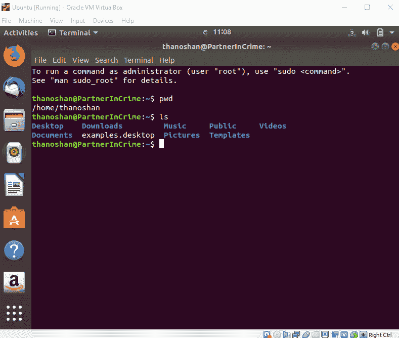

检查完这些之后，使用下面的命令关闭您的机器。

```
poweroff
```

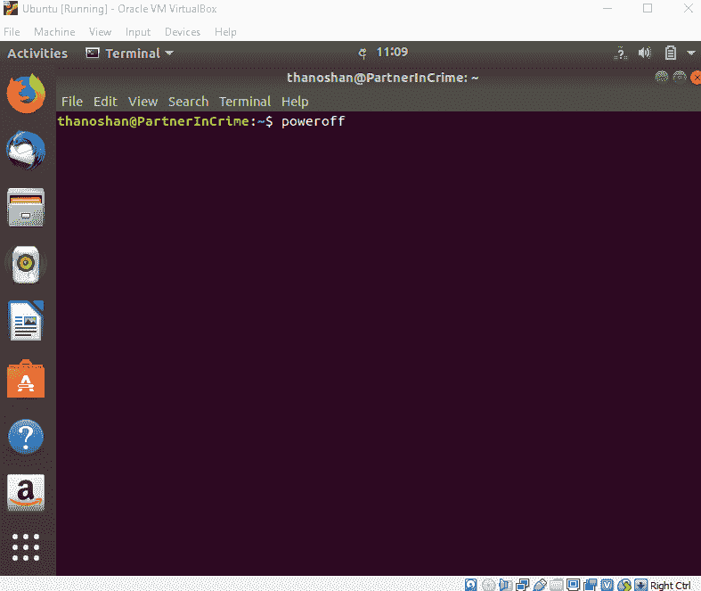

## 结论

VirtualBox 是免费的，是在一个操作系统上运行多个操作系统的好工具。Ubuntu 有很多好处。如果你是 Linux 的初学者，我会推荐你使用 Ubuntu，因为它对初学者很友好。

如果你有任何问题，请随时告诉我。

你可以在 [Twitter](https://twitter.com/ThanoshanMV) 和 [Medium](https://medium.com/@mvthanoshan9) 上与我联系。

感谢您的阅读。

**编码快乐！**