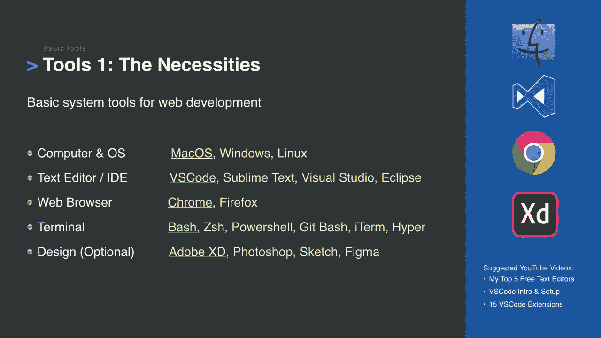
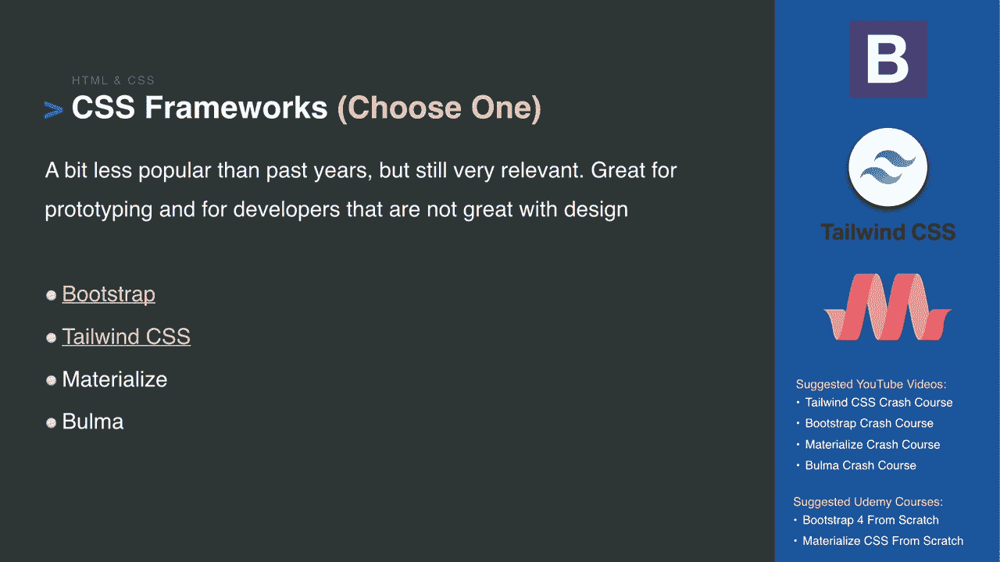
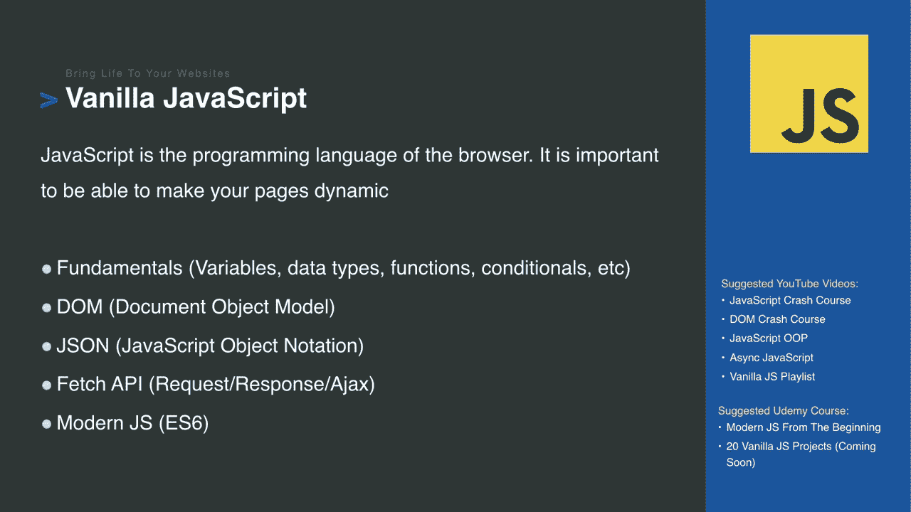
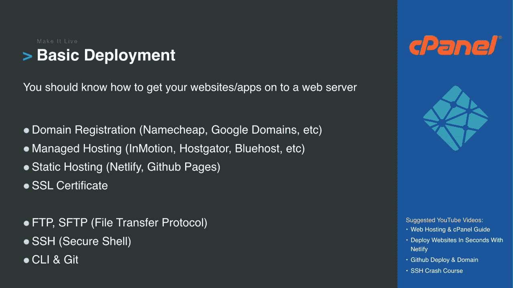
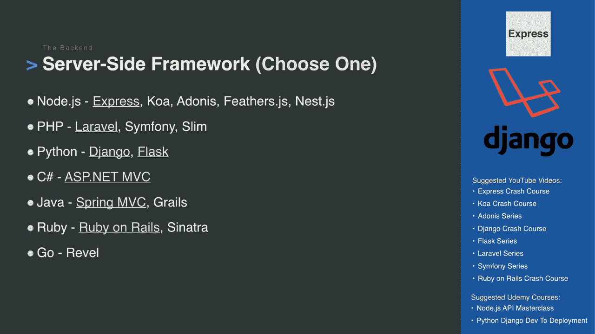
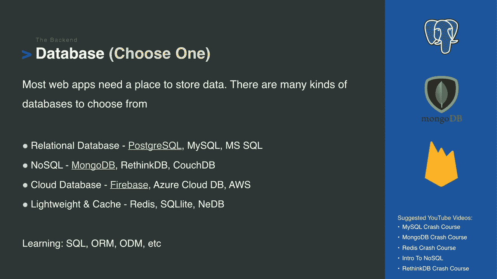
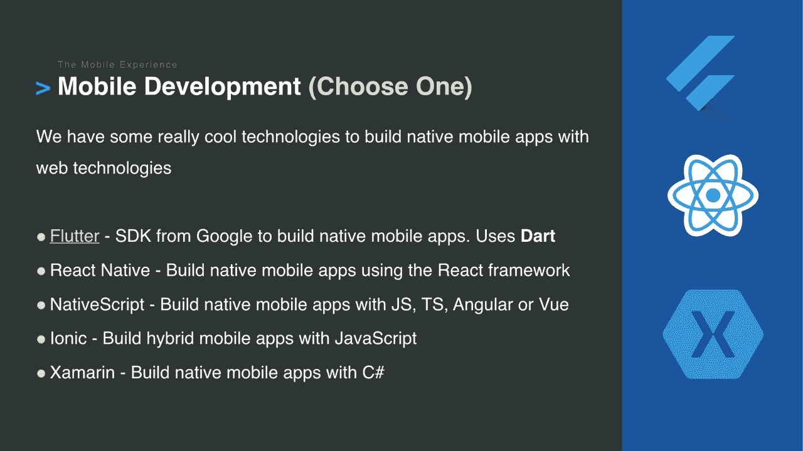
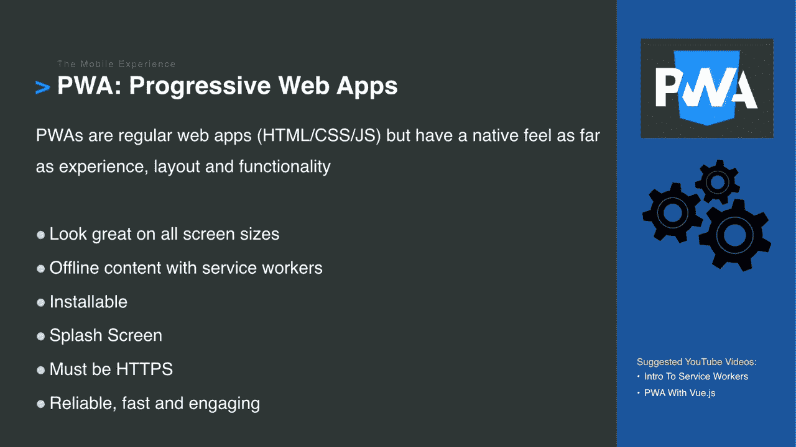

# 2020 年的 Web 开发:你应该学习什么样的编码工具

> 原文：<https://www.freecodecamp.org/news/web-development-2020/>

今天，我最喜欢的一位老师，Brad Traversy，发表了一篇概述，他建议你在 2020 年成为一名网站开发者应该学习些什么。

布拉德打破了你在社交媒体上听到的许多炒作。他的建议是实际可行的。我同意他推荐你学习的几乎所有东西。

布拉德强调的主要一点——也是我一直强调的——是不要感到气馁或让自己不知所措。

记住: [freeCodeCamp 的课程](https://www.freecodecamp.org/)涵盖了这些工具中的大部分，它已经帮助超过 40000 人获得了开发者的工作。如果有疑问，就专注于此。

为了方便起见，我将 Brad 的主要观点总结如下。也就是说，我鼓励你观看他的完整视频，我已经嵌入在下面。除了这些笔记所传达的内容之外，他还添加了许多细节。这是 73 分钟的手表。

[https://www.youtube.com/embed/0pThnRneDjw?feature=oembed](https://www.youtube.com/embed/0pThnRneDjw?feature=oembed)

# 2020 年的网络发展:概述

该视频的主要目的是让您熟悉一些可供 web 开发人员使用的更主流的 web 开发工具。

“我不是想用技术来压倒你。这些只是你有的选择...外面有很多技术。当你听到 Nuxt 或 Gatsby 这样的词时，我想让你知道它是什么。然后你可以选择想不想学。”

Brad 首先鼓励人们先问自己想做什么。你想去产品公司工作吗？还是做顾问？你想做自由职业者吗？还是打造一个自己的产品？

他关于学什么的很多建议归结起来就是你的目标是什么。他用这种观点框定了他的许多工具建议。

作为起点，他建议学习他所谓的“必需品”

This slide and all subsequent slides come from Brad's video. The underlines indicate the tools he personally recommends.

他指出了一件违背直觉的事情:你不需要一台昂贵的电脑来进行网络开发。“这不像游戏引擎开发之类的东西，所以你可以使用中档笔记本电脑或台式机，甚至在某些情况下是低端电脑。”

他将 MacOS、Windows 10 和 Linux 用于云服务器，甚至用于他的一些媒体服务器。

他是他的编辑器的 VS 代码的忠实粉丝，并使用 Chrome 及其内置的 DevTools 进行基于浏览器的调试。也就是说，他认为 Firefox 也取得了长足的进步，是一个可行的替代方案。

他建议从标准的 HTML 和 CSS 开始，学习更新的 CSS 工具，如 Flexbox 和 Grid。

他说，在 2020 年学习响应式网页设计应该是必然的。"你创建的每一个严肃的项目都应该看起来不错，并且完全可以在所有设备上使用."

他建议你不要依赖于像 Bootstrap 这样的 CSS 框架，而是练习构建你自己的模块化 CSS 组件，这样你就可以在整个项目中重复使用。

他说，当你为不同的雇主做项目时，你可能会遇到这些问题。

Bootstrap is still by far the most popular CSS framework, but there are a few other widely-used ones, too.

他特别提到了顺风，我以前没听说过。Tailwind 与其他 CSS 框架有点不同。它集中在“实用类”上，您可以组合这些类来完成您想要的设计。

毫不奇怪，Brad 建议要真正精通 JavaScript。

Some of the fundamentals you should get good with. Brad has videos for most of these topics, and most of this is covered in the freeCodeCamp curriculum as well.

## 以实用的速度学习

在布拉德的整个指南中，他反复强调实用性的必要性。

是的——凡事都有最佳实践。但是在许多情况下，有一种足够好的方法可以帮助你更快地行动，完成更多的工作，而不会陷入工具的泥潭。

他说的最有趣(也许是异端)的事情之一是:

“对于一个小网站来说，没有必要学习 DevOps 和 AWS 以及所有这些东西。托管网站或托管网站如 InMotion 或 Hostgator 都可以。它允许您在浏览器中直接进行[部署]。没必要把事情搞得太复杂。”

他认为，即使在 2020 年，使用熟悉的工具还是有好处的。

对于刚接触 web 开发的人，Brad 建议首先成为一名基本的前端 web 开发人员。这将允许你作为自由职业者为当地企业建立网站。

“潮人会说你肯定需要使用前端框架。我不认为那是真的。如果你想在不使用前端框架的情况下在服务器上渲染模板，我认为这绝对没问题，但有许多许多工作正在寻找像 React 或 Vue 这样的东西。”

但是一旦你准备好处理前端框架，他建议你探索 React、Vue 和 Angular。"把这三个都试试，看看你最喜欢哪一个。"

他还向 Svelte 致敬——它不是一个框架，而是一个编译器。但他表示，这可能太新了，无法在 2020 年尝试和重拾。

他还讨论了服务器端呈现的日益流行。基于文件系统的路由意味着您不必创建复杂的路由文件。相反，您可以将文件放在您希望它们所在的目录中。

两个流行的服务器端渲染工具是 Next.js(用于 React)和 nuxt . js(Vue 选项)。

另一个新兴趋势是静态站点呈现，他说你不需要学习，但你应该知道。例如，Gatsby 网站速度极快，不需要服务器。

## 后端开发工具

A slide from Brad's talk with the most popular frameworks for each language.

对于服务器端开发，Brad 更喜欢 Node.js，因为它速度快，而且他可以在前端和后端都使用 JavaScript。

对于服务器端开发框架，他推荐学习 Express，因为它是最受欢迎的，并且“它给了你很大的自由，让你可以按照自己的方式构建东西。”

他还在一些项目中使用 Python，并推荐使用它。

“Python 有两个很棒的框架。Django 是一个大型的、功能齐全的框架，而 Flask 则更加简约。它给了你所需要的东西，但剩下的决定由你来做。老实说，我无法从这两者中选择一个，我都爱它们，并将它们用于不同的事情。”

他很快为 PHP 辩护:

“很多人对 PHP 不屑一顾，这很不幸，因为 PHP 可以成为一门伟大的语言。它很实用，而且可以简单地部署到任何地方。PHP 非常适合需要快速获取信息的自由职业者。如果你打算为一家大公司工作，PHP 可能不是最好的选择，但如果你是自由职业者并构建个人项目，PHP 可能是很好的选择。抨击 PHP 变得很酷。PHP 是我学习的第一门语言，我仍然非常喜欢它...如果你看看 Laravel 代码，它非常优雅。”

Brad 还快速浏览了数据库，并推荐了最受欢迎的 PostgreSQL。

## 其他工具可能会继续存在

对于 API 来说，GraphQL 是 REST 的替代方案。在 Brad 的频道和 freeCodeCamp 的频道上都有几门涵盖 GraphQL 的课程。但他说，“GraphQL 现在不是你必须学习的东西，但它足够大，我认为它会一直存在下去。这不仅仅是一种趋势。”

Brad 还谈到了内容管理系统(CMS ),以及它们如何演变成新的“无头”选项，您只需将它们用作后端，并编写自己的前端代码。

“对于自由职业者来说，CMS 非常方便，他们的客户希望能够登录并创建他们的博客帖子之类的东西。很多人抨击 WordPress，但互联网上有很大比例的网站是由 WordPress 运营的，它仍然非常受欢迎。”

对于 web 服务器，他更喜欢 NGINX 而不是 Apache，因为“它似乎不太复杂。”我们在 freeCodeCamp 广泛使用 NGINX，我倾向于同意。

Brad 还解释了虚拟化的工作原理，并谈到了它如何通过在多台计算机上标准化环境来简化更复杂的项目。但他警告不要试图虚拟化一切:

“Docker 对团队真的很好。我不喜欢的是人们说你应该总是使用 Docker。只是偏好而已。如果你只是想运行一个本地 LAMP 服务器，那也没什么不好。不要觉得学 Docker 之类的东西有压力。”

他补充道，为了强调我个人怎么强调都不为过的一点:“我知道很多书呆子只想把事情复杂化，我讨厌这样。仅仅因为我列出了所有这些，并不意味着我把它强加给你。”

他还很快指出，大多数大公司都有专门的 DevOps 团队(也称为“站点可靠性工程师”)，他们可以为你做很多这方面的工作。

## 很高兴有你可以作为专业学习的技能

如果你想在移动应用开发上一试身手，Brad 强烈推荐 Flutter 框架。它使用 Dart，这是一种更晦涩的语言。他将 Dart 描述为介于 Java 和 JavaScript 之间的语言，并说如果你懂这两种语言中的任何一种，你就应该能够学会它。

他的移动应用程序开发的第二选择是 React Native，如果你已经知道 React，这很容易上手。

然后，Brad 很好地解释了什么是渐进式网络应用程序，以及它们的一些好处。这是幻灯片，但我再次强烈建议你观看他的完整视频。

然后他谈到了 Electron，它允许您使用 JavaScript 构建桌面应用程序。他最初持怀疑态度，但他说他最喜欢的一些桌面应用程序——如 VS Code 和 Discord——现在都是用 Electron 开发的。

他提到了 JAMstack (JavaScript、API 和标记)和无服务器架构。这些是更高级的话题，他的频道和 freeCodeCamp 的 YouTube 频道都有视频教程。

然后他谈到了 2020 年的大趋势。

## 机器学习和 Web 组装

仅仅因为其他人都在谈论机器学习，并不意味着你必须放下一切去学习它。这就是他如何开始这一阶段的演讲。

是的，你也可以用 JavaScript 进行机器学习。

“Python 是机器学习的王者。但即使有了 JavaScript，你还有 TensorFlow.js，你还有 Brain.js 来创建神经网络，做一些真正酷的事情。”

从他谈论 Web Assembly 的方式可以明显看出，他对此非常兴奋。

“网络组装仍处于早期阶段，但我认为今年我们会看到更多。传统上，我们在网页上使用 JavaScript 来操作 DOM 和运行计算。JavaScript 在速度方面有局限性。像 C 或 C++这样的语言比 JavaScript 要快得多。因此，Web Assembly 是一种高效的低级字节码，可以由浏览器执行，速度极快。它可以由 C、C++和 Rust 等语言生成。”

Rust 是 WebAssembly 可以使用的语言之一(除了 C 和 C++)。它比 C 和 C++更容易学习和使用。

但是需要注意的是，WebAssembly 并不能免除您学习 JavaScript 的责任。

“你几乎可以把 JavaScript 想象成老板，它可以告诉 Web Assembly 做什么。因此，它允许我们在 web 应用程序中使用非常快速的低级语言，如 C++，这给了我们更多的功能，如浏览器中的下一级视频游戏和视频编辑工具，这些都是只用 JavaScript 无法想象的。”

最后，他说，“你学得越多，就越容易学到更多，也越容易将所有这些技术结合在一起。尽量不要被压倒。一步一步来，做一些研究，弄清楚你想做什么。”

再次感谢布拉德·特拉弗斯制作了这个全面的视频。

人们总是问我“如果我想成为一名 web 开发人员，我应该学些什么？”我的回答是“只需[将 freeCodeCamp 作为你的核心课程](https://www.freecodecamp.org)，并随着你的发展扩展到其他学习资源。”

我很高兴地说， [Brad 的 Traversy Media YouTube 频道](https://www.youtube.com/user/TechGuyWeb)是我极力推荐的额外资源之一。