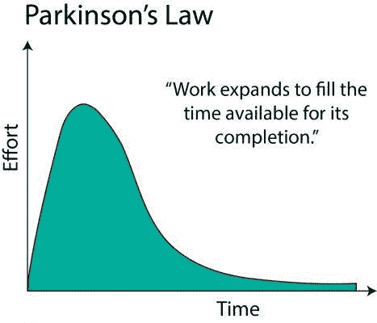
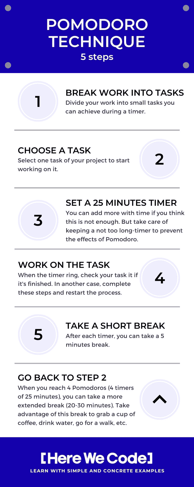

# 完成代码:如何停止浪费时间并开始投资

> 原文：<https://www.freecodecamp.org/news/low-productivity-how-to-stop-wasting-time/>

你曾经在工作的时候浪费时间娱乐吗？

在我开始大量阅读这方面的内容并寻找提高效率的方法之前，这种情况每次都发生在我身上。我和你一样，但今天一切都结束了。当我专注于一项任务时，没有什么能再打扰我了。

> "停止浪费时间，开始投入时间，因为这是走向伟大的唯一途径."――Sunday Adelaja，[如何通过时间转换变得伟大:你是在浪费时间、花费时间还是投资时间？](https://www.goodreads.com/book/show/35851967-how-to-become-great-through-time-conversion)

## 有哪些坏习惯？

几年前，当我开始每天编码时，我的生产力是如此的弱。不知不觉中，每样东西都是我的触发器:噪音、我的社交网络、我的电子邮件、我旁边说话的人，等等。

我想我们大多数人都知道这一点；你开始做一些事情，然后突然你有了错误的想法，打开一个网页，开始阅读一篇、两篇、三篇文章。半小时后，你关闭浏览器，问自己我在哪里？在你再次开始工作之前，你的大脑需要几次来记住所有的事情。

我日常习惯的其他例子，起床后 30-45 分钟的社交网络，在厕所 5-10 分钟的 youtube 视频，每次休息 20 分钟的新闻，等等。

你认出你自己了吗？所以，你和我一样:你浪费你的时间，大大降低你的生产力。

> "时间应该被投资，而不是浪费或花费."— Sunday Adelaja，[如何通过时间转换变得伟大:你是在浪费时间、花费时间还是投资时间？](https://www.goodreads.com/book/show/35851967-how-to-become-great-through-time-conversion)

## 其实，为什么是问题？

一旦你对这些坏习惯产生依赖，你就是在进行多任务处理。

首先，我们可以说多任务处理是一件好事。我们可以同时完成很多事情，我的工作效率非常高。

但这是假的。可惜人类不是计算机，我们的大脑无法正确处理。

当我写这篇文章的时候，我正在寻找一个多任务的定义，我发现了一些有趣的事情。

> 在操作系统中，多任务允许用户同时执行一个以上的计算机任务(如应用程序的操作)。操作系统能够跟踪你在这些任务中的位置，并在不丢失信息的情况下从一个任务转到另一个任务。”——[WhatIs.com](https://whatis.techtarget.com/definition/multitasking)

多任务是在第一次搜索中，一种计算机技能。

的确，这似乎是一个同时完成许多事情的好方法，但研究人员表明，我们的大脑无法做到这一点。这样做，你会失去很多注意力，还有智商。

> “根据伦敦大学精神病学研究所的一项研究，边打电话边发电子邮件会使你的智商降低 10 分。研究人员对一家英国公司的 1100 名员工进行了研究，发现与吸食大麻或失眠相比，同时处理多项电子媒体任务对智商的影响更大。— [芝加哥论坛报](https://www.chicagotribune.com/opinion/ct-xpm-2010-08-10-ct-oped-0811-multitask-20100810-story.html)

不仅如此，一些研究发现，一个典型的办公室工作人员在每次中断之间只有 11 分钟，中断后平均需要 25 分钟才能回到原来的任务。

你还记得上一次你正在做一件事情，一个同事让你快速完成另一项任务吗？试着回忆一下你回到第一个任务的时间。

> 加州大学欧文分校的格洛丽亚·马克发现，一个典型的办公室职员在每次中断之间只有 11 分钟的时间，而在中断后平均需要 25 分钟才能回到原来的工作状态— [任何时候](https://www.nytimes.com/2013/05/05/opinion/sunday/a-focus-on-distraction.html)

## 现在改变你的习惯还不晚

上一部分我想说明的是，我们很多事情都是习惯做的，没有真正去思考。如果一个实践是正确的，这很好，但是在这些情况下，我们的模式是错误的，我们需要找到打破它们的解决方案。

我会通过给你一些帮助我的建议来帮助你停止一心多用，提高你的工作效率。

## 定义你的时间浪费者

你需要做的第一件事是定义你的时间浪费者。正如我之前解释的那样，在我的情况下，大多数时候是社交应用。

你需要休息一下，在纸上写下所有让你无法专注于一项任务的诱因。试着回忆一下你最后一次工作或尝试学习的时间。一旦你做到了这一点，你就对未来的生产力提高做出了相当大的改进。

## 停止浪费时间的小贴士

我把我的建议分为三类:

*   *通用:*每个人都可以用来提高生产力的小技巧。
*   低时间浪费:如果你失去了一点时间，你想在不阻塞一切的情况下做一些改进。
*   如果你已经尝试了很多次来停止分心，但是没有任何效果。

## 常规

### 帕金森定律

这个定律遵循的原则是，功的膨胀是为了填满完成它所需要的时间。这解释了为什么你在做最后一分钟的工作时更有效率。你的大脑会更专注，因为你知道这是最后的极限，你不能超过它。

如果你想打破这个定律，你需要在你的任务中建立时间限制。例如，你应该在一个月内完成一项任务，试着在两周内完成。

约束会给你一个明确的目标，让你更容易集中注意力。

[Parkinson's law](https://benjaminhardy.com/parkinsons-law-on-steroids-the-single-principle-for-automatically-expanding-your-confidence-and-success/)

### 番茄工作法

这种工作方法帮助了很多人(开发人员、项目经理等。)，而且是你日常生活中实施的最简单的生产力方法。

完成这个方法只需要 5 个简单的步骤。

尽管看起来很简单，计时器会产生一种紧迫感。不知不觉中，你会更加专注于你的任务，因为你想达到你的目标。

如果你在做 Pomodoro 的时候分心了，比如一个同事在和你说话，你需要推迟你的定时器，等你能再次集中注意力的时候再启动它。

免费番茄定时器(在线、安卓或 IOS):

*   [发条番茄](https://play.google.com/store/apps/details?id=net.phlam.android.clockworktomato&hl=en_GB)(安卓)
*   [森林](https://www.forestapp.cc/)(安卓和 IOS)
*   [番茄计时器](https://tomato-timer.com/)(在线)

> “对许多人来说，时间是敌人。我们争分夺秒地完成任务，赶上最后期限。番茄工作法教你与时间一起工作，而不是与时间抗争。这是一个革命性的时间管理系统，学习起来似乎很简单，使用起来却能改变生活。”——[番茄工作法](https://francescocirillo.com/pages/pomodoro-technique)

### 噪音消除耳机

这个建议简单而有效。对大多数人来说，噪音会引发注意力的集中。如果你在一个嘈杂的工作场所工作，你的大脑将很难保持注意力集中。).

当我开始编码时，我决定投资一个消除噪音的耳机。这有点贵，但是通过购买，我的生产力有了指数级的提高。

你可以在不同的价格找到许多具有这种功能的耳机或耳塞。我的文章不会给你什么是最好的，但几个例子。

1.  索尼 WH-1000XM3
2.  Bose 降噪耳机 700
3.  索尼 WH-1000XM2
4.  Bose QuietComfort 35 II
5.  索尼 WF-1000XM3 真正的无线耳塞
6.  Jabra Elite 85H
7.  飞利浦 Fidelio NC1
8.  Bose 静音舒适型 25
9.  鲍尔斯和威尔金斯 PX 无线
10.  森海塞尔 HD 4.50 BTNC
11.  JBL 直播 650BTNC
12.  微软 Surface 耳机

## 低浪费时间

### 禁用无用应用的数据连接

几个月前，我一天收到数百份通知。我一直在看我的手机。这些通知大部分都不有趣:谁喜欢我上一篇 twitter 帖子，电子邮件广告，游戏等等。

我在后台禁用了所有不重要的应用程序的数据连接。

要知道所有的智能手机都是一直在后台同步通知的。这就是为什么即使所有的店都关门了，你还是会收到它们。

在 IOS 和 Android 上，如果你想要这个功能，你可以为每个应用程序选择。我建议禁用所有社交网络、新闻和游戏的数据抓取。

这并不意味着您将无法使用这些应用程序。只有在您打开它们时，您才会收到通知。

此外，它将节省您的电池电量！

### 退订无用的电子邮件

和前面的提示有点类似。你的邮件通知大多是广告，不要不知所措，使用无用邮件底部的“退订”选项。

这样做几个星期后，你的电话就会停止不停地响。

### 使用“请勿打扰”模式

如果不能控制自己，定时解锁手机，可以开启“勿扰”模式。当你收到通知时，它会阻止你的手机亮着，你不会离开你的任务去看你的手机。

## 浪费时间

屏蔽浪费时间的网站和应用程序这对我来说是最重要的事情，我今天还在使用它。

如果你想强迫自己专注于你的任务，你应该消除一切干扰。一些公司和开发者在智能手机和电脑上创建了屏蔽器，以删除对分散注意力的网站或应用程序的访问。

当我感到心烦意乱的时候，我就开机，我没有别的事情可做。你可以平安无事；需要的话可以用手机打电话接听。

您可以使用的一些应用程序(Windows、Mac、Android 和 IOS):

*   [焦点](https://heyfocus.com/) (Mac)
*   [自由](https://freedom.to/) (Windows、Mac、Android 和 IOS)
*   [自控](https://selfcontrolapp.com/) (Mac)
*   [森林](https://www.forestapp.cc/)(安卓和 IOS)
*   [ColdTurkey](https://getcoldturkey.com/) (Windows 和 Mac)

### 关闭手机或使用“飞行”模式

如果你的手机真的让你分心，你可以关掉它或者使用“飞行”模式来保持注意力集中。当你在学习一个新的东西或者准备考试时，它会很有用。

### 多睡觉

睡眠不足会对你的思维方式和工作效率产生负面影响。如果你每天都很难集中注意力，那可能是因为你睡眠不足。

对于高效的工作，健康的生活是必不可少的。如果你的生活没有定性，你就无法专注。

## 不要逃避规则

我希望这篇文章能帮助你找到避免浪费时间的方法。

最后一个提示是:**不要逃避规则**。如果你在日常任务中保持这些新习惯，你就会成功！

如果这些习惯对你有帮助，请分享这篇文章和你的反馈。

如果你想要更多这样的内容，你可以在推特上关注我，我在推特上谈论网络开发、自我完善以及我作为一个完整的开发者的旅程！