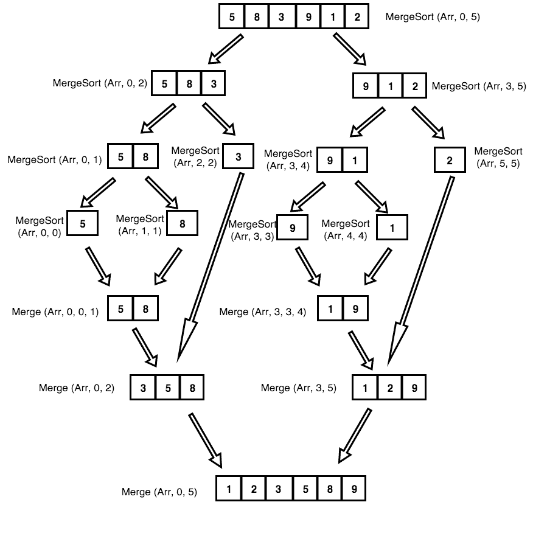

# 用 JavaScript、Python、Java 和 C++举例说明排序算法

> 原文：<https://www.freecodecamp.org/news/sorting-algorithms-explained-with-examples-in-python-java-and-c/>

## 什么是排序算法？

排序算法是一组指令，将数组或列表作为输入，并将项目排列成特定的顺序。

最常见的排序是数字或字母(或字典)顺序，可以是升序(A-Z，0-9)或降序(Z-A，9-0)。

## 为什么排序算法很重要

由于排序算法通常可以降低问题的复杂性，因此它们在计算机科学中非常重要。这些算法直接应用于搜索算法、数据库算法、分治法、数据结构算法等等。

## 排序算法的权衡

在选择排序算法时，必须要问一些问题——被排序的集合有多大？有多少内存可用？收藏品需要增加吗？

这些问题的答案可能会决定哪种算法最适合每种情况。一些算法，如合并排序，可能需要大量的空间或内存来运行，而插入排序并不总是最快的，但不需要很多资源来运行。

在决定使用哪种排序算法之前，您应该确定自己的需求，并考虑系统的局限性。

## 一些常见的排序算法

一些最常见的排序算法有:

*   选择排序
*   冒泡排序
*   插入排序
*   合并排序
*   快速排序
*   堆排序
*   计数排序
*   基数排序
*   桶排序

但是在我们深入研究每一个之前，让我们再多了解一点排序算法的分类。

## 排序算法的分类

排序算法可以根据以下参数进行分类:

1.  **所需交换或求逆的次数:**这是算法交换元素以对输入进行排序的次数。选择排序需要最少的交换次数。
2.  **比较次数:**这是算法比较元素以对输入进行排序的次数。使用 [Big-O 符号](https://guide.freecodecamp.org/computer-science/notation/big-o-notation/)，上面列出的排序算法示例在最好的情况下至少需要`O(nlogn)`次比较，在最坏的情况下对于大多数输出需要`O(n^2)`次比较。
3.  **是否使用递归:**一些排序算法，比如快速排序，使用递归技术对输入进行排序。其他排序算法，如选择排序或插入排序，使用非递归技术。最后，一些排序算法，如合并排序，利用递归和非递归技术对输入进行排序。
4.  **稳定还是不稳定:**稳定排序算法保持了值相等的元素，或者键的相对顺序。不稳定的排序算法不会维护具有相等值/键的元素的相对顺序。

    例如，假设你有一个输入数组`[1, 2, 3, 2, 4]`。为了帮助区分两个相等的值`2`，让我们将它们更新为`2a`和`2b`，形成输入数组`[1, 2a, 3, 2b, 4]`。

    稳定排序算法将保持`2a`和`2b`的顺序，意味着输出数组将是`[1, 2a, 2b, 3, 4]`。不稳定排序算法不保持等值顺序，输出数组可能是`[1, 2b, 2a, 3, 4]`。

    插入排序、合并排序、冒泡排序比较稳定。堆排序和快速排序是不稳定的。
5.  **所需的额外空间:**一些排序算法可以对一个列表进行排序，而无需创建一个全新的列表。这些被称为就地排序算法，需要恒定的`O(1)`额外空间来进行排序。同时，错位排序算法在排序时会创建一个新的列表。

    插入排序和快速排序是原地排序算法，因为元素是围绕一个支点移动的，并不使用单独的数组。

    合并排序是一个不适当排序算法的例子，因为在排序过程中必须预先分配输入的大小来存储输出，这需要额外的内存。

## 桶排序

存储桶排序是一种比较排序算法，它通过将元素划分到不同的存储桶中，然后分别对这些存储桶进行排序来对元素进行操作。每个存储桶都使用单独的排序算法(如插入排序)进行单独排序，或者通过递归应用存储桶排序算法进行排序。

当输入在一个范围内均匀分布时，桶排序非常有用。例如，假设您有一个在上限和下限之间均匀分布的大型浮点整数数组。

您可以使用另一种排序算法，如合并排序、堆排序或快速排序。然而，这些算法保证了最佳情况下的时间复杂度为`O(nlogn)`。

使用桶排序，可以在`O(n)`时间内完成对同一数组的排序。

### 桶排序的伪代码:

```
void bucketSort(float[] a,int n)

{

    for(each floating integer 'x' in n)

    {
        insert x into bucket[n*x]; 
    }

    for(each bucket)

    {
        sort(bucket);
    }

} 
```

## 计数排序

计数排序算法首先创建列表中每个唯一值的计数或出现次数的列表。然后，它根据计数列表创建一个最终的排序列表。

需要记住的一件重要事情是，只有在事先知道输入中可能值的范围时，才能使用计数排序。

### 示例:

```
Say you have a list of integers from 0 to 5:

input = [2, 5, 3, 1, 4, 2]

First, you need to create a list of counts for each unique value in
the `input` list. Since you know the range of the `input` is from 0 to
5, you can create a list with five placeholders for the values 0 to 5,
respectively:

count = [0, 0, 0, 0, 0, 0]
  # val: 0  1  2  3  4  5

Then, you go through the `input` list and iterate the index for each value by one.

For example, the first value in the `input` list is 2, so you add one
to the value at the second index of the `count` list, which represents
the value 2:

count = [0, 0, 1, 0, 0, 0]
  # val: 0  1  2  3  4  5

The next value in the `input` list is 5, so you add one to the value at
the last index of the `count` list, which represents the value 5:

count = [0, 0, 1, 0, 0, 1]
  # val: 0  1  2  3  4  5

Continue until you have the total count for each value in the `input`
list:

count = [0, 1, 2, 1, 1, 1]
  # val: 0  1  2  3  4  5

Finally, since you know how many times each value in the `input` list
appears, you can easily create a sorted `output` list. Loop through
the `count` list, and for each count, add the corresponding value
(0 - 5) to the `output` array that many times.

For example, there were no 0's in the `input` list, but there was one
occurrence of the value 1, so you add that value to the `output` array
one time:

output = [1]

Then there were two occurrences of the value 2, so you add those to the
`output` list:

output = [1, 2, 2]

And so on until you have the final sorted `output` list:

output = [1, 2, 2, 3, 4, 5] 
```

### 性能

*   空间复杂度:`O(k)`
*   最佳情况性能:`O(n+k)`
*   平均案例性能:`O(n+k)`
*   最差情况性能:`O(n+k)`
*   稳定:是(`k`是数组中元素的范围)

### 用 JavaScript 实现

```
let numbers = [1, 4, 1, 2, 7, 5, 2];
let count = [];
let output =[];
let i = 0;
let max = Math.max(...numbers);

// initialize counter
for (i = 0; i <= max; i++) {
  count[i] = 0;
}

// initialize output array
for (i = 0; i < numbers.length; i++) {
  output[i] = 0;
}

for (i = 0; i < numbers.length; i++) {
  count[numbers[i]]++;
}

for (i = 1; i < count.length; i++) {
  count[i] += count[i-1];
}

for (i = numbers.length - 1; i >= 0; i--) { 
  output[--count[numbers[i]]] = numbers[i];
}

// output sorted array
for (i = 0; i < output.length; i++) {
  console.log(output[i]);
}
```

### C++实现

```
#include <iostream>

#include <vector>

void countSort(int upperBound, int lowerBound, std::vector < int > numbersToSort) // Lower and upper bounds of numbers in vector
{
  int i;
  int range = upperBound - lowerBound; // Create a range large enough to get every number between the min and max
  std::vector < int > counts(range + 1); // Initialize of counts of the size of the range
  std::fill(counts.begin(), counts.end(), 0); // Fill vector of zeros
  std::vector < int > storedNumbers(numbersToSort.size()); // Initialize of storedNumbers of the same size as the input vector
  std::fill(storedNumbers.begin(), storedNumbers.end(), 0); // Fill storedNumbers vector of zeros

  for (i = 0; i < numbersToSort.size(); i++) {
    int index = numbersToSort[i] - lowerBound; // For example, if 5 is the lower bound and numbersToSort[i] is 5, the index will be 0 and the
    counts[index] += 1; // count of 5 will be stored in counts[0]
  }

  for (i = 1; i < counts.size(); i++) {
    counts[i] += counts[i - 1];
  }

  for (i = numbersToSort.size() - 1; i >= 0; i--) { // Copy elements from numbersToSort to storedNumbers according to the count
    storedNumbers[--counts[numbersToSort[i] - lowerBound]] = numbersToSort[i];
  }

  for (i = 0; i < storedNumbers.size(); i++) {
    std::cout << storedNumbers[i];
    if (i != storedNumbers.size() - 1)
      std::cout << ", ";
  }
  std::cout << std::endl;
}
```

### 快速实施

```
func countingSort(_ array: [Int]) {
  // Create an array to store the count of each element
  let maxElement = array.max() ?? 0
  var countArray = [Int](repeating: 0, count: Int(maxElement + 1))

  for element in array {
    countArray[element] += 1
  }

  for i in 1 ..< countArray.count {
    countArray[i] += countArray[i-1];
  }

  var sortedArray = [Int](repeating: 0, count: array.count)

  // copy elements from array to sortedArray according to the count
  for i in (0 ..< array.count) .reversed() {
    countArray[array[i]] -= 1
    sortedArray[countArray[array[i]]] = array[i];
  }

  print(sortedArray)
}
```

## 插入排序

插入排序是针对少量元素的简单排序算法。

### 示例:

在插入排序中，将`key`元素与前面的元素进行比较。如果前一个元素大于`key`元素，那么你将前一个元素移动到下一个位置。

从索引 1 开始到输入数组的大小。

[ 8 3 5 1 4 2 ]

第一步:

![[ 8 3 5 1 4 2 ]](img/23902c434faebb42271d3ed02c836e7e.png)

```
 key = 3 //starting from 1st index.

      Here `key` will be compared with the previous elements.

      In this case, `key` is compared with 8\. since 8 > 3, move the element 8
      to the next position and insert `key` to the previous position.

      Result: [ 3 8 5 1 4 2 ] 
```

第二步:

![[ 3 8 5 1 4 2 ]](img/37123766c131f61afc6323fd0466a789.png)

```
 key = 5 //2nd index

      8 > 5 //move 8 to 2nd index and insert 5 to the 1st index.

      Result: [ 3 5 8 1 4 2 ] 
```

第三步:

![[ 3 5 8 1 4 2 ]](img/e08815fbd03138a987d10589c9c2ae93.png)

```
 key = 1 //3rd index

      8 > 1     => [ 3 5 1 8 4 2 ]  

      5 > 1     => [ 3 1 5 8 4 2 ]

      3 > 1     => [ 1 3 5 8 4 2 ]

      Result: [ 1 3 5 8 4 2 ] 
```

第四步:

![[ 1 3 5 8 4 2 ]](img/9b438c3b7ea1206520261828d1847803.png)

```
 key = 4 //4th index

      8 > 4   => [ 1 3 5 4 8 2 ]

      5 > 4   => [ 1 3 4 5 8 2 ]

      3 > 4   ≠>  stop

      Result: [ 1 3 4 5 8 2 ] 
```

第五步:

![[ 1 3 4 5 8 2 ]](img/ecacb2f334093a2e19bf33da64a86324.png)

```
 key = 2 //5th index

      8 > 2   => [ 1 3 4 5 2 8 ]

      5 > 2   => [ 1 3 4 2 5 8 ]

      4 > 2   => [ 1 3 2 4 5 8 ]

      3 > 2   => [ 1 2 3 4 5 8 ]

      1 > 2   ≠> stop

      Result: [1 2 3 4 5 8] 
```

![[ 1 2 3 4 5 8 ]](img/fcadba3ba8daf5b69665f7defb5de0d9.png)

下面显示的算法是一个稍微优化的版本，以避免在每次迭代中交换`key`元素。这里，`key`元素将在迭代结束时被交换(步骤)。

```
 InsertionSort(arr[])
      for j = 1 to arr.length
         key = arr[j]
         i = j - 1
         while i > 0 and arr[i] > key
            arr[i+1] = arr[i]
            i = i - 1
         arr[i+1] = key 
```

以下是 JavaScript 的详细实现:

```
function insertion_sort(A) {
    var len = array_length(A);
    var i = 1;
    while (i < len) {
        var x = A[i];
        var j = i - 1;
        while (j >= 0 && A[j] > x) {
            A[j + 1] = A[j];
            j = j - 1;
        }
        A[j+1] = x;
        i = i + 1;
    }
} 
```

Swift 中的快速实施如下所示:

```
 var array = [8, 3, 5, 1, 4, 2]

  func insertionSort(array:inout Array<Int>) -> Array<Int>{
      for j in 0..<array.count {
          let key = array[j]
          var i = j-1

          while (i > 0 && array[i] > key){
              array[i+1] = array[i]
              i = i-1
          }
          array[i+1] = key
      }
      return array
  } 
```

Java 示例如下所示:

```
public int[] insertionSort(int[] arr)
      for (j = 1; j < arr.length; j++) {
         int key = arr[j]
         int i = j - 1
         while (i > 0 and arr[i] > key) {
            arr[i+1] = arr[i]
            i -= 1
         }
         arr[i+1] = key
      }
      return arr; 
```

在 c 语言中....

```
void insertionSort(int arr[], int n) 
{ 
   int i, key, j; 
   for (i = 1; i < n; i++) 
   { 
       key = arr[i]; 
       j = i-1;
       while (j >= 0 && arr[j] > key) 
       { 
           arr[j+1] = arr[j]; 
           j = j-1; 
       } 
       arr[j+1] = key; 
   } 
} 
```

### 属性:

*   空间复杂度:O(1)
*   时间复杂度:O(n)，O(n* n)，O(n* n)分别代表最好，一般，最坏的情况。
*   最佳情况:数组已经排序
*   平均情况:数组是随机排序的
*   最坏的情况:数组被反向排序。
*   就地分类:是
*   稳定:是

## 堆排序

Heapsort 是一种基于使用最大/最小堆的高效排序算法。堆是满足堆属性的基于树的数据结构，即对于最大堆，任何节点的键都小于或等于其父节点的键(如果它有父节点的话)。

使用 maxHeapify 方法，可以利用该属性在 O(logn)时间内访问堆中的最大元素。我们执行这个操作 n 次，每次将堆中的最大元素移动到堆的顶部，并将其从堆中提取出来，放入一个排序后的数组中。因此，在 n 次迭代之后，我们将得到输入数组的排序版本。

该算法不是就地算法，需要先构建一个堆数据结构。该算法也是不稳定的，这意味着当比较具有相同键的对象时，原始排序将不会被保留。

该算法的运行时间为 O(nlogn ),额外占用 O(1)个空间[O(n)包括存储输入数据所需的空间],因为所有操作都是完全就地执行的。

Heapsort 的最佳、最差和平均情况时间复杂度为 O(nlogn)。尽管 heapsort 比 quicksort 具有更好的最坏情况复杂性，但一个实现良好的 quicksort 在实践中运行得更快。这是一种基于比较的算法，因此它可以用于非数字数据集，只要可以在元素上定义某种关系(堆属性)即可。

Java 中的实现如下所示:

```
import java.util.Arrays;
public class Heapsort {

	public static void main(String[] args) {
		//test array
		Integer[] arr = {1, 4, 3, 2, 64, 3, 2, 4, 5, 5, 2, 12, 14, 5, 3, 0, -1};
		String[] strarr = {"hope you find this helpful!", "wef", "rg", "q2rq2r", "avs", "erhijer0g", "ewofij", "gwe", "q", "random"};
		arr = heapsort(arr);
		strarr = heapsort(strarr);
		System.out.println(Arrays.toString(arr));
		System.out.println(Arrays.toString(strarr));
	}

	//O(nlogn) TIME, O(1) SPACE, NOT STABLE
	public static <E extends Comparable<E>> E[] heapsort(E[] arr){
		int heaplength = arr.length;
		for(int i = arr.length/2; i>0;i--){
			arr = maxheapify(arr, i, heaplength);
		}

		for(int i=arr.length-1;i>=0;i--){
			E max = arr[0];
			arr[0] = arr[i];
			arr[i] = max;
			heaplength--;
			arr = maxheapify(arr, 1, heaplength);
		}

		return arr;
	}

	//Creates maxheap from array
	public static <E extends Comparable<E>> E[] maxheapify(E[] arr, Integer node, Integer heaplength){
		Integer left = node*2;
		Integer right = node*2+1;
		Integer largest = node;

		if(left.compareTo(heaplength) <=0 && arr[left-1].compareTo(arr[node-1]) >= 0){
			largest = left;
		}
		if(right.compareTo(heaplength) <= 0 && arr[right-1].compareTo(arr[largest-1]) >= 0){
			largest = right;
		}	
		if(largest != node){
			E temp = arr[node-1];
			arr[node-1] = arr[largest-1];
			arr[largest-1] = temp;
			maxheapify(arr, largest, heaplength);
		}
		return arr;
	}
} 
```

用 C++实现

```
#include <iostream>
using namespace std;
void heapify(int arr[], int n, int i) 
{ 
    int largest = i; 
    int l = 2*i + 1;  
    int r = 2*i + 2;
    if (l < n && arr[l] > arr[largest]) 
        largest = l;
    if (r < n && arr[r] > arr[largest]) 
        largest = r;
    if (largest != i) 
    { 
        swap(arr[i], arr[largest]); 

        heapify(arr, n, largest); 
    } 
} 

void heapSort(int arr[], int n) 
{ 

    for (int i = n / 2 - 1; i >= 0; i--) 
        heapify(arr, n, i); 

    for (int i=n-1; i>=0; i--) 
    { 

        swap(arr[0], arr[i]); 

        heapify(arr, i, 0); 
    } 
} 
void printArray(int arr[], int n) 
{ 
    for (int i=0; i<n; ++i) 
        cout << arr[i] << " "; 
    cout << "\n"; 
} 
int main() 
{ 
    int arr[] = {12, 11, 13, 5, 6, 7}; 
    int n = sizeof(arr)/sizeof(arr[0]); 

    heapSort(arr, n); 

    cout << "Sorted array is \n"; 
    printArray(arr, n); 
} 
```

## 基数排序

先决条件:计数排序

QuickSort、MergeSort 和 HeapSort 是基于比较的排序算法。CountSort 不是。它的复杂度为 O(n+k)，其中 k 是输入数组的最大元素。因此，如果 k 是 O(n)，CountSort 变成线性排序，这比基于比较的排序算法具有 O(nlogn)时间复杂度要好。

其思想是扩展 CountSort 算法，以在 k 变为 O(n2)时获得更好的时间复杂度。基数排序的概念由此而来。

### 算法:

对于每个数字 I，其中 I 从数字的最低有效位到最高有效位变化，根据第 I 个数字使用 countsort 算法对输入数组进行排序。我们使用计数排序，因为它是一个稳定的排序。

示例:假设输入数组是:

10, 21, 17, 34, 44, 11, 654, 123

基于该算法，我们将根据一的数字(最低有效位)对输入数组进行排序。

0:10
1:21 11
2:
3:123
4:34 44 654
5:
6:
7:17
8:
9:

因此，数组变成了 10，21，11，123，24，44，654，17。

现在，我们将根据十的位数进行排序:

0:
1:10 11 17
2:21 123
3:34
4:44
5:654
6:
7:
8:
9:

现在，数组变成了:10，11，17，21，123，34，44，654。

最后，我们根据百位数(最高有效位)进行排序:

0:010 011 017 021 034 044
1:123
2:
3:
4:
5:
6:654
7:
8:
9:

排序后的数组变成:10，11，17，21，34，44，123，654。这就是我们算法的工作原理。

用 C 语言实现:

```
void countsort(int arr[],int n,int place){

        int i,freq[range]={0};         //range for integers is 10 as digits range from 0-9
        int output[n];

        for(i=0;i<n;i++)
                freq[(arr[i]/place)%range]++;

        for(i=1;i<range;i++)
                freq[i]+=freq[i-1];

        for(i=n-1;i>=0;i--){
                output[freq[(arr[i]/place)%range]-1]=arr[i];
                freq[(arr[i]/place)%range]--;
        }

        for(i=0;i<n;i++)
                arr[i]=output[i];
}

void radixsort(ll arr[],int n,int maxx){            //maxx is the maximum element in the array

        int mul=1;
        while(maxx){
                countsort(arr,n,mul);
                mul*=10;
                maxx/=10;
        }
} 
```

## 选择排序

选择排序是最简单的排序算法之一。这个算法的名字来源于它遍历数组的方式:它选择当前最小的元素，并将其交换到适当的位置。

它是这样工作的:

1.  找到数组中最小的元素，并与第一个元素交换。
2.  找到第二小的元素，并与数组中的第二个元素交换。
3.  找到第三小的元素，并与数组中的第三个元素交换。
4.  重复寻找下一个最小元素并将其交换到正确位置的过程，直到整个数组排序完毕。

但是，如何编写代码来查找数组中第二个最小值的索引呢？

一种简单的方法是注意到最小值已经被交换到索引 0 中，所以问题简化为从索引 1 开始寻找数组中的最小元素。

选择排序总是采用相同数量的键比较—N(N-1)/2。

### 用 C/C++实现

下面的 C++程序包含选择排序算法的迭代和递归实现。这两个实现都在`main()`函数中调用。

```
#include <iostream>
#include <string>
using namespace std;

template<typename T, size_t n>
void print_array(T const(&arr)[n]) {
    for (size_t i = 0; i < n; i++)
        std::cout << arr[i] << ' ';
    cout << "\n";
}

int minIndex(int a[], int i, int j) {
    if (i == j)
        return i;
    int k = minIndex(a, i + 1, j);
    return (a[i] < a[k]) ? i : k;
}

void recurSelectionSort(int a[], int n, int index = 0) {
    if (index == n)
        return;
    int k = minIndex(a, index, n - 1);
    if (k != index)
        swap(a[k], a[index]);
    recurSelectionSort(a, n, index + 1);
}

void iterSelectionSort(int a[], int n) {
    for (int i = 0; i < n; i++)
    {
        int min_index = i;
        int min_element = a[i];
        for (int j = i + 1; j < n; j++)
        {
            if (a[j] < min_element)
            {
                min_element = a[j];
                min_index = j;
            }
        }
        swap(a[i], a[min_index]);
    }
}

int main() {
    int recurArr[6] = { 100,35, 500, 9, 67, 20 };
    int iterArr[5] = { 25, 0, 500, 56, 98 };

    cout << "Recursive Selection Sort"  << "\n";
    print_array(recurArr); // 100 35 500 9 67 20
    recurSelectionSort(recurArr, 6);
    print_array(recurArr); // 9 20 35 67 100 500

    cout << "Iterative Selection Sort" << "\n";
    print_array(iterArr); // 25 0 500 56 98
    iterSelectionSort(iterArr, 5);
    print_array(iterArr); // 0 25 56 98 500
} 
```

### 用 JavaScript 实现

```
function selection_sort(A) {
    var len = A.length;
    for (var i = 0; i < len - 1; i = i + 1) {
        var j_min = i;
        for (var j = i + 1; j < len; j = j + 1) {
            if (A[j] < A[j_min]) {
                j_min = j;
            } else {}
        }
        if (j_min !== i) {
            swap(A, i, j_min);
        } else {}
    }
}

function swap(A, x, y) {
    var temp = A[x];
    A[x] = A[y];
    A[y] = temp;
} 
```

### 用 Python 实现

```
def seletion_sort(arr):
         if not arr:
         return arr
    for i in range(len(arr)):
         min_i = i
         for j in range(i + 1, len(arr)):
              if arr[j] < arr[min_i]:
                  min_i = j
         arr[i], arr[min_i] = arr[min_i], arr[i] 
```

### 用 Java 实现

```
public void selectionsort(int array[])
{
    int n = array.length;            //method to find length of array 
    for (int i = 0; i < n-1; i++)
    {
        int index = i;
        int min = array[i];          // taking the min element as ith element of array
        for (int j = i+1; j < n; j++)
        {
            if (array[j] < array[index])
            {
                index = j;
                min = array[j];
            }
        }
        int t = array[index];         //Interchange the places of the elements
        array[index] = array[i];
        array[i] = t;
    }
} 
```

### MATLAB 中的实现

```
function [sorted] = selectionSort(unsorted)
    len = length(unsorted);
    for i = 1:1:len
        minInd = i;
        for j = i+1:1:len
           if unsorted(j) < unsorted(minInd) 
               minInd = j;
           end
        end
        unsorted([i minInd]) = unsorted([minInd i]);    
    end
    sorted = unsorted;
end 
```

### 性能

*   空间复杂度: **O(n)**
*   时间复杂度: **O(n2)**
*   分类到位:**是**
*   稳定:**否**

## 冒泡排序

就像气泡从玻璃杯底部升起一样，**气泡排序**是一个简单的算法，对列表进行排序，允许较低或较高的值上升到顶部。该算法遍历一个列表并比较相邻的值，如果它们的顺序不正确，就交换它们。

与快速排序等其他排序算法相比，冒泡排序是非常慢的。好处是它是最容易理解和从头编码的排序算法之一。

从技术角度来看，冒泡排序对于排序小型数组是合理的，特别是在内存资源非常有限的计算机上执行排序算法时。

### 示例:

### 首先浏览列表:

*   从`[4, 2, 6, 3, 9]`开始，算法比较数组中的前两个元素，4 和 2。它交换它们是因为 2 < 4: `[2, 4, 6, 3, 9]`
*   它比较接下来的两个值 4 和 6。当 4 < 6 时，这些已经按顺序排列，算法继续:`[2, 4, 6, 3, 9]`
*   接下来的两个值也会交换，因为 3 < 6: `[2, 4, 3, 6, 9]`
*   最后两个值 6 和 9 已经按顺序排列，因此算法不会交换它们。

### 第二遍列表:

*   2 < 4，所以不需要调仓:`[2, 4, 3, 6, 9]`
*   该算法交换接下来的两个值，因为 3 < 4: `[2, 3, 4, 6, 9]`
*   4 < 6 时不交换:`[2, 3, 4, 6, 9]`
*   同样，6 < 9，因此不会发生交换:`[2, 3, 4, 6, 9]`

列表已经排序了，但是冒泡排序算法没有意识到这一点。更确切地说，它需要在不交换任何值的情况下完成对列表的整个遍历，以知道列表已经排序。

### 第三遍通过列表:

*   `[2, 4, 3, 6, 9]`=>= 
*   `[2, 4, 3, 6, 9]`=>= 
*   `[2, 4, 3, 6, 9]`=>= 
*   `[2, 4, 3, 6, 9]`=>= 

显然，冒泡排序远远不是最有效的排序算法。尽管如此，还是很简单的把你的脑袋包起来，自己去实现。

#### 性能

*   空间复杂度:O(1)
*   最佳情况性能:O(n)
*   平均案例性能:O(n*n)
*   最差情况性能:O(n*n)
*   稳定:是

### 视频讲解

[冒泡排序算法](https://www.youtube.com/watch?v=Jdtq5uKz-w4)

### JavaScript 中的示例

```
let arr = [1, 4, 7, 45, 7,43, 44, 25, 6, 4, 6, 9],
    sorted = false;

while(!sorted) {
  sorted = true;
  for(var i=0; i < arr.length; i++) {
    if(arr[i] < arr[i-1]) {
      let temp = arr[i];
      arr[i] = arr[i-1];
      arr[i-1] = temp;
      sorted = false;
    }
  }
} 
```

### Java 中的示例

```
public class BubbleSort {
    static void sort(int[] arr) {
        int n = arr.length;
        int temp = 0;
         for(int i=0; i < n; i++){
                 for(int x=1; x < (n-i); x++){
                          if(arr[x-1] > arr[x]){
                                 temp = arr[x-1];
                                 arr[x-1] = arr[x];
                                 arr[x] = temp;
                         }

                 }
         }

    }
    public static void main(String[] args) {

		for(int i=0; i < 15; i++){
			int arr[i] = (int)(Math.random() * 100 + 1);
		}

                System.out.println("array before sorting\n");
                for(int i=0; i < arr.length; i++){
                        System.out.print(arr[i] + " ");
                }
                bubbleSort(arr);
                System.out.println("\n array after sorting\n");
                for(int i=0; i < arr.length; i++){
                        System.out.print(arr[i] + " ");
                }

        }
} 
```

### C++中的示例

```
// Recursive Implementation
void bubblesort(int arr[], int n)
{
	if(n==1)	//Initial Case
		return;
	bool swap_flag = false;
	for(int i=0;i<n-1;i++)	//After this pass the largest element will move to its desired location.
	{
		if(arr[i]>arr[i+1])
		{
			int temp=arr[i];
			arr[i]=arr[i+1];
			arr[i+1]=temp;
			swap_flag = true;
		}
	}
        // IF no two elements were swapped in the loop, then return, as array is sorted 
	if(swap_flag == false)
		return;
	bubblesort(arr,n-1);	//Recursion for remaining array
} 
```

### Swift 中的示例

```
func bubbleSort(_ inputArray: [Int]) -> [Int] {
    guard inputArray.count > 1 else { return inputArray } // make sure our input array has more than 1 element
    var numbers = inputArray // function arguments are constant by default in Swift, so we make a copy
    for i in 0..<(numbers.count - 1) {
        for j in 0..<(numbers.count - i - 1) {
            if numbers[j] > numbers[j + 1] {
                numbers.swapAt(j, j + 1)
            }
        }
    }
    return numbers // return the sorted array
} 
```

### Python 中的示例

```
def bubbleSort(arr): 
    n = len(arr) 
    for i in range(n):
        for j in range(0, n-i-1):
                if arr[j] > arr[j+1] : 
                        arr[j], arr[j+1] = arr[j+1], arr[j]
    print(arr) 
```

### PHP 中的示例

```
function bubble_sort($arr) {
    $size = count($arr)-1;
    for ($i=0; $i<$size; $i++) {
        for ($j=0; $j<$size-$i; $j++) {
            $k = $j+1;
            if ($arr[$k] < $arr[$j]) {
                // Swap elements at indices: $j, $k
                list($arr[$j], $arr[$k]) = array($arr[$k], $arr[$j]);
            }
        }
    }
    return $arr;// return the sorted array
}

$arr = array(1,3,2,8,5,7,4,0);
print("Before sorting");
print_r($arr);

$arr = bubble_sort($arr);
print("After sorting by using bubble sort");
print_r($arr); 
```

### C 中的示例

```
#include <stdio.h>

int BubbleSort(int array[], int n);

int main(void) {
  int arr[] = {10, 2, 3, 1, 4, 5, 8, 9, 7, 6};
  BubbleSort(arr, 10);

  for (int i = 0; i < 10; i++) {
    printf("%d", arr[i]);
  }
  return 0;
}
int BubbleSort(int array[], n)
{
for (int i = 0 ; i < n - 1; i++)
  {
    for (int j = 0 ; j < n - i - 1; j++)     //n is length of array
    {
      if (array[j] > array[j+1])      // For decreasing order use 
      {
        int swap   = array[j];
        array[j]   = array[j+1];
        array[j+1] = swap;
      }
    }
  }
} 
```

## 快速排序

快速排序是一种高效的分治排序算法。快速排序的平均情况时间复杂度是 O(nlog(n))，最坏情况时间复杂度是 O(n^2，这取决于 pivot 元素的选择，pivot 元素将当前数组分成两个子数组。

例如，当选择 pivot 将原始数组分成两个大小几乎相等的子数组时，快速排序的时间复杂度大约为`O(nlog(n))`。

另一方面，如果选择输入阵列的中枢元素的算法一致地输出在阵列大小方面具有大差异的 2 个子阵列，则快速排序算法可以实现 O(n^2).的最坏情况时间复杂度

快速排序涉及的步骤有:

*   选择一个元素作为枢纽，在这种情况下，数组的最后一个元素是枢纽。
*   分区:以这样一种方式对数组进行排序:小于轴心的所有元素都在左边，大于轴心的所有元素都在右边。
*   递归调用 Quicksort，考虑前面的 pivot 来适当细分左右数组。(更详细的解释可以在下面的评论中找到)

## 各种语言的示例实现

### 用 JavaScript 实现:

```
const arr = [6, 2, 5, 3, 8, 7, 1, 4];

const quickSort = (arr, start, end) => {

  if(start < end) {

    // You can learn about how the pivot value is derived in the comments below
    let pivot = partition(arr, start, end);

    // Make sure to read the below comments to understand why pivot - 1 and pivot + 1 are used
    // These are the recursive calls to quickSort
    quickSort(arr, start, pivot - 1);
    quickSort(arr, pivot + 1, end);
  } 

}

const partition = (arr, start, end) => { 
  let pivot = end;
  // Set i to start - 1 so that it can access the first index in the event that the value at arr[0] is greater than arr[pivot]
  // Succeeding comments will expound upon the above comment
  let i = start - 1,
      j = start;

  // Increment j up to the index preceding the pivot
  while (j < pivot) {

    // If the value is greater than the pivot increment j
    if (arr[j] > arr[pivot]) {
      j++;
    }

    // When the value at arr[j] is less than the pivot:
    // increment i (arr[i] will be a value greater than arr[pivot]) and swap the value at arr[i] and arr[j]
    else {
      i++;
      swap(arr, j, i);
      j++;
    }

  }

  //The value at arr[i + 1] will be greater than the value of arr[pivot]
  swap(arr, i + 1, pivot);

  //You return i + 1, as the values to the left of it are less than arr[i+1], and values to the right are greater than arr[i + 1]
  // As such, when the recursive quicksorts are called, the new sub arrays will not include this the previously used pivot value
  return i + 1;
}

const swap = (arr, firstIndex, secondIndex) => {
  let temp = arr[firstIndex];
  arr[firstIndex] = arr[secondIndex];
  arr[secondIndex] = temp;
}

quickSort(arr, 0, arr.length - 1);
console.log(arr); 
```

### 用 C 实现

```
#include<stdio.h>  
void swap(int* a, int* b) 
{ 
    int t = *a; 
    *a = *b; 
    *b = t; 
}
int partition (int arr[], int low, int high) 
{ 
    int pivot = arr[high];     
    int i = (low - 1);  

    for (int j = low; j <= high- 1; j++) 
    { 
        if (arr[j] <= pivot) 
        { 
            i++;    
            swap(&arr[i], &arr[j]); 
        } 
    } 
    swap(&arr[i + 1], &arr[high]); 
    return (i + 1); 
}
void quickSort(int arr[], int low, int high) 
{ 
    if (low < high) 
    {
        int pi = partition(arr, low, high); 

        quickSort(arr, low, pi - 1); 
        quickSort(arr, pi + 1, high); 
    } 
} 

void printArray(int arr[], int size) 
{ 
    int i; 
    for (i=0; i < size; i++) 
        printf("%d ", arr[i]); 
    printf("n"); 
} 

int main() 
{ 
    int arr[] = {10, 7, 8, 9, 1, 5}; 
    int n = sizeof(arr)/sizeof(arr[0]); 
    quickSort(arr, 0, n-1); 
    printf("Sorted array: n"); 
    printArray(arr, n); 
    return 0; 
} 
```

### Python3 中的实现

```
import random

z=[random.randint(0,100) for i in range(0,20)]

def quicksort(z):
    if(len(z)>1):        
        piv=int(len(z)/2)
        val=z[piv]
        lft=[i for i in z if i<val]
        mid=[i for i in z if i==val]
        rgt=[i for i in z if i>val]

        res=quicksort(lft)+mid+quicksort(rgt)
        return res
    else:
        return z

ans1=quicksort(z)
print(ans1) 
```

### MATLAB 中的实现

```
a = [9,4,7,3,8,5,1,6,2];

sorted = quicksort(a,1,length(a));

function [unsorted] =  quicksort(unsorted, low, high)
    if low < high
        [pInd, unsorted] = partition(unsorted, low, high);
        unsorted = quicksort(unsorted, low, pInd-1);
        unsorted = quicksort(unsorted, pInd+1, high);
    end

end

function [pInd, unsorted] = partition(unsorted, low, high)
    i = low-1;
    for j = low:1:high-1
        if unsorted(j) <= unsorted(high)
            i = i+1;
            unsorted([i,j]) = unsorted([j,i]);

        end
    end
    unsorted([i+1,high]) = unsorted([high,i+1]);
    pInd = i+1;

end 
```

快速排序的空间复杂度为`O(n)`。这是对其他分而治之排序算法的一个改进，它占用了`O(nlong(n))`空间。

快速排序通过改变给定数组中元素的顺序来实现这一点。比较一下[合并排序](https://guide.freecodecamp.org/algorithms/sorting-algorithms/merge-sort)算法，它在每个函数调用中创建 2 个数组，每个长度为`n/2`。

然而，如果枢轴总是保持在中间，则确实存在这种排序算法耗时`O(n*n)`的问题。这可以通过利用随机枢轴来克服

### 复杂性

最好，一般，最差，内存:n log(n)n log(n)n 2log(n)。这不是一个稳定的算法，快速排序通常在 O(log(n))堆栈空间内就地完成。

快速排序的空间复杂度为 O(n)。这是对其他分治排序算法的改进，其他算法占用 O(n log(n))空间。

## Timsort

Timsort 是一种快速排序算法，工作在稳定的 O(N log(N))复杂度。

Timsort 是插入排序和合并排序的混合。这个算法在 Java 的 Arrays.sort()以及 Python 的 sorted()和 sort()中实现。较小的部分使用插入排序进行排序，然后使用合并排序合并在一起。

Python 中的快速实现:

```
def binary_search(the_array, item, start, end):
    if start == end:
        if the_array[start] > item:
            return start
        else:
            return start + 1
    if start > end:
        return start

    mid = round((start + end)/ 2)

    if the_array[mid] < item:
        return binary_search(the_array, item, mid + 1, end)

    elif the_array[mid] > item:
        return binary_search(the_array, item, start, mid - 1)

    else:
        return mid

"""
Insertion sort that timsort uses if the array size is small or if
the size of the "run" is small
"""
def insertion_sort(the_array):
    l = len(the_array)
    for index in range(1, l):
        value = the_array[index]
        pos = binary_search(the_array, value, 0, index - 1)
        the_array = the_array[:pos] + [value] + the_array[pos:index] + the_array[index+1:]
    return the_array

def merge(left, right):
    """Takes two sorted lists and returns a single sorted list by comparing the
    elements one at a time.
    [1, 2, 3, 4, 5, 6]
    """
    if not left:
        return right
    if not right:
        return left
    if left[0] < right[0]:
        return [left[0]] + merge(left[1:], right)
    return [right[0]] + merge(left, right[1:])

def timsort(the_array):
    runs, sorted_runs = [], []
    length = len(the_array)
    new_run = [the_array[0]]

    # for every i in the range of 1 to length of array
    for i in range(1, length):
        # if i is at the end of the list
        if i == length - 1:
            new_run.append(the_array[i])
            runs.append(new_run)
            break
        # if the i'th element of the array is less than the one before it
        if the_array[i] < the_array[i-1]:
            # if new_run is set to None (NULL)
            if not new_run:
                runs.append([the_array[i]])
                new_run.append(the_array[i])
            else:
                runs.append(new_run)
                new_run = []
        # else if its equal to or more than
        else:
            new_run.append(the_array[i])

    # for every item in runs, append it using insertion sort
    for item in runs:
        sorted_runs.append(insertion_sort(item))

    # for every run in sorted_runs, merge them
    sorted_array = []
    for run in sorted_runs:
        sorted_array = merge(sorted_array, run)

    print(sorted_array)

timsort([2, 3, 1, 5, 6, 7]) 
```

### 复杂性:

Tim 排序的稳定复杂度为 O(N log(N))，与 Quicksort 相当。在这张[图](https://cdn-images-1.medium.com/max/1600/1*1CkG3c4mZGswDShAV9eHbQ.png)中可以找到复杂性的对比。

## 合并排序

合并排序是一种[分治](https://guide.freecodecamp.org/algorithms/divide-and-conquer-algorithms)算法。它将输入数组分成两半，为这两半调用自身，然后合并排序后的两半。该算法的主要部分给出了两个排序数组，我们必须将它们合并成一个排序数组。对 N 个整数的数组进行排序的整个过程可以总结为三个步骤

*   将阵列分成两半。
*   使用相同的递归算法对左半部分和右半部分进行排序。
*   合并排序后的两半。

有一种叫做[双指算法](https://en.wikipedia.org/wiki/Cheney%27s_algorithm)的东西可以帮助我们将两个排序后的数组合并在一起。使用这个子例程并递归调用数组一半的合并排序函数，将得到我们要寻找的最终排序后的数组。

因为这是一个基于递归的算法，我们有一个递归关系。递归关系只是一种用子问题来表示问题的方式。

`T(n) = 2 * T(n / 2) + O(n)`

用简单的英语来说，我们在每一步都将子问题分解成两部分，并且在每一步我们都要做一些线性的工作来将排序后的两半合并在一起。

### 复杂性

使用归并排序最大的好处是[时间复杂度](https://www.youtube.com/watch?v=V42FBiohc6c&list=PL2_aWCzGMAwI9HK8YPVBjElbLbI3ufctn)只有 n*log(n)来排序整个数组。它比冒泡排序或插入排序的 n^2 运行时间好得多。

在我们写代码之前，让我们借助一个图表来理解 merge sort 是如何工作的。



*   最初，我们有一个由 6 个未排序的整数 Arr(5，8，3，9，1，2)组成的数组
*   我们将数组分成两半 Arr1 = (5，8，3)和 Arr2 = (9，1，2)。
*   同样，我们把它们分成两半:Arr3 = (5，8)和 Arr4 = (3)和 Arr5 = (9，1)和 Arr6 = (2)
*   同样，我们把它们分成两半:Arr7 = (5)，Arr8 = (8)，Arr9 = (9)，Arr10 = (1)和 Arr6 = (2)
*   我们现在将比较这些子数组中的元素，以便合并它们。

### 属性:

*   空间复杂度:O(n)
*   时间复杂度:O(n*log(n))。乍一看，合并排序的时间复杂度可能并不明显。进来的 log(n)因子是因为我们之前提到过的递归关系。
*   就地排序:在典型的实现中没有
*   稳定:是
*   可并行化:是的(在 Cormen，Leiserson，Rivest 和 Stein 的《算法导论》第三版中讨论了几个并行变体。)

### **C++实现**

```
void merge(int array[], int left, int mid, int right)
{
    int i, j, k;

    // Size of left sublist
int size_left = mid - left + 1;

// Size of right sublist
int size_right =  right - mid;

/* create temp arrays */
int Left[size_left], Right[size_right];

/* Copy data to temp arrays L[] and R[] */
for(i = 0; i < size_left; i++)
{
    Left[i] = array[left+i];
}

for(j = 0; j < size_right; j++)
{
    Right[j] = array[mid+1+j];
}

// Merge the temp arrays back into arr[left..right]
i = 0; // Initial index of left subarray
j = 0; // Initial index of right subarray
k = left; // Initial index of merged subarray

while (i < size_left && j < size_right)
{
    if (Left[i] <= Right[j])
    {
        array[k] = Left[i];
        i++;
    }
    else
    {
        array[k] = Right[j];
        j++;
    }
    k++;
}

// Copy the remaining elements of Left[]
while (i < size_left)
{
    array[k] = Left[i];
    i++;
    k++;
}

// Copy the rest elements of R[]
while (j < size_right)
{
    array[k] = Right[j];
    j++;
    k++;
}
}

void mergeSort(int array[], int left, int right)
{
    if(left < right)
    {
        int mid = (left+right)/2;

        // Sort first and second halves
    mergeSort(array, left, mid);
    mergeSort(array, mid+1, right);

    // Finally merge them
    merge(array, left, mid, right);
}
}
```

### **JavaScript 实现**

```
function mergeSort (arr) {
  if (arr.length < 2) return arr;
  var mid = Math.floor(arr.length /2);
  var subLeft = mergeSort(arr.slice(0,mid));
  var subRight = mergeSort(arr.slice(mid));
  return merge(subLeft, subRight);
}
```

首先我们检查数组的长度。如果它是 1，那么我们简单地返回数组。这将是我们的基本情况。否则，我们将找出中间值并将数组分成两半。我们现在将通过递归调用 MergeSort 函数对这两半进行排序。

```
function merge (a,b) {
    var result = [];
    while (a.length >0 && b.length >0)
        result.push(a[0] < b[0]? a.shift() : b.shift());
    return result.concat(a.length? a : b);
}
```

当我们合并两半时，我们将结果存储在一个辅助数组中。我们将比较左数组的开始元素和右数组的开始元素。较小的那个将被推入结果数组，我们将使用[shift()操作符把它从各自的数组中移除。如果我们仍然以左数组或右数组中的值结束，我们可以简单地将它连接在结果的末尾。以下是排序结果:

```
var test = [5,6,7,3,1,3,15];
console.log(mergeSort(test));

>> [1, 3, 3, 5, 6, 7, 15]
```

### 一个合并排序 YouTube 教程

这里有一个很好的 YouTube 视频，[详细介绍了这个主题](https://www.youtube.com/watch?v=TzeBrDU-JaY)。

### JS 中的实现

```
const list = [23, 4, 42, 15, 16, 8, 3]

const mergeSort = (list) =>{
  if(list.length <= 1) return list;
  const middle = list.length / 2 ;
  const left = list.slice(0, middle);
  const right = list.slice(middle, list.length);
  return merge(mergeSort(left), mergeSort(right));
}

const merge = (left, right) => {
  var result = [];
  while(left.length || right.length) {
    if(left.length && right.length) {
      if(left[0] < right[0]) {
        result.push(left.shift())
      } else {
        result.push(right.shift())
      }
    } else if(left.length) {
        result.push(left.shift())
      } else {
        result.push(right.shift())
      }
    }
  return result;
}

console.log(mergeSort(list)) // [ 3, 4, 8, 15, 16, 23, 42 ] 
```

### 用 C 实现

```
#include<stdlib.h> 
#include<stdio.h>
void merge(int arr[], int l, int m, int r) 
{ 
    int i, j, k; 
    int n1 = m - l + 1; 
    int n2 =  r - m; 

    int L[n1], R[n2]; 

    for (i = 0; i < n1; i++) 
        L[i] = arr[l + i]; 
    for (j = 0; j < n2; j++) 
        R[j] = arr[m + 1+ j];
    i = 0; 
    j = 0; 
    k = l; 
    while (i < n1 && j < n2) 
    { 
        if (L[i] <= R[j]) 
        { 
            arr[k] = L[i]; 
            i++; 
        } 
        else
        { 
            arr[k] = R[j]; 
            j++; 
        } 
        k++; 
    } 

    while (i < n1) 
    { 
        arr[k] = L[i]; 
        i++; 
        k++; 
    } 

    while (j < n2) 
    { 
        arr[k] = R[j]; 
        j++; 
        k++; 
    } 
} 

void mergeSort(int arr[], int l, int r) 
{ 
    if (l < r) 
    {  
        int m = l+(r-l)/2; 

        mergeSort(arr, l, m); 
        mergeSort(arr, m+1, r); 

        merge(arr, l, m, r); 
    } 
}
void printArray(int A[], int size) 
{ 
    int i; 
    for (i=0; i < size; i++) 
        printf("%d ", A[i]); 
    printf("\n"); 
} 
int main() 
{ 
    int arr[] = {12, 11, 13, 5, 6, 7}; 
    int arr_size = sizeof(arr)/sizeof(arr[0]); 

    printf("Given array is \n"); 
    printArray(arr, arr_size); 

    mergeSort(arr, 0, arr_size - 1); 

    printf("\nSorted array is \n"); 
    printArray(arr, arr_size); 
    return 0; 
```

### 用 C++实现

让我们考虑数组 A = {2，5，7，8，9，12，13}和数组 B = {3，5，6，9，15}，我们希望数组 C 也是升序排列。

```
void mergesort(int A[],int size_a,int B[],int size_b,int C[])
{
     int token_a,token_b,token_c;
     for(token_a=0, token_b=0, token_c=0; token_a<size_a && token_b<size_b; )
     {
          if(A[token_a]<=B[token_b])
               C[token_c++]=A[token_a++];
          else
               C[token_c++]=B[token_b++];
      }

      if(token_a<size_a)
      {
          while(token_a<size_a)
               C[token_c++]=A[token_a++];
      }
      else
      {
          while(token_b<size_b)
               C[token_c++]=B[token_b++];
      }

} 
```

### 用 Python 实现

```
def merge(left,right,compare):
	result = [] 
	i,j = 0,0
	while (i < len(left) and j < len(right)):
		if compare(left[i],right[j]):
			result.append(left[i])
			i += 1
		else:
			result.append(right[j])
			j += 1
	while (i < len(left)):
		result.append(left[i])
		i += 1
	while (j < len(right)):
		result.append(right[j])
		j += 1
	return result

def merge_sort(arr, compare = lambda x, y: x < y):
     #Used lambda function to sort array in both(increasing and decresing) order.
     #By default it sorts array in increasing order
	if len(arr) < 2:
		return arr[:]
	else:
		middle = len(arr) // 2
		left = merge_sort(arr[:middle], compare)
		right = merge_sort(arr[middle:], compare)
		return merge(left, right, compare) 

arr = [2,1,4,5,3]
print(merge_sort(arr)) 
```

### 用 Java 实现

```
public class mergesort {

	public static int[] mergesort(int[] arr,int lo,int hi) {

		if(lo==hi) {
			int[] ba=new int[1];
			ba[0]=arr[lo];
			return ba;
		}

		int mid=(lo+hi)/2;
		int arr1[]=mergesort(arr,lo,mid);
		int arr2[]=mergesort(arr,mid+1,hi);
		return merge(arr1,arr2);
	}

	public static int[] merge(int[] arr1,int[] arr2) {
		int i=0,j=0,k=0;
		int n=arr1.length;
		int m=arr2.length;
		int[] arr3=new int[m+n];
		while(i<n && j<m) {
			if(arr1[i]<arr2[j]) {
				arr3[k]=arr1[i];
				i++;
			}
			else {
				arr3[k]=arr2[j];
				j++;
			}
			k++;
		}

		while(i<n) {
			arr3[k]=arr1[i];
			i++;
			k++;
		}

		while(j<m) {
			arr3[k]=arr2[j];
			j++;
			k++;
		}

		return arr3;

	}

	public static void main(String[] args) {
		// TODO Auto-generated method stub
		int arr[]= {2,9,8,3,6,4,10,7};
		int[] so=mergesort(arr,0,arr.length-1);
		for(int i=0;i<arr.length;i++)
			System.out.print(so[i]+" ");
	}

} 
```

### Java 中的示例

```
public class mergesort {
  public static int[] mergesort(int[] arr, int lo, int hi) {
    if (lo == hi) {
      int[] ba = new int[1];
      ba[0] = arr[lo];
      return ba;
    }
    int mid = (lo + hi) / 2;
    int arr1[] = mergesort(arr, lo, mid);
    int arr2[] = mergesort(arr, mid + 1, hi);
    return merge(arr1, arr2);
  }

  public static int[] merge(int[] arr1, int[] arr2) {
    int i = 0, j = 0, k = 0;
    int n = arr1.length;
    int m = arr2.length;
    int[] arr3 = new int[m + n];
    while (i < n && j < m) {
      if (arr1[i] < arr2[j]) {
        arr3[k] = arr1[i];
        i++;
      } else {
        arr3[k] = arr2[j];
        j++;
      }
      k++;
    }
    while (i < n) {
      arr3[k] = arr1[i];
      i++;
      k++;
    }
    while (j < m) {
      arr3[k] = arr2[j];
      j++;
      k++;
    }
    return arr3;
  }

  public static void main(String[] args) {
    int arr[] = {2, 9, 8, 3, 6, 4, 10, 7};
    int[] so = mergesort(arr, 0, arr.length - 1);
    for (int i = 0; i < arr.length; i++)
      System.out.print(so[i] + " ");
  }
} 
```