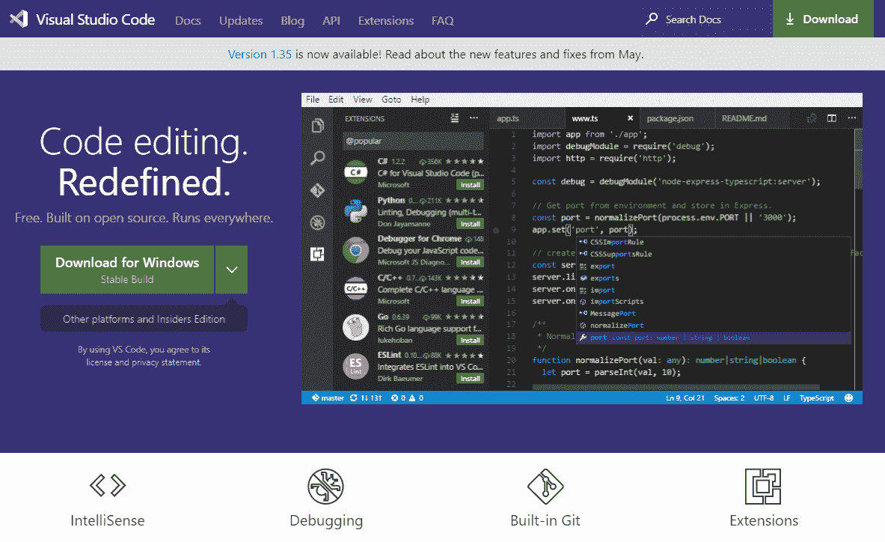
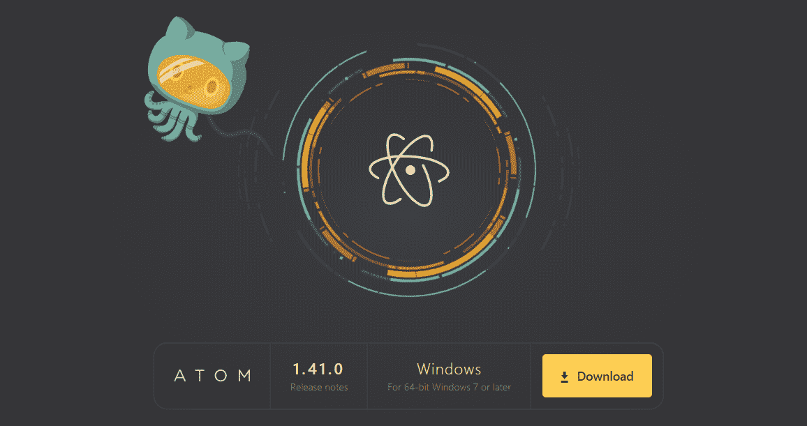
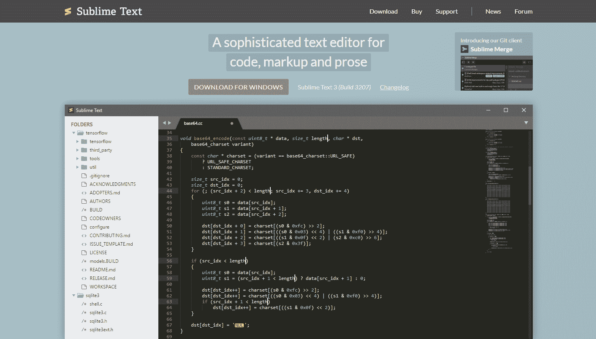
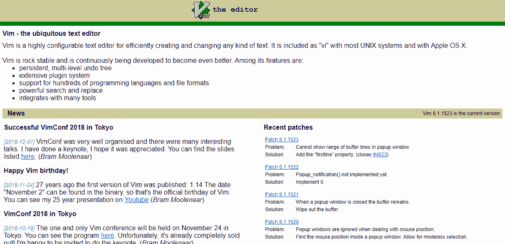
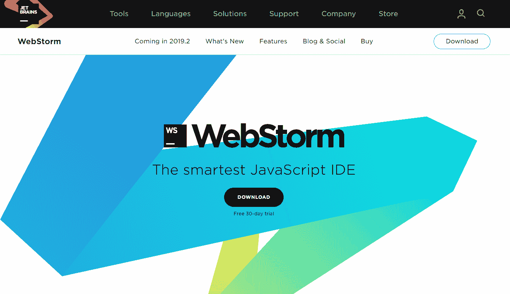

# 如何为 Web 开发选择最好的 JavaScript 编辑器

> 原文：<https://www.freecodecamp.org/news/how-to-choose-a-javascript-code-editor/>

对于正在寻找一个好的 JavaScript 编辑器的开发人员来说，有很多选择可以提供一个更高效、更愉快的工作环境。

领先的 JavaScript 代码编辑器分享了许多您可能期望的重要特性，包括自动完成(代码完成)、git 集成和插件支持。但是对于给定的开发人员来说，正是这些小事使得一个编辑器比另一个更适合。

一旦您熟悉了代码编辑器并熟悉了使您更高效的工作流，切换编辑器可能会很困难，因为您将不得不重新学习捷径来优化您的开发过程。

即使从长远来看你变得更有效率，当切换时仍然有一个很大的进入壁垒，所以值得投资一点时间来挑选你需要的最好的编辑器。

现在让我们来看看一些最流行的编辑器选项。

## [Visual Studio 代码](https://code.visualstudio.com/)

微软的 VSCode 是免费的，开源的，安装起来非常轻便。对于初学 JavaScript 的开发者来说，这是一个事实上的编辑器，部分原因是它预装了一组不需要额外插件的功能。VSCode 也很受欢迎，非常适合需要快速入门的高级用户。

VSCode 的一个独特功能是可以通过浏览器使用。因此，在移动中使用平板电脑也可以获得与桌面完全相同的环境。一个[代码服务器](https://github.com/cdr/code-server)必须配置在一个你可以访问的网络上，这个特性才能工作，但是一旦设置好就非常方便了。

****提示**** :在另一个 IDE 中处理一个大型项目时，构建过程可能会花费一些时间，我经常会在 VSCode 中打开巨大的 JS 输出文件，并在应用它之前对其进行调整，以便在浏览器中立即测试更改。VSCode 可以流畅地处理这些大文件。

Git 内置于 IDE 中，但是集成不如其他一些编辑器健壮。例如，与 VSCode 相比，WebStorm 的用户更喜欢推送/合并体验。

您可以安装许多您可能需要的附加功能作为扩展，这些功能有数千种。但并不是所有的都是实际特征。代码片段与特性和附加组件混在一起，这可能需要时间来检查并找到添加的最佳选项。如果你遇到问题，VSCode 有一个庞大的用户社区；有人可能遇到过同样的问题，并已经解决了它。

如果你还没有准备好使用一个全付费的 IDE，并且对你可能需要的插件和特性还不够熟悉，这是一个合理的起点。

## [Atom](https://atom.io/)

免费的 Atom 编辑器由 GitHub 开发。它实际上是 chromium 浏览器的一个专门版本，被转换成一个文本和源代码编辑器。在内部，它利用 Node.js 提供插件支持。

你可能想要的任何特性都有大量的插件，但是开箱即用并不强大。你必须收集一些插件来建立开发环境，在那里你可以尽可能地有效。如果您正在使用 JavaScript，这里有一些基本的 Atom 插件可以帮助您入门:

*   原子类型脚本
*   文件-图标-为不同的文件类型着色和分配图标
*   原子美化
*   剥绒机

****提示**** :启用自动保存包，当焦点丢失时会保存编辑内容。默认情况下，它是禁用的。

通过 teletype 插件，多个用户可以同时处理同一个文件，每个用户在屏幕上都有多个光标。您可以将此用于指导、结对编码或协作。这个特性使 Atom 有别于其他编辑器。

正如您对 GitHub 软件的期望，git 集成实现得很好。同样有用的是 git-plus 插件，它允许您通过键盘快捷键运行 git 命令，而无需使用 git 终端。

Atom 是可定制的，您可以编辑一个. less 文件来调整 IDE 颜色，如果您喜欢调整环境的每个细节，这很好。您可以在启动时运行一个. coffe 脚本，该脚本可用于快速更改编辑器的行为。

你可以用 JavaScript 编写插件来对抗一个文档完备的编辑器 API。如果需要的话，创作自己的功能和行为是很好的。

编辑体验很流畅，你可以用其他插件如 minimap 来增强它，但是需要一些初始时间投资来设置你想要的所有功能。好处是你不需要的功能不会花时间加载，这会降低体验。但是，在加载大文件或切换标签时，您可能会经历短暂的迟滞。

我最初喜欢编辑 CSS 样式来定制 IDE 环境的想法，或者至少如果我想提出自己的主题的话，有这种可能性。这听起来很有趣，但在实践中，提出包含许多变量的主题并不是一个简单的项目。幸运的是，有许多精美的主题插件可供下载。

Atom 是一个可靠的编辑器，它将非常适合许多开发人员。

## [崇高的文字](https://www.sublimetext.com/)

Sublime Text 是一个付费编辑器，但可以免费试用。它没有预装很多插件，但当然它们可以满足您的任何需求。一些软件包，比如 SideBarEnhancements，用于重命名、移动、复制和粘贴，可能应该内置到核心软件包中，但是您可以下载它们来启用这个功能。

与 Atom 类似，设置好一切可能需要一点时间。但是一旦上线运行，体验非常流畅。还可以保存丢失的焦点。

Sublime Text 很好，因为它是轻量级的，这使得它可以非常快速地加载和处理大型项目或文件。“goto anything”功能的实现非常突出，因为它可以与文件名、符号和行号一起使用。大多数 ide 都以这样或那样的形式提供了类似的特性，但是能够将它们结合起来并使用类似“fileName@functionName”的查询进行搜索是非常好的。

选择一个变量将会选择该变量的所有实例，重命名该变量将会自动重命名所有实例，因此这个常见任务将会变得非常简单。

在许多方面，Sublime Text 与 Atom 非常相似。但是 Sublime Text 有一般性能和响应性更好的优势，这是一流的。

## [VIM](https://www.vim.org/)

Vim 也是一个免费的文本编辑器，非常易于配置。最初命名为 vi，是为 Unix 开发的第一个文本编辑器，后来被扩展成一个功能更加丰富的编辑器，命名为 Vim。它在大多数 Linux 发行版上都可用。

Vim 具有强大的搜索和语法突出显示功能，而且它非常轻便，因此即使处理非常大的文件也能运行良好。但是它确实需要一些工作来设置和准备使用它。

GUI 是可用的，但它不是 Vim 的默认界面。即使启用鼠标支持也需要一些操作才能使其工作。默认是键盘模式，有些人可能更喜欢通过快捷键访问每个控件和功能。

也就是说，如果您花一些时间学习该软件的细节，并在其中设置您想要的所有行为和特性，Vim 可以成为您完美的 IDE。如果您时间紧迫，并且无法进行初始投资来解决问题，那么 Vim 可能不是您的最佳选择。

## [网络风暴](https://www.jetbrains.com/webstorm/)

WebStorm 由 JetBrains 开发，作为一个真正的 JavaScript IDE 脱颖而出，因为它集成了开箱即用的所有功能。React、Angular、Vue.js 等不同平台的开发环境。是无缝的。您可以调试节点脚本，并在内置服务器上运行测试。您还可以通过树视图界面执行和调试 npm 脚本。而且不需要任何插件来做到这一点。

然而，插件可用于一些不直接内置于软件中的罕见功能。默认情况下不包括的一个插件是降价分割编辑/预览窗口。但是你可能需要的大部分东西都已经在那里了。这样做的好处是，你会发现你以前不知道的功能，以及拥有它们是多么美好。

默认情况下，当您处理文件时，文件会自动保存。当你使用另一个不做这个的 app 时，手动保存相比之下感觉很原始。虽然它不是 WebStorm 独有的，但实现要好得多。

有些人可能并不总是信任 ctrl-z 撤销状态堆栈的完整性，但是在 WebStorm 中有一个内置的 VSC 系统，它基本上在每次保存文件时都会提交一次。这是内部的，与 git 提交是分开的。文件至少在文件内容窗口失去焦点时保存。因此，如果您有一段时间没有提交 git，而在最后一次提交后又不得不返回或查看以前的状态，这没有问题。

****提示****:Ctrl-shift-上/下箭头键让你在编辑器自动处理逗号/块括号的同时上下移动代码行或代码块。

当您处理包含许多文件的项目时，滚动文件树来搜索特定文件会降低您的速度。但是，如果其中一个项目已经打开并获得焦点，单击目标图标会将项目树视图滚动到该文件。很方便。

两个缺点是它不是免费的。有时，对于非常大的项目来说，它可能是一个内存猪。随着时间的推移，它变得越来越好，文件内容被内部索引，因此搜索大型项目非常快。最近的更新还包括启动速度的显著提高。

## 一般编辑生产力提示

重复行/选择快捷方式(在 WebStorm: ctrl-d，在 Atom: ctrl-shift-d，但他们都可以做到)是我的最爱之一，可以在很多编码场景中节省大量时间。

当你有一个条目列表，并且不得不修改每行的第一个(或一些)字符时，这种情况会不时出现。到'，'，但是 find-replace 并不实用。WebStorm 允许 alt-click 放置多个光标，在多个地方进行相同的编辑。尽管如此，我发现以下方法在某些情况下更快:

*   将光标放在第一个周期之后，开始手动进行更改。
*   按退格键，逗号，向下箭头键。用一个手指按住每一个键，重复按压，开始慢慢按压，然后加速按压。一旦你记下了这个模式，你就可以加快速度，很快就可以完成一个 200 行的列表。

这几乎就像在钢琴上弹奏一段旋律(尽可能快)。您也可以对编号列表执行此操作。写下没有数字的第一行，重复这一行 9 次，做同样的过程，除了每次用一个手指按下一个数字。以“1”开始接下来的 10 行，并做同样的过程，在每个“1”后添加一个数字。

如果你在谷歌上搜索“[编辑器名称] cheatsheet”，你可以从用户那里得到你正在尝试的编辑器的重要配置或快捷方式的快速摘要。打印出来，阅读所有的快捷方式，了解你可能不会接触到的新特性和功能。

考虑突出显示的行动如何改进您当前的流程将是有益的。如果你看到一个可能有帮助的，在它旁边做个标记，这样下次你遇到这种情况时就很容易回忆起来。即使您很少使用它，并且主要是在开始时，手头有一个快速参考可以减少更多地了解您的编辑器的摩擦，并且可以节省将来切换上下文和搜索的时间。

我甚至找到了 PDF 版本，打印并层压页面以备将来参考，但对于一些人来说，书签或截图也可以。

## 结论

如果你是一个初学者，希望学习 JavaScript 并使用一个完善的开发环境开始，VSCode 是显而易见的选择，因为它易于使用，内置了许多强大的功能。

对于更有经验的开发者来说，他们知道自己想要什么，Sublime 和 Atom 可能更好，因为它们会让你完全控制你的开发环境。您可以从数以千计的功能(软件包)中进行选择，以安装和保持应用程序的启动和资源使用免费额外的你不需要或想要的。花些时间和每一个人在一起会帮助你做出正确的选择。

对于那些喜欢在项目中独自使用键盘的铁杆超级用户来说，使用 Vim 比使用任何其他编辑器都更有效。节省你的手在键盘和鼠标之间移动的时间会加起来，但需要一些时间来掌握这个过程！

最后，如果您不介意保持付费订阅，并且不担心开发机器的内存或 CPU 限制，WebStorm 将让您快速启动并运行，而不管您使用的 JavaScript 开发平台、transpilers 或构建过程。它提供了一个非常方便的工作环境。

我个人使用 WebStorm 作为我的主要 IDE，但当性能是优先考虑的因素时，我仍然经常使用 VSCode 来编辑单个或非常大的文件。

如果你喜欢这篇文章，请考虑看看 [JSCharting](https://jscharting.com/) ，这是一个面向开发者的 JavaScript 图表库。你也可以在这里查看[的其他博文。](https://jscharting.com/blog/)