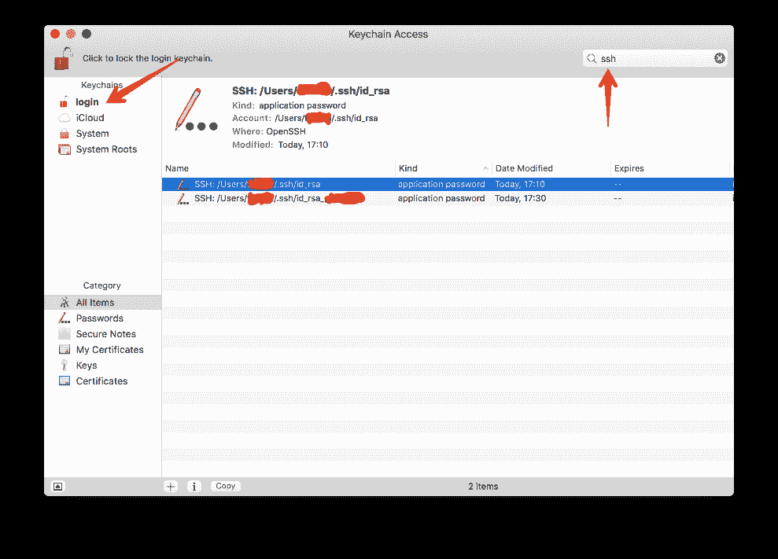

# SSH 终极指南——设置 SSH 密钥

> 原文：<https://www.freecodecamp.org/news/the-ultimate-guide-to-ssh-setting-up-ssh-keys/>

欢迎阅读我们设置 SSH(安全外壳)密钥的终极指南。本教程将向您介绍创建 SSH 密钥的基础知识，以及如何管理多个密钥和密钥对。

## 创建新的 SSH 密钥对

打开终端并运行以下命令:

```
ssh-keygen
```

您将看到以下文本:

```
Generating public/private rsa key pair.
Enter file in which to save the key (/home/username/.ssh/id_rsa):
```

按 enter 键将您的密钥保存到默认的`/home/username/.ssh`目录。

然后会提示您输入密码:

```
Enter passphrase (empty for no passphrase):
```

建议在这里输入密码，以增加一层安全性。通过设置密码，如果有人获得了您的私有 SSH 密钥或您的机器，您可以防止对您的服务器和帐户的未授权访问。

输入并确认密码后，您将看到以下内容:

```
Your identification has been saved in /home/username/.ssh/id_rsa.
Your public key has been saved in /home/username/.ssh/id_rsa.pub.
The key fingerprint is:
SHA256:/qRoWhRcIBTw0D4KpTUyK6YepyL6RQ2CQrtWsaicCb4 username@871e129f767b
The key's randomart image is:
+---[RSA 2048]----+
| .o=+....        |
|+.*o+o .         |
|+X.=o o          |
|@.=.oo .         |
|=O ...o S        |
|o.oo . .         |
|.E+ . . . .      |
|oo . ... +       |
|=.. .o. . .      |
+----[SHA256]-----+
```

现在，您有了一个公共和私有 SSH 密钥对，可以用来访问远程服务器和处理 Git 等命令行程序的身份验证。

## 管理多个 SSH 密钥

尽管每个设备只有一个公钥-私钥对被认为是一种好的做法，但有时您需要使用多个密钥或者您有非正统的密钥名。例如，您可能使用一个 SSH 密钥对来处理公司的内部项目，但是您可能使用不同的密钥来访问客户的服务器。除此之外，您可能使用不同的密钥对来访问您自己的私有服务器。

一旦需要使用第二个密钥，管理 SSH 密钥就会变得很麻烦。传统上，你会使用`ssh-add`来存储你的密钥到`ssh-agent`，为每个密钥输入密码。问题是每次重启电脑时你都需要这样做，这很快就会变得乏味。

更好的解决方案是自动添加密钥，存储密码，并指定在访问某些服务器时使用哪个密钥。

### 战略科研署

输入 SSH `config`，这是用于 SSH 通信的每个用户的配置文件。创建一个新文件:`~/.ssh/config`并打开它进行编辑:

```
nano ~/.ssh/config
```

### 管理自定义命名的 SSH 密钥

我们使用这个`config`文件要解决的第一件事是避免使用`ssh-add`添加自定义命名的 SSH 密钥。假设您的私有 SSH 密钥名为`~/.ssh/id_rsa`，将以下内容添加到`config`文件中:

```
Host github.com
  HostName github.com
  User git
  IdentityFile ~/.ssh/id_rsa
  IdentitiesOnly yes
```

接下来，通过打开另一个终端并运行以下命令，确保`~/.ssh/id_rsa`不在`ssh-agent`中:

```
ssh-add -D
```

该命令将从当前激活的`ssh-agent`会话中删除所有密钥。

现在，如果你尝试关闭一个 GitHub 库，你的`config`文件将使用`~/.ssh/ida_rsa`的密钥。

以下是一些其他有用的配置示例:

```
Host bitbucket-corporate
        HostName bitbucket.org
        User git
        IdentityFile ~/.ssh/id_rsa_corp
        IdentitiesOnly yes
```

现在你可以使用`git clone git@bitbucket-corporate:company/project.git`

```
Host bitbucket-personal
        HostName bitbucket.org
        User git
        IdentityFile ~/.ssh/id_rsa_personal
        IdentitiesOnly yes
```

现在你可以使用`git clone git@bitbucket-personal:username/other-pi-project.git`

```
Host myserver
        HostName ssh.username.com
        Port 1111
        IdentityFile ~/.ssh/id_rsa_personal
        IdentitiesOnly yes
        User username
        IdentitiesOnly yes
```

现在您可以使用`ssh myserver`SSH 进入您的服务器。您不再需要在每次 SSH 进入您的私有服务器时输入端口和用户名。

### 密码管理

难题的最后一部分是管理密码。每次初始化 SSH 连接时，输入密码会变得非常繁琐。为了解决这个问题，我们可以使用 macOS 和各种 Linux 发行版附带的密码管理软件。

在本教程中，我们将使用 macOS 的钥匙串访问程序。通过将`-K`选项传递给`ssh-add`命令，开始将您的密钥添加到钥匙串访问:

```
ssh-add -K ~/.ssh/id_rsa_whatever
```

现在，您可以在“钥匙串访问”中看到您的 SSH 密钥:



但是如果你用`ssh-add -D`从`ssh-agent`中移除密钥或者重启电脑，当你尝试使用 SSH 时，会再次提示你输入密码。原来还有一个圈要跳过。通过运行`nano ~/.ssh/config`打开您的 SSH `config`文件，并添加以下内容:

```
Host *
  AddKeysToAgent yes
  UseKeychain yes
```

这样，每当你运行`ssh`时，它就会在钥匙串访问中寻找钥匙。如果它找到一个，您将不再被提示输入密码。每次重启机器时，密钥也会自动添加到`ssh-agent`中。

既然你已经知道了创建新的 SSH 密钥和管理多个密钥的基本知识，那就出去尽情享受吧！