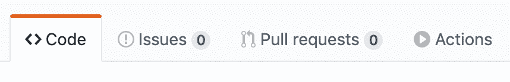
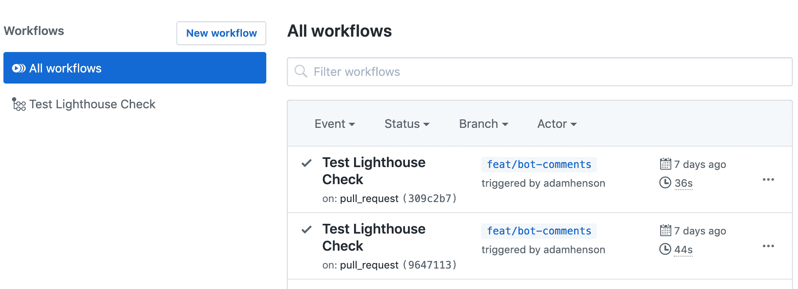
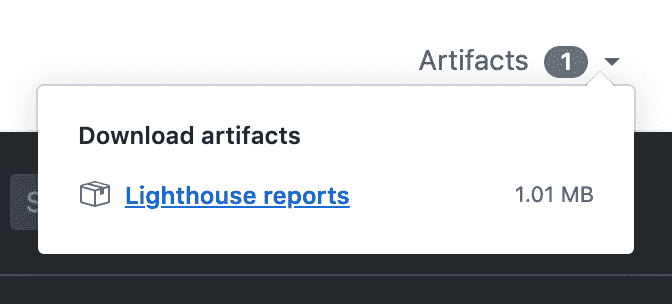
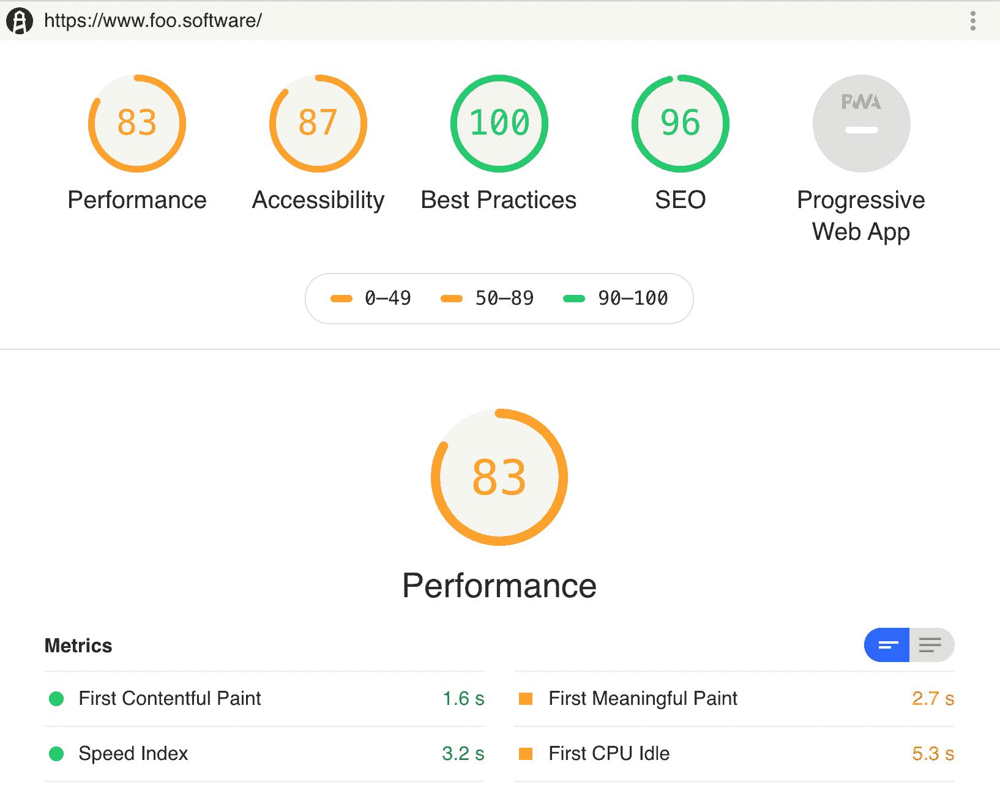
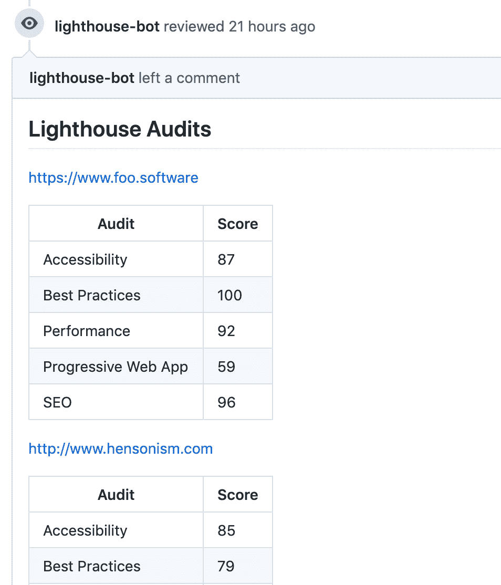
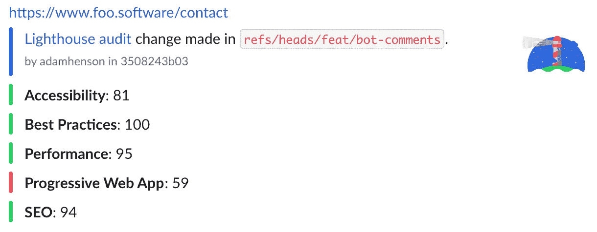

# 如何在 GitHub 操作中使用 Lighthouse

> 原文：<https://www.freecodecamp.org/news/how-to-use-lighthouse-in-github-actions/>

[GitHub 动作](https://help.github.com/en/actions/automating-your-workflow-with-github-actions)用于自动化软件工程工作流程。与 CircleCI、Jenkins、Travis 和许多其他工具类似，GitHub Actions 提供了一个用于定义工作流的声明式 API。这些工作流可以包括构建、测试和部署应用程序的作业。

Lighthouse 是 Google 的一个开源项目，用于提高网页质量。它提供了以用户为中心的指标来审核 SEO、性能、可访问性、最佳实践和渐进式 web 应用。关于 Lighthouse 更深入的探讨，请阅读“[如何使用 Lighthouse](https://www.freecodecamp.org/news/three-ways-to-analyze-website-performance-with-lighthouse-8d100966c04b/) 分析网站性能”。这篇文章将展示以下内容:

*   GitHub 动作工作流中 Lighthouse 的基本实现。
*   在拉式请求注释中显示 Lighthouse 结果的高级设置。
*   S3 灯塔报告上传。
*   延期通知。

# 灯塔检查 GitHub 操作

这篇文章将提供一个使用[灯塔检查动作](https://github.com/foo-software/lighthouse-check-action)自动化灯塔审计的指南。它可以在由任何事件触发的[工作流中使用。这篇文章将演示当被一个拉请求事件触发时如何使用这个动作。](https://help.github.com/en/actions/automating-your-workflow-with-github-actions/events-that-trigger-workflows)

# 基本示例

通过以下步骤，我们可以创建一个基本的工作流程。

1.  在本地创建并签出一个新分支。
2.  在您的项目中创建一个文件，路径类似于下面的`.github/workflows/my-workflow.yml`(用您选择的任何名称替换`my-workflow`)。
3.  用下面的例子填充上面的文件，用逗号分隔的要测试的 URL 列表替换`urls`字段。
4.  在本地提交更改，并将分支推送到您的远程。
5.  在您的新分支机构中，打开一个拉取请求。

```
name: Lighthouse Check
on: [pull_request]

jobs:
  lighthouse-check:
    runs-on: ubuntu-latest
    steps:
    - uses: actions/checkout@master
    - run: mkdir /tmp/artifacts
    - name: Run Lighthouse
      uses: foo-software/lighthouse-check-action@master
      with:
        outputDirectory: /tmp/artifacts
        urls: 'https://www.foo.software,https://www.foo.software/contact'
    - name: Upload artifacts
      uses: actions/upload-artifact@master
      with:
        name: Lighthouse reports
        path: /tmp/artifacts 
```

瞧啊。—我们有 Lighthouse 的工作流！假设您在 repo 中启用了 GitHub 操作，您应该会看到类似下面的内容( **注意:在撰写本文时，GitHub 操作处于“beta”模式，并且** [**需要注册**](https://github.com/features/actions) )。



GitHub repository tabs

单击“操作”将列出当前运行的和以前运行的所有工作流。



List of GitHub Actions workflows

按照我们的基本示例中的步骤，您应该在这个列表中看到一个项目。点击将显示灯塔的结果打印到控制台。


Lighthouse results printed out in the console

从我们的配置中，我们还将 HTML 报告中捕获的结果保存为“工件”。



Clicking through the “Artifacts” dropdown downloads the HTML reports



Full Lighthouse report as an HTML file downloaded from “Artifacts”

# 高级示例

灯塔检查行动通过利用引擎盖下的`[lighthouse-check](https://github.com/foo-software/lighthouse-check)` [NPM 模块](https://github.com/foo-software/lighthouse-check)提供了一整套华而不实的功能。我们可以用它做更多的事情。我们继续吧！

## 提取请求注释

通过利用这一特性，每次提交时，都会发布带有 Lighthouse 结果的注释。我们可以通过下面的步骤做到这一点。

1.  创建一个新用户或找到一个现有的用户作为一个“机器人”。
2.  [从该用户帐户创建个人访问令牌](https://help.github.com/en/github/authenticating-to-github/creating-a-personal-access-token-for-the-command-line)。
3.  创建一个 GitHub secret 来保存上面的加密值。在我们的例子中，我们将其命名为`LIGHTHOUSE_CHECK_GITHUB_ACCESS_TOKEN`。
4.  用下面显示的差异更新我们的工作流文件。
5.  提交和推送。

```
with:
+  accessToken: ${{ secrets.LIGHTHOUSE_CHECK_GITHUB_ACCESS_TOKEN }}
  outputDirectory: /tmp/artifacts 
```

这样，我们就创建了一个 bot 来发布 pull 请求的 Lighthouse 结果？！



Lighthouse results as PR comments

## S3 报告上传

在我们的例子中，我们通过将报告作为工件上传到我们的工作流中来持久化结果。这种解决方案在某些情况下可能已经足够了，但是工件并不是永久存储的。为了查看报告，我们需要导航到工作流中，并从工件视图中手动下载报告。

但是，如果我们想要一种更可靠的方式来存储和引用报告，该怎么办呢？这就是 S3 特性发挥作用的地方。我们可以按照以下步骤配置 AWS S3 存储。

1.  [如果您还没有 AWS 帐户，请创建一个帐户](https://aws.amazon.com/premiumsupport/knowledge-center/create-and-activate-aws-account/)。
2.  [创建一个 S3 存储桶](https://docs.aws.amazon.com/AmazonS3/latest/gsg/SigningUpforS3.html)如果你还没有的话。
3.  [获取 AWS 访问密钥 id 和秘密访问密钥](https://docs.aws.amazon.com/general/latest/gr/aws-sec-cred-types.html)。
4.  [为这两个值创建 GitHub 秘密](https://help.github.com/en/actions/automating-your-workflow-with-github-actions/creating-and-using-encrypted-secrets)。在我们的例子中，我们将分别使用`LIGHTHOUSE_CHECK_AWS_ACCESS_KEY_ID`和`LIGHTHOUSE_CHECK_AWS_SECRET_ACCESS_KEY`。
5.  添加桶名和[地区](https://docs.aws.amazon.com/AWSEC2/latest/UserGuide/using-regions-availability-zones.html)(例如:`us-east-1`)作为 GitHub 秘密:`LIGHTHOUSE_CHECK_AWS_BUCKET`和`LIGHTHOUSE_CHECK_AWS_REGION`。

接下来，我们将使用以下差异更新我们的配置。

```
with:
  accessToken: ${{ secrets.LIGHTHOUSE_CHECK_GITHUB_ACCESS_TOKEN }}
+  awsAccessKeyId: ${{ secrets.LIGHTHOUSE_CHECK_AWS_ACCESS_KEY_ID }}
+  awsBucket: ${{ secrets.LIGHTHOUSE_CHECK_AWS_BUCKET }}
+  awsRegion: ${{ secrets.LIGHTHOUSE_CHECK_AWS_REGION }}
+  awsSecretAccessKey: ${{ secrets.LIGHTHOUSE_CHECK_AWS_SECRET_ACCESS_KEY }} 
```

在我们的下一次提交和推送中，报告将自动上传到 S3 ✅！我们的公关评论中也有他们的链接。


Lighthouse result PR comment with S3 report linked

## 时差通知

没有延迟通知的 DevOps 工作流中有什么新功能？的确很悲伤。让我们将通知添加到一个 Slack 频道，让整个团队都能看到。我们可以通过以下步骤来实现这一点。

1.  [在你的空闲工作空间中创建一个“传入 Webhook”并授权一个频道](https://api.slack.com/messaging/webhooks)。
2.  添加 Webhook URL 作为 [GitHub 秘密](https://help.github.com/en/actions/automating-your-workflow-with-github-actions/creating-and-using-encrypted-secrets) — `LIGHTHOUSE_CHECK_WEBHOOK_URL`。
3.  将 GitHub 数据和 Webhook URL 添加到我们的配置中，区别如下。GitHub 数据将呈现在我们的通知中。我们通过使用 [GitHub“上下文”](https://help.github.com/en/actions/automating-your-workflow-with-github-actions/contexts-and-expression-syntax-for-github-actions#github-context)的配置来传递 GitHub 数据。

```
with:
  accessToken: ${{ secrets.LIGHTHOUSE_CHECK_GITHUB_ACCESS_TOKEN }}  +  author: ${{ github.actor }}
  awsAccessKeyId: ${{ secrets.LIGHTHOUSE_CHECK_AWS_ACCESS_KEY_ID }}
  awsBucket: ${{ secrets.LIGHTHOUSE_CHECK_AWS_BUCKET }}
  awsRegion: ${{ secrets.LIGHTHOUSE_CHECK_AWS_REGION }}
  awsSecretAccessKey: ${{ secrets.LIGHTHOUSE_CHECK_AWS_SECRET_ACCESS_KEY }}
+  branch: ${{ github.ref }}
  outputDirectory: /tmp/artifacts
+  sha: ${{ github.sha }}
+  slackWebhookUrl: ${{ secrets.LIGHTHOUSE_CHECK_WEBHOOK_URL }}
  urls: 'https://www.foo.software,https://www.foo.software/contact' 
```

我们的下一个提交和推送引入了松弛通知！下面截图中的“Lighthouse audit”链接以 configured✨.的身份导航到 S3 报告



Lighthouse Slack notification

## **维护历史记录**

Foo 的自动化灯塔检查工具是我们可以用来管理灯塔审计历史记录的工具。我们可以用 Lighthouse Check GitHub 连接它！通过这样做，你可以远程运行 Lighthouse，而不是在本地的 dockerized GitHub 环境中。有了这一点，我们可以确信我们的 Lighthouse 结果不会因为 GitHub 基础设施的改变而变得不稳定。按照[记录的步骤连接自动灯塔检查](https://github.com/foo-software/lighthouse-check-action#usage-automated-lighthouse-check-api)。


A historical record of Lighthouse audits with "Automated Lighthouse Check"

# 现在怎么办？

你可以在上面的[灯塔检查行动文件](https://github.com/foo-software/lighthouse-check-action#example-usage)中找到完整的例子。希望这篇文章能为你的 DevOps 工作流程提供有益的补充！通过将 Lighthouse 集成到 CI/CD 管道中，我们可以保持充分的准备，以确保网站 SEO、性能、可访问性、最佳实践和渐进式 web 应用程序的高质量。