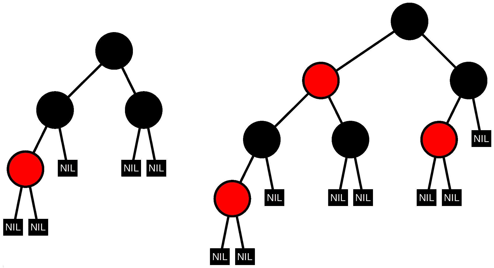

# 红黑树:用例子解释自平衡二分搜索法树

> 原文：<https://www.freecodecamp.org/news/red-black-trees/>

## 什么是红黑树？

红黑树是一种自平衡二叉查找树(BST)。在红黑树中，每个节点都遵循以下规则:

1.  每个节点都有两个子节点，颜色不是红色就是黑色。
2.  每一个树叶节点总是黑色的。
3.  每个红色节点的两个子节点都是黑色的。
4.  没有两个相邻的红色节点(一个红色节点不能有红色父节点或红色子节点)。
5.  从根到树叶节点的每条路径都有相同数量的黑色节点(称为“黑色高度”)。

### 插入红黑树

节点最初被插入到红黑树中，就像任何二叉查找树一样。然后，新节点被赋予红色。插入该节点后，必须对树进行验证，以确保没有违反五个属性中的任何一个。如果违反了某个属性，有三种可能的情况需要对节点进行左旋转、右旋转和/或重新着色。案例依赖于当前节点的“叔叔”。具体来说就是“大叔”节点是黑还是红。有关插入的更多信息，可在[这里](https://www.geeksforgeeks.org/red-black-tree-set-2-insert/)找到这三种情况。

### 左倾的红黑树

左倾红黑树是一种自平衡二叉查找树。它是红黑树的一个变种，保证了相同的渐进运算复杂度，但是设计得更容易实现。

### 左倾红黑树的性质

已经提出的所有红黑树算法的特征在于由 N 个关键字的树中的 log N 的小常数倍数所限定的最坏情况搜索时间，并且在实践中观察到的行为通常比最坏情况的界限快相同的倍数，接近于在完全平衡的树中观察到的最佳 log N 节点。

具体来说，在由 N 个随机键构建的左倾红黑树 2-3 中:->一个随机成功的搜索检查`log2 N`—0.5 个节点。- >平均树高约为`2 log2 N`