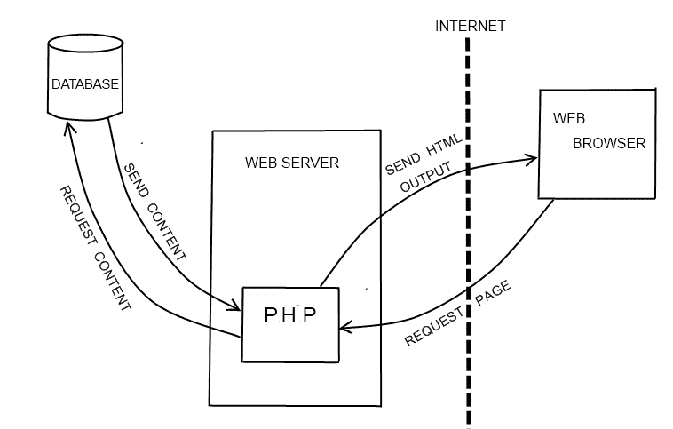

# 最好的 PHP 例子

> 原文：<https://www.freecodecamp.org/news/the-best-php-examples/>

PHP 是一种服务器端脚本语言，由拉斯马斯·勒德尔夫于 1995 年创建。

PHP 是一种广泛使用的开源通用脚本语言，特别适合 web 开发，并且可以嵌入到 HTML 中。

### PHP 是用来做什么的？

截至 2018 年 10 月，在服务器端语言已知的网站中，有 [80%使用 PHP。它通常用在网站上，以动态生成网页内容。用例包括:](https://w3techs.com/technologies/overview/programming_language/all)

*   网站和 web 应用程序(服务器端脚本)
*   命令行脚本
*   桌面(GUI)应用程序

通常，它以第一种形式动态生成网页内容。例如，如果您有一个博客网站，您可以编写一些 PHP 脚本来从数据库中检索您的博客文章并显示它们。PHP 脚本的其他用途包括:

*   处理和保存表单数据中的用户输入
*   设置和使用网站 cookies
*   限制访问您网站的某些页面

最大的社交网络平台，[脸书](https://www.facebook.com/)是用 PHP 编写的

### PHP 是如何工作的？

所有的 PHP 代码只在网络服务器上执行，而不是在你的本地计算机上。例如，如果您在网站上完成一个表单并提交它，或者单击一个用 PHP 编写的网页的链接，实际上没有 PHP 代码在您的计算机上运行。相反，表单数据或网页请求被发送到 web 服务器，由 PHP 脚本处理。然后，web 服务器将处理后的 HTML 发回给您(这就是名称中的“超文本预处理器”的由来)，您的 web 浏览器显示结果。因此，您看不到网站的 PHP 代码，只能看到 PHP 脚本生成的 HTML。

下图说明了这一点:



Source: https://github.com/xeroxism/

PHP 是一种解释型语言。这意味着当您对源代码进行更改时，您可以立即测试这些更改，而无需首先将源代码编译成二进制形式。跳过编译步骤会使开发过程更快。

PHP 代码包含在`<?php`和`?>`标签之间，然后可以嵌入到 HTML 中。

## 装置

PHP 可以在有或没有网络服务器的情况下安装。

### GNU/Linux

在基于 Debian 的 GNU/Linux 发行版上，您可以通过以下方式安装:

```
sudo apt install php
```

在 Centos 6 或 7 上，您可以通过以下方式进行安装:

```
sudo yum install php
```

安装后，您可以运行任何 PHP 文件，只需在终端中这样做:

```
php file.php
```

你也可以安装一个本地主机服务器来运行 PHP 网站。对于安装 Apache Web 服务器:

```
sudo apt install apache2 libapache2-mod-php
```

或者你也可以安装 PHP，MySQL 和 Web-server

[XAMPP](https://www.apachefriends.org/download.html) (免费开源的跨平台 web 服务器解决方案堆栈包)或类似的包，如 [WAMP](http://www.wampserver.com/en/)

## PHP 框架

由于为一个网站编写完整的代码对于大多数项目来说并不实际/可行，所以大多数开发人员倾向于使用框架进行 web 开发。使用框架的优势在于

*   你不必每次创建一个项目都重新发明轮子，很多细微差别已经为你考虑好了
*   它们通常结构良好，因此有助于分离关注点
*   大多数框架倾向于遵循该语言的最佳实践
*   它们中的许多都遵循 MVC(模型-视图-控制器)模式，因此它将表示层从逻辑中分离出来

### 流行的框架

*   [CodeIgniter](https://codeigniter.com/)
*   拉勒维尔
*   [symphony](https://symfony.com/)
*   [Zend](http://www.zend.com/)
*   [CakePHP](https://cakephp.org/)
*   [燃料马力](https://fuelphp.com/)
*   [苗条](https://www.slimframework.com/)
*   [好的 2](https://www.yiiframework.com/)

## 基本语法

PHP 脚本可以放在文档中的任何地方，并且总是以`<?php`开始，以`?>`结束。同样，PHP 语句以分号(；).

下面是一个简单的脚本，它使用内置的`echo`函数将文本“最佳 PHP 示例”输出到页面:

```
<!DOCTYPE html>
<html>
<body>

<h1>Developer News</h1>

<?php echo "The Best PHP Examples"; ?>

</body>
</html> 
```

其输出将是:

```
Developer News

The Best PHP Examples
```

### 评论

PHP 支持几种注释方式:

*   单行注释:
*   多行注释:

```
<?php
  // This is a single-line comment

  # You can also make single-line comments like this
?>
```

```
<?php
/*
This comment block spans
over multiple 
lines
*/
?>
```

### 区分大小写

所有关键字、类和函数都不区分大小写。

在下面的示例中，所有三个 echo 语句都有效:

```
<?php
ECHO "Hello!<br>";
echo "Welcome to Developer News<br>";
EcHo "Enjoy all of the ad-free articles<br>";
?>
```

但是，所有变量名都区分大小写。在下面的例子中，只有第一条语句是有效的，并将显示`$name`变量的值。`$NAME`和`$NaMe`都被视为不同的变量:

```
<?php
$name = "Quincy";
echo "Hi! My name is " . $name . "<br>";
echo "Hi! My name is " . $NAME . "<br>";
echo "Hi! My name is " . $NaMe . "<br>";
?>
```

## 变量

变量是 PHP 程序中存储信息的主要方式。

PHP 中的所有变量都以类似`$variable_name`的美元符号开头。要分配一个变量，使用`=`操作符，左边是变量名，右边是要计算的表达式。

****语法:****

```
<?php
// Assign the value "Hello!" to the variable "greeting"
$greeting = "Hello!";
// Assign the value 8 to the variable "month"
$month = 8;
// Assign the value 2019 to the variable "year"
$year = 2019;
?>
```

### PHP 变量的规则

*   变量声明以`$`开头，后跟变量的名称
*   变量名只能以大写或小写字母或下划线(`_`)开头
*   变量名只能包含字母、数字或下划线(A-z、0-9 和`_`)。其他特殊字符如`+ - % ( ) . &`无效
*   变量名区分大小写

**允许变量名的一些例子:**

*   $my_variable
*   $另一个变量
*   $第二个变量

### 预定义变量

PHP 有几个特殊的关键字，虽然它们是“有效的”变量名，但不能用于变量。这是因为语言本身已经定义了那些变量，它们被用于特殊的目的。下面列出了几个例子，完整的列表见 PHP 文档网站。

*   `$this`
*   `$_GET`
*   `$_POST`
*   `$_SERVER`
*   `$_FILES`

## PHP 数据类型

变量可以存储不同类型的数据，例如:

*   字符串(“你好”)
*   整数(5)
*   浮点型(也称为双精度型)(1.0)
*   布尔型(1 或 0)
*   Array ( Array("I "，" am "，" an "，" array "))
*   目标
*   空
*   资源

### 用线串

字符串是一系列字符。它可以是引号内的任何文本(单引号或双引号):

```
$x = "Hello!";
$y = 'Hello!';
```

### 整数

整数数据类型是介于-2，147，483，648 和 2，147，483，647 之间的非十进制数。

**整数规则:**

*   整数必须至少有一位数字
*   整数不能有小数点
*   整数可以是正数，也可以是负数

`$x = 5;`

### 漂浮物

浮点数是一个带小数点的数字。

`$x = 5.01;`

### 布尔运算

布尔值表示两种可能的状态:真或假。布尔经常在条件测试中使用。

```
$x = true;
$y = false;
```

### 数组

数组在一个变量中存储多个值。

`$colors = array("Magenta", "Yellow", "Cyan");`

### 空

Null 是一种特殊的数据类型，只能有值`null`。变量可以声明为不带值，或者通过将值设置为`null`来清空。同样，如果一个变量在没有赋值的情况下被创建，它会被自动赋值`null`。

```
<?php
// Assign the value "Hello!" to greeting
$greeting = "Hello!";

// Empty the value greeting by setting it to null
$greeting = null;
?>
```

### 类别和对象

类是对现实世界中的事物建模有用的数据结构，可以包含属性和方法。对象是类的实例，是封装特定于类的值和函数的便捷方式。

```
<?php
class Car {
    function Car() {
        $this->model = "Tesla";
    }
}

// create an object
$Lightning = new Car();

// show object properties
echo $Lightning->model;
?>
```

### PHP 资源

资源是一个特殊的变量，保存着对外部资源的引用。资源是由特殊函数创建和使用的。可以使用[get*resource*type()](http://php.net/manual/en/function.get-resource-type.php)函数查看资源类型。

```
<?php
// prints: mysql link
$c = mysql_connect();
echo get_resource_type($c) . "\n";

// prints: stream
$fp = fopen("foo", "w");
echo get_resource_type($fp) . "\n";

// prints: domxml document
$doc = new_xmldoc("1.0");
echo get_resource_type($doc->doc) . "\n";
```

## 用线串

字符串是一系列字符。这些可以用来存储应用程序中的任何文本信息。

在 PHP 中创建字符串有许多不同的方法。

### 单引号

可以使用单引号创建简单的字符串。

```
$name = 'Joe';
```

要在字符串中包含单引号，请使用反斜杠将其转义。

```
$last_name = 'O\'Brian';
```

### 双引号

您也可以使用双引号创建字符串。

```
$name = "Joe";
```

要包含双引号，请使用反斜杠将其转义。

```
$quote = "Mary said, \"I want some toast,\" and then ran away.";
```

双引号字符串也允许转义序列。这些是特殊的代码，将代表通常不可见字符的字符放入字符串中。例子包括换行符`\n`、制表符`\t`和实际反斜杠`\\`。

您也可以在双引号字符串中嵌入 PHP 变量，将它们的值添加到字符串中。

```
$name = 'Joe';
$greeting = "Hello $name"; // now contains the string "Hello Joe"
```

### 字符串函数

#### 求一个字符串的长度

`strlen()`函数返回一个字符串的长度。

```
<?php
echo strlen("Developer News"); // outputs 14
?>
```

**查找字符串中的单词数**
`str*word*count()`函数返回字符串中的单词数:

```
<?php
echo str_word_count("Developer News"); // outputs 2
?>
```

#### **反转一个字符串**

`strrev()`函数反转一个字符串:

```
<?php
echo strrev("Developer News"); // outputs sweN repoleveD
?>
```

#### 在字符串中搜索文本

`strpos()`函数在字符串中搜索文本:

```
<?php
echo strpos("Developer News", "News"); // outputs 10
?>
```

#### 替换字符串中的文本

`str_replace()`函数替换字符串中的文本:

```
<?php
echo str_replace("freeCodeCamp", "Developer", "freeCodeCamp News"); // outputs Developer News
?>
```

## 常数

常量是 PHP 中的一种变量。设置常量的`define()`函数有三个参数——键名、键值和一个布尔值(true 或 false ),该值决定键名是否区分大小写(默认为 false)。常量的值一旦设置就不能更改。它用于很少更改的值(例如数据库密码或 API 密钥)。

### 范围

重要的是要知道，与变量不同，常量总是有一个全局范围，可以从脚本中的任何函数访问。

```
<?php
define("freeCodeCamp", "Learn to code and help nonprofits", false);
echo freeCodeCamp;
>?

// Output: Learn to code and help nonprofits
```

此外，在创建类时，可以声明自己的常量。

```
class Human {
  const TYPE_MALE = 'm';
  const TYPE_FEMALE = 'f';
  const TYPE_UNKNOWN = 'u'; // When user didn't select his gender

  .............
}
```

****注意:**** 如果要使用`Human`类内部的那些常量，可以把它们称为`self::CONSTANT_NAME`。如果你想在课堂外使用它们，你需要把它们称为`Human::CONSTANT_NAME`。

## 经营者

PHP 包含了编程语言中所有常见的操作符。

单个“=”用作赋值运算符，双“==”或三“===”用于比较。

通常的“”也可用于比较，而“+=”可用于添加一个值并同时赋值。

最值得注意的是“.”的使用连接字符串和"。= "将一个字符串追加到另一个字符串的末尾。

PHP 7.0.X 的新特性是宇宙飞船操作符(<=>)。当$a 小于、等于或大于$b 时，飞船操作符返回-1、0 或 1。

```
<?php

echo 1 <=> 1; // 0
echo 1 <=> 2; // -1
echo 2 <=> 1; // 1
```

## If / Else / Elseif 语句

If / Else 是一个条件语句，根据条件的真实性，将执行不同的操作。

****注意:**** 只有当条件有多个动作语句时，才需要`{}`括号；但是，最好的做法是无论如何都要包括它们。

### 如果语句

```
<?php

  if (condition) {
    statement1;
    statement2;
  }
```

****注意:**** 您可以在一个“if”块中嵌套任意多的语句；你不限于例子中的数量。

### If/Else 语句

```
<?php

  if (condition) {
    statement1;
    statement2;
  } else {
    statement3;
    statement4;
  }
```

****注:****`else`语句可选。

### If/Elseif/Else 语句

```
<?php

  if (condition1) {
    statement1;
    statement2;
  } elseif (condition2) {
    statement3;
    statement4;
  } else {
    statement5;
  }
```

****注:**** `elseif`应始终写成一个字。

### 嵌套的 If/Else 语句

```
<?php

  if (condition1) {
      if (condition2) {
        statement1;
        statement2;
      } else {
        statement3;
        statement4;
      }
  } else {
      if (condition3) {
        statement5;
        statement6;
      } else {
        statement7;
        statement8;
      }
  }
```

### 多重条件

“或”(||)、“异或”和“与”(&&)逻辑运算符可以同时使用多个条件。

例如:

```
<?php

  if (condition1 && condition2) {
    echo 'Both conditions are true!';
  } elseif (condition1 || condition2) {
    echo 'One condition is true!';
  } else (condition1 xor condition2) {
    echo 'One condition is true, and one condition is false!';
  }
```

****注意:**** 当有多个条件时，最好将单个条件放在括号中(这样可以提高可读性)。

### 可选的 If/Else 语法

控制结构也有一种替代语法

```
 if (condition1):
    statement1;
  else:
    statement5;
  endif;
```

### 三元运算符

三元运算符基本上是单行 if / else 语句。

假设您需要在用户登录时显示“Hello(用户名)”，在用户未登录时显示“Hello guest”。

**If / Else 语句**:

```
if($user == !NULL {
  $message = 'Hello '. $user; 
} else {
  $message = 'Hello guest';
}
```

**三元运算符**:

```
$message = 'Hello '.($user == !NULL ? $user : 'Guest');
```

## 转换

在 PHP 中，`Switch`语句与 JavaScript `Switch`语句非常相似(参见本 [JavaScript switch 语句指南](https://www.freecodecamp.org/news/javascript-switch-case-js-switch-statement-example/)进行比较和对比)。它允许在许多不同的可能条件下进行快速案例测试，代码也更具可读性。

```
<?php
	// Switch Statement Example
	switch ($i) {
    	case "free":
    	    echo "i is free";
    	    break;
    	case "code":
    	    echo "i is code";
    	    break;
    	case "camp":
    	    echo "i is camp";
    	    break;
    	default:
    	    echo "i is freecodecamp";
            break;
	}
```

### 破裂

`break;`语句退出开关，并继续运行应用程序的其余代码。如果您不使用`break;`语句，您可能会运行多个案例和语句，有时这可能是您所希望的，在这种情况下，您不应该包含`break;`语句。

下面是这种行为的一个例子:

```
<?php
    $j = 0;

    switch ($i) {
        case '2':
            $j++;
        case '1':
            $j++;
            break;
        default:
            break;
    }
```

如果$i = 1，则$j 的值为:

```
1
```

如果$i = 2，则$j 的值为:

```
2
```

虽然在某些情况下可以省略 break 而不会导致漏接(见下文)，但出于易读性和安全性的考虑，通常最好将 break 包括在内(见下文):

```
<?php
    switch ($i) {
        case '1':
            return 1;
        case '2':
            return 2;
        default:
            break;
     }
```

```
<?php
    switch ($i) {
        case '1':
            return 1;
            break;
        case '2':
            return 2;
            break;
        default:
            break;
     }
```

### 例子

```
<?php
//initialize with a random integer within range
$diceNumber = mt_rand(1, 6);

//initialize
$numText = "";

//calling switch statement
  switch($diceNumber) 
  {
  case 1:
    $numText = "One";
    break;
  case 2:
    $numText = "Two";
    break;
  case 3:
  case 4:
    // case 3 and 4 will go to this line
    $numText = "Three or Four";
    break;
  case 5:
    $numText = "Five";
    echo $numText;
    // break; //without specify break or return it will continue execute to next case.
  case 6:
    $numText = "Six";
    echo $numText;
    break;
  default:
    $numText = "unknown";
  }

  //display result
  echo 'Dice show number '.$numText.'.';

?>
```

### 输出

```
if case is 1
> Dice show number One.

if case is 2
> Dice show number Two.

if case is 3
> Dice show number Three or Four.

if case is 4
> Dice show number Three or Four.

if case is 5
> FiveSixDice show number Six.

if case is 6
> SixDice show number Six.

if none of the above
> Dice show number unknown.
```

## 环

当你需要多次重复一个任务时，你可以使用一个循环，而不是一遍又一遍地添加相同的代码。

在循环中使用`break`可以停止循环执行。

### For 循环

在代码块中循环特定的次数。

```
<?php
for($index = 0; $index < 5; $index ++)
{
    echo "Current loop counter ".$index.".\n";
}
?>

/*
Output:

Current loop counter 0.
Current loop counter 1.
Current loop counter 2.
Current loop counter 3.
Current loop counter 4.
*/
```

### While 循环

如果条件为真，则循环通过代码块。

```
<?php
$index = 10;
while ($index >= 0)
{
    echo "The index is ".$index.".\n";
    $index--;
}
?>

/*
Output:

The index is 10.
The index is 9.
The index is 8.
The index is 7.
The index is 6.
The index is 5.
The index is 4.
The index is 3.
The index is 2.
The index is 1.
The index is 0.
*/
```

### 做...While 循环

在代码块中循环一次，如果条件为真，则继续循环。

```
<?php
$index = 3;
do
{
    // execute this at least 1 time
    echo "Index: ".$index.".\n"; 
    $index --;
}
while ($index > 0);
?>

/*
Output:

Index: 3.
Index: 2.
Index: 1.
*/
```

### Foreach 循环

对数组中的每个值循环通过一个代码块。

## 功能

函数是可以在程序中重复使用的语句块。

### 简单函数+调用

```
function say_hello() {
  return "Hello!";
}

echo say_hello();
```

### 简单函数+参数+调用

```
function say_hello($friend) {
  return "Hello " . $friend . "!";
}

echo say_hello('Tommy');
```

### 让所有的字符变得越来越大！

```
function makeItBIG($a_lot_of_names) {
  foreach($a_lot_of_names as $the_simpsons) {
    $BIG[] = strtoupper($the_simpsons);
  }
  return $BIG;
}

$a_lot_of_names = ['Homer', 'Marge', 'Bart', 'Maggy', 'Lisa'];
var_dump(makeItBIG($a_lot_of_names));
```

## 数组

数组类似于常规变量，但在一个有序列表中保存多个值。如果您有多个彼此相关的值，如学生姓名列表或首都列表，这将非常有用。

### 数组的类型

在 PHP 中，有两种类型的数组:索引数组和关联数组。每一种都有自己的用途，我们将看看如何创建这些数组。

### 索引数组

索引数组是有序值的列表。数组中的每个值都被分配了一个索引号。数组的索引总是从第一个值的`0`开始，然后从那里增加 1。

```
<?php
$shopping_list = array("eggs", "milk", "cheese");
?>
```

`$shopping_list[0]`会返回`"eggs"`，`$shopping_list[1]`会返回`"milk"`，`$shopping_list[2]`会返回`"cheese"`。

### 关联数组

关联数组是通过键而不是索引号访问的值的列表。密钥可以是任何值，但对于数组必须是唯一的。

```
<?php
$student_scores = array("Joe" => 83, "Frank" => "93", "Benji" => "90");
?>
```

`$student_scores['Joe']`将返回`83`，`$student_scores['Frank']`将返回`93`，`$student_scores['Benji']`将返回`90`。

### 多维数组

多维数组是包含其他数组的数组。这使您可以创建复杂的数据结构，可以对非常复杂的数据组进行建模。

```
<?php
$students = 
  array(
    array("first_name" => "Joe", "score" => 83, "last_name" => "Smith"),
    array("first_name" => "Frank", "score" => 92, "last_name" => "Barbson"),
    array("first_name" => "Benji", "score" => 90, "last_name" => "Warner")   
  );
?>
```

现在，您可以通过以下方式获得第一名学生的`first_name`:

```
$students[0]['first_name']
```

### 获取数组的长度 count()函数

`count()`函数用于返回一个数组的长度(元素的数量):

```
<?php
$cars = array("Volvo", "BMW", "Toyota");
echo count($cars);
?>
```

## 排序数组

PHP 提供了几个函数来对数组进行排序。本页描述了不同的功能并包括示例。

### 排序()

函数按照字母/数字的升序对数组中的值进行排序(例如 A，B，C，D，E...1, 2, 3, 4, 5...)

```
<?php
$freecodecamp = array("free", "code", "camp");
sort($freecodecamp);
print_r($freecodecamp);
?>
```

****输出** :**

```
Array
(
    [0] => camp
    [1] => code
    [2] => free
)
```

### rsort()

`rsort()`函数按字母/数字降序排列数组的值(例如 Z，Y，X，W，V...5, 4, 3, 2, 1...)

```
<?php
$freecodecamp = array("free", "code", "camp");
rsort($freecodecamp);
print_r($freecodecamp);
?>
```

****输出:****

```
Array
(
    [0] => free
    [1] => code
    [2] => camp
)
```

### asort()

函数的作用是:根据数组的值，按照字母/数字的升序对数组进行排序(例如:A，B，C，D，E...1, 2, 3, 4, 5...)

```
<?php
$freecodecamp = array("zero"=>"free", "one"=>"code", "two"=>"camp");
asort($freecodecamp);
print_r($freecodecamp);
?>
```

****输出:****

```
Array
(
    [two] => camp
    [one] => code
    [zero] => free
)
```

### ksort()

函数的作用是:通过关键字，按照字母/数字的升序(例如 A，B，C，D，E...1, 2, 3, 4, 5...)

```
<?php
$freecodecamp = array("zero"=>"free", "one"=>"code", "two"=>"camp");
ksort($freecodecamp);
print_r($freecodecamp);
?>
```

****输出:****

```
Array
(
    [one] => code
    [two] => camp
    [zero] => free
)
```

### 排序()

函数的作用是:根据数组的值，按照字母/数字的降序对数组进行排序(例如 Z，Y，X，W，V...5, 4, 3, 2, 1...)

```
<?php
$freecodecamp = array("zero"=>"free", "one"=>"code", "two"=>"camp");
arsort($freecodecamp);
print_r($freecodecamp);
?>
```

****输出:****

```
Array
(
    [zero] => free
    [one] => code
    [two] => camp
)
```

### krsort()

`krsort()`函数按照字母/数字的降序对关联数组进行排序(例如 Z，Y，X，W，V...5, 4, 3, 2, 1...)

```
<?php
$freecodecamp = array("zero"=>"free", "one"=>"code", "two"=>"camp");
krsort($freecodecamp);
print_r($freecodecamp);
?>
```

****输出:****

```
Array
(
    [zero] => free
    [two] => camp
    [one] => code
)
```

## 形式

表单是用户输入数据或从网页中选择数据的一种方式。表单可以存储数据，并允许检索信息供以后使用。

要让一个表单在 PHP 这样的语言中工作，你需要 html 中的一些基本属性。在大多数情况下，PHP 使用“post”和“get”超级全局变量从表单中获取数据。

```
<html>
<body>
  <form method="get" action="target_proccessor.php">
      <input type="search" name="search" /><br />
      <input type="submit" name="submit" value="Search" /><br />
  </form>
<body>
</html>
```

这里的“方法”属性告诉表单发送表单数据的方式。然后“action”属性告诉将表单数据发送到哪里进行处理。现在“name”属性非常重要，它应该是唯一的，因为在 PHP 中，名称的值作为输入字段的标识。

## 检查所需输入

PHP 有几个函数来检查是否满足了所需的输入。这些功能是`isset`、`empty`和`is_numeric`。

### 检查表单以确保其设置

`isset`检查该字段是否已经设置并且不为空。示例:

```
$firstName = $_GET['firstName']

if(isset($firstName)){
  echo "firstName field is set". "<br>";
}
else{
  echo "The field is not set."."<br>";
}
```

## 处理表单输入

我们可以用全局变量$ *POST 和$* GET 获得表单输入。

```
$_POST["firstname"] or $_GET['lastname']
```