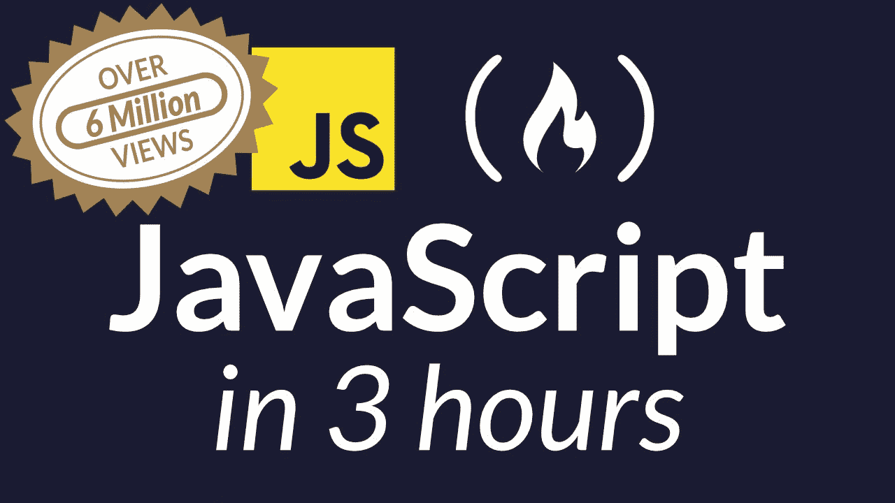

# 最好的 JavaScript 教程

> 原文：<https://www.freecodecamp.org/news/best-javascript-tutorial/>

JavaScript 是世界上使用最广泛的脚本语言。它拥有所有编程语言中最大的库生态系统。

JavaScript 是 web 的核心语言，也是唯一可以在所有主流 web 浏览器中运行的编程语言。

值得注意的是，JavaScript 和 Java 没有关系。看看 JavaScript:世界上最容易被误解的编程语言。

JavaScript 的正式名称是在标准 [ECMA-262](https://www.ecma-international.org/publications/standards/Ecma-262.htm) 下定义的 ECMAScript。

如果你想了解更多关于 JavaScript 语言的知识，以及为什么它被如此广泛地使用，请阅读 Quincy Larson 的文章- [我应该首先学习哪种编程语言？](https://www.freecodecamp.org/news/what-programming-language-should-i-learn-first-19a33b0a467d/) -或者看这个来自 Preethi Kasireddy 的[鼓舞人心的视频。](https://www.youtube.com/watch?v=VqiEhZYmvKk)

freeCodeCamp 在 YouTube 上有一个[深度 JavaScript 教程](https://www.youtube.com/watch?v=PkZNo7MFNFg)，它将在短短 3 个小时内教你所有的基础知识。



## 其他一些不错的 JavaScript 教程:

*   [猫用 JavaScript】](http://jsforcats.com/)
*   [现代 JavaScript 教程](https://javascript.info/)
*   弗里斯比教授的函数式编程指南
*   [雄辩的 Javascript](http://www.eloquentjavascript.net/) ( [*注解*](https://watchandcode.com/courses/eloquent-javascript-the-annotated-version) )
*   [说 Javascript](http://speakingjs.com/es5/)
*   [探索 ES6](http://exploringjs.com/es6/)
*   [Udemy - Javascript 理解奇怪的部分(*前 3.5 小时* )](https://www.youtube.com/watch?v=Bv_5Zv5c-Ts)
*   [JavaScript 中的函数式编程](https://www.youtube.com/playlist?list=PL0zVEGEvSaeEd9hlmCXrk5yUyqUag-n84)
*   [JavaScript 简介:第一步](https://www.educative.io/collection/5679346740101120/5720605454237696?authorName=Arnav%20Aggarwal)
*   [道格拉斯·克洛克福特的视频](https://www.youtube.com/watch?v=v2ifWcnQs6M&index=1&list=PL62E185BB8577B63D)
*   [现代 JS 备忘单](https://mbeaudru.github.io/modern-js-cheatsheet/)
*   [学习 JavaScript 的 50 个最佳网站](http://www.codeconquest.com/blog/top-50-websites-to-learn-javascript/)
*   [Codementor JavaScript 教程](https://www.codementor.io/community/topic/javascript)
*   你可能不需要 jQuery

## **参考文献**

*   [DevDocs](http://devdocs.io/)
*   [OverAPI JavaScript 备忘单](http://overapi.com/javascript)
*   [ECMA-262](http://www.ecma-international.org/publications/standards/Ecma-262.htm)
*   [Mozilla 开发者网络(MDN)](https://developer.mozilla.org/en-US/docs/Web/JavaScript)

## **快速 JavaScript**

*   [REPL](https://repl.it/languages/Javascript)([节点 T5)](https://repl.it/languages/iojs/)
*   [JSBin](http://jsbin.com/)
*   [小提琴](https://jsfiddle.net/)
*   [密码笔](http://codepen.io/)
*   [CoderPad ( *结对编程* )](http://coderpad.io/)
*   [C9 ( *IDE* ，*结对编程* )](http://c9.io/)
*   [物体游乐场(*可视化物体* )](http://www.objectplayground.com/)
*   扑通一声

## **挑战**

*   [代码大战](http://codewars.com/)
*   [黑客等级](https://hackerrank.com/)
*   [编码游戏](http://codingame.com/)
*   [格斗赛](https://codefights.com/home)
*   [ES6 卡塔斯](http://es6katas.org/)

## **教程**

*   [代码学院](https://www.codecademy.com/)
*   [算法学校](https://www.rithmschool.com/)

## **练习**

*   [编码](https://codility.com/programmers/lessons/)
*   [码字节](http://coderbyte.com/)
*   [练习](http://exercism.io/)
*   [JavaScript30](https://javascript30.com/)
*   [Javascript.com(复数视线)](https://www.javascript.com/)

## **编辑**

*   [Visual Studio 代码](https://code.visualstudio.com/)
*   [Atom](http://atom.io/)
*   [崇高的文字](https://www.sublimetext.com/)
*   [网络风暴](https://www.jetbrains.com/webstorm/)
*   [括号](http://brackets.io/)

## **博客**

*   [完美杀死](http://perfectionkills.com/)
*   [2 真实性](http://www.2ality.com/)
*   [介质上的 JS 集合](https://medium.com/the-javascript-collection)
*   大卫·沃尔什
*   超级英雄

## **播客**

*   [JS 叽里咕噜](https://devchat.tv/js-jabber)

## **视频教程**

*   [德里克·巴纳斯在一个视频中学习 JS](https://www.youtube.com/watch?v=fju9ii8YsGs)
*   [德里克·巴纳斯的面向对象 JavaScript](https://www.youtube.com/watch?v=O8wwnhdkPE4)

## **书籍**

*   [JavaScript 忍者的秘密](https://www.manning.com/books/secrets-of-the-javascript-ninja)
*   [编写 JavaScript 应用程序](http://pjabook.com/)
*   [可维护的 JavaScript](http://shop.oreilly.com/product/0636920025245.do)
*   [学习 JavaScript 设计模式](http://addyosmani.com/resources/essentialjsdesignpatterns/book/)
*   [Airbnb JavaScript 风格指南](https://github.com/airbnb/javascript)
*   [JSDoc](http://usejsdoc.org/)
*   [Javascript 加长 6](https://leanpub.com/javascriptallongesix/read)
*   [你不知道 JS](https://github.com/getify/You-Dont-Know-JS)

Kyle Simpson 的 6 本关于 JavaScript 的书，从初级到高级。

*   [雄辩的 Javascript](http://www.eloquentjavascript.net/)

精彩、全面地介绍了 JavaScript 的基础和特性，包括浏览器内的交互式代码。

*   弗里斯比教授的函数式编程指南

相当深入的 JavaScript 函数式编程指南

*   [JavaScript 方式](https://github.com/bpesquet/thejsway)
*   [功能灯 JS](https://github.com/getify/Functional-Light-JS)

## **独立的 JavaScript 引擎**

Mozilla 的 SpiderMonkey，有史以来第一个 JavaScript 引擎，目前用于 Mozilla Firefox。

V8，谷歌的 JavaScript 引擎，用于谷歌 Chrome。

Google Apps 脚本，一个基于云/服务器端的解释器，提供了对 Google Apps 服务和文档的编程式“类似宏”的控制。

Node.js 构建在 V8 之上，V8 是一个支持用 JavaScript 编写服务器端应用程序的平台。

Windows 包括 JScript，它是 Windows 脚本宿主中的一种 JavaScript 变体。

Chakra 是 Jscript 的一个分支，由微软开发，用于他们的 Edge 浏览器。

Mozilla 还提供 Rhino，这是一种用 Java 构建的 JavaScript 实现，通常嵌入到 Java 应用程序中，为最终用户提供脚本。

WebKit(Chromium 项目除外)实现了 JavaScriptCore 引擎。

## **JavaScript 框架**

最常用的 JavaScript 框架是 React JS、Angular JS、jQuery 和 NodeJS。更多详情请点击此[链接](https://javascriptreport.com/the-ultimate-guide-to-javascript-frameworks/)。

# **JavaScript 的优缺点**

像所有的编程语言一样，JavaScript 有一些优点和缺点需要考虑。其中许多都与 JavaScript 通常在客户端浏览器中直接执行的方式有关。但是现在有其他方法可以使用 JavaScript，让它拥有服务器端语言的好处。

## **JavaScript 的优势**

*   ********速度**** -**** JavaScript 往往非常快，因为它经常在客户端的浏览器中立即运行。只要不需要外部资源，JavaScript 就不会因为调用后端服务器而变慢。此外，主流浏览器都支持 JavaScript 的 JIT(即时)编译，这意味着在运行之前不需要编译代码。
*   ********简洁**** -**** JavaScript 的语法受 Java 的启发，与 C++等其他流行语言相比，相对容易学习。
*   ********人气**** -**** JavaScript 在 web 上无处不在，而且随着 Node.js 的出现，越来越多地用在后端。学习 JavaScript 的资源数不胜数。StackOverflow 和 GitHub 都显示了越来越多的使用 JavaScript 的项目，并且它在最近几年获得的牵引力预计只会增加。
*   ********互通性**** -**** 与 PHP 或其他脚本语言不同，JavaScript 可以插入到任何网页中。由于支持 Pearl 和 PHP 等其他语言，JavaScript 可以用于许多不同类型的应用程序。
*   ********服务器负载**** -**** JavaScript 是客户端的，所以整体上降低了对服务器的需求，简单的应用可能根本不需要服务器。
*   ********丰富的界面**** -**** JavaScript 可以用来创建像拖放这样的功能和滑块这样的组件，所有这些都大大增强了一个站点的用户界面和体验。
*   ********扩展功能**** -**** 开发者可以通过为 Greasemonkey 等第三方插件编写 JavaScript 的片段来扩展网页的功能。
*   ********通用性**** -**** 通过 Node.js 服务器使用 JavaScript 的方法有很多种。如果您使用 Express 引导 Node.js，使用像 MongoDB 这样的文档数据库，并在客户端的前端使用 JavaScript，那么只使用 JavaScript 就可以从前端到后端开发一个完整的 JavaScript 应用程序。
*   ********更新**** -**** 自 ECMAScript 5(JavaScript 所依赖的脚本规范)问世以来，ECMA International 一直致力于每年更新 JavaScript。到目前为止，我们已经收到了 2017 年 ES6 的浏览器支持，并期待未来 ES7 也能得到支持。

## **JavaScript 的缺点**

*   ********客户端安全**** -**** 由于 JavaScript 代码是在客户端执行的，因此漏洞和疏忽有时会被恶意利用。正因为如此，有些人选择完全禁用 JavaScript。
*   ********浏览器支持**** -**** 虽然服务器端脚本总是产生相同的输出，但不同的浏览器有时会对 JavaScript 代码做出不同的解释。现在差别已经很小了，只要你在所有主流浏览器中测试你的脚本，你就不必担心这个问题。

## **ES6**

ECMAScript 的第六版叫做 ES6。

它也被称为 ES2015。

这些变化增加了许多语法上的好处，允许开发人员以面向对象的风格创建应用程序。

ES5 示例:

```
var User = function () {
  function User(name) {
    this._name = name;
  }

  User.prototype.getName = function getName(x) {
    return 'Mr./Mrs. ' + this._name;
  };

  return User;
}();
```

ES6 示例:

```
class User {
  constructor(name) {
    this._name = name
  }

  getName() {
    return `Mr./Mrs. ${this._name}`
  }
}
```

引入了许多新的语法功能，包括:

*   班
*   模块
*   模板
*   for/of 循环
*   生成器表达式
*   箭头功能
*   收集
*   承诺

如今，大多数功能在所有流行的浏览器中都可以使用。[兼容性表](https://kangax.github.io/compat-table/es6/)包含了所有现代浏览器功能可用性的所有信息。

通常，新功能是后续 ES7 的一部分。常见的方法是将现代 JavaScript (ES6、ES7 和其他实验提案)翻译成 ES5。这确保了旧的浏览器也可以执行代码。有像 [Babel](https://babeljs.io/) 这样的工具可以将新的 JavaScript 转换成 ES5。

除了来自 ECMAScript 标准的语法糖，还有一些特性需要一个 [Polyfill](https://babeljs.io/docs/usage/polyfill) 。通常它们是必要的，因为整个类/方法的实现都被添加到了标准中。

## **对象实例化**

在 JavaScript 和大多数其他语言中，一个对象包含一系列属性，它们是一个键值对。当您需要构造一个对象时，有多个选项可供您选择。

### **初始化一个对象变量**

您可以创建具有预定义属性的对象，如下所示:

```
let myObject = {
  name: "Dave",
  age: 33
}
```

### **创建一个空对象**

这将在 myObject 变量中创建一个空对象:

```
let myObject = new Object();
```

当您希望将属性添加到对象中时，只需使用点符号或括号符号以及您选择的属性名称:

```
myObject.name = "Johnny Mnemonic"
myObject["age"] = 55
```

### **使用构造函数**

您可以定义一个用于创建对象的构造函数:

```
function Kitten(name, cute, color) {
  this.name = name,
  this.cute = cute,
  this.color = color
}
```

您可以通过调用构造函数来定义包含此对象实例化的变量:

```
let myKitten = new Kitten("Nibbles", true, "white")
```

### **Object.create()**

Object.create()方法(首先在 ECMAScript 5.1 中定义)允许您创建对象。它允许您为新对象选择原型对象，而无需预先定义构造函数。

```
// Our pre-defined object
let kitten = {
  name: "Fluff",
  cute: true,
  color: "gray"
}
// Create a new object using Object.create(). kitten is used as the prototype
let newKitten = Object.create(kitten)

console.log(newKitten.name) // Will output "Fluff"
```