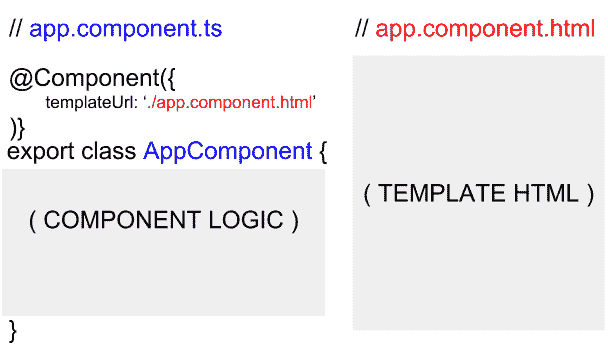

# 最好的角度例子

> 原文：<https://www.freecodecamp.org/news/the-best-angular-examples/>

Angular 是一个基于 TypeScript 的开源框架，用于开发前端 web 应用程序。它是 AngularJS 的继承者，所有提到 Angular 的地方都是指版本 2 和更高版本。Angular 具有泛型、静态类型等特性，还有一些 ES6 特性。

## 版本历史

谷歌在 2010 年 10 月 20 日发布了 AngularJS 的初始版本。AngularJS 的稳定发布是在 2017 年 12 月 18 日，版本 1.6.8。AngularJS 的最新重要版本 1.7 于 2018 年 7 月 1 日发布，目前处于 3 年长期支持期。Angular 2.0 于 2014 年 9 月 22 日在 ng-Europe 大会上首次公布。Angular 2.0 的一个新特性是动态加载，大部分核心功能被移到了模块中。

经过一些修改，Angular 4.0 于 2016 年 12 月发布。Angular 4 向后兼容 Angular 2.0，一些新特性是 HttpClient 库和新的路由器生命周期事件。2017 年 11 月 1 日发布的 Angular 5，其一大特色是支持渐进式 web apps。Angular 6 发布于 2018 年 5 月，Angular 7 发布于 2018 年 10 月。最新的稳定版本是 [7.0.0](https://angular.io/guide/releases) 。

## 装置

安装 Angular 最简单的方法是通过 [Angular CLI](https://cli.angular.io/) 。这个工具允许创建新的项目和生成组件、服务、模块等等，达到 Angular 团队认为是最佳实践的标准。

### 角度 2.x 及以上

#### 安装 Angular CLI

```
npm install -g @angular/cli
```

#### 创建工作区和初始应用程序

您可以在角度工作空间的环境中开发应用程序。工作区包含一个或多个项目的文件。项目是由一个应用程序、一个库或端到端(e2e)测试组成的一组文件。

```
ng new my-app
```

#### 为应用服务

Angular 包括一个服务器，以便您可以轻松地在本地构建和服务您的应用程序。

1.  导航至工作区文件夹(`my-app`)

使用带`--open`选项的 CLI 命令`ng serve`启动服务器

```
cd my-app
ng serve --open
```

万岁，你创建了你的第一个 angular 应用！！！

# 成分

Angular 包含许多用于建筑应用的*原理图*。组件就是这样一种示意图。它们包含与应用程序的单个部分相关的单个逻辑单元。组件通常与其他原理图配合使用，以便更有效地运行。

组件简化了应用程序。他们的主要目标是将逻辑集中到可视界面的一个部分。要一步一步地构建应用程序，您必须一个组件一个组件地构建。组件毕竟是 Angular 的构建模块。

### 组件类和元数据

CLI 命令`ng generate component [name-of-component]`产生以下内容。

```
import { Component, OnInit } from '@angular/core';

@Component({
  selector: 'app-example',
  templateUrl: './example.component.html',
  styleUrls: ['./example.component.css']
})
export class ExampleComponent implements OnInit {
  constructor() { }

  ngOnInit() { }
}
```

这是所有伟大组件的基本框架。装饰是最重要的部分。没有它，上面的例子就变成了一个泛型类。Angular 依靠 decorators 来辨别一个类的模式类型。

`@Component`将元数据作为单个对象接收。装饰者只是幕后的 JavaScript 函数。它们像元数据对象一样接受参数。元数据对象配置组件的基本依赖关系。每个字段都扮演一个角色。

*   `selector:`告诉 Angular 将组件与应用程序模板 HTML 中的某个元素相关联。
*   `templateUrl:`接受组件模板 HTML 的文件位置(这是显示数据的地方)。
*   接受样式表文件位置(字符串)的数组。这些样式表以组件的指定模板为目标。

把元数据想象成一大块配置。装饰器接受它，以便它可以生成特定于组件的数据。装饰器*用类行为所需的数据装饰底层类*。一个*组件就是*级。

默认情况下导出该类的签名，以便可以导入该组件。`ngOnInit`也得到实现。`implements`告诉类根据接口的定义来定义某些方法。`ngOnInit`是一个生命周期挂钩。

### 组件数据

数据驱动一切。组件也不例外。组件封装了它们所有的数据。要从外部接收数据，组件必须显式声明它。这种形式的隐私可以防止组件树中的信息冲突。

数据决定了组件类向其模板显示的内容。对类数据的任何更新都会(或者至少应该)更新模板显示。

组件通常会初始化一组存储数据的成员(或变量)。为了方便起见，它们在整个组件类逻辑中使用。这些信息推动了产生模板及其行为的逻辑。请参见下面的示例。

```
// ./components/example/example.component.ts

import { Component, OnInit } from '@angular/core';
import { Post, DATA } from '../../data/posts.data';

@Component({
  selector: 'app-example',
  templateUrl: './example.component.html'
})
export class ExampleComponent implements OnInit {
  username: string;
  totalPosts: number;
  allPosts: Post[];

  deletePost(index: number): void {
    this.allPosts.splice(index, 1);
    this.totalPosts = this.allPosts.length;
  }

  ngOnInit(): void {
    this.username = DATA.author;
    this.totalPosts = DATA.thePosts.length;
    this.allPosts = DATA.thePosts;
  }
}
```

```
<!-- ./components/example/example.component.html -->

<h1>{{ username }}</h1>
<span>Change Name: </span><input [(ngModel)]="username">
<h3>Posts: {{ totalPosts }}</h3>
<ul>
<hr/>
<div *ngFor="let post of allPosts; let i=index">
  <button (click)="deletePost(i)">DELETE</button>
  <h6>{{ post.title }}</h6>
  <p>{{ post.body }}</p>
  <hr/>
</div>
</ul>
```

注意组件与其数据交互的方式。它首先从`../../data/posts.data`获取它，然后开始将它转发给模板进行显示。

数据显示在整个模板中。在双花括号中，变量的值从组件类映射到括号中。`*ngFor`在`allPosts`类数组中循环。点击按钮通过索引从`allPosts`中删除特定元素。你甚至可以通过在输入框中输入来改变最顶端的`username`。

上述交互改变了组件类的数据，进而更新了组件的模板 HTML。组件提供了促进数据流动的主干逻辑。模板 HTML 使数据对用户可读。

## 数据绑定

数据通常定义了应用程序的外观。将数据解释到用户界面中涉及到类逻辑(`*.component.ts`)和模板视图(`*.component.html`)。Angular 通过数据绑定将它们连接起来。将数据绑定视为组件交互的工具。

### 组件和模板

组件将大部分逻辑和数据存储在用`@Component`修饰的类中。这个装饰器用模板 HTML 将类定义为一个组件。组件的模板表示应用程序中的类。这里的重点需要放在组件的类和模板 HTML 之间。

这就是数据绑定发生的地方。元素属性和事件获得指定的值。这些由组件类定义的值有两种作用。一个是生成模板随后接收的数据。另一个处理模板元素发出的事件。



### 元素属性

为了识别数据绑定元素属性，Angular 使用了特殊的括号语法。

```
// my.component.ts
@Component({
  templateUrl: './my.component.html'
})

export class MyComponent {
  value:type = /* some value of type */;
}
```

```
<!-- my.component.html -->
<any-element [property]=“value”>innerHTML</any-element>
```

在这一点上容忍我。

`[property]`镜像域对象模型(DOM)元素的对象节点中的属性。不要混淆对象属性和 DOM 元素的属性。属性(Properties)和特性(attributes)通常共享相同的名称，做相同的事情。然而，有一个明显的区别。

记住`attr` (attributes)是底层 DOM 对象的单个属性。它在 DOM 实例化时被声明，属性值与元素的定义相匹配。之后保持不变。每个属性在 DOM 对象节点中都有自己的键值字段。这些属性是可变的后实例化。

知道属性和性质的区别。这将有助于更好地理解 Angular 如何将数据绑定到属性(属性绑定)。Angular 几乎不会将数据绑定到元素的属性。例外情况非常罕见。最后一次:Angular 将组件数据绑定到属性，而不是属性！

回头参考这个例子，元素的属性赋值中的`[ … ]`有特殊的含义。括号显示`property`被绑定到赋值右边的`“value”`。

`value`在括号的上下文中也有特殊含义。`value`本身就是一个字符串文字。Angular 读取它并将其值与组件类成员进行匹配。Angular 将替换匹配成员属性的值。这当然是指托管模板 HTML 的同一个组件类。

数据从组件到模板的单向流动已经完成。括号内的产权转让对应的成员提供`value`。请注意，对组件类中成员值的更改会渗透到模板中。那是 Angular 的变化检测在起作用。模板范围内的更改对组件类成员没有影响。

要点:组件类提供数据，而模板显示数据。

我没有提到数据值也可以显示在组件的`innerHTML`中。最后一个例子实现了双花括号。Angular 识别这些括号，并将匹配的组件类数据插入到`div`的`innerHTML`中。

```
<div>The value of the component class member ‘value’ is {{value}}.</div>
```

### 事件处理

如果组件提供数据，则模板提供事件。

```
// my.component.ts
@Component({
  templateUrl: './my.component.html'
})

export class MyComponent {
  handler(event):void {
      // function does stuff
  }
}
```

```
// my.component.html
<any-element (event)=“handler($event)”>innerHTML</any-element>
```

这类似于属性绑定。

`(event)`属于任何有效的事件类型。例如，最常见的事件类型之一是`click`。当你*点击鼠标*时，它就会发出声音。不管是哪种类型，示例中的`event`都会绑定到`“handler”`。事件处理程序通常是组件类的成员函数。

`( … )`是有棱角的特殊。圆括号告诉 Angular 一个事件被有界到右边赋值的`handler`。事件本身源于宿主元素。

当事件发出时，它以`$event`的形式传递事件对象。`handler`映射到组件类的同名`handler`函数。从事件绑定元素到组件类的单向交换已经完成。

从处理程序发出事件虽然可能，但不会影响模板元素。绑定毕竟是单向的。

## 指令

指令是由 Angular 创建和识别的组件元素和属性。Angular 将元素或属性与其对应的类定义相关联。`@Directive`或`@Component`修饰这些类。两者都表示该类作为指令执行的角度。

一些指令修改宿主元素的样式。其他指令显示视图或作为嵌入视图插入到现有视图中。换句话说，它们改变了 HTML 的布局。

在任何情况下，指令都会通知 Angular 编译器。它们根据指令的类逻辑来标记要修改的组件。

### 结构指令

这里有三个结构指令的例子。每一个都有一个逻辑对应(`if`、`for`和`switch`)。

*   *ngIf
*   *适用于
*   *ngSwitchCase 和*ngSwitchDefault

****重要提示:**** 三者都可以通过`CommonModule`导入。它可以从`@angular/common`导入到应用程序的根模块中。

##### *ngIf

`*ngIf`测试一个给定值，基于 JavaScript 中的一般布尔求值，查看它是*真值*还是*假值*。如果为 the，则显示元素及其 innerHTML。否则，它们永远不会呈现到域对象模型(DOM)中。

```
<!-- renders “<h1>Hello!</h1>” -->
<div *ngIf="true">
  <h1>Hello!</h1>
</div>

<!-- does not render -->
<div *ngIf="false">
  <h1>Hi!</h1>
</div>
```

这是一个人为的例子。模板组件类中的任何成员值都可以替代`true`或`false`。

注意:您还可以使用*ngIf 执行以下操作来访问 observalbe 值

```
<div *ngIf="observable$ | async as anyNameYouWant">
  {{  anyNameYouWant }}
</div>
```

##### *适用于

`*ngFor`基于右赋值的循环，*微同步*表达式。Microsyntax 超出了本文的范围。要知道 microsyntax 是逻辑表达式的简称。它作为能够引用类成员值的单个字符串出现。它可以循环迭代值，这对`*ngFor`很有用。

```
<ul>
  <li *ngFor=“let potato of [‘Russet’, ‘Sweet’, ‘Laura’]; let i=index”>
      Potato {{ i + 1 }}: {{ potato }}
  </li>
  <!-- Outputs
  <li>
      Potato 1: Russet
  </li>
  <li>
      Potato 2: Sweet
  </li>
  <li>
      Potato 3: Laura
  </li>
  -->
</ul>
```

`[‘Russet’, ‘Sweet’, ‘Laura’]`是一个可迭代的值。数组是最常见的可迭代对象之一。`*ngFor`为每个数组元素抛出一个新的`<li></li>`。每个数组元素被赋予变量`potato`。这些都是利用 microsyntax 完成的。`*ngFor`定义了`ul`元素的结构内容。这是结构指令的特征。

注意:您还可以使用*ngFor 指令执行以下操作来访问 observalbe 值(hacky)

```
<div *ngFor="let anyNameYouWant of [(observable$ | async)]">
  {{  anyNameYouWant }}
</div>
```

##### *ngSwitchCase 和*ngSwitchDefault

这两个结构指令一起为模板 HTML 提供`switch`功能。

```
<div [ngSwitch]=“potato”>
  <h1 *ngSwitchCase=“‘Russet’”>{{ potato }} is a Russet Potato.</h1>
  <h1 *ngSwitchCase=“‘Sweet’”>{{ potato }} is a Sweet Potato.</h1>
  <h1 *ngSwitchCase=“‘Laura’”>{{ potato }} is a Laura Potato.</h1>
  <h1 *ngSwitchDefault>{{ potato }} is not a Russet, Sweet, nor Laura Potato.</h1>
</div>
```

只有一个`*ngSwitch…`表达式被渲染。注意包装开关的`div`元素中的`[ngSwitch]`属性。这沿着`*ngSwitch...`链传递了`potato`的值。这个结构指令链决定了呈现哪个`h1`元素。

因此，`[ngSwitch]`不像`*ngSwitch…`语句那样是一个结构指令。它传递值，而 switch 块决定 HTML 的最终布局。

请记住，样式化和值传递不是结构化指令的责任。这涉及到属性指令。结构指令只决定布局。

# 管道

输出数据转换确保数据在加载到用户屏幕上时是理想的格式。通常数据在幕后转换。使用管道，可以在模板 HTML 中转换数据。管道直接转换模板数据。

管道看起来很漂亮，也很方便。它们有助于保持组件的类没有基本转换。从技术上来说，管道封装了数据转换逻辑。

### 用例

Angular 预装了一套基本的管道。与他们中的几个人一起工作将会培养出处理其余问题的直觉。下面的列表提供了三个例子。

*   异步管道
*   数据管道
*   标题套管

##### 异步管道

这部分需要对承诺或可观察到的事物有一个基本的理解，才能完全领会。AsyncPipe 在这两者中的任何一个上运行。AsyncPipe 从承诺/可观察值中提取数据，作为下一步的输出。

对于 Obervables，AsyncPipe 自动订阅数据源。不管数据来自哪里，AsyncPipe 都订阅源可观察对象。`async`是 AsyncPipe 的语法名称，如下所示。

```
<ul *ngFor=“let potato of (potatoSack$ | async); let i=index”>
  <li>Potatoe {{i + 1}}: {{potato}}</li>
</ul>
```

在本例中，`potatoSack$`是一个等待上传土豆的可观察值。一旦土豆同步或异步到达，AsyncPipe 就以一个*可迭代*数组的形式接收它们。然后列表元素被土豆填满。

##### 数据管道

用 JavaScript `Date`对象格式化日期字符串需要相当多的时间。假设给定的输入是有效的时间格式，DatePipe 提供了一种强大的方法来格式化日期。

##### 标题套管

将文本转换为标题大小写。将每个单词的首字母大写，并将单词的其余部分转换为小写。单词由任何空白字符分隔，如空格、制表符或换行符。

```
// example.component.ts

@Component({
  templateUrl: './example.component.html'
})
export class ExampleComponent {
  timestamp:string = ‘2018-05-24T19:38:11.103Z’;
}
```

```
<!-- example.component.html -->

<div>Current Time: {{timestamp | date:‘short’}}</div>
```

上面`timestamp`的格式是[ISO 8601¹](https://en.wikipedia.org/wiki/ISO_8601)——不是最容易读懂的。DatePipe ( `date`)将 ISO 日期格式转换成更传统的`mm/dd/yy, hh:mm AM|PM`。还有许多其他格式选项。所有这些选项都在[官方文档](https://angular.io/api/common/DatePipe)中。

#### 创建管道

虽然 Angular 只有固定数量的管道，但`@Pipe` decorator 允许开发人员创建自己的管道。这个过程从`ng generate pipe [name-of-pipe]`开始，用一个更好的文件名替换`[name-of-pipe]`。该命令产生以下结果:

```
import { Pipe, PipeTransform } from ‘@angular/core’;

@Pipe({
  name: 'example'
})
export class ExamplePipe implements PipeTransform {
  transform(value: any, args?: any): any {
      return null;
  }
}
```

该管道样板简化了自定义管道的创建。装饰者告诉 Angular 这个类是一个管道。`name: ‘example’`的值，在这里是`example`，是 Angular 在扫描定制管道的模板 HTML 时识别的值。

关于类逻辑。`PipeTransform`实现为`transform`函数提供了指令。这个函数在`@Pipe`装饰器的上下文中有特殊的含义。默认情况下，它接收两个参数。

`value: any`是管道接收的输出。想到`<div>{{ someValue | example }}</div>`。someValue 的值被传递给`transform`函数的`value: any`参数。这是在 ExamplePipe 类中定义的同一个`transform`函数。

`args?: any`是管道可选接收的任何参数。想到`<div>{{ someValue | example:[some-argument] }}</div>`。`[some-argument]`可以用任何一个值代替。这个值被传递给`transform`函数的`args?: any`参数。也就是 ExamplePipe 的类中定义的`transform`函数。

无论函数返回什么(`return null;`)都会成为管道操作的输出。请看下一个例子，以了解 ExamplePipe 的完整示例。根据管道接收的变量，它会将输入大写或小写，作为新的输出。无效或不存在的参数将导致管道返回与输出相同的输入。

```
// example.pipe.ts

@Pipe({
  name: 'example'
})
export class ExamplePipe implements PipeTransform {
  transform(value:string, args?:string): any {
    switch(args || null) {
      case 'uppercase':
        return value.toUpperCase();
      case 'lowercase':
        return value.toLowerCase();
      default:
        return value;
    }
  }
}
```

```
// app.component.ts

@Component({
  templateUrl: 'app.component.html'
})
export class AppComponent {
  someValue:string = "HeLlO WoRlD!";
}
```

```
<!-- app.component.html -->

<!-- Outputs “HeLlO WoRlD!” -->
<h6>{{ someValue | example }}</h6>

<!-- Outputs “HELLO WORLD!” -->
<h6>{{ someValue | example:‘uppercase’ }}</h6>

<!-- Outputs “hello world!” -->
<h6>{{ someValue | example:‘lowercase’ }}</h6>
```

## 生命周期挂钩

生命周期挂钩是定时方法。它们的不同之处在于执行的时间和原因。变化检测触发这些方法。它们的执行取决于当前周期的条件。角度运行不断改变对其数据的检测。生命周期挂钩有助于管理其影响。

这些钩子的一个重要方面是它们的执行顺序。它从不偏离。它们根据检测周期产生的一系列可预测的负载事件来执行。这使得它们是可预测的。有些资产只有在某个钩子执行后才可用。当然，一个钩子只在当前变化检测周期中设定的特定条件下执行。

### 执行顺序:

### 恩贡昌斯

`ngOnChanges`绑定类成员`@Input`修改后触发。由`@Input()`装饰器绑定的数据来自外部来源。当外部源以可检测的方式改变数据时，它再次通过`@Input`属性。

有了这个更新，`ngOnChanges`立刻火了。它也在输入数据初始化时触发。钩子接收一个类型为`SimpleChanges`的可选参数。该值包含有关已更改的输入绑定属性的信息。

### 恩戈尼特

在组件的输入绑定(`@Input`)属性初始化时触发一次。下一个例子看起来与上一个相似。当 ChildComponent 接收输入数据时，挂钩不会触发。相反，它会在数据呈现到 ChildComponent 模板后立即触发。

### ngDoCheck

`ngDoCheck`在每个变更检测周期触发。角行程经常改变检测。执行任何动作都会导致它循环。`ngDoCheck`用这些周期点火。慎用。如果实施不当，可能会造成性能问题。

让开发人员手动检查他们的数据。他们可以有条件地触发新的申请日期。结合`ChangeDetectorRef`，开发人员可以为变更检测创建他们自己的检查。

### ngAfterContentInit

在组件的内容 DOM 初始化(首次加载)后触发。等待`@ContentChild(ren)`查询是钩子的主要用例。

查询产生内容 DOM 的元素引用。因此，在加载内容 DOM 之前，它们是不可用的。因此使用了`ngAfterContentInit`和它的对应词`ngAfterContentChecked`。

### ngAfterContentChecked

`ngAfterContentChecked`在针对内容 DOM 的每个更改检测周期后触发。这让开发人员可以更方便地处理内容 DOM 对变更检测的反应。`ngAfterContentChecked`如果实施不当，可能会频繁触发并导致性能问题。

在组件的初始化阶段也会触发。就在`ngAfterContentInit`之后。

### ngAfterViewInit

视图 DOM 完成初始化后触发一次。视图总是在内容之后加载。`ngAfterViewInit`等待`@ViewChild(ren)`的查询解决。这些元素是从组件的同一个视图中查询的。

在下面的示例中，查询了 BComponent 的`h3`头。`ngAfterViewInit`一旦查询结果可用就执行。

### ngAfterViewChecked

`ngAfterViewChecked`在针对组件视图的任何更改检测周期后触发。`ngAfterViewChecked`钩子让开发人员更容易理解变化检测如何影响视图 DOM。

### 恩贡德斯特罗伊

从视图和后续 DOM 中移除组件时触发。这个钩子提供了一个机会，可以在删除一个组件之前清理任何遗留问题。

## 视图

视图几乎就像它们自己的虚拟 DOM。每个视图都包含对 DOM 中相应部分的引用。视图中的节点反映了本部分中的内容。Angular 为每个 DOM 元素分配一个视图节点。每个节点都有一个对匹配元素的引用。

当 Angular 检查更改时，它会检查视图。Angular 避免引擎盖下的 DOM。视图代表它引用 DOM。还有其他机制可以确保视图变化呈现到 DOM 中。相反，对 DOM 的更改不会影响视图。

同样，视图在除 DOM 之外的所有开发平台上都是通用的。即使是为一个平台开发，视图仍然被认为是最佳实践。他们保证 Angular 对 DOM 有正确的解释。

第三方库中可能不存在视图。直接 DOM 操作是这种场景的一个出口。当然，不要期望应用程序能够跨平台运行。

### 视图类型

有两种主要类型的视图:嵌入视图和宿主视图。

还存在视图容器。它们包含嵌入视图和宿主视图，通常被称为简单的“视图”。

每个`@Component`类用 Angular 注册一个视图容器(view)。新组件生成一个针对特定 DOM 元素的定制选择器。视图会附加到该元素出现的任何位置。Angular 现在知道查看视图模型时零部件的存在。

### 主体视图和容器

主机视图*主机动态组件*。视图容器(视图)会自动附加到模板中已有的元素。视图可以附加到组件类特有的元素之外的任何元素。

想想传统的组件生成方法。首先创建一个类，用`@Component`修饰它，并填充元数据。这种方法适用于模板的任何预定义组件元素。

尝试使用 Angular 命令行界面(CLI)命令:`ng generate component [name-of-component]`。它产生以下结果。

```
import { Component, OnInit } from '@angular/core';

@Component({
  selector: 'app-example',
  templateUrl: './example.component.html',
  styleUrls: ['./example.component.css']
})
export class ExampleComponent implements OnInit {
  constructor() { }

  ngOnInit() { }
}
```

这就创建了带有选择器`app-example`的组件。这将视图容器附加到模板中的`<app-example></app-example>`。如果这是应用程序的根，它的视图将封装所有其他视图。从 Angular 的角度来看，根视图标志着应用程序的开始。

动态创建组件并在角度视图模型中注册它们需要一些额外的步骤。结构化指令帮助管理动态内容(`*ngIf, *ngFor, and *ngSwitch…`)。然而，指令不能扩展到更大的应用程序。太多的结构指令会使模板变得复杂。

这就是从现有的类逻辑实例化组件派上用场的地方。这些组件需要创建一个可以插入视图模型的主体视图。主体视图保存构件的数据，以便 Angular 识别它们的结构用途。

### 嵌入式视图

结构化指令在一大块 HTML 内容周围创建一个 [`ng-template`。指令的 host 元素附加了一个视图容器。这使得内容可以有条件地呈现到其预期的布局中。](https://angular.io/guide/structural-directives#the-asterisk--prefix)

`ng-template`包含表示 innerHTML 中每个元素的嵌入式视图节点。`ng-template`绝不是 DOM 元素。它会将自己注释掉。标签定义了其嵌入视图的范围。

实例化一个嵌入式视图除了它自己的引用之外不需要任何外部资源。`@ViewChild`查询可以获取这些信息。

有了模板引用，从它调用`createEmbeddedView`就可以了。引用的 innerHTML 成为它自己的嵌入视图实例。

在下一个例子中，`<ng-container></ng-container>`是一个视图容器。`ng-container`在编译时被注释掉，就像`ng-template`一样。因此，它为插入嵌入式视图提供了一个出口，同时保持 DOM 精简。

嵌入式视图模板插入到`ng-container`的布局位置。除了视图容器之外，这个新插入的视图没有额外的视图封装。请记住它与主机视图的不同之处(主机视图附加到它们的`ng-component`元素包装器)。

```
import { Component, AfterViewInit, ViewChild,
ViewContainerRef, TemplateRef } from '@angular/core';

@Component({
  selector: 'app-example',
  template: `
  <h1>Application Content</h1>
  <ng-container #container></ng-container> <!-- embed view here -->
  <h3>End of Application</h3>

  <ng-template #template>
    <h1>Template Content</h1>
    <h3>Dynamically Generated!</h3>
  </ng-template>
  `
})
export class ExampleComponent implements AfterViewInit {
  @ViewChild("template", { read: TemplateRef }) tpl: TemplateRef<any>;
  @ViewChild("container", { read: ViewContainerRef }) ctr: ViewContainerRef;

  constructor() { }

  ngAfterViewInit() {
    const view =  this.tpl.createEmbeddedView(null);
    this.ctr.insert(view);
  }
}
```

`@ViewChild`查询*模板参考变量*T1。这提供了一个`TemplateRef`类型的模板引用。`TemplateRef`持有`createEmbeddedView`功能。它将模板实例化为嵌入式视图。

`createEmbeddedView`的单个参数用于上下文。如果你想传入额外的元数据，你可以在这里作为一个对象。这些字段应该与`ng-template`属性(`let-[context-field-key-name]=“value”`)匹配。通过`null`表示不需要额外的元数据。

第二个`@ViewChild`查询提供了对`ng-container`的引用作为`ViewContainerRef`。嵌入式视图只附加到其他视图，而不是 DOM。`ViewContainerRef`引用嵌入视图中的视图。

嵌入式视图也可以插入到`<app-example></app-example>`的组件视图中。这种方法将视图定位在 ExampleComponent 视图的最末端。然而，在这个例子中，我们希望内容显示在`ng-container`所在的正中间。

`ViewContainerRef` `insert`函数*将*嵌入的视图插入`ng-container`。视图内容将 ups 显示在 ExampleComponent 视图中间的预定位置。

## 按指定路线发送

路由至关重要。许多现代 web 应用程序在一个页面上承载了太多的信息。用户也不必滚动浏览整个应用程序的内容。一个应用程序需要把自己分成不同的部分。一个可行的最佳实践是在一个单独的顶层模块中加载和配置路由器，该模块专用于路由并由根 AppModule 导入。

用户优先考虑必要的信息。路由帮助他们找到具有这些信息的应用部分。对其他用户有用的任何其他信息可能存在于完全独立的路径上。通过路由，两个用户都可以快速找到他们需要的东西。无关的细节隐藏在无关的路线后面。

路由擅长排序和限制对应用程序数据的访问。敏感数据不应向未经授权的用户显示。在每条路线之间，应用程序可能会介入。它可以检查用户的会话以进行身份验证。这种检查决定了该路线应该渲染什么。路由为开发人员提供了在继续之前验证用户的绝佳机会。

至于 Angular，routing 在框架内占据了自己的整个库。所有现代前端框架都支持路由，Angular 也不例外。路由发生在客户端，使用哈希或位置路由。两种风格都允许客户端管理自己的路由。在初始请求之后，不需要来自服务器的额外帮助。

### 基本路由

从`@angular/router`可用的`RouterModule`导出路由实用程序。它不是核心库的一部分，因为不是所有的应用程序都需要路由。引入路由的最传统方式是作为它自己的[功能模块](https://angular.io/guide/feature-modules)。

随着路由复杂性的增加，将它作为自己的模块将促进根模块的简单性。在不牺牲功能的情况下保持简单就是好的模块设计。

```
import { NgModule } from '@angular/core';
import { RouterModule, Routes } from '@angular/router';

import { AComponent } from '../../components/a/a.component';
import { BComponent } from '../../components/b/b.component';

// an array of soon-to-be routes!
const routes: Routes = [];

@NgModule({
  imports: [ RouterModule.forRoot(routes) ],
  exports: [ RouterModule ]
})
export class AppRoutingModule { }
```

`.forRoot(...)`是 RouterModule 类中可用的类函数。该函数接受一个由`Route`对象组成的数组作为`Routes`。`.forRoot(...)`为快速加载配置路由，而其替代`.forChild(...)`为慢速加载配置路由。

急切加载意味着路由从一开始就将其内容加载到应用程序中。延迟加载按需发生。本文的重点是急切加载。这是加载应用程序的默认方法。RouterModule 类定义类似于下一个代码块。

```
@NgModule({
  // … lots of metadata ...
})
export class RouterModule {
  forRoot(routes: Routes) {
    // … configuration for eagerly loaded routes …
  }

  forChild(routes: Routes) {
    // … configuration for lazily loaded routes …
  }
}
```

不要担心示例用注释省略的配置细节。现在有个大概的了解就行了。

注意 AppRoutingModule 是如何在导出 RouterModule 的同时导入它的。假定 AppRoutingModule 是一个特征模块，这是有意义的。它作为特征模块导入到根模块中。它向根组件树公开 RouterModule 指令、接口和服务。

这解释了为什么 AppRoutingModule 必须导出 RouterModule。这样做是为了根模块的底层组件树。它需要访问那些路由实用程序！

```
import { BrowserModule } from '@angular/platform-browser';
import { NgModule } from '@angular/core';

import { AppComponent } from './app.component';
import { AComponent } from './components/a/a.component';
import { BComponent } from './components/b/b.component';
import { AppRoutingModule } from './modules/app-routing/app-routing.module';

@NgModule({
  declarations: [
    AppComponent,
    AComponent,
    BComponent
  ],
  imports: [
    AppRoutingModule, // routing feature module
    BrowserModule
  ],
  providers: [],
  bootstrap: [ AppComponent ]
})
export class AppModule { }
```

适当的模块令牌从最顶端导入。它的令牌插入到根模块的导入数组中。根组件树现在可以利用 RouterModule 库。这包括已经提到的指令、接口和服务。非常感谢 AppRoutingModule 导出 RouterModule！

RouterModule 实用程序对于根的组件来说很方便。AppComponent 的基本 HTML 使用了一个指令:`router-outlet`。

```
<!-- app.component.html -->

<ul>
  <!-- routerLink(s) here -->
</ul>
<router-outlet></router-outlet>
<!-- routed content appends here (AFTER THE ELEMENT, NOT IN IT!) -->
```

`routerLink`是 RouterModule 的属性指令。一旦路线建立，它将连接到`<ul></ul>`的每个元素。`router-outlet`是一个行为有趣的组件指令。它更多地充当显示路由内容的标记。路由内容是导航到特定路线的结果。通常这意味着在适当的模块中配置一个单独的组件

路由的内容在`<router-outlet></router-outlet>`之后立即呈现。没有任何东西在里面渲染。这并没有造成太大的差别。也就是说，不要期望`router-outlet`表现得像一个路由内容的容器。它只是一个标记，用于将路由的内容附加到文档对象模型(DOM)中。

要解决的第一个问题是这个应用程序将使用什么路由？有两个组件:a 组件和 b 组件。每个人都应该有自己的路线。它们可以根据当前的路线位置从 AppComponent 的`router-outlet`进行渲染。

路由位置(或路径)通过一系列斜杠(`/`)定义了什么附加到一个[网站的起点](https://developer.mozilla.org/en-US/docs/Web/HTTP/Headers/Origin)(例如 [http://localhost:4200](http://localhost:4200/) )。

```
// … same imports from before …

const routes: Routes = [
  {
    path: 'A',
    component: AComponent
  },
  {
    path: 'B',
    component: BComponent
  }
];

@NgModule({
  imports: [ RouterModule.forRoot(routes) ],
  exports: [ RouterModule ]
})
export class AppRoutingModule { }
```

`http://localhost:4200/A`从 AppComponent 的`router-outlet`呈现一个组件。`http://localhost:4200/B`渲染 b 组件。您需要一种不使用地址栏就能到达这些位置的方法。应用程序不应该依赖网页浏览器的地址栏来导航。

全局 CSS(层叠样式表)补充了它下面的 HTML。应用程序的路由器链接应该有一个令人愉快的外观。这个 CSS 也适用于所有其他的例子。

```
/* global styles.css */

ul li {
  cursor: pointer;
  display: inline-block;
  padding: 20px;
  margin: 5px;
  background-color: whitesmoke;
  border-radius: 5px;
  border: 1px solid black;
}

ul li:hover {
  background-color: lightgrey;
}
```

```
<!-- app.component.html -->

<ul>
  <li routerLink="/A">Go to A!</li>
  <li routerLink="/B">Go to B!</li>
</ul>
<router-outlet></router-outlet>
```

这是基本路由！单击任何一个路由器链接元素都会路由网址。它会重新分配它，而不刷新 web 浏览器。Angular 的`Router`将路由地址映射到 AppRoutingModule 中配置的`Routes`。它将地址匹配到数组中单个`Route`对象的`path`属性。第一个匹配总是赢，所以匹配所有路线应该位于`Routes`数组的最末端。

匹配-所有路由防止应用程序在无法匹配当前路由时崩溃。这可以从地址栏中发生，用户可以在地址栏中键入任何路线。为此，Angular 提供了一个接受所有路由的通配符路径值`**`。此路径通常会呈现一个 PageNotFoundComponent 组件，显示“错误 404:找不到页面”。

```
// … PageNotFoundComponent imported along with everything else …

const routes: Routes = [
  {
    path: 'A',
    component: AComponent
  },
  {
    path: 'B',
    component: BComponent
  },
  {
    path: '',
    redirectTo: 'A',
    pathMatch: 'full'
  },
  {
    path: '**',
    component: PageNotFoundComponent
  }
];
```

包含`redirectTo`的`Route`对象阻止 PageNotFoundComponent 作为`http://localhost:4200`的结果进行渲染。这是应用程序的归途。为了解决这个问题，`redirectTo`将回家的路线改为`http://localhost:4200/A`。`http://localhost:4200/A`间接成为应用程序的新 home route。

`pathMatch: 'full'`告诉`Route`对象匹配归途(`http://localhost:4200`)。它与空路径相匹配。

这两个新的`Route`对象位于数组的末尾，因为第一次匹配获胜。最后一个数组元素(`path: '**'`)总是匹配的，所以它排在最后。

在继续之前，还有最后一件事值得一提。用户如何知道他或她在应用程序中相对于当前路线的位置？当然，可能有特定于路线的内容，但是用户应该如何建立这种联系呢？应该有某种形式的突出应用于路由器链接。这样，用户将知道哪个路由对于给定的网页是活动的。

这很容易解决。当你点击一个`routerLink`元素时，Angular 的`Router`将*焦点*分配给它。这种聚焦可以触发某些向用户提供有用反馈的样式。`routerLinkActive`指令可以为开发者追踪这个焦点。

```
<!-- app.component.html -->

<ul>
  <li routerLink="/A" routerLinkActive="active">Go to A!</li>
  <li routerLink="/B" routerLinkActive="active">Go to B!</li>
</ul>
<router-outlet></router-outlet>
```

`routerLinkActive`的右赋值表示一串类。这个例子只描述了一个类(`.active`)，但是可以应用任意数量的空格分隔的类。当`Router`将*焦点*分配给 routerLink 时，空格分隔的类应用于主机元素。当焦点转移时，这些类会自动移除。

```
/* global styles.css */

.active {
  background-color: lightgrey !important;
}
```

用户现在可以很容易地识别当前路线和页面内容是如何重合的。`lightgrey`高亮显示适用于匹配当前路线的路线链接。`!important`确保突出显示覆盖内嵌样式。