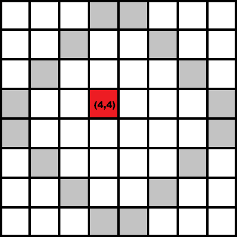

# 举例说明洪水填充算法

> 原文：<https://www.freecodecamp.org/news/flood-fill-algorithm-explained-with-examples/>

## 什么是洪水填充？

Flood fill 是一种算法，主要用于确定连接到多维数组中给定节点的有界区域。它与绘画程序中的桶工具非常相似。

该算法最接近的实现是基于堆栈的递归函数，这是我们接下来要讨论的。

### 它是如何工作的？

这个问题非常简单，通常遵循以下步骤:

1.  取起点的位置。
2.  决定你是要去 4 个方向( **N，S，W，E** )还是 8 个方向( **N，S，W，E，NW，NE，SW，SE** )。
3.  选择替换颜色和目标颜色。
4.  往那个方向走。
5.  如果你着陆的瓷砖是一个目标，用选择的颜色替换它。
6.  重复第 4 步和第 5 步，直到你到达边界内的所有地方。

让我们以下面的数组为例:



红色方块是起点，灰色方块是所谓的墙。

关于进一步的细节，下面是描述该函数的一段代码:

```
int wall = -1;

void flood_fill(int pos_x, int pos_y, int target_color, int color)
{

   if(a[pos_x][pos_y] == wall || a[pos_x][pos_y] == color) // if there is no wall or if i haven't been there
      return;                                              // already go back

   if(a[pos_x][pos_y] != target_color) // if it's not color go back
      return;

   a[pos_x][pos_y] = color; // mark the point so that I know if I passed through it. 

   flood_fill(pos_x + 1, pos_y, color);  // then i can either go south
   flood_fill(pos_x - 1, pos_y, color);  // or north
   flood_fill(pos_x, pos_y + 1, color);  // or east
   flood_fill(pos_x, pos_y - 1, color);  // or west

   return;

} 
```

如上图，我的出发点是(4，4)。在调用开始坐标 **x = 4** 和 **y = 4** 的函数后，我可以开始检查现场是否没有墙或颜色。如果这是有效的，我用一个**【颜色】**标记该点，并开始检查其他相邻的方块。

向南我们将到达点(5，4)，函数再次运行。

### 练习题

我一直认为使用新学到的算法解决一个(或多个)问题是完全理解这个概念的最好方法。

这里有一个:

**语句:**

在二维数组中，给你 n 个**【岛】**。试着找出一个岛的最大面积和对应的岛号。0 表示水，1 到 n 之间的任何其他 x 表示与岛屿 x 相对应的距离表面一个正方形。

**输入**

*   **n** -岛屿的数量。
*   **l，c** -矩阵的维数。
*   下一个 **l** 行， **c** 数字给出了矩阵的第 **l** 行。

**输出**

*   **i** -面积最大的岛的编号。
*   **A**—**I**th 岛的面积。

**例如:**

您有以下输入:

```
2 4 4
0 0 0 1
0 0 1 1
0 0 0 2
2 2 2 2 
```

你将得到 2 号岛，它是最大的岛，有 5 个正方形的面积。

### 暗示

这个问题很简单，但这里有一些提示:

```
1\. Use the flood-fill algorithm whenever you encounter a new island.
2\. As opposed to the sample code, you should go through the area of the island and not on the ocean (0 tiles). 
```