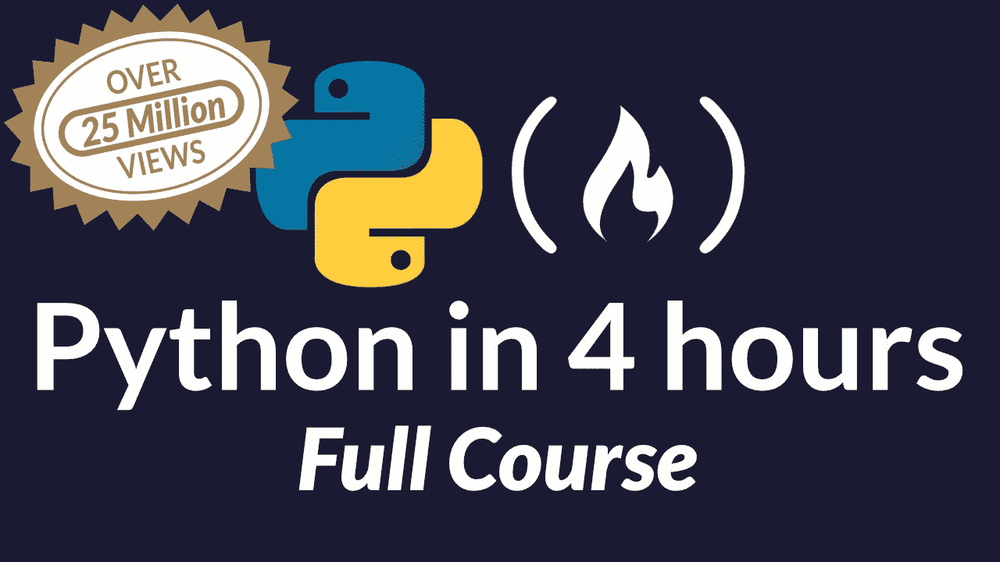

# 最好的 Python 教程

> 原文：<https://www.freecodecamp.org/news/best-python-tutorial/>

Python 是一种通用编程语言，它是动态类型化的、可解释的，并且以其可读性强、设计原则好而著称。

freeCodeCamp 有一个最受欢迎的 Python 课程。完全免费(甚至没有任何广告)。你可以在 YouTube 上看这个视频。



## **想了解更多信息？**

网络是一个很大的地方，还有很多可以探索的地方:

*   Python 练习册:[http://anandology.com/python-practice-book/index.html](http://anandology.com/python-practice-book/index.html)
*   想想 Python:[http://greenteapress.com/thinkpython/html/index.html](http://greenteapress.com/thinkpython/html/index.html)
*   实用商业巨蟒:[http://pbpython.com/](http://pbpython.com/)
*   另一门课程:[https://realpython.com/?utm*source = FSP&UTM*medium = promo&UTM _ campaign = best resources](https://realpython.com/?utm_source=fsp&utm_medium=promo&utm_campaign=bestresources)
*   将军:[https://www.fullstackpython.com/](https://www.fullstackpython.com/)
*   学习基础知识:[https://www.codecademy.com/learn/learn-python](https://www.codecademy.com/learn/learn-python)
*   使用 Python 的计算机科学:[https://www . EDX . org/course/introduction-computer-science-mitx-6-00-1x-11？ref=hackernoon#！](https://www.edx.org/course/introduction-computer-science-mitx-6-00-1x-11?ref=hackernoon#!)
*   学习 python 的更多资源列表:[https://github.com/vinta/awesome-python](https://github.com/vinta/awesome-python)
*   互动 Python:[http://interactive Python . org/rune stone/static/thinkcspy/index . html](http://interactivepython.org/runestone/static/thinkcspy/index.html)
*   Python 开发者指南:[https://devguide.python.org/](https://devguide.python.org/)

## **Python 是用来做什么的？**

Python 可以很容易地用于小型、大型、在线和离线项目。利用 Python 的最佳选择是 web 开发、简单的脚本和数据分析。下面是 Python 能让你做什么的几个例子:

##### **网页开发:**

您可以使用 Python 创建不同复杂程度的 web 应用程序。有许多优秀的 Python web 框架，包括 Pyramid、Django 和 Flask 等等。

##### **数据分析:**

Python 是许多数据科学家的首选语言。Python 在这个领域越来越受欢迎，因为有很多优秀的库专注于数据科学(其中 NumPy 和 Pandas 是最著名的两个)和数据可视化(如 Matplotlib 和 Seaborn)。Pyton 通过其众多可用的库，让数据处理变得有趣。Ipython with JupyterLab 是 python 的另一种形式，它改进了 Python 在数据科学领域的使用。

##### **自动化:**

Python 是一种非常灵活的语言，可用于自动化枯燥或重复的任务。系统管理员通常通过编写可以从终端轻松执行的脚本来使用它。Python 也可以用来创建自动完成我们一些日常任务的机器人。

##### **人工智能:**

Python 也广泛应用于不断发展的人工智能(AI)领域。Google 选择 Python 作为首批支持良好的编程语言之一，用于使用 Tensorflow 训练模型并与之交互。

#### **手机应用开发**

移动应用和游戏可以通过 python 使用 Kivy、Pygame 和 PyQt 来创建。

#### **安全和网络:**

Python 用于构建广泛使用的网络工具和安全工具。Python 的远程自动化对于框架的云测试来说是最安全、快速和高效的。这就是为什么专业开发人员使用 python 来制作最安全的框架和进行套接字编程。

##### **机器学习，深度学习**

Python 是最适合机器学习、深度学习和数据分析的语言之一，在所有这些领域都有一席之地。

有专门的语言最适合各种角色，如 R 和 MATLAB，但当涉及到应用程序的重叠领域时，python 轻而易举地胜出，因为它具有灵活性、快速原型和库的可用性。

#### **电报机器人开发**

你可以使用 Python 和一些 Python 库来开发你自己的[电报机器人](https://core.telegram.org/bots)。

#### **通过爬行和抓取收集数据**

Python 也可以用来解析页面的源代码和检索数据。使用一些 python 模块，比如 Scrapy 和 Selenium(对于一些使用 javascript 的页面)应该可以做到！

#### **Python 一般用于**

*   网络和互联网开发
*   教育进步
*   科学研究/计算
*   桌面开发
*   数值计算
*   软件开发
*   业务应用开发
*   机器学习
*   IOT
*   游戏开发
*   快速原型
*   浏览器自动化
*   数据分析
*   从网站抓取数据
*   图像处理

#### **一些关于 python 可用性的文章**

*   [Python 的 10 大用途](http://www.dummies.com/programming/python/10-major-uses-of-python/)
*   [Python 的应用](https://www.python.org/about/apps/)
*   [Python 语言用在哪里？](https://stackoverflow.com/questions/3043085/where-is-python-language-used)
*   [Python 是用来做什么的？](https://stackoverflow.com/questions/1909512/what-is-python-used-for)

python 的官方包索引是这里的。

## **应该用 Python 2 还是 Python 3？**

这两个版本相似。如果您知道其中一种，切换到另一种编写代码就很容易了。

*   2020 年后将不再维护 Python 2.x。
*   3.x 正在积极开发中。这意味着，例如，所有最近的标准库改进都只在 Python 3.x 中默认可用。
*   多年来，Python 生态系统积累了大量高质量的软件。在 3.x 中打破向后兼容性的缺点是，一些软件(尤其是公司内部的软件)仍然不能在 3.x 上工作。

## **安装**

大多数基于*nix 的操作系统都安装了 Python(通常是 Python 2，最近的是 Python 3)。不建议替换系统的默认 Python 安装，这可能会导致问题。然而，不同版本的 Python 可以安全地与系统的默认版本一起安装。参见 [Python 设置和使用](https://docs.python.org/3/using/index.html)。

Windows 没有附带 Python，但是安装程序和说明可以在[这里](https://docs.python.org/3/using/windows.html)找到。

## **Python 解释器**

Python 解释器是用来运行 Python 脚本的。

如果它可用并且在 Unix shell 的搜索路径中，可以通过键入命令`python`后跟脚本名来启动它。这将调用解释器并运行脚本。

`hello_campers.py`

```
print('Hello campers!')
```

从终端:

```
$ python hello_campers.py
Hello campers!
```

当安装了多个版本的 Python 时，可以根据安装配置按版本调用它们。在 Cloud9 IDE 定制环境中，可以像下面这样调用它们:

```
$ python --version
Python 2.7.6
$ python3 --version
Python 3.4.3
$ python3.5 --version
Python 3.5.1
$ python3.6 --version
Python 3.6.2 
$ python3.7 --version
Python 3.7.1
```

## **Python 解释器交互模式**

交互模式可以通过调用带有`-i`标志或不带任何参数的 Python 解释器来启动。

交互模式有一个提示，可以在其中输入和运行 Python 命令:

```
$ python3.5
Python 3.5.1 (default, Dec 18 2015, 00:00:00)
GCC 4.8.4 on linux
Type "help", "copyright", "credits" or "license" for more information.
>>> print("Hello campers!")
Hello campers!
>>> 1 + 2
3
>>> exit()
$
```

## **Python 之禅**

影响 Python 设计的一些原则作为复活节彩蛋包含在内，可以通过使用 Python 解释器交互模式中的命令来阅读:

```
>>> import this
The Zen of Python, by Tim Peters

Beautiful is better than ugly.
Explicit is better than implicit.
Simple is better than complex.
Complex is better than complicated.
Flat is better than nested.
Sparse is better than dense.
Readability counts.
Special cases aren't special enough to break the rules.
Although practicality beats purity.
Errors should never pass silently.
Unless explicitly silenced.
In the face of ambiguity, refuse the temptation to guess.
There should be one-- and preferably only one --obvious way to do it.
Although that way may not be obvious at first unless you're Dutch.
Now is better than never.
Although never is often better than *right* now.
If the implementation is hard to explain, it's a bad idea.
If the implementation is easy to explain, it may be a good idea.
Namespaces are one honking great idea -- let's do more of those!
```

## **Python 的利与弊**

### **优点**

1.  交互式语言，支持几乎所有功能的模块。
2.  开源:所以，你可以为社区做贡献，为将来使用和帮助他人而开发的功能
3.  很多好的解释器和笔记本可以提供更好的体验，比如 jupyter notebook。

#### **缺点**

1.  作为开源软件，多年来已经为相同的功能开发了许多不同的方法。这有时会给其他人阅读别人的代码造成混乱。
2.  这是一种缓慢的语言。所以这是一种非常不好的语言，不能用来开发通用算法。

## **文档**

[Python 有据可查](https://docs.python.org/3/)。这些文档包括教程、指南、参考资料和语言的元信息。

另一个重要的参考是 Python 增强提案( [PEPs](https://www.python.org/dev/peps/) )。PEPs 中包含了编写 Python 代码的风格指南， [`PEP 8`](https://www.python.org/dev/peps/pep-0008/) 。

## **调试**

内联`print`语句可用于简单的调试:

> 调试程序最快的方法通常是在源代码中添加一些打印语句:快速的编辑-测试-调试循环使得这种简单的方法非常有效。
> 
> [执行摘要](https://www.python.org/doc/essays/blurb/)

Python 还包括更强大的调试工具，例如:

*   记录模块， [*记录*](https://docs.python.org/3/library/logging.html)
*   调试模块，[*pdb*](https://docs.python.org/3/library/pdb.html)

请注意，这些是暂时存在的。

## 你好，世界！

回到文档中，我们可以读到 [Python 标准库](https://docs.python.org/3/library/index.html)的 [`print`](https://docs.python.org/3/library/functions.html#print) 函数，一个 [*内置函数*](https://docs.python.org/3/library/functions.html) 。

```
print(*objects, sep=' ', end='\n', file=sys.stdout, flush=False)
```

内置函数按字母顺序排列。该名称后面是带括号的形式参数列表，其中包含可选的默认值。下面是函数及其参数的简短描述，偶尔会有一个例子。

Python 3 中的 [`print`](https://docs.python.org/3/library/functions.html#print) 函数取代了 Python 2 中的 [`print`](https://docs.python.org/2/reference/simple_stmts.html#print) 语句。

```
>>> print("Hello world!")
Hello world!
```

当函数名后跟`()`时，调用该函数。为了你好世界！例如，调用 print 函数时，将一个字符串作为第一个参数的变量。对于其余参数，使用默认值。

我们调用`print`函数的参数是一个`str`对象或*字符串*，Python 的 [*内置类型*](https://docs.python.org/3/library/stdtypes.html#text-sequence-type-str) 之一。另外，python 最重要的一点是，你不必在声明变量时指定数据类型；python 的编译器会根据赋值的类型自己完成这项工作。

`objects`参数以一个`*`为前缀，表示该函数将接受该参数的任意数量的参数。