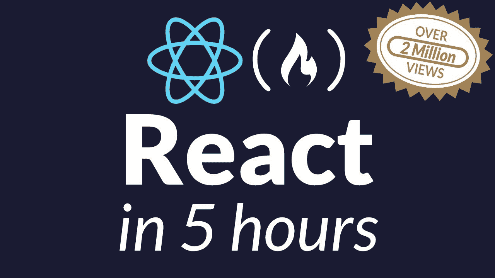

# 最佳 React 教程

> 原文：<https://www.freecodecamp.org/news/best-react-javascript-tutorial/>

React 是一个用于构建用户界面的 JavaScript 库。在 Stack Overflow 2017 年开发者调查的“框架、库和其他技术”类别中，它被评为最受喜爱的。

React 是一个 JavaScript 库，基于它构建的 React 应用程序运行在浏览器中，而不是在服务器上。这种类型的应用程序只在必要时与服务器通信，这使得它们比传统网站更快，传统网站迫使用户等待服务器重新呈现整个页面并将其发送到浏览器。

React 用于构建用户界面——用户在屏幕上看到的内容，以及使用 web 应用时与之交互的内容。这个界面被分割成组件，而不是一个巨大的页面，你把它分割成更小的称为组件的部分。更一般地说，这种方法被称为模块化。

*   它是声明性的:React 使用声明性范式，这使得对应用程序进行推理变得更加容易。
*   它是高效的:React 计算保持 DOM 最新所需的最小更改集。
*   而且它很灵活:React 可以与您已经知道的库和框架一起工作。

## 学习 React 的最佳教程

freeCodeCamp 在 YouTube 上有一个 [React 教程，可以在短短 5 个小时内教会你所有的基础知识。](https://www.youtube.com/watch?v=DLX62G4lc44)



我们还有一个更深入的中级 React 教程，教你如何使用 Firebase 构建一个完整的社交媒体 React 应用。它长达 12 个小时，如果你跟随它，你将会学到一大堆 React 的复杂性。

## **为什么学 React？**

React 涉及到组合，即许多组件将功能包装到一个封装的容器中。

许多流行的网站使用 React 实现 MVC 架构模式。脸书(部分)、Instagram(完全)、可汗学院(部分)、纽约时报(部分)、雅虎邮箱(完全)、Dropbox 的新照片和视频图库应用 Carousel(完全)是已知使用 React 的热门网站。

这些大型应用程序是如何使用 React 构建的？简单的答案是构建小型应用程序或组件。示例:

```
const Component2 = () => {
  return (
    <div></div>
  );
};
const Component3 = () => {
  return (
    <div></div>
  );
};
const Component1 = () => {
  return (
    <div>
      <Component2 />
      <Component3 />
    </div>
  );
};

ReactDOM.render(
  <Component1 />, 
  document.getElementById("app")
);
```

React 在很大程度上是声明性的，这意味着我们更关心做什么，而不是如何做一个特定的任务。

声明式编程是一种表达计算逻辑而不描述其控制流的编程范式。声明式编程有一定的优势，例如减少副作用(当我们修改任何状态或改变某些东西或发出 API 请求时发生)，最小化可变性(因为它的很多部分都是抽象的)，增强可读性，以及更少的错误。

React 也有单向数据流。React 中的 UI 其实就是状态的功能。这意味着当状态更新时，它也会更新 UI。所以我们的 UI 随着状态的变化而变化。

## **React 的优势**

使用 React 的一些原因是:

1.  很快。React 中的应用程序可以处理复杂的更新，并且仍然感觉快速响应。
2.  模块化。您可以编写许多较小的、可重用的文件，而不是编写大而密的代码文件。React 的模块化是 JavaScript 的可维护性问题的一个很好的解决方案。
3.  可扩展。显示大量变化数据的大型程序是 React 表现最好的地方。
4.  灵活。你可以将 React 用于与制作 web 应用无关的有趣项目。人们仍在研究 React 的潜力。还有探索的空间。

### **虚拟 DOM**

React 的魅力来自它对 DOM 的解释和创建 ui 的策略。

React 首先使用虚拟 DOM 来呈现 HTML 树。然后，每当一个状态改变，我们得到一个新的 HTML 树，需要被带到浏览器的 DOM，而不是写整个新树，React 只会写新树和前一个树之间的差异(因为 React 在内存中有两个树)。这个过程称为树协调。

### **对账**

React 有一个智能区分算法，它使用该算法只在其 DOM 节点中重新生成实际需要重新生成的内容，而其他内容保持不变。由于 React 的虚拟 DOM，这个不同的过程是可能的。

使用虚拟 DOM，React 在内存中保存最后一个 DOM 版本。当它将新的 DOM 版本带到浏览器时，新的 DOM 版本也将在内存中，因此 React 可以计算新旧版本之间的差异。

React 将指示浏览器只更新计算出的 diff，而不是整个 DOM 节点。无论我们重新生成界面多少次，React 只会给浏览器带来新的“部分”更新。

## **从零开始反应**

您想开始学习 react 的基础知识而不陷入创建开发环境的困境吗？如果你是 web 开发的新手，当你刚刚开始学习 React 时，建立一个开发环境可能会让你感到有点害怕。

在本文中，我们将了解如何开始使用 React，只使用文本编辑器和浏览器，不使用其他工具。

### **1 —用 Emmet** 设置锅炉板代码

让我们从第一步开始。我们将从浏览器中的一个名为“index.html”的文件开始。我们将从锅炉板 HTML 代码开始。作为一个快速的开始，我推荐使用 Emmet 和你有的任何文本编辑器。在第一行，输入`html:5`，然后按 shift 键得到下面的代码。或者您可以继续从下面复制并粘贴代码。

```
html:5
```

这将产生以下代码:

```
<!DOCTYPE html>
<html lang="en">
<head>
  <meta charset="UTF-8">
  <meta name="viewport" content="width=device-width, initial-scale=1.0">
  <meta http-equiv="X-UA-Compatible" content="ie=edge">
  <title>Document</title>
</head>
<body>

</body>
</html>
```

我们可以把标题填成“反应时间到了！”。

此内容不会出现在您的网页中。HTML 文件头部分的任何内容都是元数据，我们的浏览器将使用它来解释正文部分的代码。这个标题将会出现在我们页面的标签上，而不是真正出现在页面上。

### **2 -获取脚本标签以利用 React 和巴别塔库的能力**

好了，第一项从我们的清单上划掉了。让我们看看第二项。我们将通过使用脚本标签引入 React 和 Babel 来设置我们的开发人员环境。

这不是真实的开发环境。这将是一个相当复杂的设置。它还会给我们留下大量的模板代码和库，让我们远离学习 React 基础知识的主题。本系列的目标是复习 React 的基本语法并直接进入编码。我们将使用`<script>`标签引入 React 库、React DOM 库(为什么)和 Babel 库。

```
<head>
  ...
  <!-- REACT LIBRARY -->
  <script src="https://unpkg.com/react@15.5.4/dist/react.js"></script>
  <!-- REACT DOM LIBRARY -->
  <script src="https://unpkg.com/react-dom@15.5.4/dist/react-dom.js"></script>
  <!-- BABEL LIBRARY -->
  <script src="https://cdnjs.cloudflare.com/ajax/libs/babel-standalone/6.25.0/babel.min.js"></script>
  ...
  <title>Time to React!</title>
</head>
```

随着这些库的更新版本的出现，您可以自由地使用它们。他们不应该对我们报道的内容做任何突破性的改变。

我们在这里做什么？HTML `<script>`元素用于嵌入或引用一个可执行脚本。“src”属性指向 React 库、ReactDOM 库和 Babel 库的外部脚本文件。

这就像你有一把电动剃须刀。除非你能把电动剃须刀插在墙上通电，否则不管它有多漂亮，对你来说都毫无用处。如果我们的浏览器不能插入这些库来理解和解释我们要做的事情，那么我们将要编写的 React 代码将毫无用处。

这就是我们的应用程序将如何获得 React 的能力，这将是我们将 React 插入 Dom 的方式。我们将 React 和 ReactDOM 作为两个不同的库，因为有 React Native 这样的用例，移动开发不需要渲染到 DOM，所以库被拆分，这样人们可以根据他们正在进行的项目来决定他们需要什么。

因为我们将需要 React 来创建 DOM，所以我们将使用这两个脚本。Babel 是我们如何利用 ES5 之外的 ECMA 脚本，并处理我们将在 React 中使用的称为 JSX (JavaScript as XML)的东西。我们将在下一节中深入探讨巴别塔的魔力:)

好了，我们已经完成了第 1 步和第 2 步。我们已经建立了我们的锅炉板代码，并建立了我们的开发环境。

### **3 -渲染对 DOM 的反应**

我们接下来的两步将是在 DOM 中选择我们想要呈现 React 内容的位置。我们将为正文中的 React 内容使用另一个脚本标记。一般来说，作为一个良好的关注点分离实践，这将在它自己的文件中，然后链接到这个 html 文档。我们将在接下来的章节中介绍这一点。现在，我们让它停留在我们当前所在的 html 文档的主体中。

现在我们来看看在 DOM 上选择一个位置来呈现我们的 React 内容是多么简单。我们会进入身体内部。最佳实践不仅仅是将 React 放入要显示的 body 标记中，而是创建一个单独的元素，通常是一个 div，您可以将它作为根元素来插入 React 内容。

```
<body>
  <div id="app">React has not rendered yet</div>
</body>
```

我们将创建一个简单的`<div>`元素，并给它一个 id“app”。我们将能够定位这个位置来插入我们的 React 内容，就像您可以使用 CSS 来定位一个您选择的样式的 id 一样。任何 react 内容都将在 id 为 app 的 div 标记中呈现。与此同时，我们会留下一些文字说“反应还没有渲染”。如果我们在预览页面时看到这个，这意味着我们错过了渲染反应。

现在，让我们继续在我们的主体中创建一个脚本标记，我们将在这里第一次使用 React 创建。我们脚本标签需要的语法是添加一个“type”属性。这指定了脚本的媒体类型。上面我们使用了一个 src 属性，它指向 React 库、ReactDOM 库和 Babel 库的外部脚本文件。

```
<body>
  <div id="app">React has not rendered yet</div>
  <script type="text/babel">
  </script>
</body>
```

我们使用的脚本的“类型”将用引号括起来，并设置为`"text/babel"`。当我们和 JSX 合作时，我们需要马上使用巴贝尔的能力。

首先，我们将渲染 DOM 的 React。我们将使用`ReactDOM.render()`方法来做到这一点。这将是一个方法，记住方法只是一个附加在对象上的函数。这个方法需要两个参数。

```
<body>
  <div id="app">React has not rendered yet</div>
  <script type="text/babel">
  ReactDOM.render(React What, React Where);
</script>
</body>
```

第一个争论是反应的“什么”。第二个参数是您希望它在 DOM 中放置的“位置”。让我们从调用 ReactDOM.render()方法开始。我们的第一个论点是我们的 JSX。

```
<body>
  <div id="app">React has not rendered yet</div>
  <script type="text/babel">
  ReactDOM.render(
    <h1>Hello World</h1>, 
    React Where
  );
</script>
</body>
```

[官方 react 文档声明](https://reactjs.org/docs/introducing-jsx.html):“这个有趣的标签语法既不是字符串也不是 HTML。它被称为 JSX，是 JavaScript 的语法扩展。我们建议将它与 React 一起使用来描述 UI 应该是什么样子。JSX 可能会让你想起模板语言，但它具有 JavaScript 的全部功能。JSX 产生“元素反应”。"

很多时候，JSX 让已经开发了一段时间的人感到害怕，因为它看起来像 HTML。在很小的时候，开发人员就被教导关注点分离。HTML 有它的位置，CSS 有它的位置，JavaScript 有它的位置。JSX 似乎模糊了界限。你使用的看起来像 HTML，但正如脸书所说，它具有 JavaScript 的全部功能。

这可能会吓坏老手，所以许多 React 教程开始时没有 JSX，这可能相当复杂。我们不会那么做的。因为这篇文章是针对那些事业上非常年轻的人的，所以当你看到这个语法时，你可能不会感到危险。

JSX 非常直观。您可能很容易阅读这段代码，并看到这将是显示文本“Hello World”的最大的 header 标记。没有神秘感，非常简单。现在，让我们看看第二个论点是什么。

```
<body>
  <div id="app">React has not rendered yet</div>
  <script type="text/babel">
    ReactDOM.render(
      <h1>Hello World</h1>, 
      document.getElementById("app")
    );
  </script>
</body>
```

这是我们希望 React 内容呈现给 DOM 的地方。你可能在过去已经这样做过很多次了。我们只需输入`document.getElementById()`。我们将进入应用程序 id 的讨论。就是这样。我们现在将把 id 为 app 的 div 作为目标来插入我们的 React 内容。

我们希望确保我们的内容得到保存。继续在浏览器中打开它，你应该会看到“Hello World”。您可能已经猜到，使用 React 不是创建 Hello World 应用程序的最快或最好的方式。我们还没有看到它的好处。但是现在，我们知道一切都在运转。

继续打开控制台，查看“元素”。你可以在 Mac 上用 command + shift + j 或者在 Windows 和 Linux 上用 Ctrl + Shift + J

如果你点击 head 标签，我们可以看到我们包含的脚本库。然后我们可以深入到文档的主体。让我们点击 id 为“app”的 div。当我们这样做时，我们会看到我们的`<h1>`标签，内容为“Hello World”。

[点击](https://github.com/robgmerrill/hello-react/blob/master/section-one/index.html)查看全部代码。

### **重述**

让我们快速回顾一下。在我们的 head 标签中，我们抓取了 React、ReactDOM 和 Babel 的脚本标签。这些是我们的浏览器在元数据中需要的工具，用来读取我们的 React 代码和 JSX。

然后，我们通过创建一个 id 为“app”的元素 div，在 DOM 中找到想要插入 React 的位置。

接下来，我们创建了一个脚本标签来输入我们的 React 代码。我们使用了带有两个参数的 ReactDOM.render()方法。React 内容的“什么”,在本例中是我们的 JSX，第二个参数是您希望将 React 内容插入 DOM 的“位置”。在这种情况下，它是 id 为“app”的位置。

作为 JSX 的替代方案，你可以像 Babel 一样使用 ES6 和 Javascript 的编译器。[https://babeljs.io/](https://babeljs.io/)

## **安装 React**

### **创建新的 React 项目**

你可以把 React 库嵌入到你的网页中，就像这样:

```
<script src="https://cdnjs.cloudflare.com/ajax/libs/react/16.0.0/cjs/react.production.min.js"></script>
```

聪明的程序员希望采取更实际、更高效的方式:[创建 React App](https://github.com/facebookincubator/create-react-app)

```
npm install -g create-react-app
create-react-app my-app

cd my-app
npm start
```

这将设置您的开发环境，以便您可以使用最新的 JavaScript 特性，提供良好的开发人员体验，并为生产优化您的应用程序。

`npm start`将启动一个开发服务器，允许实时重装 ³ 。

在您完成项目并准备好将您的应用程序部署到生产环境后，您可以使用`npm run build`在`build`文件夹中创建应用程序的优化版本。

## **你的第一个 React 应用**

### **安装**

如前一节(安装)所述，运行`Create React App`工具。一切完成后，将`cd`放入应用程序的文件夹中并运行`npm start`。这将启动一个开发服务器，您就可以开始开发您的应用程序了！

```
npm install -g react-create-app
create-react-app my-first-app

cd my-first-app
npm start
```

### **编辑代码**

启动您选择的编辑器或 IDE，编辑`src`文件夹中的`App.js`文件。当用`react-create-app`工具创建时，这个文件中已经有一些代码了。

该代码将由以下部分组成:

#### **进口**

```
import React, { Component } from 'react';
import logo from './logo.svg';
import './App.css';
```

这被 [webpack](https://webpack.js.org/) 用来导入所有需要的模块，以便您的代码可以使用它们。这段代码导入了 3 个模块:

1.  `React`和`Component`，它们允许我们按照应该的方式使用 React。(带组件)
2.  `logo`，它允许我们在这个文件中使用`logo.svg`。
3.  `./App.css`，导入该文件的样式表。

#### **类别/组件**

```
class App extends Component {
  render() {
    return (
      <div className="App">
        <header className="App-header">
          
          <h1 className="App-title">Welcome to React</h1>
        </header>
        <p className="App-intro">
          To get started, edit <code>src/App.js</code> and save to reload.
        </p>
      </div>
    );
  }
}
```

React 是一个利用组件的库，它允许你把你的 UI 分割成独立的、可重用的部分，并且独立地考虑每一部分。已经创建了 1 个组件，即`App`组件。如果你使用了`create-react-app`工具，这个组件是项目中的主要组件，你应该围绕这个中心类来构建。

我们稍后将更详细地了解组件。

#### **出口**

当在 React 中创建一个类时，应该在声明后导出它们，这允许您通过使用`import`关键字在另一个文件中使用组件。您可以在`export`关键字后使用`default`来告诉 React 这是该文件的主类。

```
export default App;
```

### **查看结果！**

当您通过发出`npm start`命令启动开发服务器时，您可以在浏览器中实时查看您添加到项目中的更改。发出命令后，npm 应该会打开一个浏览器，自动显示您的应用程序。

## **反应成分**

组件在 React 中是可重用的。您可以为道具注入价值，如下所示:

```
function Welcome(props) {
  return <h1>Hello, {props.name}</h1>;
}

const element = <Welcome name="Faisal Arkan" />;
ReactDOM.render(
  element,
  document.getElementById('root')
);
```

`name="Faisal Arkan"`将从`function Welcome(props)`给`{props.name}`赋值，并在`name="Faisal Arkan"`返回已经给定值的组件。之后，react 会将元素呈现为 HTML。

### **声明组件的其他方式**

使用 React 时，有许多方法可以声明组件。有两种组件， *****无状态***组件和 *****有状态***** 组件。**

### **有状态**

#### **类类型组件**

```
class Cat extends React.Component {
  constructor(props) {
    super(props);

    this.state = {
      humor: 'happy'
    }
  }
  render() {
    return(
      <div>
        <h1>{this.props.name}</h1>
        <p>
          {this.props.color}
        </p>
      </div>
    );
  }
}
```

### **无状态组件**

#### **功能组件(来自 ES6 的箭头功能)**

```
const Cat = props => {
  return (  
    <div>
      <h1>{props.name}</h1>
      <p>{props.color}</p>
    </div>;
  );
};
```

#### **隐式返回组件**

```
const Cat = props => 
  <div>
    <h1>{props.name}</h1>
    <p>{props.color}</p>
  </div>;
```