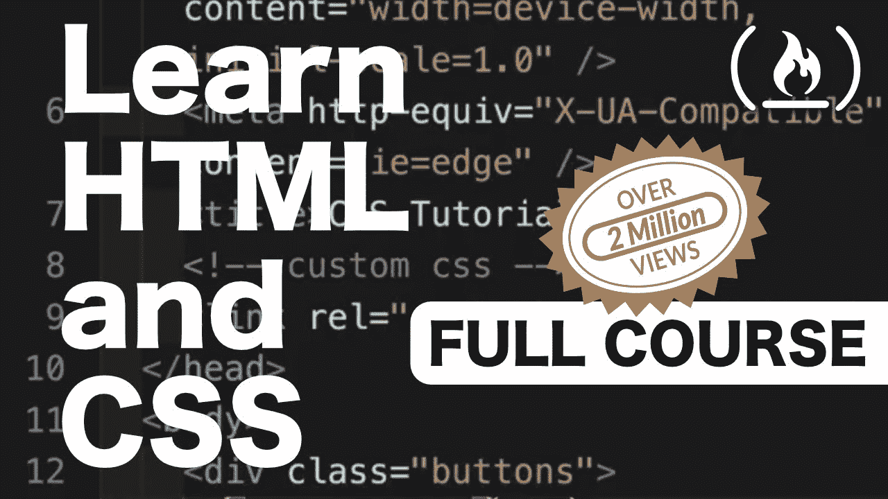

# 最好的 CSS 和 CSS3 教程

> 原文：<https://www.freecodecamp.org/news/best-css-and-css3-tutorial/>

### **层叠样式表(CSS)**

CSS 是级联样式表的缩写。它最早发明于 1996 年，现在是所有主流网络浏览器的标准功能。

CSS 允许开发者通过“设计”网页的 HTML 结构来控制网页的外观。

CSS 规范由[万维网联盟(W3C)](https://www.w3.org/) 维护。

你可以单独用 CSS 构建一些非常令人惊奇的东西，比如这个纯 CSS [扫雷游戏](https://codepen.io/bali_balo/pen/BLJONk)(它不使用 JavaScript)。


一个好的开始是 freeCodeCamp 课程[基础 CSS 介绍](https://learn.freecodecamp.org/responsive-web-design/basic-css)。

给初学者的另一个建议是 W3C 的从 HTML + CSS 开始的[，它教导如何创建一个样式表。](https://www.w3.org/Style/Examples/011/firstcss)

网站 [CSS Zen Garden](http://www.csszengarden.com/) 是一个很好的例子，说明了如何将相同的 html 设计成完全独特的样式。

为了展示 CSS 的威力，请查看中的[物种。](http://species-in-pieces.com/#)

# 从 CSS 和 CSS3 开始的教程

学习 CSS 的最佳起点是 freeCodeCamp 的 [2 小时 CSS 入门教程](https://www.youtube.com/watch?v=ieTHC78giGQ)。

然后，如果你感觉更有冒险精神，我们有完整的 [12 小时课程，详细涵盖 HTML、HTML5 和 CSS](https://www.youtube.com/watch?v=mU6anWqZJcc)。



## **柔性盒**

Flexbox 是一种在 CSS3 中构建内容的新方法。它提供了一种创建响应性网站的好方法，这种网站可以在不同的屏幕尺寸和订单内容上很好地工作。

使用 Flexbox 有 3 个简单的步骤:

1.  使用`display: flex;`将父容器转换为 flex 容器
2.  使用`flex-direction`调整不同容器的布局
3.  通过使用类似于`justify-content`、`align-items`等属性来调整容器内项目的布局

Flexbox 允许您有效地布局、对齐和调整不同页面元素之间的空间，即使您不知道它们的确切大小。相反，项目和容器是动态的，会“伸缩”以最好地填充可用空间。

*   ****主轴**** :一个伸缩容器的主轴，伸缩项目沿着这个主轴布局。请记住，这可以是水平的，也可以是垂直的，具体取决于`flex-direction`属性。
*   ****main-start | main-end****:**Flex 项目从`main-start`到`main-end`放置在一个容器中。**
*   ****:柔性项目的主要尺寸，可以是宽度，也可以是高度，作为项目的主要尺寸。****
*   ********横轴**** :垂直于主轴的轴。横轴的方向取决于主轴的方向。****
*   ******交叉开始|交叉结束**** :从`cross-start`侧到`cross-end`侧，将柔性线和项目放入柔性容器中。**
*   ****:项目的横向尺寸(宽度或高度)作为项目的横向尺寸。****

## ******网格布局******

****CSS 网格布局，简称 Grid，是 CSS 中最新最强大的一种布局方案。所有主流浏览器都支持它，它提供了一种在页面上定位和移动项目的方法。****

****它可以自动将项目分配到*区域*，调整它们的大小，根据您定义的模式创建列和行，并且它使用新引入的`fr`单元进行所有计算。****

### ******为什么网格？******

*   ****你可以很容易地用一行 CSS 创建一个 12 列的网格。`grid-template-columns: repeat(12, 1fr)`****
*   ****网格可以让你向任何方向移动物体。与 Flex 不同，在 Flex 中你可以水平(`flex-direction: row`)或垂直(`flex-direction: column`)移动项目，但不能同时移动两者——Grid 允许你将任何*网格项目*移动到页面上任何预定义的*网格区域*。您移动的项目不必相邻。****
*   ****有了 CSS Grid，你可以 ****只使用 CSS**** 改变 HTML 元素的顺序。将某些内容从顶部移动到右侧，将页脚中的元素移动到侧边栏等等。不用在 HTML 中将`<div>`从`<footer>`移动到`<aside>`，只需在 CSS 样式表中用`grid-area`改变它的位置。****

### ****网格与伸缩****

*   **Flex 是一维的——水平或垂直，而 Grid 是二维的，这意味着您可以在水平和垂直平面上移动元素**
*   **在 Grid 中，我们将布局样式应用于父容器，而不是项目。另一方面，Flex 以 flex 项为目标来设置属性，如`flex-basis`、`flex-grow`和`flex-shrink`**
*   **Grid 和 Flex 并不相互排斥。您可以在同一个项目中使用这两种方法。**

### ****检查浏览器与`@supports`** 的兼容性**

**理想情况下，当你建立一个网站时，你应该用 Grid 设计它，并使用 Flex 作为后备。你可以用`@support` CSS 规则(又名特征查询)来发现你的浏览器是否支持网格。这里有一个例子:**

```
`.container {
  display: grid; /* display grid by default */
}

@supports not (display: grid) { /* if grid is not supported by the browser */
  .container {
    display: flex; /* display flex instead of grid */
  }
}`
```

### ****入门****

**要使任何元素成为网格，您需要将它的`display`属性赋给`grid`，就像这样:**

```
`.conatiner {
  display: grid;
}`
```

**仅此而已。你刚刚做了一个网格。`.container`中的每一个元素都会自动变成一个网格项目。**

### ****定义模板****

**行和列**

```
`grid-template-columns: 1fr 1fr 1fr 1fr;
grid-template-rows: auto 300px;`
```

**区域**

```
`grid-template-areas: 
  "a a a a"
  "b c d e"
  "b c d e"
  "f f f f";`
```

**或者**

```
`grid-template-areas:
  "header header header header"
  "nav main main sidebar";`
```

### ****网格区域****

**下面是一些关于如何定义和分配网格区域的示例代码:**

```
`.site {
  display: grid;
  grid-template-areas: /* applied to grid container */
    "head head" /* you're assigning cells to areas by giving the cells an area name */
    "nav  main" /* how many values kind of depends on how many cells you have in the grid */
    "nav  foot";
}

.site > header {
  grid-area: head;
}

.site > nav {
  grid-area: nav;
}

.site > main {
    grid-area: main;
}

.site > footer {
    grid-area: foot;
}`
```

### ****`fr`单位****

**网格引入了一个新的`fr`单位，代表*分数*。使用`fr`单元的好处是它会为您处理计算。使用`fr`可以避免边距和填充问题。有`%`和`em`等。计算`grid-gap`时就变成了数学方程式。如果您使用了`fr`单元，它将自动计算列和装订线的大小，并相应地调整列的大小。另外，在结尾也不会有出血的间隙。**

## **例子**

#### ****根据屏幕尺寸改变元素的顺序****

**假设你想在小屏幕上把页脚移到底部，在大屏幕上移到右边，在这两者之间有一堆其他的 HTML 元素。**

**简单的解决方法是根据屏幕尺寸改变`grid-template-areas`。您也可以根据屏幕尺寸 ****改变列数和行数**** 。这是 Bootstrap 的网格系统(`col-xs-8 col-sm-6 col-md-4 col-lg-3`)的一个更干净、更简单的替代方案。**

```
`.site {
  display: grid;
  grid-template-columns: 1fr 1fr;
  grid-template-areas:
    "title title"
    "main header"
    "main sidebar"
}

@media screen and (min-width: 34em) { /* If the screen is big enough, use a different template for grid areas */
  .site {
    grid-template-columns: 2fr 1fr 1fr;
    grid-template-areas:
      "title title title"
      "main header header"
      "main sidebar footer"
  }
}`
```

#### ****更多信息:****

*   **由 Mozilla 开发的 CSS Grid playground:如果你是 CSS Grid 的新手，这是一个很好的起点。它有视觉效果来帮助你容易地理解术语**
*   **[YouTube:Morten Rand-hendrik sen:CSS Grid 改变了一切(关于网页布局)](https://www.youtube.com/watch?v=txZq7Laz7_4):这个演示会在不到一个小时的时间里说服你为什么 CSS Grid 很酷，为什么/如何使用它们。**
*   **视频:Rachel Andrew 的学习网格布局视频系列 : Rachel Andrew 是这方面的专家。视频标题可能看起来很奇怪，让人不知所措，但内容简短扼要**
*   **[书:准备好 CSS 网格布局，作者瑞秋·安德鲁](https://abookapart.com/products/get-ready-for-css-grid-layout)**

# ****选择器****

**选择器是针对 HTML 元素应用样式的 CSS 规则。标签名、类名、id 和属性是一些用作选择器的钩子。**

## ****选择器语法****

**以特定顺序排列的选择器建立了一个指向目标元素的规则。一个例子:**

```
`/* selects anchor tags */
a { 
    color: orange;
}

/* selects elements with hero class */
.hero {
    text-align: center;
}`
```

## ****选择器类型****

*   **TypeDescription 是类型选择器，标记名用于选择元素，如`h1`或`a`。**
*   **通用选择器适用于所有元素。**
*   **`div *`匹配 div 元素中的所有元素。**
*   **属性选择器是根据元素的属性[以及可选的值]定位元素的选择器。**
*   **`h1[title]`选择具有`title`属性的`h1`元素。**
*   **类选择器是使用类名定位元素的选择器。**
*   **ID 选择器是使用 ID 来定位元素的选择器。`#logo`选择 ID 为`logo`的元素。**
*   **伪类选择器是特殊的选择器，它根据元素的状态来定位元素。当指针悬停在链接上时，选择器应用样式。**

## ****选择器组合子****

**组合子:目的`white space`后代组合子。`.nav li`选择类`.nav`中的所有`li`孩子，包括嵌套的`li`元素。`>`子组合子。`.menu > li`选择所有 li，它们是具有`.menu`类的元素的直接子元素。`+`相邻同胞组合子。`.logo + h1`的目标是`h1`，它是`.logo`类的直接兄弟。`~`一般兄弟组合子。`header ~ div`以`div`元素为目标，这些元素是`header`元素的同级。**

**本节详细介绍了所有这些选举人。**

#### ****更多信息:****

**您可以在以下资源中了解有关选择器的更多信息:**

*   **[官方 CSS3 选择器规格](https://www.w3.org/TR/css3-selectors)**
*   **Mozilla 开发者网络上的选择器页面**
*   **[自由代码营指南上的 CSS 选择器备忘单](https://guide.freecodecamp.org/css/tutorials/css-selectors-cheat-sheet)**

**CSS(级联样式表)中的选择器是基于*特异性确定的。*有了这个，我们可以更加具体地定义我们的样式规则，并覆盖其他可能针对相同元素但不那么具体的规则。**

**这种特异性层次的工作方式是基于权重的。这意味着元素选择器的权重为 1(一)，类选择器的权重为 10(十)，id 选择器的权重为 100(一百)。我们可以将不同的选择器组合在一起，更具体地选择我们想要改变的元素。**

**举个例子:**

```
 `p {
      color: blue;
    }
    p .red {
       color: red;
    }`
```

**我们的类型选择器 p 将选择 html 文档中的所有 p 元素，但是它只有一个权重。相比之下，类选择器的权重为 11，因为我们将一个类型选择器与一个类选择器组合在一起(这个选择器将所有 p 元素与一个 red 类匹配)。**

**注意:**

*   **直接定位的规则总是优先于从其祖先继承元素的规则。**
*   **只有当多个声明以同一个元素为目标时，特异性才适用，并且只有在那时才适用这条规则。**
*   **特殊性通常是一些样式规则不能应用于元素的原因。**

## ****CSS 显示****

**display 属性指定用于 HTML 元素的框的类型。它有 20 个可能的关键字值。常用的有:**

```
 `.none             {display: none}
    .block            {display: block}
    .inline-block     {display: inline-block}
    .inline           {display: inline}
    .flex             {display: flex}
    .inline-flex      {display: inline-flex}
    .inline-table     {display: inline-table}
    .table            {display: table}
    .inherit          {display: inherit}
    .initial          {display: initial}`
```

**当使网站具有响应性时,`display:none`属性通常会很有帮助。例如，当屏幕尺寸缩小时，您可能想要隐藏页面上的元素，以弥补空间的不足。`display: none`不仅会隐藏该元素，而且页面上的所有其他元素都将表现得好像该元素不存在一样。**

**这是该属性与`visibility: hidden`属性的最大区别，后者隐藏元素，但将所有其他页面元素保持在相同的位置，就像隐藏元素可见时一样。**

**这些关键字值分为六类:**

*   **`<display-inside>`**
*   **`<display-outside>`**
*   **`<display-listitem>`**
*   **`<display-box>`**
*   **`<display-internal>`**
*   **`<display-legacy>`**