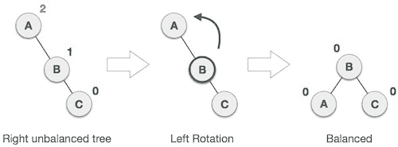
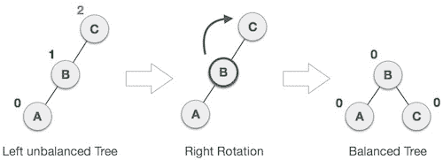

# AVL 树插入、旋转和平衡因子解释

> 原文：<https://www.freecodecamp.org/news/avl-tree-insertion-rotation-and-balance-factor/>

## 什么是 AVL 树？

AVL 树是二叉查找树的一种。AVL 树以其发明者阿德尔森、维尔斯基和兰迪斯的名字命名，除了二分搜索法树展示的所有其他特性之外，它还具有动态自我平衡的特性。

BST 是由节点组成的数据结构。它有以下保证:

1.  每棵树都有一个根节点(在顶部)
2.  根节点有零个、一个或两个子节点
3.  每个子节点有零个、一个或两个子节点
4.  每个节点最多有两个子节点
5.  对于每个节点，其左后代小于当前节点，当前节点小于右后代

AVL 树有一个额外的保证:

1.  左右子树的深度之差不能超过 1。这种差异称为平衡系数。为了维持这种保证，AVL 的实现将包括一种算法，当添加额外的元素会破坏这种保证时，该算法将重新平衡该树

AVL 树的最坏情况查找、插入和删除时间为`O(log n)`，其中`n`是树中节点的数量。空间复杂度最差的情况是`O(n)`。

### AVL 插入过程

AVL 树中的插入类似于二叉查找树中的插入。但是在插入元素后，您需要通过向左或向右旋转来修改 AVL 属性:

*   如果左侧子树的右侧子树不平衡，则执行左右旋转
*   如果左侧子树的左侧子树不平衡，则执行向右旋转
*   如果右侧子树的右侧子树不平衡，则执行向左旋转
*   如果右侧子树的左侧子树不平衡，则执行左右旋转

[https://www.youtube.com/embed/7m94k2Qhg68?feature=oembed](https://www.youtube.com/embed/7m94k2Qhg68?feature=oembed)

## AVL 树旋转

在 AVL 树中，在每次插入和删除操作之后，需要检查每个节点的平衡因子。如果每个节点都满足平衡因子条件，那么操作可以结束。否则，需要使用旋转操作来重新平衡树。

共有四种轮换，分为两种类型:

### 向左旋转(LL 旋转)

在左旋转中，每个节点从当前位置向左移动一个位置。

### 右旋转(右旋转)

在右旋转中，每个节点从当前位置向右移动一个位置。

### 左右旋转(左右旋转)

左右旋转是单次向左旋转和单次向右旋转的组合。

首先，每个节点从当前位置向左移动一个位置，然后向右移动一个位置。

### 左右旋转(左侧旋转)

左右旋转是一次右旋转后跟着一次左旋转的组合。

首先，每个节点从当前位置向右移动一个位置，然后向左移动一个位置。

## AVL 树的应用

AVL 树在像数据库这样的情况下很有用，在这种情况下，插入和删除并不频繁，但是您经常检查条目。