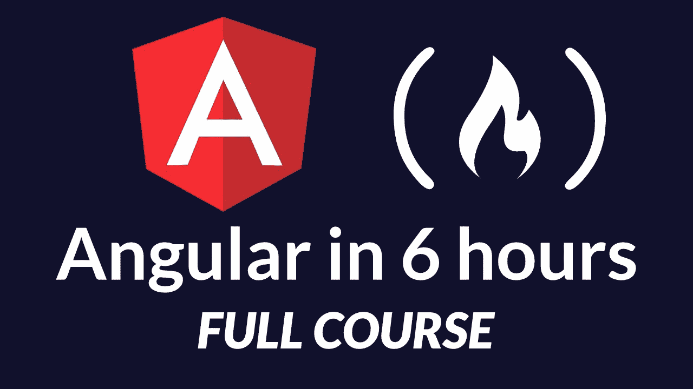

# 最佳角度和角度教程

> 原文：<https://www.freecodecamp.org/news/best-angular-tutorial-angularjs/>

angular js(1 . x 版)是一个基于 JavaScript 的开源框架。它是跨平台的，用于开发单页 Web 应用程序(SPWAs)。AngularJS 实现了 MVC 模式来分离逻辑、表现和数据组件。它还使用依赖注入来利用客户端应用程序中的服务器端服务。

angular(2 . x 及以上版本)是一个基于 Typescript 的开源框架，用于开发前端 Web 应用程序。Angular 具有泛型、静态类型和一些 ES6 特性。

我们建议学习 Angular 并将其用于新项目。AngularJS 主要用于遗留项目。

学习 Angular 的最好方法是在 YouTube 上看 freeCodeCamp 的 6 小时 Angular 教程。



# 关于 Angular 的其他教程

## **角度 1.x**

### **总页数**

*   [Angular JS](https://angularjs.org/)-Angular JS 主页
*   [AngularJS 风格指南](https://github.com/johnpapa/angular-styleguide/tree/master/a1) -详细的角度发展最佳实践

### **视频**

*   [Angular JS 路由](https://www.youtube.com/watch?v=5uhZCc0j9RY) -客户端路由 15 分钟
*   [Angular ToDo App](https://www.youtube.com/watch?v=WuiHuZq_cg4) -一个 12 分钟的 Angular ToDo App

### **课程**

*   [Egghead.io AngularJS 课程($)](https://egghead.io/browse/frameworks/angularjs)

## **角度 2.x+**

### **总页数**

*   [Angular](https://angular.io/)-Angular 主页
*   [棱角风格指南](https://angular.io/guide/styleguide) -棱角发展的详细最佳实践

### **专题页面**

*   [指令](http://www.sitepoint.com/practical-guide-angularjs-directives/) -详细介绍角度指令的优秀指南(第 1 部分)

### **课程**

*   [Egghead.io 角航向($)](https://egghead.io/browse/frameworks/angular)
*   [FrontendMasters -用 Angular 构建 Awesomer 应用](https://frontendmasters.com/courses/building-apps-angular)
*   [终极角度——托德座右铭](https://ultimateangular.com/)
*   [Angular 6(原 Angular 2)——完整指南($)Maximilian Schwarzüller](https://www.udemy.com/the-complete-guide-to-angular-2/)

## **博客**

*   [Alligator.io](https://alligator.io/angular/)
*   [深度角](https://blog.angularindepth.com/tagged/angular)

## **版本历史**

谷歌在 2010 年 10 月 20 日发布了 AngularJS 的初始版本。AngularJS 第一个稳定发布是在 2017 年 12 月 18 日 1.6.8 版本。Angular 2.0 于 2014 年 9 月 22 日在 ng-Europe 会议上发布。Angular 2.0 的一个特点就是动态加载。

经过一番修改，Angular 4.0 于 2016 年 12 月发布。角度 4 向后兼容角度 2.0。HttpClient 库是 Angular 4.0 的特性之一。Angular 5 于 2017 年 11 月 1 日发布。对渐进式 web 应用程序的支持是 Angular 4.0 的改进之一。Angular 6 于 2018 年 5 月发布。最新的稳定版本是 [6.1.9](https://blog.angular.io/angular-v6-1-now-available-typescript-2-9-scroll-positioning-and-more-9f1c03007bb6)

****安装**** :

我们可以通过参考可用的资源或下载框架来添加 Angular。

****链接到来源**** :

AngularJS:我们可以参考 Google 的内容交付网络来添加 AngularJS (Angular 1.x 版本)。

```
<script src="https://ajax.googleapis.com/ajax/libs/angularjs/1.6.4/angular.min.js"></script> 
```

下载/安装:我们可以用 npm，Bower 或者 composer 下载框架。

****棱角分明 1.x**** :

npm

```
npm install angular
```

然后在你的`index.html`上加一个`<script>`:

```
<script src="/node_modules/angular/angular.js"></script>
```

凉亭

```
bower install angular
```

然后在你的`index.html`上加一个`<script>`:

```
<script src="/bower_components/angular/angular.js"></script>
```

有关文档的更多信息，请参考 [AngularJS](https://docs.angularjs.org/api) 的官方网站。

按照 [Angular](https://angular.io/guide/quickstart) 官方文档中的步骤，可以安装 ****Angular 2.x**** 等版本。

# **组件**

#### **动机**

Angular 包含许多用于建筑应用的*原理图*。组件就是这样一种示意图。它们包含与应用程序的单个部分相关的单个逻辑单元。组件通常与其他原理图配合使用，以便更有效地运行。

在所有原理图中，元件消耗的往往比它们提供的多。虽然其他示意图(如指令、管道和服务)提供了实用工具，但组件利用了。他们负责应用程序接口，所以他们使用工具是有道理的。

组件简化了应用程序。他们的主要目标是将逻辑集中到可视界面的一个部分。要一步一步地构建应用程序，您必须一个组件一个组件地构建。毕竟，组件是 Angular 的构建模块。

#### **组件介绍**

如前所述，组件消耗效用(服务/资源)。它们位于业务逻辑和表示之间，产生一个内聚的单元。Angular 将各种机构附加到每个组件。这些附件将一个类标识为一个组件，并定义了它的标准功能。

Angular 必须在遇到组件时识别它们。要做到这一点，`@Component`必须修饰每个打算成为组件的类。装饰者向 Angular 指出这个类是什么。

在组件的情况下，它必须知道如何与它的注入器交互，如何与模板连接，如何从样式列表中提取样式，如何封装样式，等等。Angular 处理了大部分低层次的需求。开发人员仍然需要配置组件的行为，导入其依赖项，并扩展其逻辑。

对于所有这些事情，我们有组件的类。班级保持一切相对统一。它封装了组件的业务逻辑。

#### **组件类和元数据**

继续安装 [Angular 命令行界面(CLI)](https://cli.angular.io/) 。你可以从这篇文章中了解更多。CLI 命令`ng generate component [name-of-component]`产生以下内容。

```
import { Component, OnInit } from '@angular/core';

@Component({
  selector: 'app-example',
  templateUrl: './example.component.html',
  styleUrls: ['./example.component.css']
})
export class ExampleComponent implements OnInit {
  constructor() { }

  ngOnInit() { }
}
```

这是所有伟大组件的基本框架。装饰是最重要的部分。没有它，上面的例子就变成了一个泛型类。Angular 依靠 decorators 来辨别一个类的模式类型。

`@Component`将元数据作为单个对象接收。装饰者只是幕后的 JavaScript 函数。它们像元数据对象一样接受参数。元数据对象配置组件的基本依赖关系。每个字段都扮演一个角色。

*   `selector:`告诉 Angular 将组件与应用程序模板 HTML 中的某个元素相关联。
*   `templateUrl:`接受组件模板 HTML 的文件位置(这是显示数据的地方)。
*   接受样式表文件位置(字符串)的数组。这些样式表以组件的指定模板为目标。

把元数据想象成一大块配置。装饰器接受它，以便它可以生成特定于组件的数据。装饰器*用类行为所需的数据装饰底层类*。一个*组件就是*级。

默认情况下，导出该类的签名，以便可以导入该组件。`ngOnInit`也得到实现。`implements`告诉类根据接口的定义来定义某些方法。`ngOnInit`是一个生命周期挂钩。

#### **组件生命周期和变更检测**

组件使用各种工具、服务和特性。组件可用的一个关键特性是生命周期挂钩。本文中的[给出了每个钩子的解释。](https://guide.freecodecamp.org/angular/lifecycle-hooks)

总共有八个，它们都具有计时功能。当组件通过[变化检测](https://blog.angularindepth.com/everything-you-need-to-know-about-change-detection-in-angular-8006c51d206f)从一个状态转换到另一个状态时，它们有条件地执行。这个过程在组件树中不断发生。它搜索数据中值得重新呈现模板的变化。

是时候向前看了。有关组件生命周期的更多信息，请参考上述文章。它值得更多的解释。

#### **组件数据**

数据驱动一切。组件也不例外。组件封装了它们所有的数据。要从外部接收数据，组件必须显式声明它。这种形式的隐私可以防止组件树中的信息冲突。

数据决定了组件类向其模板显示的内容。对类数据的任何更新都会(或者至少应该)更新模板显示。

组件通常会初始化一组存储数据的成员(或变量)。为了方便起见，它们在整个组件类逻辑中使用。这些信息推动了产生模板及其行为的逻辑。请参见下面的示例。

```
// ./components/example/example.component.ts

import { Component, OnInit } from '@angular/core';
import { Post, DATA } from '../../data/posts.data';

@Component({
  selector: 'app-example',
  templateUrl: './example.component.html'
})
export class ExampleComponent implements OnInit {
  username: string;
  totalPosts: number;
  allPosts: Post[];

  deletePost(index: number): void {
    this.allPosts.splice(index, 1);
    this.totalPosts = this.allPosts.length;
  }

  ngOnInit(): void {
    this.username = DATA.author;
    this.totalPosts = DATA.thePosts.length;
    this.allPosts = DATA.thePosts;
  }
}
```

```
<!-- ./components/example/example.component.html -->

<h1>{{ username }}</h1>
<span>Change Name: </span><input [(ngModel)]="username">
<h3>Posts: {{ totalPosts }}</h3>
<ul>
<hr/>
<div *ngFor="let post of allPosts; let i=index">
  <button (click)="deletePost(i)">DELETE</button>
  <h6>{{ post.title }}</h6>
  <p>{{ post.body }}</p>
  <hr/>
</div>
</ul>
```

注意组件与其数据交互的方式。它首先从`../../data/posts.data`获取它，然后开始将它转发给模板进行显示。

数据显示在整个模板中。在双花括号中，变量的值从组件类映射到括号中。`*ngFor`在`allPosts`类数组中循环。点击按钮通过索引从`allPosts`中删除特定元素。你甚至可以通过在输入框中输入来改变最顶端的`username`。

上述交互改变了组件类的数据，进而更新了组件的模板 HTML。组件提供了促进数据流动的主干逻辑。模板 HTML 使数据对用户可读。

#### **组件模板**

前一个例子的模板 HTML 有一个有趣的语法。语法不是真正的 HTML。这是 Angular 的模板 HTML。有些人经常称它为 HTML *Plus，*只有 Angular 的编译器才能识别。编译器支持导致 HTML 动态操作的语法。这篇文章经常称之为“模板 HTML”或“模板”。

该语法允许组件将数据直接注入模板 HTML。注入是动态的。这意味着数据可以迭代并将自身显示为 HTML，而不需要外部帮助。Angular 编译器在它到达 web 浏览器时将其编译成真正的 HTML。

要了解更多关于数据绑定到模板的方法，请阅读 Angular 中的[数据绑定。数据绑定的几个例子发生在前面的例子中(`{{ ... }}`)。对于本文，认识到组件类和它的模板之间发生的数据交互就足够了。](https://guide.freecodecamp.org/angular/data-binding)

#### **查询模板**

管理模板状态的数据必须工作正常。然而，纯数据并不总是满足应用程序的预期设计。可能需要更直接地与文档对象模型(DOM)交互。

为此，组件必须引用模板元素。当数据改变时，组件可以显式地操作 DOM。这是一种更具声明性的方法。

组件可以使用 web 浏览器的 DOM 应用程序编程接口(API)来获取引用。不过，这是个坏主意。Angular 更喜欢跨平台兼容性。对于一个在 web 浏览器之外运行的组件，它需要使用 Angular 的 API，而不是 DOM 的。

组件可以使用`@ViewChild`和`ContentChild`装饰器查询它们的模板。它们代表组件类获取对模板元素的引用。

```
import { Component, ViewChild, ContentChild, ElementRef, Renderer2, AfterContentChecked, AfterViewChecked } from '@angular/core';

@Component({
  selector: 'app-child',
  template: `
  <button (click)="toggleEnlarge()">Toggle Enlarge</button>
  <ng-content></ng-content>
  `
})
export class ChildComponent implements AfterContentChecked {
  @ContentChild("pReference", { read: ElementRef }) pElement: ElementRef;
  textEnlarge: boolean = false;

  constructor(private renderer: Renderer2) { }

  toggleEnlarge() {
    this.textEnlarge = !this.textEnlarge;
  }

  ngAfterContentChecked() {
    if (this.textEnlarge)
      this.renderer.setStyle(this.pElement.nativeElement, 'font-size', '25px');
      else
      this.renderer.setStyle(this.pElement.nativeElement, 'font-size', 'initial');
    }
}

@Component({
  selector: 'app-parent',
  template: `
  <button (click)="toggleHighlight()">Toggle Highlight</button>
  <h1 #hOneRefereance>View Child</h1>
  <app-child>
    <p #pReference>Content Child</p>
  </app-child>
  `
})
export class ParentComponent implements AfterViewChecked {
  @ViewChild("hOneRefereance", { read: ElementRef }) hOneElement: ElementRef;
  textHighlight: boolean = false;

  constructor(private renderer: Renderer2) { }

  toggleHighlight() {
    this.textHighlight = !this.textHighlight;
  }

  ngAfterViewChecked() {
    if (this.textHighlight)
      this.renderer.setStyle(this.hOneElement.nativeElement, 'background-color', 'yellow');
    else
      this.renderer.setStyle(this.hOneElement.nativeElement, 'background-color', 'initial');
  }
}
```

上面的例子包含了两个为每个元素切换特定样式的按钮。单击按钮可切换每个组件特有的真/假值。这些布尔值决定了自定义样式是否适用。这些值不是强制性地改变，而是生命周期钩子(`ngAfterViewChecked`和`ngAfterContentChecked`)声明性地改变 DOM。

声明性方法通过元素的引用显式地改变样式。在命令式编程中，对基于数据的 DOM 的更改是隐式的。查看这篇关于[命令式和声明式编程](https://codeburst.io/declarative-vs-imperative-programming-a8a7c93d9ad2)的文章，了解更多信息。

要注意的主要事情是如何从模板中提取这些引用。在这个例子中，使用两个装饰器查询了模板的两个部分:`@ViewChild`和`@ContentChild`。

它们的不同之处在于寻找元素引用的位置，无论是在内容 DOM 还是视图 DOM 中。这两个 DOM 存在于 ParentComponent 的模板中。区分它们很重要，因为它们在不同的时间完成渲染。

这就是为什么`@ViewChild`和`@ContentChild`都存在的原因。它们与它们的伙伴生命周期挂钩`ngAfterViewChecked`和`ngAfterContentChecked`一起工作。这些生命周期挂钩在执行之前会等待它们各自的查询得到解决。

一旦被解析，`@ViewChild`和`@ContentChild`提供对两个元素的引用。两者都存在于 DOM 的不同部分。布尔数据仍然决定结果。结果如何转化为 DOM 是与以前的关键区别。DOM 通过`Renderer2`的直接操作来更新。

#### **内容投影**

内容 DOM 存在于 ChildComponent 的`<app-child></app-child>`元素的 innerHTML 中。它都位于 ParentComponent 的模板中。`app-child` *的 innerHTML 通过`<ng-content></ng-content>`将*投射到 ChildComponent 的模板上。

这举例说明了内容投影。使用`one`模板中`another`标签的 innerHTML 将内容从`one`组件显示到另一个组件，这样`another`组件可以通过`<ng-content></ng-content>`将 innerHTML 拉入自己的模板。*谢谢你看了那句话。*

这就是为什么 ChildComponent 使用`@ContentChild`引用它的`<p></p>`元素。ParentComponent 模板的`<app-child></app-child>`中包含的内容构成了内容 DOM。ChildComponent 用一个`@ContentChild`查询引用元素。

ParentComponent 的视图 DOM 包含可以从组件视图中访问的所有内容。考虑到`<app-child></app-child>`的 innerHTML，这不一定包括整个模板。同样，使用`@ContentChild`从 ChildComponent 查询 DOM 的这一部分。使用 ParentComponent 类中的`@ViewChild`查询其他所有内容。

这是组件交换内容和查询它们自己的内容的好方法，而不管它们的 DOM 类型如何。组件也可以使用数据绑定与自身和其他组件进行通信。从[这篇文章](https://guide.freecodecamp.org/angular/data-binding)中了解更多信息。

#### **组件样式**

样式对于组件的可读性和交互性至关重要。每个组件封装了它的样式表依赖关系。这样，它们只适用于组件的模板 HTML。HTML 的影子 DOM 引入的一种特殊技术使这成为可能。

影子 DOM 分支可能存在于任何元素上。从 HTML 的源代码中看不到 DOM 的这一部分。标准 HTML 元素利用影子 DOM 来提供它们的商标外观。shadow DOM 分支必须将其自身锚定到一个可见的组件，以便它可以对其进行样式化和自定义。

影子 DOM 分支的独特之处在于它的封装。用于样式化影子 DOM 分支的根元素的所有东西都是它的私有元素。没有其他元素可以访问它。

Angular 包含了这种形式的组件封装。组件的样式表和模板封装在一起。没有其他组件可以访问它们。不能发生样式表冲突。

默认情况下，Angular 不使用阴影 DOM。它使用模拟影子 DOM 行为的仿真系统。这是一个临时措施，因为一些 web 浏览器还不支持影子 DOM API。

`@Component`元数据包含`encapsulation`字段。这使得开发人员可以在模拟阴影 DOM 和真实阴影 DOM 之间切换，或者两者都不切换。以下是按顺序排列的选项:

*   `ViewEncapsulation.Emulated` -假阴影 DOM(默认)
*   真实阴影 DOM(从 Angular 6.0.8 开始已被弃用)
*   都不是

`ViewEncapsulation.None`表示组件的样式表提升到全局范围。考虑到组件应该形成自己的私有单元(封装)，不推荐使用。Angular 仍然提供它作为极端情况下的逃生出口。

#### **结论**

组件构建应用程序。除非另行配置，否则它们都是私有的，并且彼此独立统一。应用程序往往从根模块开始。除此之外，组件形成了一棵定义应用程序其余部分的细长树。

组件覆盖应用程序接口的指定单元。这包括它的风格、逻辑和布局。管道、服务和指令等其他图表在组件代码中经常使用。您可以在其他一些角度指南文章中了解更多关于这些交互的信息。

不要忘记组件必须[引导](https://angular.io/guide/bootstrapping)。这可能发生在根模块或组件的元数据中。无论组件出现在应用程序中的什么地方，它都可以识别。

您总是可以学到更多，因为组件比本文所能传达的内容更有深度。