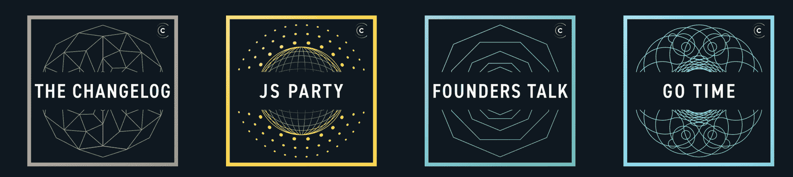
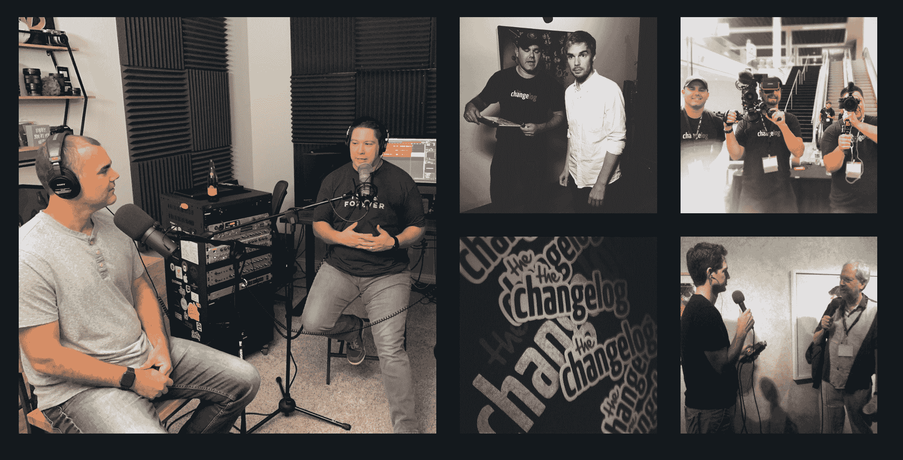

# 开源进展很快:10 年的变更日志

> 原文：<https://www.freecodecamp.org/news/open-source-moves-fast-10-years-of-the-changelog/>

10 年前，Adam Stacoviak 发布了 Changelog 播客的第一集。从那以后，他采访了数百名项目维护人员。并且 Changelog 已经成为开发人员社区中的传奇。

我从 2011 年开始听变更日志，那时我刚开始学习编码。在编码会议的间隙，我会戴上耳机，尽可能多地吸收他们的旧目录。这让我鸟瞰了日益发展的开源世界。

直到今天我还在听 Changelog。他们成长了很多。他们现在有很多节目，包括一个专注于 JavaScript，一个专注于 Go。

The Changelog currently has 8 podcasts focused on different software-related topics. Each has its own symmetric logo.

写这篇文章的时候，更新日志已经发布了 370 集。人们已经听了这些播客超过 1400 万次。

早在 2016 年，我就是 Changelog 的嘉宾，当时 freeCodeCamp 还是一个刚刚起步的项目，我用自己的个人积蓄提供资金。我清楚地记得为我的父母播放采访。我很自豪能够“成功”并出现在变更日志上。

快进到 2019 年初。我和亚当谈论为他们的十周年纪念做一些特别的事情。当时我住在中国，以为我必须通过视频会议采访他。

但是命运安排，我把家搬到了达拉斯。刚好距离休斯顿的亚当工作室 4 小时车程。

所以我说:你知道吗，我们还是当面说吧。

亚当过去 7 年的共同主持人杰罗德·桑托从他的家乡内布拉斯加州奥马哈市预订了一张机票。我们一起进行了整整 4 个小时的采访。

Photos from [The Changelog's 10 Year Celebration](https://www.freecodecamp.org/news/open-source-moves-fast-10-years-of-the-changelog/changelog.com/ten) website.

在我们开始采访之前(是的，你可以在这篇文章中听到，无论是音频还是视频)，让我告诉你更多关于 Changelog 的事情。

亚当用一句口头禅创建了 Changelog:“开源进展很快。跟上。”这是在 GitHub 时代的早期。

事实上，在 GitHub 取得我们今天都知道的巨大成功之前，亚当和他的搭档韦恩·尼德兰在第十集采访了前 GitHub 首席执行官克里斯·万斯特拉斯。

GitHub 在其“探索”页面中展示了 Changelog，这导致了听众人数的快速增长。

他们的关系如此密切，以至于韦恩自己最终在 2012 年在 GitHub 找了份工作，并离开了 Changelog。

有一段时间，亚当继续独自运营播客。但是亚当有家庭和全职工作。而 Changelog 也面临着停产的危险。

幸运的是，Changelog 有一个特别忠实的听众——一个来自奥马哈的名叫 Jerod Santo 的开发者。杰罗德注意到发作越来越少了。所以在 2013 年，他联系了亚当，问他能帮上什么忙。这引发了更新日志的复兴。

Adam 决定他需要将 Changelog 从一个兼职的激情项目转变为一项有利可图的努力。他辞掉了工作，全力以赴为 Changelog 寻找广告客户，这样他就可以让它持续下去。

他们与长期合作的赞助商建立了重要的合作伙伴关系，这些赞助商在资金、服务器和带宽方面给予了帮助——即用于云服务器的 Linode、用于带宽的 Fastly 和用于监控的 Rollbar。

不久，Changelog 开始推出更多的节目。他们使用 Elixir Phoenix framework 等新兴工具建立了一个速度极快的网站。他们开源一切。

他们的故事还有很多。面试时，我会问他们:

*   亚当从一个贫穷的小镇到美国军队的旅程，在那里他晋升军衔并在海外服役
*   亚当在咨询公司找到第一份技术工作之前，从事销售工作
*   亚当是如何进入播客领域并最终开创了 Changelog 播客的
*   杰罗德的起源故事，以及他在接受研究生院奖学金后如何陷入政府机构的困境
*   亚当成功的 3 C(一致性、社区、优质内容)
*   他们是如何将变更日志从一项爱好转变为一项有利可图的业务的
*   Go Time、JS Party 和其他 Changelog 播客的创建
*   他们与神秘的 Breakmaster Cylinder 的关系，他为他们的演出创作了所有的音乐
*   他们如何在 Elixir 中建立闪电般快速的 Changelog 网站
*   他们如何与开源贡献者合作，并鼓励他们的播客客托管
*   他们对开源会议的想法
*   以及他们对未来十年变更日志的期望

是的-我是一个非常彻底的面试官。？

然后，在我采访完他们之后，他们转过身来就 freeCodeCamp 的未来采访了我。

总的来说，这是关于两个大型开源项目的四个小时的采访，这两个项目有着相互联系的社区和共同的教育人的目标。

我想你会喜欢的。

你可以在下面的视频中观看这两次采访，都是在亚当的休斯顿工作室拍摄的。

[https://www.youtube.com/embed/0hd0FPd47II?feature=oembed](https://www.youtube.com/embed/0hd0FPd47II?feature=oembed)

或者你可以在 freeCodeCamp 的 YouTube 频道上观看[。](https://www.youtube.com/watch?v=0hd0FPd47II)

如果你想使用更少的数据，你可以在下面的播客中或在你最喜欢的播客应用程序中收听采访(只需搜索“freeCodeCamp 播客”)。

[//html5-player.libsyn.com/embed/episode/id/12121229/height/90/theme/custom/thumbnail/yes/direction/forward/render-playlist/no/custom-color/000000/](//html5-player.libsyn.com/embed/episode/id/12121229/height/90/theme/custom/thumbnail/yes/direction/forward/render-playlist/no/custom-color/000000/)

如果你有亚马逊 Echo，你可以说“Alexa，播放 freeCodeCamp 播客。”

如果你还没有，你应该订阅 Changelog 播客。他们有各种各样的表演。我推荐从他们的主频道开始，这样你就可以浏览他们所有的节目:[https://changelog.com/master](https://changelog.com/master)

你可以[点击这里](https://twitter.com/adamstac)在 Twitter 上关注亚当。

你可以点击这里在 Twitter 上关注 Jerod。

如果你还没跟上我，我就在这里。