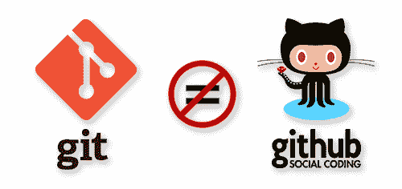

# 最佳 Git 教程

> 原文：<https://www.freecodecamp.org/news/best-git-tutorial/>

Git 是一个开源的分布式版本控制系统，由 Linus Torvalds 和 Linux 开发社区的其他人在 2005 年创建。Git 可以处理许多类型的项目，但是它最常用于软件源代码。

版本控制是一种跟踪文件或文件组随时间变化的系统。当您有这些更改的历史记录时，它允许您以后查找特定的版本，比较版本之间的更改，恢复您可能已删除的文件，或将文件恢复到以前的版本。

一个*分布式*版本控制系统意味着不同的用户维护他们自己的项目存储库，而不是从一个中央存储库中工作。用户自动拥有完整的文件跟踪能力和项目的完整版本历史，而无需访问中央服务器或网络。

当 Git 在项目目录中初始化时，它开始跟踪文件变更，并将它们存储为“变更集”或“补丁”在一个项目中一起工作的用户提交他们的变更集，然后这些变更集被包含(或拒绝)到项目中。

freeCodeCamp 有一个 [YouTube 播放列表，这里有很多实用的 Git 和 GitHub 技巧](https://www.youtube.com/watch?v=vR-y_2zWrIE&list=PLWKjhJtqVAbkFiqHnNaxpOPhh9tSWMXIF)。


### 其他教程:

*   斯科特·沙孔和本·施特劳布撰写，出版社出版的《Pro Git》一书。这本书在 [Git 文档](https://git-scm.com/book/en/v2)中有完整展示。
*   下载、文档和基于浏览器的教程: [Git 官方网站](https://git-scm.com/)
*   当你处于糟糕的 git 情况时，最有用的命令:[哦 s***，GIT！](http://ohshitgit.com/)

### **了解 Git 项目的三个部分**

Git 项目将包含以下三个主要部分:

1.  Git 目录
2.  工作目录(或工作树)
3.  部队从一个战场转往另一个战场的集结地

****Git 目录**** (位于`YOUR-PROJECT-PATH/.git/`)是 Git 存储精确跟踪项目所需的一切的地方。这包括元数据和包含项目文件压缩版本的对象数据库。

****工作目录**** 是用户对项目进行本地修改的地方。工作目录从 Git 目录的对象数据库中提取项目文件，并将它们放在用户的本地机器上。

****暂存区**** 是一个文件(也称为“索引”、“暂存”或“缓存”)，它存储了关于您下一次提交的内容的信息。提交是指您告诉 Git 保存这些分阶段的更改。Git 获取文件的快照，并将该快照永久存储在 Git 目录中。

通过三个部分，文件在任何给定时间都可以处于三种主要状态:提交、修改或暂存。每当你在你的工作目录中对一个文件做了改变，你就修改了这个文件。接下来，当您将它移动到暂存区时，它就是*暂存的*。最后，在提交之后是*提交*。

### **安装 Git**

*   Ubuntu: `sudo apt-get install git`
*   Windows: [下载](https://git-scm.com/download/win)
*   Mac: [下载](https://git-scm.com/download/mac)

### **配置 Git 环境**

Git 有一个`git config`工具，允许你定制你的 Git 环境。您可以通过设置某些配置变量来改变 Git 的外观和功能。从机器上的命令行界面(Mac 中的终端、Windows 中的命令提示符或 Powershell)运行这些命令。

这些配置变量有三个存储级别:

1.  系统:位于`/etc/gitconfig`，将默认设置应用于计算机的每个用户。要对这个文件进行修改，使用带有`git config`命令的`--system`选项。
2.  用户:位于`~/.gitconfig`或`~/.config/git/config`，将设置应用于单个用户。要修改这个文件，使用`git config`命令的`--global`选项。
3.  项目:位于`YOUR-PROJECT-PATH/.git/config`，仅将设置应用于项目。要修改这个文件，使用`git config`命令。

如果存在相互冲突的设置，项目级配置将重写用户级配置，用户级配置将重写系统级配置。

Windows 用户注意:Git 在您的`$HOME`目录(`C:\Users\$USER`)中查找用户级配置文件(`.gitconfig`)。Git 还会寻找`/etc/gitconfig`，尽管它是相对于 MSys 根目录的，也就是您在运行安装程序时决定在 Windows 系统上安装 Git 的位置。如果您使用的是 Git for Windows 的 2.x 或更高版本，那么在 Windows XP 上的`C:\Documents and Settings\All Users\Application Data\Git\config`中还有一个系统级配置文件，在 Windows Vista 和更高版本上的`C:\ProgramData\Git\config`中也有。这个配置文件只能由管理员`git config -f FILE`修改。

#### **添加您的姓名和电子邮件地址**

Git 将用户名和电子邮件作为提交信息的一部分。您需要在用户级配置文件中使用以下命令进行设置:

```
git config --global user.name "My Name"
git config --global user.email "myemail@example.com"
```

#### **改变你的文本编辑器**

Git 自动使用默认的文本编辑器，但是您可以更改它。下面是一个使用 Atom 编辑器的例子(`--wait`选项告诉 shell 等待文本编辑器，这样您就可以在程序继续运行之前在其中工作):

```
git config --global core.editor "atom --wait"
```

#### **给 Git 输出添加颜色**

您可以使用以下命令配置您的 shell 来为 Git 输出添加颜色:

```
git config --global color.ui true
```

要查看所有配置设置，请使用命令`git config --list`。

### **初始化项目中的 Git**

一旦在您的计算机上安装并配置了 Git，您需要在您的项目中初始化它，以便开始使用它的版本控制功能。在命令行中，使用`cd`命令导航到项目的顶层(或根)文件夹。接下来，运行命令`git init`。这将安装一个 Git 目录文件夹，其中包含 Git 跟踪项目所需的所有文件和对象。

Git 目录必须安装在项目根文件夹中，这一点很重要。Git 可以跟踪子文件夹中的文件，但是它不会跟踪位于相对于 Git 目录的父文件夹中的文件。

### **在 Git 中获得帮助**

如果您忘记了任何命令在 Git 中是如何工作的，您可以通过几种方式从命令行访问 Git 帮助:

```
git help COMMAND
git COMMAND --help
man git-COMMAND
```

这将在您的 shell 窗口中显示该命令的手册页。若要导航，请使用上下箭头键滚动或使用以下键盘快捷键:

*   `f`或`spacebar`向前翻页
*   `b`向后翻页
*   `q`退出

## **Git 和 GitHub 的区别**

Git 和 Github 是两回事。 [Git](https://git-scm.com/) 是[版本控制系统](https://en.wikipedia.org/wiki/Version_control)，而 [GitHub](https://github.com/) 是托管 Git repos 的服务，帮助人们协作编写软件。然而，由于它们相似的名字，由于 GitHub 建立在 Git 之上的事实，由于许多网站和文章没有足够清楚地说明它们之间的区别，它们经常被混淆。



### **去**

Git 是分布式版本控制系统。Git 负责跟踪内容的变更——通常是源代码文件。

要了解更多信息，有一篇关于 Git 本身的完整文章。

### **GitHub**

GitHub 是一个提供 Git 存储库托管的服务。这意味着他们提供了一个交钥匙解决方案来在他们的服务器上托管 Git 存储库。这对于保存存储库的备份很有用(Git 只跟踪文件随时间的变化；回购仍然需要备份)，并有一个集中的地方来保存和与他人共享您的代码。

GitHub 不仅仅是一个 Git 存储库托管服务，它还是一个软件熔炉。这意味着它还提供了一个[问题跟踪器](https://en.wikipedia.org/wiki/Issue_tracking_system)，用于[代码审查的工具](https://en.wikipedia.org/wiki/Code_review)，以及其他用于与其他人合作和创建软件的工具。

GitHub 并不是唯一提供这种服务的公司。它的主要竞争对手之一是 GitLab。关于这一点的更多信息，请看关于 Git 托管的[部分。](https://www.freecodecamp.org/news/the-beginners-guide-to-git-github/#git-repositories)

# **如何使用 SSH 通过 GitHub 认证**

继续之前，检查此处是否没有`rsa`文件，使用:

```
ls -al ~/.ssh
```

如果没有要列出的内容(即`: No such file or directory`)，则使用:

```
mkdir $HOME/.ssh
```

如果什么都没有，那么生成一个新的 keygen，包含:

```
ssh-keygen -t rsa -b 4096 -C your@email.com
```

现在使用`ls -al ~/.ssh`将显示我们的`id_rsa.pub`文件。

将 SSH 密钥添加到 SSH 代理:

```
eval "$(ssh-agent -s)" # for mac and Linux from bash
```

```
eval `ssh-agent -s`
ssh-agent -s # for Windows
```

使用以下内容将 RSA 密钥添加到 SHH:

```
ssh-add ~/.ssh/id_rsa
```

将您的密钥复制到剪贴板

```
clip < ~/.ssh/id_rsa.pub # Windows
```

```
cat ~/.ssh/id_rsa.pub # Linux
```

进入你的 GitHub [设置](https://github.com/settings/keys)页面，点击“新建 SSH 密钥”按钮，粘贴你生成的密钥。

然后通过以下方式进行身份验证:

```
ssh -T git@github.com
```