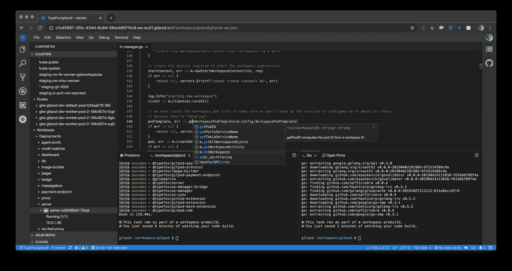
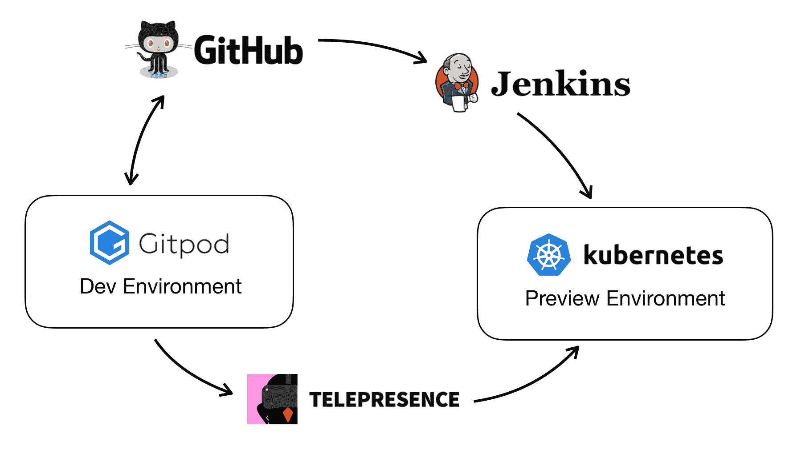

# 如何愉快地开发 Kubernetes 应用程序

> 原文：<https://www.freecodecamp.org/news/developing-kubernetes-applications-with-joy/>

让我们面对现实吧:开发分布式应用是痛苦的。

微服务架构在解耦和可伸缩性方面可能很棒，但在开发方面却非常复杂。

本地 Kubernetes 集群(Minikube)、长构建时间(Docker)以及笨拙甚至不存在的调试解决方案是我们如何开始的。两年过去了，我们已经自动化了一切:我的本地机器上不再运行任何东西，我可以在仅仅 15 秒内开始对任何分支上的单独组件进行编码和调试。？

我现在非常喜欢在我们的项目上工作，并且相信这是最简化的设置之一。下面我想分享一下我的经历。

## 从预览环境开始

要开始修复一个 bug 或特性，我只需要在 GitHub 上创建一个新的分支。这将立即触发我们的 CI 服务器(我们使用 Jenkins ),然后将预览应用程序部署到 GKE 集群。应用程序位于对应于分支名称的名称空间中，使用预览 URL，我可以访问和使用应用程序。

由于我只进行了分支，没有进行任何修改，构建工件被缓存起来，部署只需要几秒钟。但是，即使我进行了修改，构建也会运行得很快，因为它只是重新构建了真正必要的东西。

## 开始编码

接下来，我将构建一个开发环境来完成我的任务。我们使用 [Gitpod](https://www.gitpod.io) ，它类似于 CI 服务器，为任何分支预构建开发环境。在我们项目的任何 GitHub 页面上点击一个按钮，就会为该分支启动一个全新的开发环境，并在我的浏览器中打开它。

大约 15 秒后，开发环境启动，等待我的是我们回购的新克隆，正确的分支已检查完毕。此外，项目已经完全构建，甚至所有的依赖项都已经下载。终端用以下消息欢迎我:

IDE 预配置了我们需要的所有 VS 代码扩展，在我们的例子中是 Kubernetes、Docker、MySQL、Go 和 TypeScript。它也已经连接到运行预览环境的 Kubernetes 集群以及相应的数据库。例如，我可以在我的终端中输入' *kubectl get all'* ,然后看到所有部署的 kube 对象。

该连接基于一个秘密令牌，每个开发人员都必须将该令牌放入他们的用户帐户一次，并在启动开发环境时注入。

虽然这些短暂的开发环境在我的浏览器中运行，但它们提供了所有最先进的工具，允许我编码、编译、运行和调试代码，以及与数据库和集群进行交互。

当然，我现在可以将我的任何代码更改推送到 GitHub，并等待 CI 相应地更新我的预览环境。由于构建需要大量缓存，所以小的更改会在一分钟左右部署。然而，大多数时候，一分钟太长了。我们需要一种即时的热重装体验，允许在完整应用程序的上下文中调试任何服务。进入*网真*。

## 使用网真进行调试

我希望能够在整个应用程序的上下文中调试任何单独的服务。我们的组件没有等待重新部署，而是使用[网真](https://telepresence.io)进行适当的启动配置来调试它们。

Telepresence 用一个代理代替了 Kubernetes 部署，该代理将所有通信转发给本地运行的流程。简而言之，我可以启动一个本地调试会话，并让它在我的预览环境中工作。

这非常有效，是我迄今为止见过的调试 Kubernetes 服务的最好方法。它允许我重用所有可用的现有调试工具。

## 推动和审查

一旦我对我的更改感到满意，我就推送到我的分支并创建一个拉请求。我可以在 Gitpod 中这样做，这非常方便。

Jenkins 现在将更新预览环境，Gitpod 预构建一个新的开发环境。因此，当一位同事想要开始审查我的更改时，他们可以立即尝试，并快速启动开发环境进行更深入的检查。在 Gitpod 中，他们可以向代码添加注释，甚至批准(或拒绝)PR。

Our Toolchain

## 结论

实现分布式应用程序的快速周转和自动化设置是困难的，但对于进入生产流程是绝对必要的。这方面的任何摩擦都会对你团队的生产力产生不良影响。

预览环境的快速构建和流畅的基于网真的调试体验对我们来说是一种愉快的生产力提升。如果 Gitpod 不存在，我们就必须建造它；).

你有问题吗？[伸出援手](https://www.typefox.io/contact/)，我们很乐意提供帮助。

* * *

> 注意:Telepresence 中的一些功能需要系统调用，目前只有 Gitpod 自托管才允许。