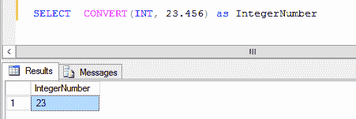
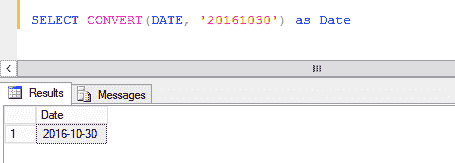
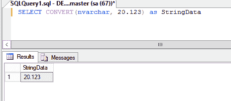
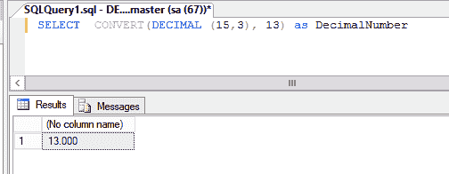
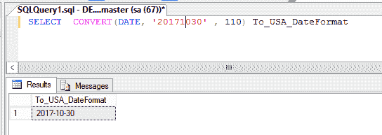

# SQL Server 日期格式和 SQL Server 转换举例说明

> 原文：<https://www.freecodecamp.org/news/sql-date-format-and-sql-server-convert/>

## SQL Convert 是做什么的？

它将一种数据类型转换为另一种数据类型。

### 句法

`CONVERT (_New Data Type, Expression, Style_)`

*   **新数据类型:**也要转换的新数据类型。例如:nvarchar、整数、小数、日期
*   **表达式:**要转换的数据。
*   **样式:**格式。例如:样式 110 是美国日期格式 mm-dd-yyyy

### 示例:将十进制数转换为整数

`SELECT CONVERT(INT, 23.456) as IntegerNumber`

注意:结果被截断。

### 示例:将字符串转换为日期

`SELECT CONVERT(DATE, '20161030') as Date`

### 示例:将十进制转换为字符串

`SELECT CONVERT(nvarchar, 20.123) as StringData`

### 示例:将整数转换为小数

`SELECT CONVERT(DECIMAL (15,3), 13) as DecimalNumber`

### 示例:将字符串转换为美国日期格式的日期格式

`SELECT CONVERT(DATE, '20171030' , 110) To_USA_DateFormat`

