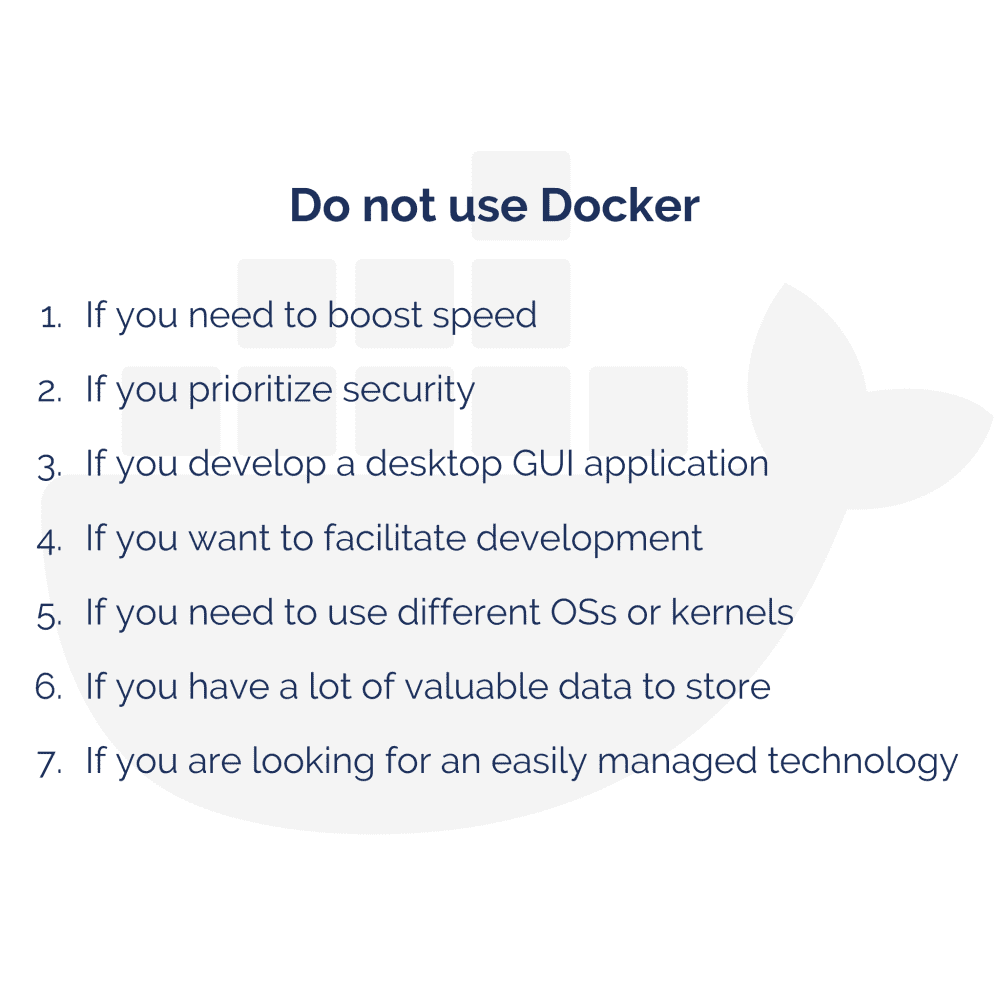

# 不应该使用 Docker 的 7 种情况

> 原文：<https://www.freecodecamp.org/news/7-cases-when-not-to-use-docker/>

## Docker 改变了游戏规则。但这不是一个放之四海而皆准的解决方案。

Docker 有很多好的地方。它作为一个轻量级的、可移植的、自给自足的容器化工具来打包、运输和运行应用程序。Docker 非常适合各种规模的企业。当你在一个小团队中处理一段代码时，它消除了“但是它能在我的机器上工作”的问题。同时，企业可以使用 Docker 来构建敏捷软件交付管道，以便更快、更安全地交付新功能。

凭借其内置的容器化系统，Docker 是一个优秀的云计算工具。反过来，Docker Swarm 推进集群化和去中心化设计。听起来好得难以置信，对吧？嗯，还是有几种情况下不要用 Docker。这是其中的七个。

让我们一个一个地过一遍。

## **如果需要提高速度，请不要使用 Docker**

Docker 容器比带有服务器和数据库的虚拟机更小，需要的资源也更少。同时，Docker 将使用主机内核调度程序允许的尽可能多的系统资源。你不应该期望 Docker 以任何方式加速应用程序。

更重要的是，Docker 甚至可能使它变慢。如果您正在使用它，您应该对容器可以使用的内存、CPU 或块 IO 设置限制。否则，如果内核检测到主机的内存运行得太低，无法执行重要的系统功能，它可能会开始杀死重要的进程。如果杀死了错误的进程(包括 Docker 本身)，系统就会不稳定。

不幸的是，Docker 的内存调整——Docker 守护进程上的内存不足优先级——没有解决这个问题。相比之下，在应用程序和操作系统之间增加一层也会导致速度降低。然而，这种减少将是微不足道的。Docker 容器不是完全隔离的，不像任何虚拟机那样包含完整的操作系统。

## **如果您优先考虑安全性，请不要使用 Docker**

Docker 最大的安全优势是它将应用程序分成了更小的部分。如果一部分的安全受到损害，其余部分不会受到影响。

然而，尽管容器中的独立进程有望提高安全性，但所有容器都共享对单个主机操作系统的访问。你冒着运行不完全隔离的 Docker 容器的风险。任何恶意代码都可以访问您的计算机内存。

在单个环境中运行大量容器是一种流行的做法。这就是你如何使你的应用容易受到资源滥用类型的攻击，除非你限制资源容器的能力。为了最大化效率和隔离，每个容器应该处理一个特定的关注区域。

另一个问题是 Docker 的默认配置——用户没有命名空间。命名空间允许软件资源仅在属于特定命名空间时使用其他资源。

使用 Docker 运行应用程序意味着使用 root 权限运行 Docker 守护程序。任何脱离 Docker 容器的进程在主机上都将拥有与在容器中相同的特权。作为非特权用户在容器内运行您的流程不能保证安全性。这取决于您添加或删除的功能。为了降低 Docker 容器泄漏的风险，您不应该从不可信的来源下载现成的容器。

## 如果您开发桌面 GUI 应用程序，请不要使用 Docker

Docker 不适合需要丰富 UI 的应用程序。Docker 主要用于带有基于控制台的应用程序的隔离容器。基于 GUI 的应用程序不是优先考虑的，它们的支持将依赖于具体的情况和应用程序。Windows 容器基于 Nano 或 Core Server——它不允许用户在 Docker 容器中启动基于 GUI 的界面或 Docker RDP 服务器。

然而，你仍然可以在 Linux 容器中运行用 Python 和 QT 框架开发的基于 GUI 的应用程序 。此外，您可以使用 X11 转发，但这种解决方案有些笨拙。

## **如果你想简化开发和调试，就不要使用 Docker**

Docker 是由开发者创造的，也是为开发者服务的。它提供了环境稳定性:开发机器上的容器将在登台、生产或任何其他环境中完全一样地工作。这就消除了不同环境下各种程序版本化的问题。

在 Docker 的帮助下，你可以很容易地为你的应用程序添加一个新的依赖项。您团队中的开发人员不需要在他们的机器上重复这种操作。一切都将在容器中启动和运行，并分发给整个团队。

同时，你必须做一些额外的设置来在 Docker 中编写你的应用程序。此外，使用 Docker 调试，您必须配置日志输出并设置调试端口。您可能还需要为容器中的应用程序和服务映射端口。所以，如果你有一个复杂繁琐的部署过程，Docker 会帮你很多。如果你有一个简单的应用程序，它只是增加了不必要的复杂性。

## **如果需要使用不同的操作系统或内核，请不要使用 Docker**

借助虚拟机，虚拟机管理程序可以对整个设备进行抽象。您可以使用 Microsoft Azure 同时运行 Windows Server 和 Linux Server 的两个实例。然而，Docker 镜像需要与其创建时相同的操作系统。

有一个 Docker 容器图像的大型数据库 Docker Hub。然而，如果一个映像是在 Linux Ubuntu 上创建的，它将只能在完全相同的 Ubuntu 上运行。

如果一个 app 是在 Windows 上开发的，但是生产运行在 Linux 上，你将无法有效地使用 Docker。有时，如果您有几个静态应用程序，设置服务器会更容易。

## **如果您有大量有价值的数据要存储，请不要使用 Docker**

按照设计，所有 Docker 文件都是在一个容器中创建的，并存储在一个可写的容器层上。如果不同的流程需要数据，那么从容器中检索数据可能会很困难。此外，容器的可写层连接到运行容器的主机。如果您需要将数据移动到其他地方，您将很难做到。不仅如此，一旦容器关闭，存储在容器中的所有数据都将永远丢失。

你必须想办法先把你的数据保存到别的地方。为了保证 Docker 中数据的安全，您需要使用一个额外的工具——Docker Data Volumes。然而，这种解决方案仍然相当笨拙，需要改进。

## **如果您正在寻找最容易管理的技术，请不要使用 Docker**

Docker 于 2012 年推出，仍然是一项新技术。作为开发人员，您可能需要定期更新 Docker 版本。不幸的是，不能保证向后兼容性。此外，文档落后于技术的进步。作为开发人员，您必须自己解决一些问题。

此外，Docker 提供的监控选项相当差。您可以快速了解一些简单的统计数据。然而，如果你想看到一些先进的监控功能，Docker 没有提供。

此外，在大型复杂应用程序的情况下，Docker 的实现是有代价的。在众多服务器上的众多容器之间建立和维护通信将花费大量的时间和精力。然而，有一个有用的工具，它使得使用多容器 Docker 应用程序变得更加容易——Docker Compose。Docker Compose 在单个 YAML 文件中定义服务、网络和卷。

尽管如此，Docker 生态系统是相当分裂的——并不是所有的支持容器产品都能很好地相互协作。每个产品都有某个公司或社区做后盾。这些公司之间的激烈竞争导致产品不兼容。

## **总结**

KeenEthics 专业人员喜欢使用 Docker，并经常使用它进行应用程序开发。尽管有一些缺点，但你可以很容易地使用它在隔离的容器中并排运行和管理应用程序。

安装一个应用程序可以像运行一个命令-<docker run="">一样简单。Docker 还为每个测试提供了一个干净和原始的隔离环境，使其成为自动化测试的一个重要和有用的工具。</docker>

Docker 特性在依赖性管理和安全性方面提供了好处。在 Docker Hub、Docker Swarm 和 Docker Compose 等有用工具的支持下，Docker 是一个流行且用户友好的解决方案。

尽管 Docker 有这么多好处，但是你不应该用它来封装你开发的每一个应用程序。

记住:Docker 是游戏规则的改变者。但这不是一个放之四海而皆准的解决方案。

Docker 也不是市场上唯一的此类工具。Docker 的替代品有 [rkt](https://coreos.com/rkt/) ，读作‘rocket’， [Linux Containers](https://linuxcontainers.org/) ，或者 [OpenVZ](https://openvz.org/) 。每一个都有其优点和缺点，与 Docker 非常相似。Docker 越来越受欢迎，使用率越来越高，这完全是因为企业决定采用它。

在对是否应该使用 Docker 下结论之前，先研究一下项目需求。与你的队友或同事交谈，让他们帮助你决定何时使用 Docker，何时不使用容器，以及它是否是 Docker 用例之一。

不管你喜不喜欢，这项技术是有前途的。有一些开发人员和开发机构讨厌 Docker，并试图将其从所有正在进行的项目中消除。与此同时，也有一些专家将所有他们能打包的东西打包，因为他们将 Docker 视为灵丹妙药。也许，你不应该加入任何一个阵营。保持公正，保持客观，根据具体情况做出决定。

## 你对 Docker 项目有什么想法吗？

我的公司 KeenEthics 是一个由经验丰富的 web 应用程序开发人员组成的团队。如果您需要类似项目的免费评估，请随时与**联系。**

你可以在我的博客上读到更多类似的文章。请允许我建议你阅读一下[为什么要重构你的代码？](https://keenethics.com/blog/1554572000000-refactoring)或[软件开发模型解释:外包 vs 加急，固定价格 vs 时间&材料？](https://keenethics.com/blog/outsourcing-vs-outstaffing)

## 附言

此外，我想对与我合著这篇文章的亚历克斯·普莱特诺夫(Alex Pletnov)以及坚持到最后的读者们说声“谢谢”!

KeenEthics 博客上发布的原文可以在这里找到: [7 种不使用 Docker 的情况](https://keenethics.com/blog/1517306255770-docker-5-cases-when-you-should-not-use-it)。