# Next.js 手册——初学者学习 Next.js

> 原文：<https://www.freecodecamp.org/news/the-next-js-handbook/>

我写这篇教程是为了帮助你快速学习 Next.js，熟悉它的工作原理。

如果您对 Next.js 一无所知，您过去使用过 React，并且您希望更深入地了解 React 生态系统，尤其是服务器端渲染，那么这将是您的理想选择。

我发现 Next.js 是创建 Web 应用程序的一个很棒的工具，在这篇文章的最后，我希望你会和我一样对此感到兴奋。而且希望对你学习 Next.js 有帮助！

[注意:你可以下载这个教程的 PDF / ePub / Mobi 版本，这样你就可以离线阅读了](https://flaviocopes.com/page/nextjs-handbook/)！

## 索引

1.  [简介](#introduction)
2.  [next . js 提供的主要功能](#the-main-features-provided-by-next-js)
3.  [Next.js vs 盖茨比 vs`create-react-app`](#next-js-vs-gatsby-vs-create-react-app)

5.  [查看源以确认 SSR 正在工作](#view-source-to-confirm-ssr-is-working)
6.  [应用捆绑](#the-app-bundles)
7.  右下角的图标是什么？
8.  [安装 React 开发工具](#install-the-react-developer-tools)
9.  [你可以使用的其他调试技术](#other-debugging-techniques-you-can-use)
10.  [向网站添加第二页](#adding-a-second-page-to-the-site)
11.  [链接两个页面](#linking-the-two-pages)
12.  [路由器的动态内容](#dynamic-content-with-the-router)
13.  [预取](#prefetching-1)
14.  [使用路由器检测活动链路](#using-the-router-to-detect-the-active-link)
15.  [使用`next/router`](#using-next-router)
16.  [使用`getInitialProps()`](#feed-data-to-the-components-using-getinitialprops) 向组件馈送数据
17.  [CSS](#css)
18.  [用自定义标签填充头部标签](#populating-the-head-tag-with-custom-tags)
19.  [添加包装组件](#adding-a-wrapper-component)
20.  [API 路线](#api-routes)
21.  [在服务器端或客户端运行代码](#run-code-only-on-the-server-side-or-client-side)
22.  [部署生产版本](#deploying-the-production-version)
23.  [正在部署](#deploying-on-now)
24.  [分析应用捆绑包](#analyzing-the-app-bundles)
25.  [惰性加载模块](#lazy-loading-modules)
26.  [何去何从](#where-to-go-from-here)

## 介绍

在 React 支持的现代 JavaScript 应用程序上工作是非常棒的，直到您意识到在客户端呈现所有内容存在一些问题。

首先，页面需要更长的时间才能对用户可见，因为在内容加载之前，所有的 JavaScript 都必须加载，并且您的应用程序需要运行以确定在页面上显示什么。

第二，如果你正在建立一个公开的网站，你有一个内容搜索引擎优化的问题。搜索引擎在运行和索引 JavaScript 应用程序方面变得越来越好，但如果我们能向它们发送内容而不是让它们自己去解决，那就更好了。

这两个问题的解决方案是**服务器渲染**，也称为**静态预渲染**。

Next.js 是一个 React 框架，它以一种非常简单的方式完成所有这些工作，但它并不局限于此。它的创造者宣传它是 React 应用程序的**零配置、单命令工具链。**

它提供了一个通用的结构，允许您轻松地构建一个前端 React 应用程序，并透明地为您处理服务器端呈现。

## Next.js 提供的主要特性

以下是 Next.js 主要特性的非详尽列表:

### 热代码重载

Next.js 在检测到保存到磁盘的任何更改时会重新加载页面。

### 自动选路

任何 URL 都映射到文件系统，映射到放在`pages`文件夹中的文件，并且您不需要任何配置(当然，您有定制选项)。

### 单个文件组件

使用由同一个团队构建的完全集成的`styled-jsx`，添加组件范围内的样式很简单。

### 服务器渲染

在将 HTML 发送到客户端之前，可以在服务器端呈现 React 组件。

### 生态系统兼容性

Next.js 与 JavaScript、Node 和 React 生态系统的其余部分配合得很好。

### 自动代码分割

页面只呈现他们需要的库和 JavaScript，仅此而已。Next.js 在几个不同的资源中自动分解应用程序，而不是生成一个包含所有应用程序代码的 JavaScript 文件。

加载页面只会加载特定页面所需的 JavaScript。

Next.js 通过分析导入的资源来做到这一点。

例如，如果只有一个页面导入了 Axios 库，那么该特定页面会将该库包含在其包中。

这确保了您的第一个页面加载尽可能快，并且只有将来的页面加载(如果它们被触发的话)会将所需的 JavaScript 发送到客户端。

有一个明显的例外。如果经常使用的导入在至少一半的站点页面中使用，那么它们会被移到主 JavaScript 包中。

### 预取

用于将不同页面链接在一起的`Link`组件支持一个`prefetch` prop，它在后台自动预取页面资源(包括由于代码分割导致的代码丢失)。

### 动态组件

可以导入 JavaScript 模块，动态反应组件。

### 静态出口

使用`next export`命令，Next.js 允许你从应用程序中导出一个完全静态的站点。

### 类型脚本支持

Next.js 是用 TypeScript 编写的，因此提供了出色的 TypeScript 支持。

## Next.js vs 盖茨比 vs `create-react-app`

Next.js、 [Gatsby](https://flaviocopes.com/gatsby/) 和 [`create-react-app`](https://flaviocopes.com/react-create-react-app/) 是我们可以用来驱动应用程序的神奇工具。

先说他们有什么共同点。他们都在引擎盖下做出了反应，为整个开发体验提供了动力。他们还抽象了 [webpack](https://flaviocopes.com/webpack/) 和所有那些我们过去手工配置的底层东西。

`create-react-app`不帮你轻松生成服务器端渲染的 app。任何附带的东西(搜索引擎优化，速度...)只有 Next.js 和 Gatsby 这样的工具提供。

**next . js 什么时候比盖茨比强？**

它们都可以帮助**服务器端渲染**，但是以两种不同的方式。

使用 Gatsby 的最终结果是一个没有服务器的静态站点生成器。您构建站点，然后在 Netlify 或另一个静态宿主站点上静态部署构建过程的结果。

Next.js 提供了一个后端，可以在服务器端呈现对请求的响应，允许您创建一个动态网站，这意味着您将在可以运行 Node.js 的平台上部署它。

Next.js *也可以*生成静态站点，但我不会说这是它的主要用例。

如果我的目标是建立一个静态网站，我会很难选择，也许盖茨比有一个更好的插件生态系统，包括许多专门用于博客的插件。

《盖茨比》也在很大程度上基于 GraphQL，这取决于你的观点和需要，你可能真的喜欢或不喜欢。

## 如何安装 Next.js？

要安装 Next.js，您需要安装 Node.js。

确保您拥有最新版本的 Node。在您的终端上运行`node -v`进行检查，并将其与在[https://nodejs.org/](https://nodejs.org/)上列出的最新 LTS 版本进行比较。

安装 Node.js 后，您将可以在命令行中使用`npm`命令。

如果你在这个阶段有任何困难，我推荐以下我为你写的教程:

*   [如何安装 Node.js](https://flaviocopes.com/node-installation/)
*   [如何更新 Node.js](https://flaviocopes.com/how-to-update-node/)
*   [NPM 软件包管理器简介](https://flaviocopes.com/npm/)
*   [Unix shell 教程](https://flaviocopes.com/shells/)
*   [如何使用 macOS 终端](https://flaviocopes.com/macos-terminal/)
*   [Bash Shell](https://flaviocopes.com/bash/)

现在你已经有了 Node，更新到了最新版本，还有`npm`，我们设置好了！

我们现在可以选择两条路线:使用`create-next-app`或传统方法，包括手动安装和设置下一个应用程序。

### 使用创建下一个应用程序

如果你熟悉 [`create-react-app`](https://flaviocopes.com/react-create-react-app/) ，`create-next-app`也是一样的——只是顾名思义，它创建的是 Next 应用而不是 React 应用。

我假设您已经安装了 Node.js，它从版本 5.2 (2 年多前撰写本文时)开始，捆绑了 [`npx`命令](https://flaviocopes.com/npx/)。这个方便的工具让我们下载并执行一个 JavaScript 命令，我们将这样使用它:

```
npx create-next-app 
```

该命令询问应用程序名称(并用该名称为您创建一个新文件夹)，然后下载它需要的所有包(`react`、`react-dom`、`next`)，将`package.json`设置为:

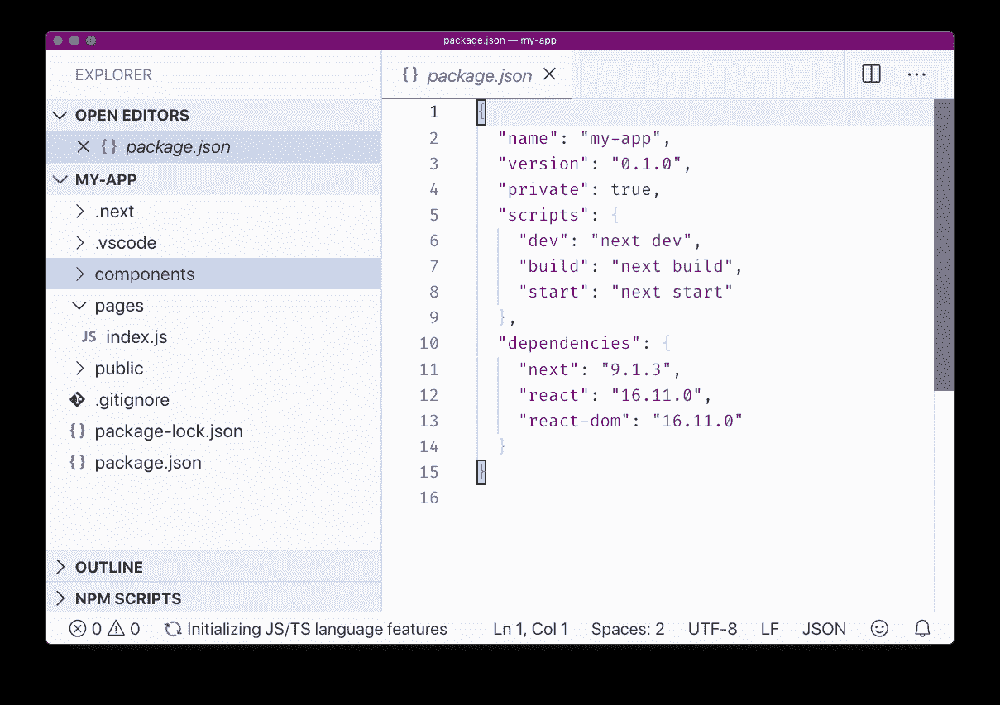

您可以通过运行`npm run dev`立即运行示例应用程序:

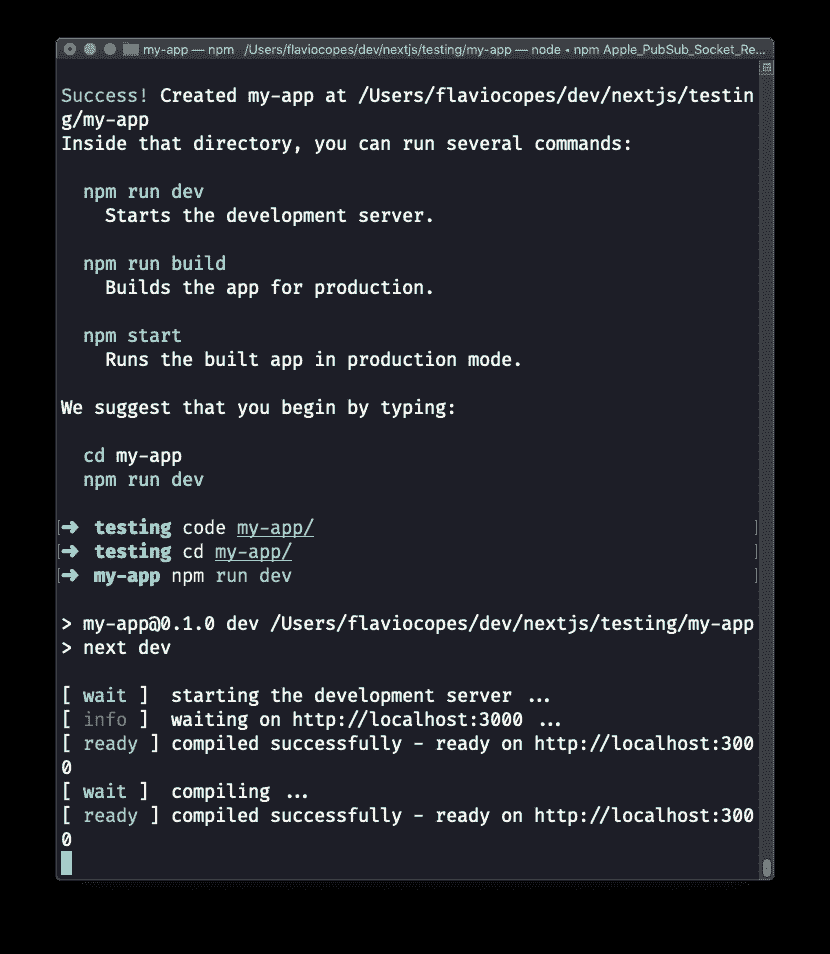

下面是在 [http://localhost:3000](http://localhost:3000) 上的结果:

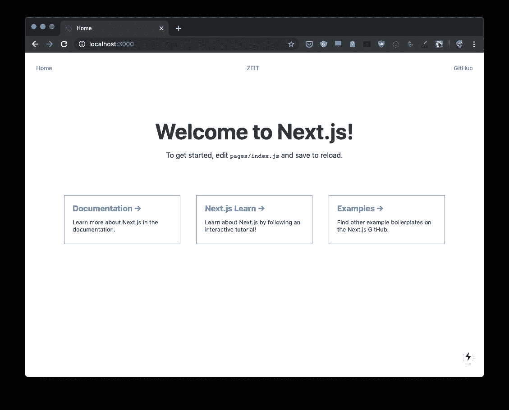

这是启动 Next.js 应用程序的推荐方式，因为它为您提供了可以使用的结构和示例代码。不仅仅是默认示例应用程序；通过使用`--example`选项，您可以使用存储在[https://github.com/zeit/next.js/tree/canary/examples](https://github.com/zeit/next.js/tree/canary/examples)的任何示例。例如，尝试:

```
npx create-next-app --example blog-starter 
```

这为您提供了一个立即可用的 blog 实例，并且语法高亮显示:


### 手动创建 Next.js 应用程序

如果你想从头开始创建下一个应用，你可以避免`create-next-app`。方法如下:在您喜欢的任何地方创建一个空文件夹，例如在您的个人文件夹中，然后进入它:

```
mkdir nextjs
cd nextjs 
```

并创建您的第一个下一个项目目录:

```
mkdir firstproject
cd firstproject 
```

现在使用`npm`命令将其初始化为一个节点项目:

```
npm init -y 
```

`-y`选项告诉`npm`使用项目的默认设置，填充一个样本`package.json`文件。

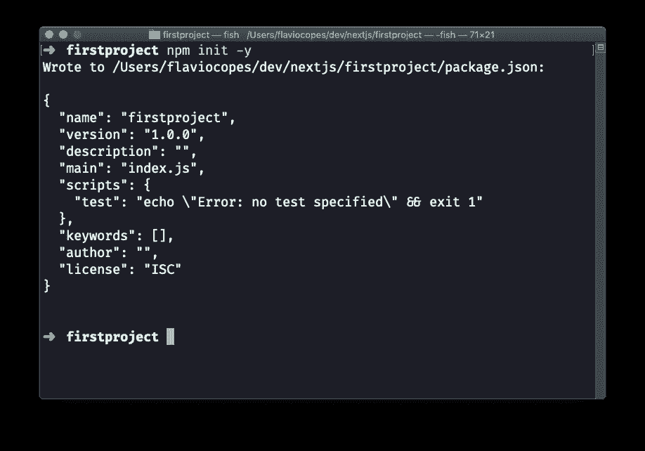

现在安装 Next 并做出反应:

```
npm install next react react-dom 
```

您的项目文件夹现在应该有两个文件:

*   `package.json` ( [看我关于它的教程](https://flaviocopes.com/package-json/))
*   `package-lock.json` ( [见我的包锁教程](https://flaviocopes.com/package-lock-json/))

和`node_modules`文件夹。

使用您喜欢的编辑器打开项目文件夹。我最喜欢的编辑器是 [VS 代码](https://flaviocopes.com/vscode/)。如果你已经安装了，你可以在你的终端中运行`code .`来打开编辑器中的当前文件夹(如果这个命令对你不起作用，请看[这个](https://code.visualstudio.com/docs/setup/mac#_launching-from-the-command-line)

打开`package.json`，里面现在有这个内容:

```
{
  "name": "firstproject",
  "version": "1.0.0",
  "description": "",
  "main": "index.js",
  "scripts": {
    "test": "echo \"Error: no test specified\" && exit 1"
  },
  "keywords": [],
  "author": "",
  "license": "ISC",
  "dependencies":  {
    "next": "^9.1.2",
    "react": "^16.11.0",
    "react-dom": "^16.11.0"
  }
} 
```

并将`scripts`部分替换为:

```
"scripts": {
  "dev": "next",
  "build": "next build",
  "start": "next start"
} 
```

添加 Next.js 构建命令，我们很快就会用到。

提示:使用`"dev": "next -p 3001",`改变端口，在这个例子中，在端口 3001 上运行。

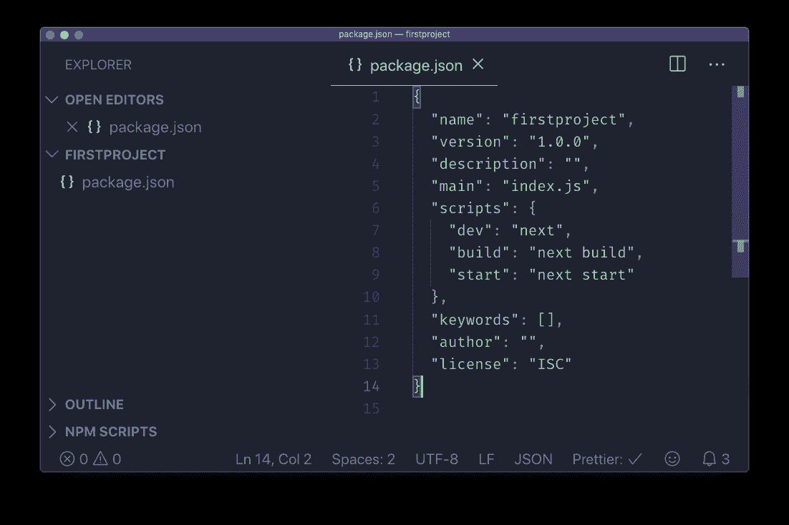

现在创建一个`pages`文件夹，并添加一个`index.js`文件。

在这个文件中，让我们创建第一个 React 组件。

我们将使用它作为默认导出:

```
const Index = () => (
  <div>
    <h1>Home page</h1>
  </div>
)

export default Index 
```

现在使用终端，运行`npm run dev`启动下一个开发服务器。

这将使应用程序在本地主机的端口 3000 上可用。

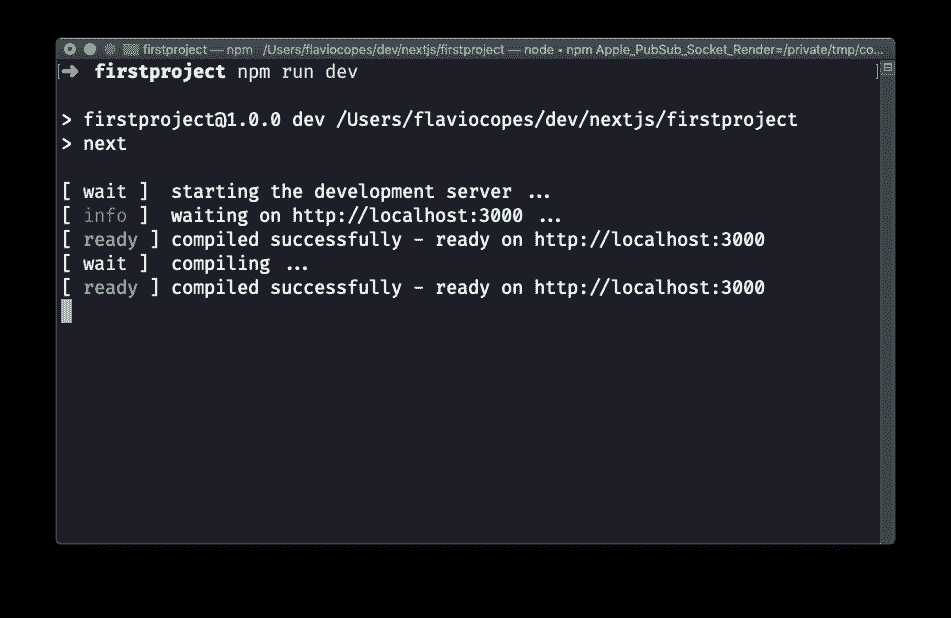

在浏览器中打开 [http://localhost:3000](http://localhost:3000) 查看。

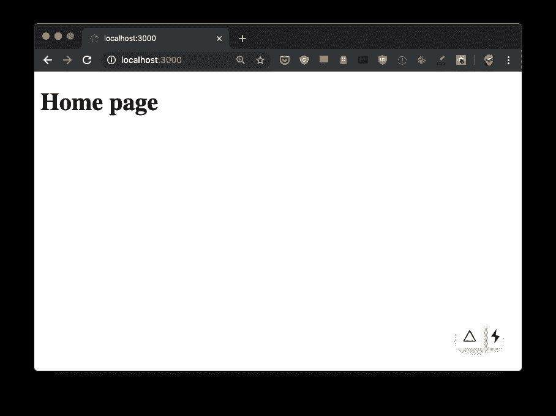

## 查看源以确认 SSR 正在工作

现在让我们检查一下应用程序是否如我们预期的那样工作。是 Next.js 的 app，所以应该是**服务器端渲染**。

这是 Next.js 的主要卖点之一:如果我们使用 Next.js 创建一个站点，站点页面就会呈现在服务器上，服务器将 HTML 传递给浏览器。

这有 3 个主要好处:

*   客户端不需要实例化 React 来呈现，这使得站点对用户来说更快。
*   搜索引擎将对页面进行索引，而不需要运行客户端 JavaScript。谷歌开始做的事情，但公开承认这是一个更慢的过程(如果你想排名靠前，你应该尽可能地帮助谷歌)。
*   你可以使用社交媒体元标签，这有助于添加预览图片，为你在脸书、Twitter 等网站上分享的任何页面定制标题和描述。

我们来查看一下 app 的源码。使用 Chrome 你可以在页面的任何地方点击鼠标右键，然后按下**查看页面来源**。

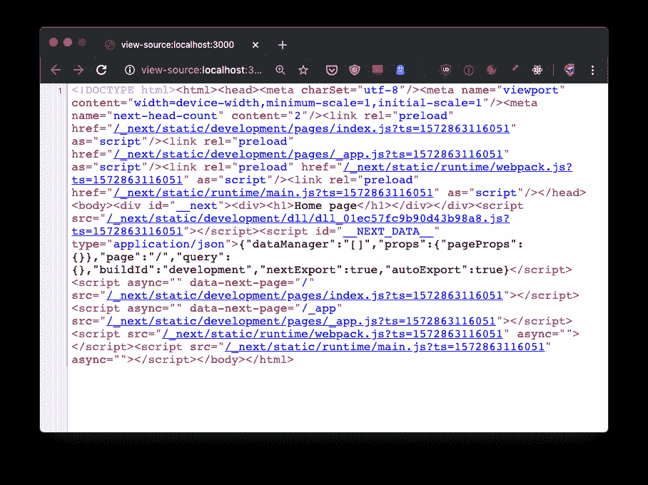

如果您查看页面的源代码，您会看到 HTML `body`中的`<div><h1>Home page</h1></div>`片段，以及一堆 JavaScript 文件——应用捆绑包。

我们不需要设置任何东西，SSR(服务器端渲染)已经为我们工作了。

React 应用程序将在客户端启动，并使用客户端渲染为点击链接等交互提供动力。但是重新加载页面会从服务器重新加载。使用 Next.js，浏览器内部的结果应该没有什么不同——服务器端呈现的页面看起来应该和客户端呈现的页面一模一样。

## 应用捆绑包

当我们查看页面源代码时，我们看到加载了一堆 JavaScript 文件:

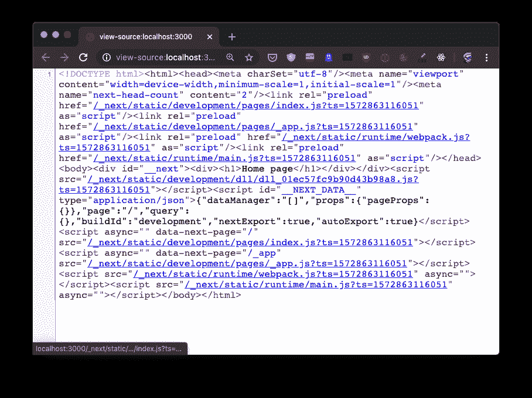

让我们首先将代码放入一个 [HTML 格式器](https://htmlformatter.com/)中，以便更好地格式化它，这样我们人类就可以更好地理解它:

```
<!DOCTYPE html>
<html>

<head>
    <meta charSet="utf-8" />
    <meta name="viewport" content="width=device-width,minimum-scale=1,initial-scale=1" />
    <meta name="next-head-count" content="2" />
    <link rel="preload" href="/_next/static/development/pages/index.js?ts=1572863116051" as="script" />
    <link rel="preload" href="/_next/static/development/pages/_app.js?ts=1572863116051" as="script" />
    <link rel="preload" href="/_next/static/runtime/webpack.js?ts=1572863116051" as="script" />
    <link rel="preload" href="/_next/static/runtime/main.js?ts=1572863116051" as="script" />
</head>

<body>
    <div id="__next">
        <div>
            <h1>Home page</h1></div>
    </div>
    <script src="/_next/static/development/dll/dll_01ec57fc9b90d43b98a8.js?ts=1572863116051"></script>
    <script id="__NEXT_DATA__" type="application/json">{"dataManager":"[]","props":{"pageProps":{}},"page":"/","query":{},"buildId":"development","nextExport":true,"autoExport":true}</script>
    <script async="" data-next-page="/" src="/_next/static/development/pages/index.js?ts=1572863116051"></script>
    <script async="" data-next-page="/_app" src="/_next/static/development/pages/_app.js?ts=1572863116051"></script>
    <script src="/_next/static/runtime/webpack.js?ts=1572863116051" async=""></script>
    <script src="/_next/static/runtime/main.js?ts=1572863116051" async=""></script>
</body>

</html> 
```

我们有 4 个 JavaScript 文件被声明预加载到`head`中，使用`rel="preload" as="script"`:

*   `/_next/static/development/pages/index.js` (96 LOC)
*   `/_next/static/development/pages/_app.js` (5900 LOC)
*   `/_next/static/runtime/webpack.js` (939 位置)
*   `/_next/static/runtime/main.js` (12k 锁定)

这告诉浏览器在正常的呈现流程开始之前尽快开始加载这些文件。如果没有这些，脚本加载将会有额外的延迟，这将提高页面加载性能。

然后在`body`的末尾加载这 4 个文件，同时加载的还有`/_next/static/development/dll/dll_01ec57fc9b90d43b98a8.js` (31k LOC)，以及一个为页面数据设置一些默认值的 JSON 片段:

```
<script id="__NEXT_DATA__" type="application/json">
{
  "dataManager": "[]",
  "props": {
    "pageProps":  {}
  },
  "page": "/",
  "query": {},
  "buildId": "development",
  "nextExport": true,
  "autoExport": true
}
</script> 
```

加载的 4 个包文件已经实现了一个叫做代码分割的特性。`index.js`文件提供了`index`组件所需的代码，该组件服务于`/`路线，如果我们有更多的页面，我们将为每个页面提供更多的包，这些包将只在需要时才被加载——为页面提供更高性能的加载时间。

## 右下角的图标是什么？

你看到页面右下角那个看起来像闪电的小图标了吗？


如果您将鼠标悬停在它上面，它会显示“预渲染页面”:

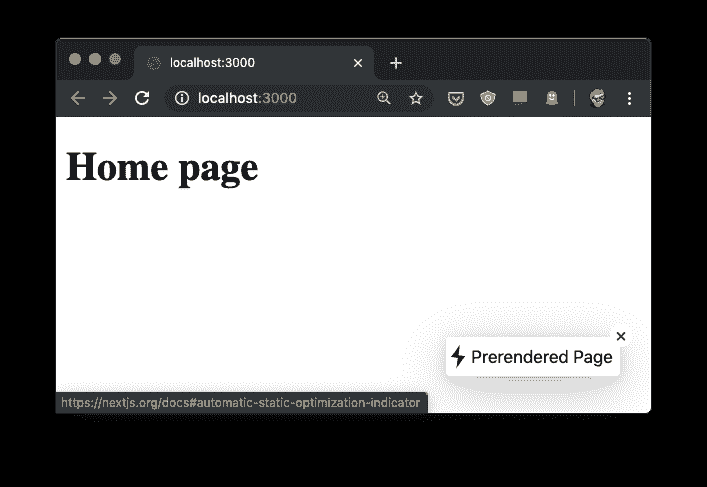

当然，这个图标*只在开发模式*下可见，它告诉你页面符合自动静态优化的条件，这基本上意味着它不依赖于需要在调用时获取的数据，并且它可以在构建时(当我们运行`npm run build`时)被预渲染并构建为静态 HTML 文件。

Next 可以通过缺少附加到页面组件的`getInitialProps()`方法来确定这一点。

在这种情况下，我们的页面甚至可以更快，因为它将作为 HTML 文件静态提供，而不是通过生成 HTML 输出的 Node.js 服务器。

另一个有用的图标可能会出现在它旁边，或者在非预呈现页面上代替它，这是一个小的动画三角形:


这是一个编译指示器，在热代码重新加载开始自动在应用程序中重新加载代码之前，当您保存页面并且 Next.js 正在编译应用程序时，它会出现。

这是一个非常好的方法，可以立即确定应用程序是否已经编译，并且可以测试您正在处理的部分。

## 安装 React 开发人员工具

Next.js 是基于 React 的，所以我们绝对需要安装的一个非常有用的工具(如果你还没有安装的话)是 React 开发者工具。

React 开发者工具可用于 Chrome 和 T2 Firefox，是你检查 React 应用的必备工具。

现在，React 开发人员工具并不特定于 Next.js，但是我想介绍它们，因为您可能并不完全熟悉 React 提供的所有工具。最好稍微深入调试工具，而不是假设你已经了解它们。

它们提供了一个检查器，可以显示构建页面的 React 组件树，对于每个组件，您可以检查道具、状态、钩子等等。

一旦你安装了 React 开发者工具，你可以打开常规浏览器 devtools(在 Chrome 中，在页面中右键点击，然后点击`Inspect`，你会发现 2 个新面板:**组件**和**剖析器**。

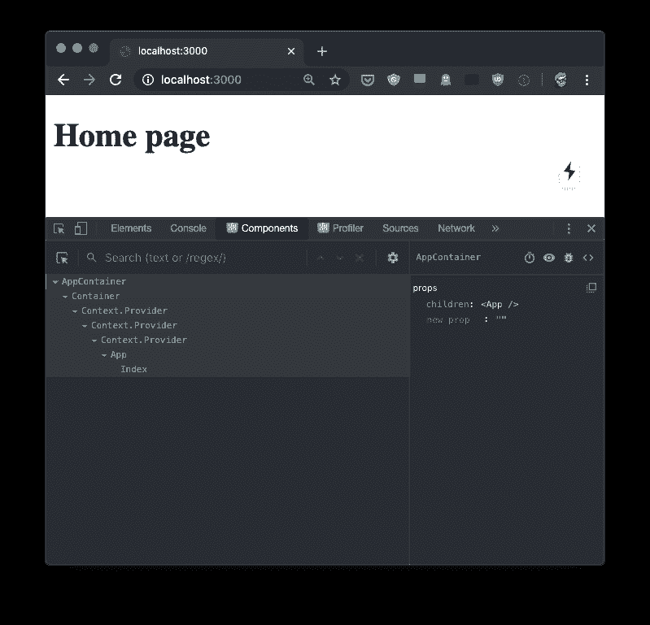

如果您将鼠标移动到组件上，您将看到在页面中，浏览器将选择由该组件呈现的部分。

如果您选择树中的任何组件，右边的面板将显示对父组件的引用**，以及传递给它的属性:**

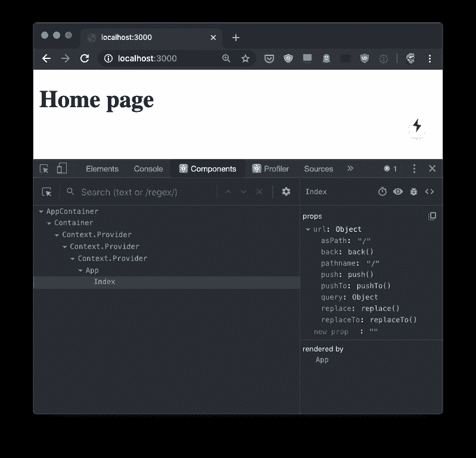

您可以通过单击组件名称来轻松导航。

您可以单击 Developer Tools 工具栏中的眼睛图标来检查 DOM 元素，并且如果您使用第一个图标，即带有鼠标图标的图标(它方便地位于类似的常规 DevTools 图标之下)，您可以将鼠标悬停在浏览器 UI 中的元素上，以直接选择呈现它的 React 组件。

您可以使用`bug`图标将组件数据记录到控制台。

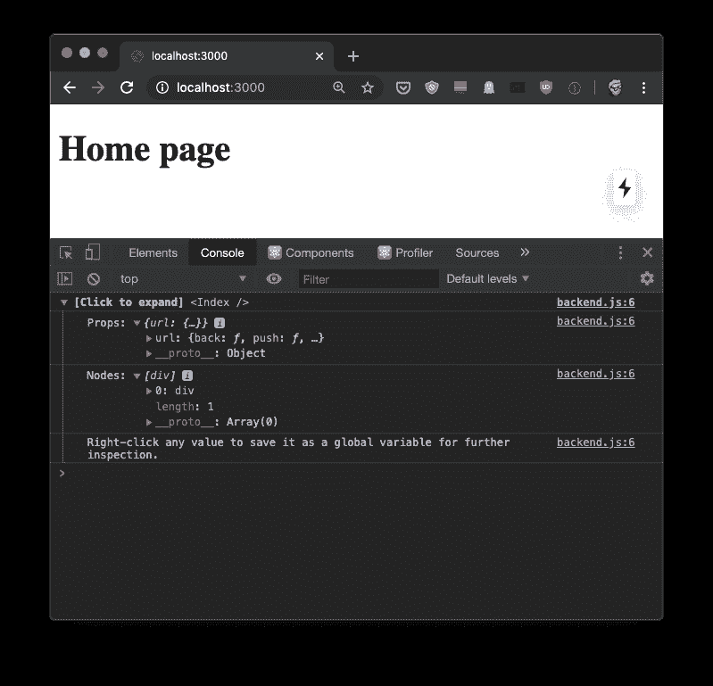

这真是太棒了，因为一旦你把数据打印出来，你就可以右击任何元素，然后按“存储为全局变量”。例如，在这里我用`url` prop 完成了它，并且我能够在控制台中使用分配给它的临时变量`temp1`来检查它:

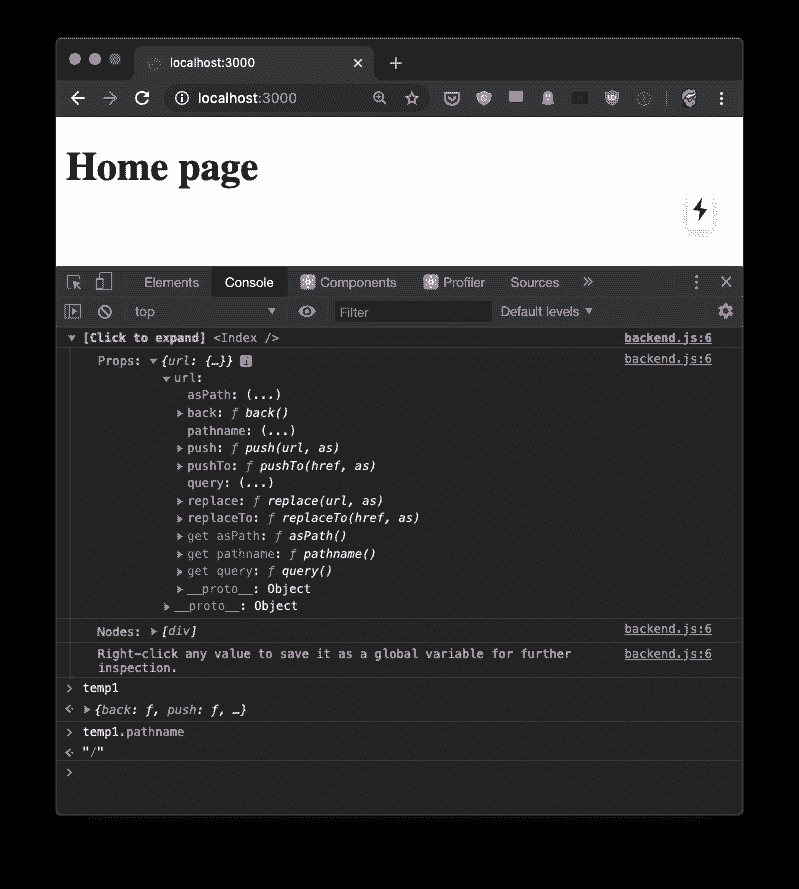

使用 Next.js 在开发模式下自动加载的**源映射**，我们可以在组件面板中单击`<>`代码，DevTools 将切换到源面板，向我们显示组件源代码:

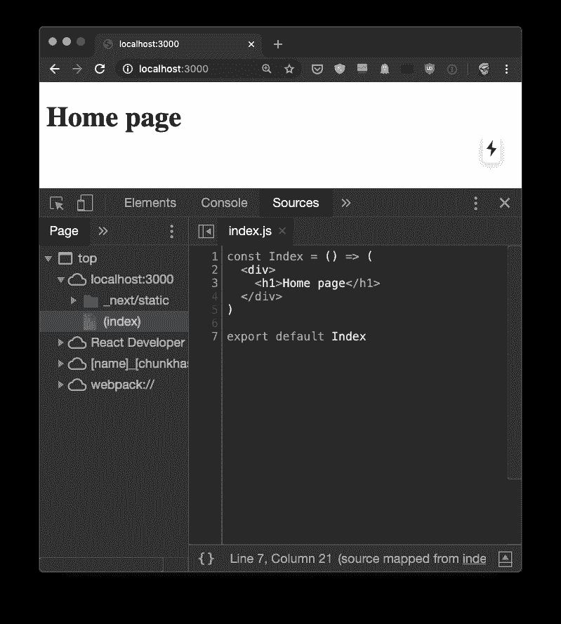

如果可能的话， **Profiler** 选项卡甚至更棒。它允许我们**在应用程序中记录一个交互**，看看会发生什么。我还不能展示一个例子，因为它需要至少 2 个组件来创建一个交互，而我们现在只有一个。这个我以后再说。

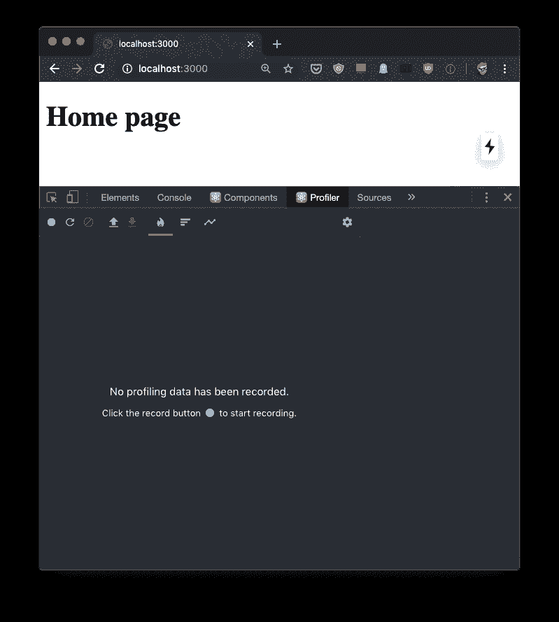

我展示了所有使用 Chrome 的截图，但是 React 开发者工具在 Firefox 中的工作方式是一样的:

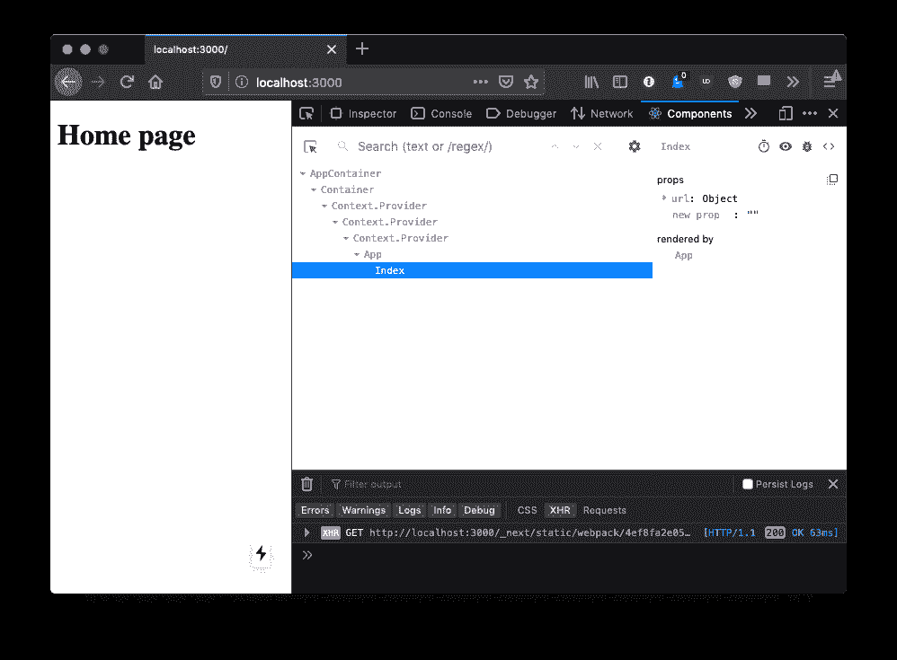

## 您可以使用的其他调试技术

除了对构建 Next.js 应用程序至关重要的 React 开发人员工具之外，我想强调调试 Next.js 应用程序的两种方法。

第一个显然是`console.log()`和所有的[其他控制台 API](https://flaviocopes.com/console-api/) 工具。Next apps 的工作方式将使一个日志语句在浏览器控制台或使用`npm run dev`启动 Next 的终端中工作。

特别是，如果页面从服务器加载，当您将 URL 指向它时，或者当您点击刷新按钮/ cmd/ctrl-R 时，任何控制台日志记录都会在终端中发生。

通过单击鼠标发生的后续页面转换将使所有控制台日志记录发生在浏览器中。

请记住，如果您对遗漏日志感到惊讶。

另一个重要的工具是`debugger`语句。将此语句添加到组件将暂停浏览器呈现页面:


真的很棒，因为现在你可以使用浏览器调试器来检查值，一次一行地运行你的应用程序。

您还可以使用 VS 代码调试器来调试服务器端代码。我提到了这种技术，并通过本教程来设置它。

## 向网站添加第二页

现在我们已经很好地掌握了可以用来帮助我们开发 Next.js 应用程序的工具，让我们从我们离开第一个应用程序的地方继续:

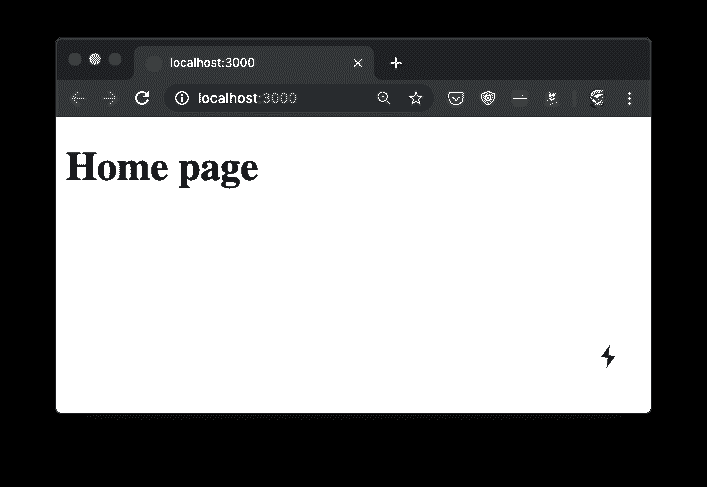

我想添加这个网站的第二页，一个博客。它将被提供给`/blog`，目前它将只包含一个简单的静态页面，就像我们的第一个`index.js`组件一样:

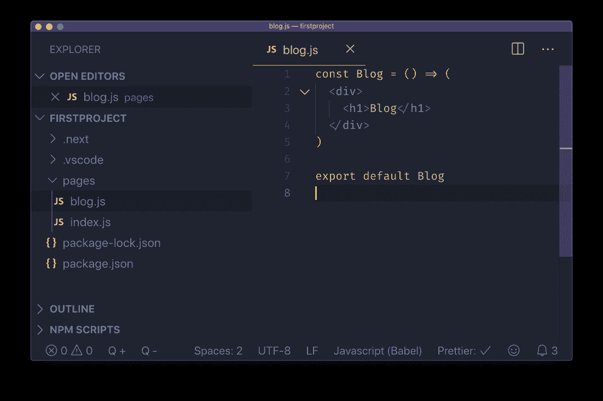

保存新文件后，已经运行的`npm run dev`进程已经能够呈现页面，而不需要重新启动它。

当我们点击 URL[http://localhost:3000/blog](http://localhost:3000/blog)时，我们有了新的页面:

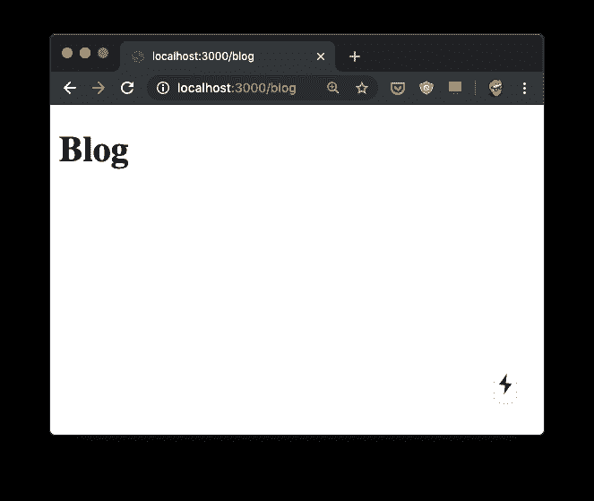

这是终端告诉我们的:

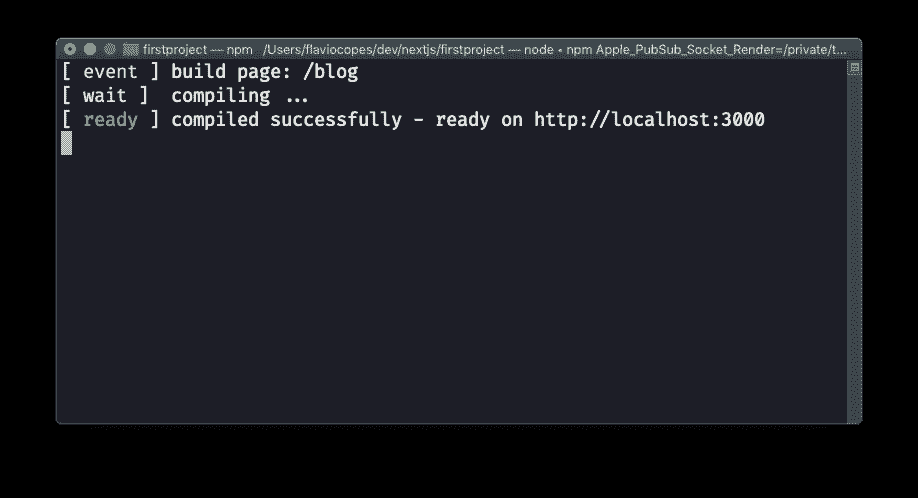

现在，URL 是`/blog`的事实仅仅取决于文件名，以及它在`pages`文件夹下的位置。

您可以创建一个`pages/hey/ho`页面，该页面将显示在 URL[http://localhost:3000/hey/ho](http://localhost:3000/hey/ho)上。

对于 URL 来说，不重要的是文件中的组件名。

尝试去查看页面的源代码，当从服务器加载时，它会将`/_next/static/development/pages/blog.js`列为加载的包之一，而不是像主页中的`/_next/static/development/pages/index.js`。这是因为由于自动代码分割，我们不需要为主页服务的包。只是服务于博客页面的包。

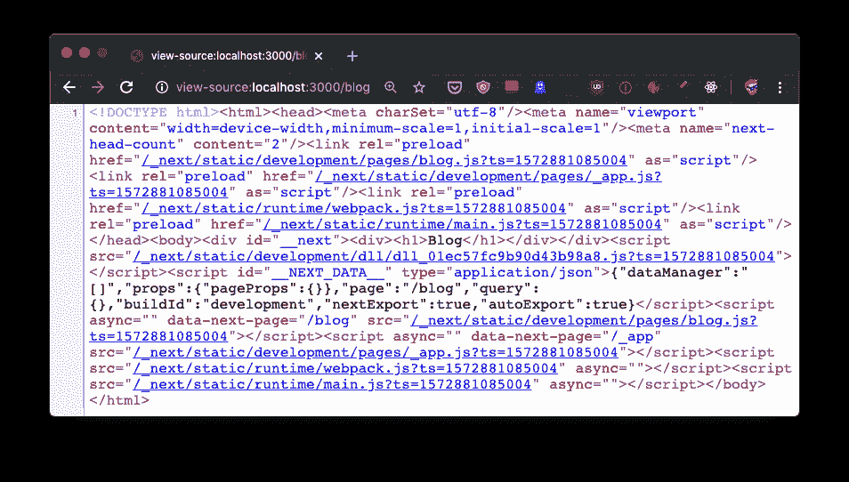

我们也可以从`blog.js`中导出一个匿名函数:

```
export default () => (
  <div>
    <h1>Blog</h1>
  </div>
) 
```

或者，如果您喜欢非箭头函数语法:

```
export default function() {
  return (
    <div>
      <h1>Blog</h1>
    </div>
  )
} 
```

## 链接两页

现在我们有 2 个页面，由`index.js`和`blog.js`定义，我们可以引入链接。

页面中的普通 HTML 链接是使用`a`标签完成的:

```
<a href="/blog">Blog</a> 
```

我们不能在 Next.js 中这样做。

为什么？我们从技术上讲*可以*，当然，因为这是 Web，Web 上的*永远不会破坏*(这就是为什么我们仍然可以使用`<marquee>`标签。但是使用 Next 的一个主要好处是，一旦一个页面被加载，由于客户端渲染，转换到另一个页面的速度非常快。

如果使用普通的`a`链接:

```
const Index = () => (
  <div>
    <h1>Home page</h1>
    <a href='/blog'>Blog</a>
  </div>
)

export default Index 
```

现在打开 **DevTools** ，特别是**网络面板**。第一次加载`http://localhost:3000/`时，我们加载了所有的页面包:

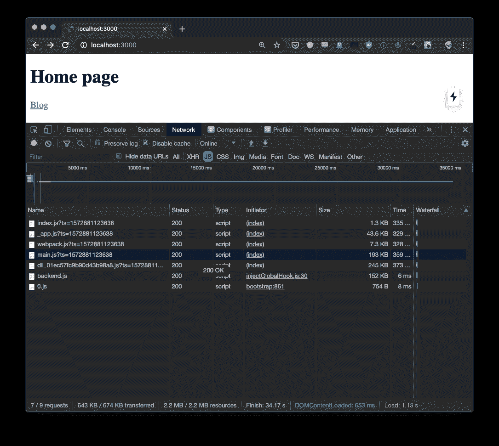

现在，如果你点击“保存日志”按钮(以避免清除网络面板)，并点击“博客”链接，这是发生的事情:

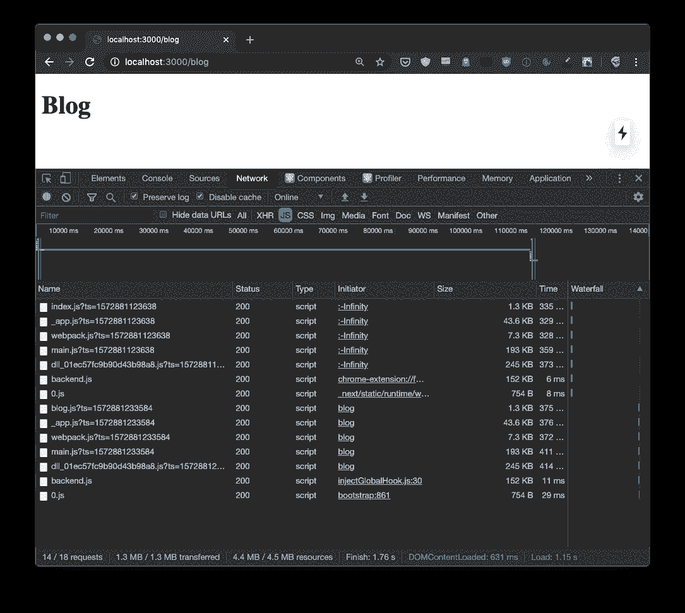

我们又一次从服务器获得了所有的 JavaScript 代码！但是..如果我们已经有了 JavaScript，我们就不需要它了。我们只需要`blog.js`页面包，这是页面中唯一的新内容。

为了解决这个问题，我们使用了 Next 提供的一个组件，叫做 Link。

我们导入它:

```
import Link from 'next/link' 
```

然后我们用它来包装我们的链接，就像这样:

```
import Link from 'next/link'

const Index = () => (
  <div>
    <h1>Home page</h1>
    <Link href='/blog'>
      <a>Blog</a>
    </Link>
  </div>
)

export default Index 
```

现在，如果您重试我们之前做的事情，您将能够看到当我们移动到博客页面时，只有`blog.js`包被加载:

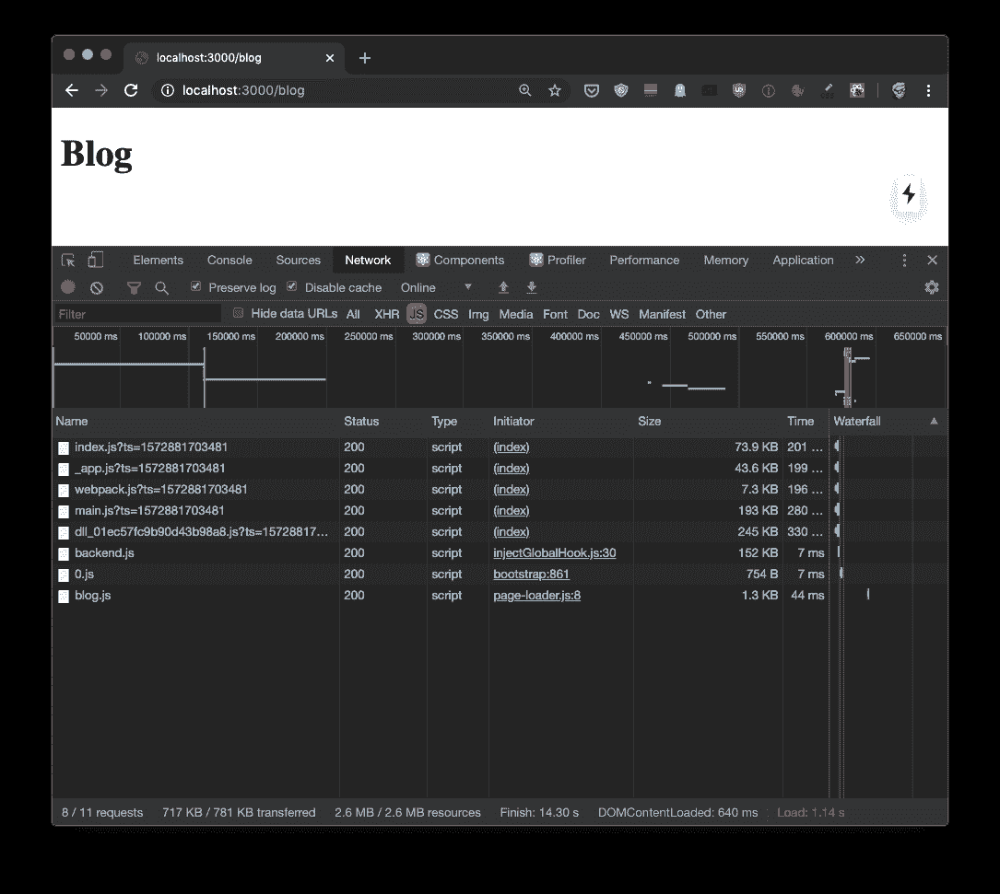

而且页面加载的速度比以前更快了，浏览器通常在标签上的微调甚至没有出现。然而，如您所见，URL 发生了变化。这与浏览器[历史 API](https://flaviocopes.com/history-api/) 无缝协作。

这是客户端的渲染。

如果你现在按后退键会怎么样？没有加载任何东西，因为浏览器仍然有旧的`index.js`包，准备加载`/index`路由。都是自动的！

## 路由器的动态内容

在前一章中，我们看到了如何将主页链接到博客页面。

博客是 Next.js 的一个很好的用例，我们将在本章中通过添加**博客文章**来继续探索这个用例。

博客文章有一个动态 URL。例如，标题为“Hello World”的帖子可能有 URL `/blog/hello-world`。标题为“我的第二篇文章”的文章可能有 URL `/blog/my-second-post`。

这些内容是动态的，可能来自数据库、降价文件或更多。

Next.js 可以提供基于动态 URL 的动态内容。

我们通过使用`[]`语法创建一个动态页面来创建一个动态 URL。

怎么会？我们添加一个`pages/blog/[id].js`文件。这个文件将处理`/blog/`路径下的所有动态 URL，就像我们上面提到的:`/blog/hello-world`、`/blog/my-second-post`等等。

在文件名中，方括号内的`[id]`表示任何动态的东西都会放在**路由器**的**查询属性**的`id`参数内。

好吧，一次做太多事情了。

什么是**路由器**？

路由器是 Next.js 提供的库。

我们从`next/router`导入它:

```
import { useRouter } from 'next/router' 
```

一旦我们有了`useRouter`，我们就用以下方法实例化路由器对象:

```
const router = useRouter() 
```

一旦我们有了这个路由器对象，我们就可以从中提取信息。

特别是，我们可以通过访问`router.query.id`来获取`[id].js`文件中 URL 的动态部分。

动态部分也可以只是 URL 的一部分，比如`post-[id].js`。

所以让我们继续把这些东西应用到实践中。

创建文件`pages/blog/[id].js`:

```
import { useRouter } from 'next/router'

export default () => {
  const router = useRouter()

  return (
    <>
      <h1>Blog post</h1>
      <p>Post id: {router.query.id}</p>
    </>
  )
} 
```

现在，如果您转到`http://localhost:3000/blog/test`路由器，您应该会看到:

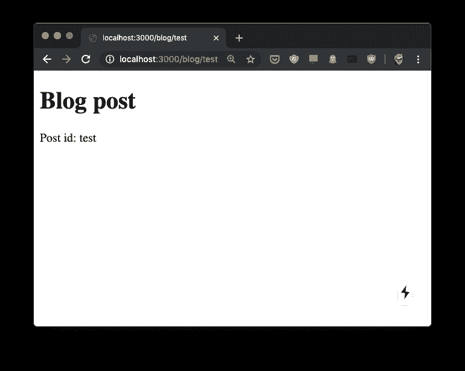

我们可以使用这个`id`参数从帖子列表中收集帖子。例如，从数据库中。为了简单起见，我们将在项目根文件夹中添加一个`posts.json`文件:

```
{
  "test": {
    "title": "test post",
    "content": "Hey some post content"
  },
  "second": {
    "title": "second post",
    "content": "Hey this is the second post content"
  }
} 
```

现在我们可以导入它，并从`id`键查找文章:

```
import { useRouter } from 'next/router'
import posts from '../../posts.json'

export default () => {
  const router = useRouter()

  const post = posts[router.query.id]

  return (
    <>
      <h1>{post.title}</h1>
      <p>{post.content}</p>
    </>
  )
} 
```

重新加载页面应该会向我们显示以下结果:

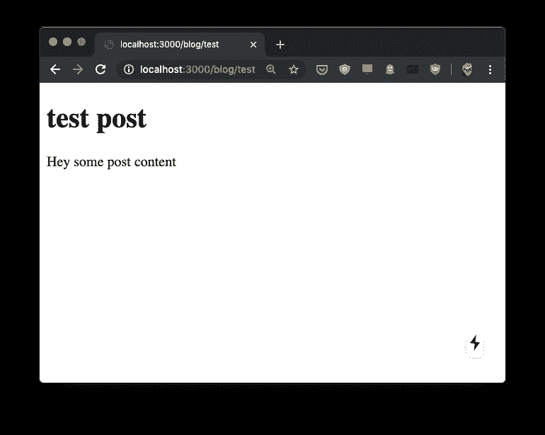

但其实不是！相反，我们在控制台中得到一个错误，在浏览器中也得到一个错误:


为什么？因为..在呈现期间，当组件被初始化时，数据还不在那里。我们将在下一课中看到如何使用 getInitialProps 向组件提供数据。

现在，在归还 JSX 之前，再做一点检查:

```
import { useRouter } from 'next/router'
import posts from '../../posts.json'

export default () => {
  const router = useRouter()

  const post = posts[router.query.id]
  if (!post) return <p></p>

  return (
    <>
      <h1>{post.title}</h1>
      <p>{post.content}</p>
    </>
  )
} 
```

现在事情应该正常了。最初，组件在没有动态`router.query.id`信息的情况下呈现。呈现后，Next.js 用查询值触发更新，页面显示正确的信息。

如果您查看 source，HTML 中有一个空的`<p>`标记:

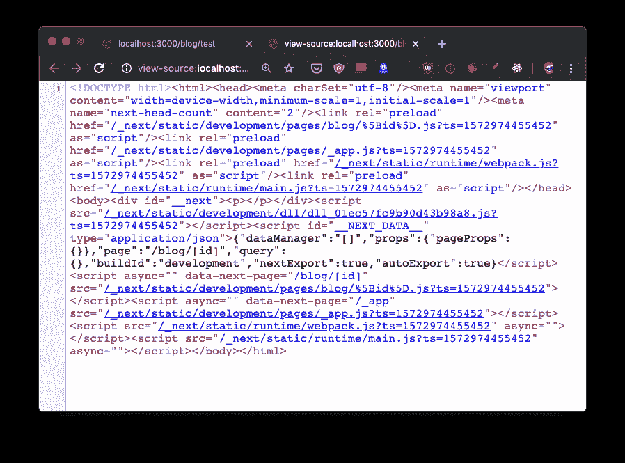

我们将很快解决这个问题，无法实现 SSR，这损害了我们的用户，搜索引擎优化和社会共享的加载时间，正如我们已经讨论过的。

我们可以通过在`pages/blog.js`中列出这些帖子来完成博客示例:

```
import posts from '../posts.json'

const Blog = () => (
  <div>
    <h1>Blog</h1>

    <ul>
      {Object.entries(posts).map((value, index) => {
        return <li key={index}>{value[1].title}</li>
      })}
    </ul>
  </div>
)

export default Blog 
```

通过从`next/link`导入`Link`并在 posts 循环中使用它，我们可以将它们链接到单独的帖子页面:

```
import Link from 'next/link'
import posts from '../posts.json'

const Blog = () => (
  <div>
    <h1>Blog</h1>

    <ul>
      {Object.entries(posts).map((value, index) => {
        return (
          <li key={index}>
            <Link href='/blog/[id]' as={'/blog/' + value[0]}>
              <a>{value[1].title}</a>
            </Link>
          </li>
        )
      })}
    </ul>
  </div>
)

export default Blog 
```

## 预取

我之前提到过如何使用`Link` Next.js 组件来创建两个页面之间的链接，当你使用它时，Next.js **透明地为我们处理前端路由**，因此当用户点击链接时，前端会显示新页面，而不会触发新的客户端/服务器请求和响应周期，这在网页中很常见。

当您使用`Link`时，Next.js 还会为您做另一件事。

一旦封装在`<Link>`中的元素出现在视口中(这意味着它对网站用户可见)，Next.js 就会预取它指向的 URL，只要它是本地链接(在您的网站上)，使应用程序对查看者来说非常快。

这种行为只有在**生产模式**下才会被触发(我们将在后面深入讨论)，这意味着如果你用`npm run dev`运行应用程序，你必须停止它，用`npm run build`编译你的生产包，然后用`npm run start`运行它。

使用 DevTools 中的网络检查器，您会注意到，在页面加载时，只要页面上的`load`事件被触发(当页面完全加载时触发，在`DOMContentLoaded`事件之后发生),文件夹上方的任何链接都会开始预取。

当用户滚动并且它

预取在高速连接(Wifi 和 3g+连接)上是自动的，除非浏览器发送 [`Save-Data` HTTP 报头](https://developer.mozilla.org/en-US/docs/Web/HTTP/Headers/Save-Data)。

您可以通过将`prefetch`属性设置为`false`来退出预取单个`Link`实例:

```
<Link href="/a-link" prefetch={false}>
  <a>A link</a>
</Link> 
```

## 使用路由器检测活动链路

使用链接时，一个非常重要的特性是确定什么是当前的 URL，特别是为活动链接分配一个类，这样我们就可以使它的样式不同于其他链接。

例如，这在你的站点标题中特别有用。

在`next/link`中提供的 Next.js 默认`Link`组件不会自动为我们做这件事。

我们可以自己创建一个链接组件，并将它存储在 Components 文件夹中的文件`Link.js`中，然后导入它，而不是默认的`next/link`。

在这个组件中，我们将首先从`react`导入 React，从`next/link`导入 Link，从`next/router`导入`useRouter`钩子。

在组件内部，我们确定当前路径名是否与组件的属性`href`匹配，如果匹配，我们将`selected`类附加到子组件。

我们最后使用`React.cloneElement()`返回这个带有更新类的孩子:

```
import React from 'react'
import Link from 'next/link'
import { useRouter } from 'next/router'

export default ({ href, children }) => {
  const router = useRouter()

  let className = children.props.className || ''
  if (router.pathname === href) {
    className = `${className} selected`
  }

  return <Link href={href}>{React.cloneElement(children, { className })}</Link>
} 
```

## 使用`next/router`

我们已经看到了如何使用 Link 组件在 Next.js 应用程序中声明性地处理路由。

在 JSX 管理路由确实很方便，但有时您需要以编程方式触发路由更改。

在这种情况下，可以直接访问`next/router`包中提供的 Next.js 路由器，调用它的`push()`方法。

下面是一个访问路由器的示例:

```
import { useRouter } from 'next/router'

export default () => {
  const router = useRouter()
  //...
} 
```

一旦我们通过调用`useRouter()`获得了路由器对象，我们就可以使用它的方法。

这是客户端路由器，所以方法应该只用于面向前端的代码。确保这一点的最简单方法是将调用包装在`useEffect()` React 钩子中，或者在 React 有状态组件的`componentDidMount()`中。

您可能最常用的是`push()`和`prefetch()`。

`push()`允许我们以编程方式触发一个 URL 更改，在前端:

```
router.push('/login') 
```

`prefetch()`允许我们以编程方式预取一个 URL，这在我们没有自动为我们处理预取的`Link`标签时很有用:

```
router.prefetch('/login') 
```

完整示例:

```
import { useRouter } from 'next/router'

export default () => {
  const router = useRouter()

  useEffect(() => {
    router.prefetch('/login')
  })
} 
```

您还可以使用路由器监听[路由变更事件](https://nextjs.org/docs#router-events)。

## 使用 getInitialProps 向组件提供数据

在前一章中，我们遇到了动态生成文章页面的问题，因为组件需要预先准备一些数据，当我们试图从 JSON 文件中获取数据时:

```
import { useRouter } from 'next/router'
import posts from '../../posts.json'

export default () => {
  const router = useRouter()

  const post = posts[router.query.id]

  return (
    <>
      <h1>{post.title}</h1>
      <p>{post.content}</p>
    </>
  )
} 
```

我们得到了这个错误:

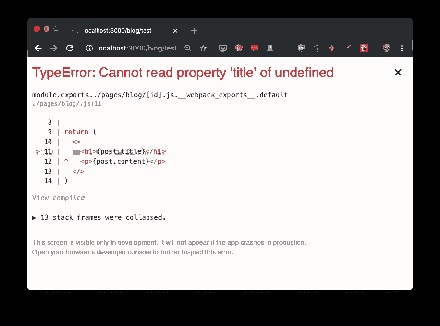

我们如何解决这个问题？我们如何让 SSR 适用于动态路由？

我们必须为组件提供道具，使用一个名为`getInitialProps()`的特殊函数，这个函数附加在组件上。

为此，首先我们将组件命名为:

```
const Post = () => {
  //...
}

export default Post 
```

然后我们给它加上函数:

```
const Post = () => {
  //...
}

Post.getInitialProps = () => {
  //...
}

export default Post 
```

该函数获取一个对象作为其参数，该对象包含几个属性。特别是，我们现在感兴趣的是获取`query`对象，这个对象是我们之前用来获取文章 id 的。

所以我们可以使用*对象析构*语法得到它:

```
Post.getInitialProps = ({ query }) => {
  //...
} 
```

现在我们可以从这个函数返回帖子:

```
Post.getInitialProps = ({ query }) => {
  return {
    post: posts[query.id]
  }
} 
```

我们也可以删除`useRouter`的导入，我们从传递给`Post`组件的`props`属性中获得 post:

```
import posts from '../../posts.json'

const Post = props => {
  return (
    <div>
      <h1>{props.post.title}</h1>
      <p>{props.post.content}</p>
    </div>
  )
}

Post.getInitialProps = ({ query }) => {
  return {
    post: posts[query.id]
  }
}

export default Post 
```

现在不会有错误，SSR 将按预期工作，如您所见检查视图源代码:

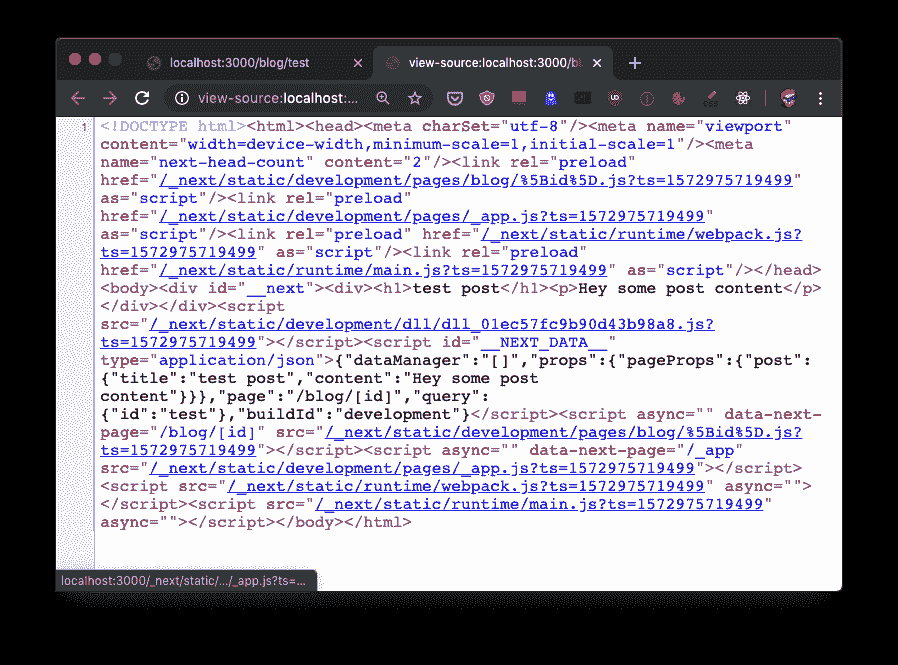

当我们像以前一样使用`Link`组件导航到一个新页面时，`getInitialProps`函数将在服务器端执行，但也在客户端执行。

值得注意的是，`getInitialProps`在其接收的上下文对象中，除了`query`对象之外，还获得了以下其他属性:

*   `pathname`:URL 的`path`段
*   `asPath` -字符串的实际路径(包括查询)显示在浏览器中

这在调用`http://localhost:3000/blog/test`的情况下将分别导致:

*   `/blog/[id]`
*   `/blog/test`

在服务器端渲染的情况下，它还将接收:

*   `req`:HTTP 请求对象
*   `res`:HTTP 响应对象
*   `err`:错误对象

如果你做过 Node.js 编码，你会对`req`和`res`很熟悉。

## 半铸钢ˌ钢性铸铁(Cast Semi-Steel)

在 Next.js 中我们如何对 React 组件进行样式化？

我们有很大的自由，因为我们可以使用任何我们喜欢的图书馆。

但是 Next.js 内置了 [`styled-jsx`](https://github.com/zeit/styled-jsx) ，因为这是由从事 Next.js 的同一批人构建的库

它是一个非常酷的库，为我们提供了作用域 CSS，这对可维护性非常好，因为 CSS 只影响它所应用的组件。

我认为这是编写 CSS 的一个很好的方法，不需要应用额外的库或增加复杂性的预处理程序。

为了将 CSS 添加到 Next.js 中的 React 组件，我们将它插入到 JSX 的一个代码片段中，该代码片段以

```
<style jsx>{` 
```

结尾是

```
`}</style> 
```

在这个奇怪的块中，我们编写普通的 CSS，就像在`.css`文件中一样:

```
<style jsx>{`
  h1 {
    font-size: 3rem;
  }
`}</style> 
```

你把它写在 JSX 里面，像这样:

```
const Index = () => (
  <div>
		<h1>Home page</h1>

		<style jsx>{`
		  h1 {
		    font-size: 3rem;
		  }
		`}</style>
  </div>
)

export default Index 
```

在块内部，我们可以使用插值来动态改变值。例如，这里我们假设父组件正在传递一个`size`属性，我们在`styled-jsx`块中使用它:

```
const Index = props => (
  <div>
		<h1>Home page</h1>

		<style jsx>{`
		  h1 {
		    font-size: ${props.size}rem;
		  }
		`}</style>
  </div>
) 
```

如果你想在全局范围内应用一些 CSS，而不是局限于一个组件，你可以将关键字`global`添加到标签`style`:

```
<style jsx global>{`
body {
  margin: 0;
}
`}</style> 
```

如果您想在 Next.js 组件中导入外部 CSS 文件，您必须首先安装`@zeit/next-css`:

```
npm install @zeit/next-css 
```

然后在项目的根目录下创建一个配置文件，名为`next.config.js`，内容如下:

```
const withCSS = require('@zeit/next-css')
module.exports = withCSS() 
```

重新启动下一个应用程序后，您现在可以像通常处理 JavaScript 库或组件一样导入 CSS:

```
import '../style.css' 
```

你也可以直接导入一个 SASS 文件，使用 [`@zeit/next-sass`](https://github.com/zeit/next-plugins/tree/master/packages/next-sass) 库代替。

## 用自定义标签填充 head 标签

从任何 Next.js 页面组件中，您都可以向页面标题添加信息。

这在以下情况下很方便:

*   您想要自定义页面标题
*   你想改变一个元标签

你怎么能这样做？

在每个组件中，您可以从`next/head`导入`Head`组件，并将其包含在您的组件 JSX 输出中:

```
import Head from 'next/head'

const House = props => (
  <div>
    <Head>
      <title>The page title</title>
    </Head>
    {/* the rest of the JSX */}
  </div>
)

export default House 
```

您可以添加任何您希望出现在页面的`<head>`部分的 HTML 标签。

当安装组件时，Next.js 将确保`Head`中的标签被添加到页面的标题中。同样，在卸载组件时，Next.js 会负责删除这些标签。

## 添加包装组件

你网站上的所有页面看起来都差不多。有一个 chrome 窗口，一个通用的基础层，你只想改变里面的东西。

有一个导航栏，一个侧边栏，然后是实际的内容。

在 Next.js 中如何构建这样的系统？

有两种方法。一种是通过创建一个`components/Layout.js`组件，使用一个[高阶组件](https://flaviocopes.com/react-higher-order-components/):

```
export default Page => {
  return () => (
    <div>
      <nav>
        <ul>....</ul>
      </hav>
      <main>
        <Page />
      </main>
    </div>
  )
} 
```

在那里，我们可以为标题和/或侧边栏导入单独的组件，我们还可以添加我们需要的所有 CSS。

你在每一页都用它，像这样:

```
import withLayout from '../components/Layout.js'

const Page = () => <p>Here's a page!</p>

export default withLayout(Page) 
```

但是我发现这仅适用于简单的情况，在这种情况下，您不需要在页面上调用`getInitialProps()`。

为什么？

因为`getInitialProps()`只在页面组件上被调用。但是如果我们从一个页面中导出带有 Layout()的高阶组件，就不会调用`Page.getInitialProps()`。`withLayout.getInitialProps()`平川。

为了避免不必要的代码复杂化，另一种方法是使用 props:

```
export default props => (
  <div>
    <nav>
      <ul>....</ul>
    </hav>
    <main>
      {props.content}
    </main>
  </div>
) 
```

在我们的页面中，我们现在这样使用它:

```
import Layout from '../components/Layout.js'

const Page = () => (
  <Layout content={(
    <p>Here's a page!</p>
  )} />
) 
```

这种方法允许我们在页面组件中使用`getInitialProps()`，唯一的缺点是必须在`content`属性中编写组件 JSX:

```
import Layout from '../components/Layout.js'

const Page = () => (
  <Layout content={(
    <p>Here's a page!</p>
  )} />
)

Page.getInitialProps = ({ query }) => {
  //...
} 
```

## API 路线

除了创建**页面路由**，这意味着页面作为网页提供给浏览器，Next.js 还可以创建 **API 路由**。

这是一个非常有趣的特性，因为这意味着 Next.js 可以用来为 Next.js 本身存储和检索的数据创建一个前端，通过 fetch 请求传输 JSON。

API 路由位于`/pages/api/`文件夹下，并被映射到`/api`端点。

这个特性在创建应用程序时非常有用。

在这些路线中，我们编写 Node.js 代码(而不是 React 代码)。这是一个范式的转变，你从前端移动到后端，但非常无缝。

假设您有一个`/pages/api/comments.js`文件，它的目标是以 JSON 的形式返回一篇博客文章的评论。

假设您有一个存储在`comments.json`文件中的注释列表:

```
[
  {
    "comment": "First"
  },
  {
    "comment": "Nice post"
  }
] 
```

下面是一个示例代码，它向客户端返回注释列表:

```
import comments from './comments.json'

export default (req, res) => {
  res.status(200).json(comments)
} 
```

它将在`/api/comments` URL 上监听 GET 请求，您可以尝试使用您的浏览器调用它:

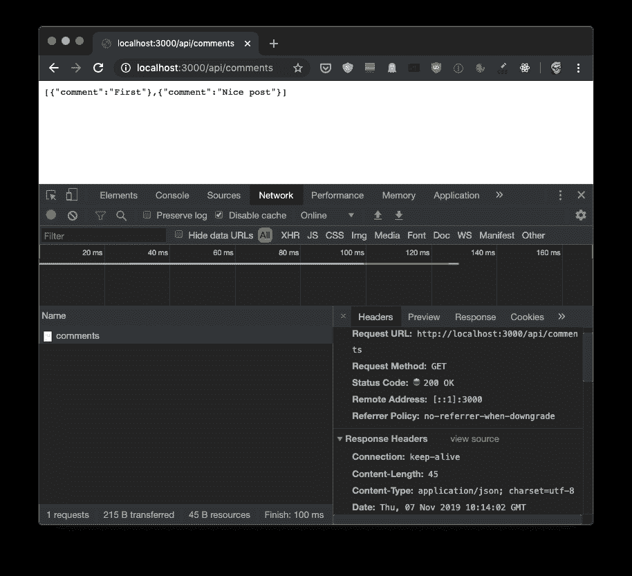

API routes 也可以使用**动态路由**像页面，使用`[]`语法创建一个动态 API route，像`/pages/api/comments/[id].js`将检索特定于帖子 id 的评论。

在`[id].js`中，您可以通过在`req.query`对象中查找来检索`id`值:

```
import comments from '../comments.json'

export default (req, res) => {
  res.status(200).json({ post: req.query.id, comments })
} 
```

您可以在这里看到上面的代码:

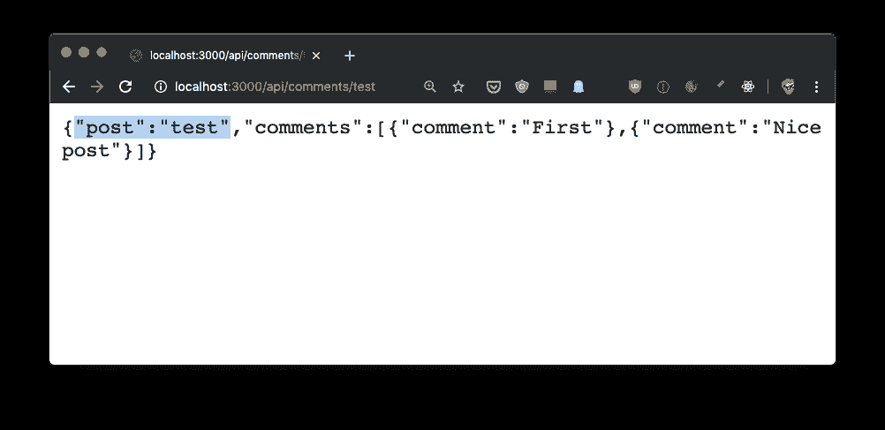

在动态页面中，您需要从`next/router`导入`useRouter`，然后使用`const router = useRouter()`获得路由器对象，然后我们就可以使用`router.query.id`获得`id`值。

在服务器端，这要容易得多，因为查询是附加在请求对象上的。

如果您执行 POST 请求，所有操作都以相同的方式工作——都通过默认导出。

要将 POST 与 GET 和其他 HTTP 方法(PUT、DELETE)分开，请查找`req.method`值:

```
export default (req, res) => {
  switch (req.method) {
    case 'GET':
      //...
      break
    case 'POST':
      //...
      break
    default:
      res.status(405).end() //Method Not Allowed
      break
  }
} 
```

除了我们已经看到的`req.query`和`req.method`，我们还可以通过引用`req.body`中的请求体`req.cookies`来访问 cookies。

在引擎盖下，这一切都是由 [Micro](https://github.com/zeit/micro) 驱动的，这是一个支持异步 HTTP 微服务的库，由构建 Next.js 的同一团队制作。

您可以在我们的 API 路径中使用任何微中间件来添加更多的功能。

## 仅在服务器端或客户端运行代码

在您的页面组件中，通过检查`window`属性，您只能在服务器端或客户端执行代码。

该属性只存在于浏览器中，因此您可以检查

```
if (typeof window === 'undefined') {

} 
```

并在该块中添加服务器端代码。

同样，您只能通过检查来执行客户端代码

```
if (typeof window !== 'undefined') {

} 
```

JS 提示:我们在这里使用了`typeof`操作符，因为我们无法检测到一个值以其他方式未定义。我们不能做`if (window === undefined)`，因为我们会得到一个“窗口未定义”的运行时错误

作为一种构建时优化，Next.js 还从包中删除了使用这些检查的代码。客户端捆绑包不会包含打包到`if (typeof window === 'undefined') {}`块中的内容。

## 部署生产版本

在教程中，部署应用程序总是放在最后。

在这里，我想提前介绍一下，因为部署 Next.js 应用程序非常容易，我们现在就可以深入了解它，然后在以后继续讨论其他更复杂的主题。

还记得在“如何安装 Next.js”一章中，我告诉您将这三行代码添加到`package.json` `script`部分:

```
"scripts": {
  "dev": "next",
  "build": "next build",
  "start": "next start"
} 
```

到目前为止，我们使用`npm run dev`来调用安装在`node_modules/next/dist/bin/next`本地的`next`命令。这启动了开发服务器，它为我们提供了**源地图**和**热代码重载**，这两个特性在调试时非常有用。

通过运行`npm run build`，可以调用相同的命令来构建传递了`build`标志的网站。然后，通过运行`npm run start`，相同的命令可用于启动传递`start`标志的生产应用程序。

这两个命令是我们必须调用的，以便在本地成功部署我们站点的生产版本。生产版本是高度优化的，没有源代码地图和其他东西，如热代码重载，这对我们的最终用户没有好处。

因此，让我们为我们的应用程序创建一个生产部署。使用以下方式构建:

```
npm run build 
```

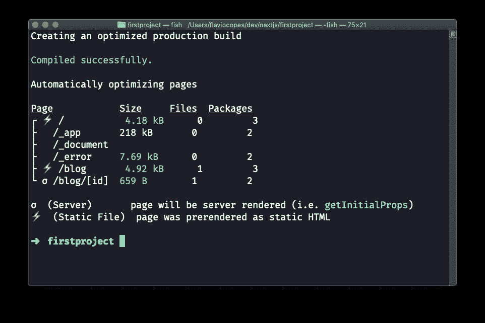

该命令的输出告诉我们，一些路由(`/`和`/blog`现在被预呈现为静态 HTML，而`/blog/[id]`将由 Node.js 后端提供服务。

然后您可以运行`npm run start`来本地启动生产服务器:

```
npm run start 
```

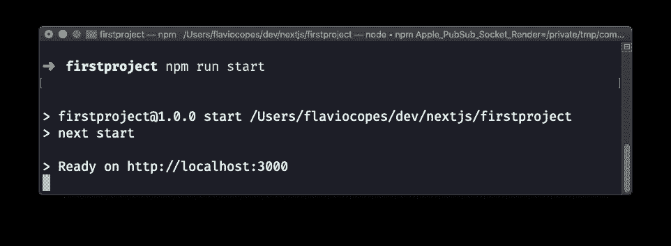

访问 [http://localhost:3000](http://localhost:3000) 将在本地向我们展示该应用的生产版本。

## 正在部署

在前一章中，我们在本地部署了 Next.js 应用程序。

我们如何将它部署到真正的 web 服务器上，以便其他人可以访问它？

部署 Next 应用程序最简单的方法之一是通过由 [Zeit](https://zeit.co) 创建的 **Now** 平台，这家公司创建了开源项目 Next.js。你可以使用 Now 来部署 Node.js 应用程序、静态网站等等。

现在让一个 app 的部署和分发步骤变得非常非常简单快速，除了 Node.js apps，还支持部署 Go、PHP、Python 等语言。

你可以把它想象成“云”，因为你真的不知道你的应用程序将被部署在哪里，但是你知道你将有一个可以到达它的 URL。

现在可以免费开始使用了，慷慨的免费计划目前包括 100GB 的托管，每天 1000 个[无服务器](https://www.freecodecamp.org/news/serverless/)函数调用，每月 1000 个构建，每月 100GB 的带宽，以及一个 [CDN](https://www.freecodecamp.org/news/cdn/) 位置。如果你需要更多，价格页面可以帮助你了解价格。

现在开始使用的最佳方式是使用官方的 Now CLI:

```
npm install -g now 
```

命令可用后，运行

```
now login 
```

该应用程序会要求您提供您的电子邮件。

如果您尚未注册，请在继续之前在[https://zeit.co/signup](https://zeit.co/signup)上创建一个帐户，然后将您的电子邮件添加到 CLI 客户端。

完成后，从 Next.js 项目根文件夹运行

```
now 
```

该应用程序将立即部署到 Now cloud，您将获得唯一的应用程序 URL:

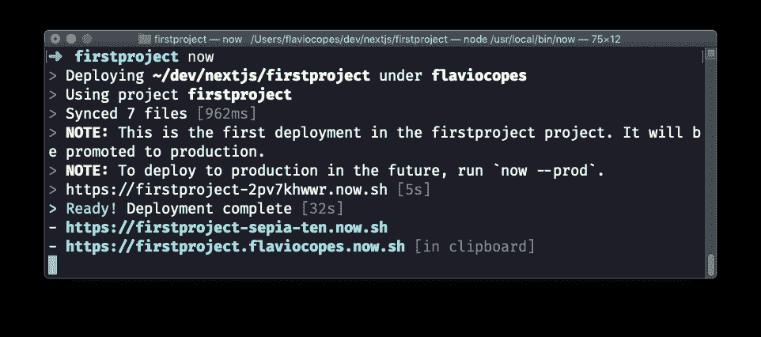

一旦你运行了`now`程序，这个应用就会被部署到`now.sh`域下的一个随机 URL 上。

在图中给出的输出中，我们可以看到 3 个不同的 URL:

*   [https://first project-2 PV 7 khwwr . now . sh](https://firstproject-2pv7khwwr.now.sh)
*   [https://first project-sepia-ten . now . sh](https://firstproject-sepia-ten.now.sh)
*   [https://first project . flavio copes . now . sh](https://firstproject.flaviocopes.now.sh)

为什么这么多？

第一个是标识部署的 URL。每次我们部署应用程序时，这个 URL 都会发生变化。

您可以通过更改项目代码中的某些内容，并再次运行`now`来立即进行测试:

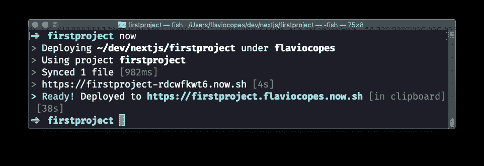

其他两个网址不会改变。第一个是随机的，第二个是你的项目名(默认为当前项目文件夹，你的帐户名，然后是`now.sh`)。

如果您访问该 URL，您将看到该应用程序已部署到生产环境中。

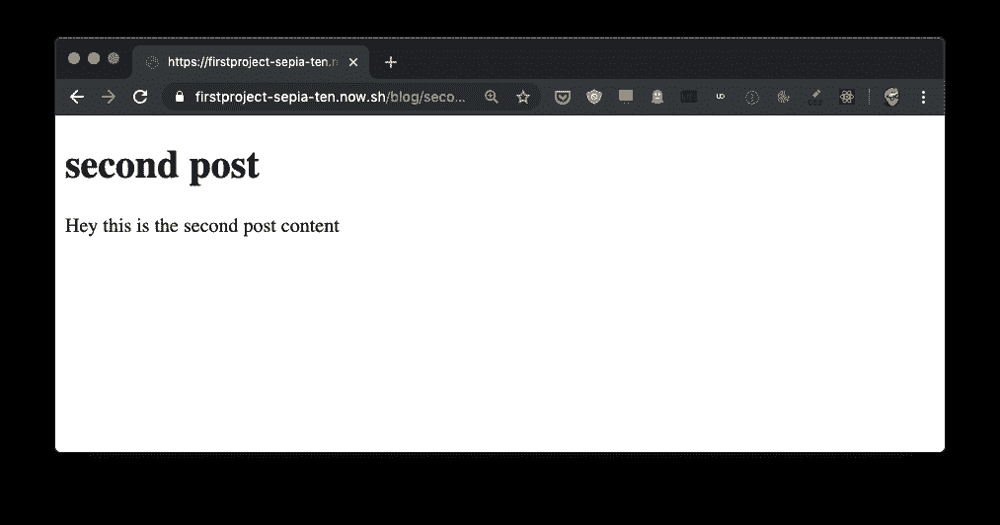

您现在可以配置站点，使其服务于您自己的自定义域或子域，但我现在不会深入讨论这个问题。

对于我们的测试来说,`now.sh`子域已经足够了。

## 分析应用捆绑包

Next 为我们提供了一种分析生成的代码包的方法。

打开应用程序的 package.json 文件，在脚本部分添加这 3 个新命令:

```
"analyze": "cross-env ANALYZE=true next build",
"analyze:server": "cross-env BUNDLE_ANALYZE=server next build",
"analyze:browser": "cross-env BUNDLE_ANALYZE=browser next build" 
```

像这样:

```
{
  "name": "firstproject",
  "version": "1.0.0",
  "description": "",
  "main": "index.js",
  "scripts": {
    "dev": "next",
    "build": "next build",
    "start": "next start",
    "analyze": "cross-env ANALYZE=true next build",
    "analyze:server": "cross-env BUNDLE_ANALYZE=server next build",
    "analyze:browser": "cross-env BUNDLE_ANALYZE=browser next build"
  },
  "keywords": [],
  "author": "",
  "license": "ISC",
  "dependencies": {
    "next": "^9.1.2",
    "react": "^16.11.0",
    "react-dom": "^16.11.0"
  }
} 
```

然后安装这两个包:

```
npm install --dev cross-env @next/bundle-analyzer 
```

在项目根目录下创建一个`next.config.js`文件，内容如下:

```
const withBundleAnalyzer = require('@next/bundle-analyzer')({
  enabled: process.env.ANALYZE === 'true'
})

module.exports = withBundleAnalyzer({}) 
```

现在运行命令

```
npm run analyze 
```

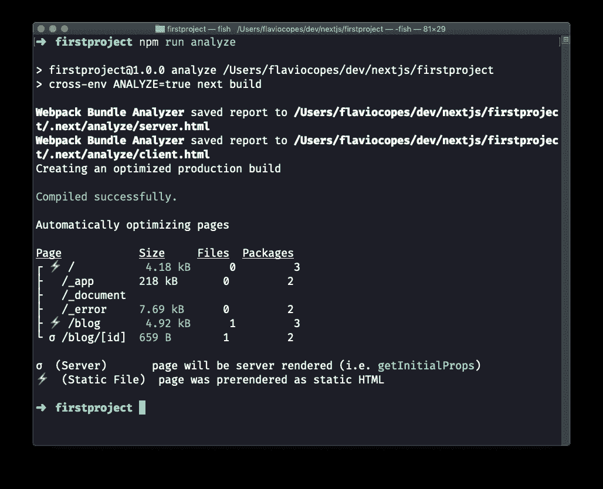

这将在浏览器中打开 2 个页面。一个用于客户端捆绑包，一个用于服务器捆绑包:

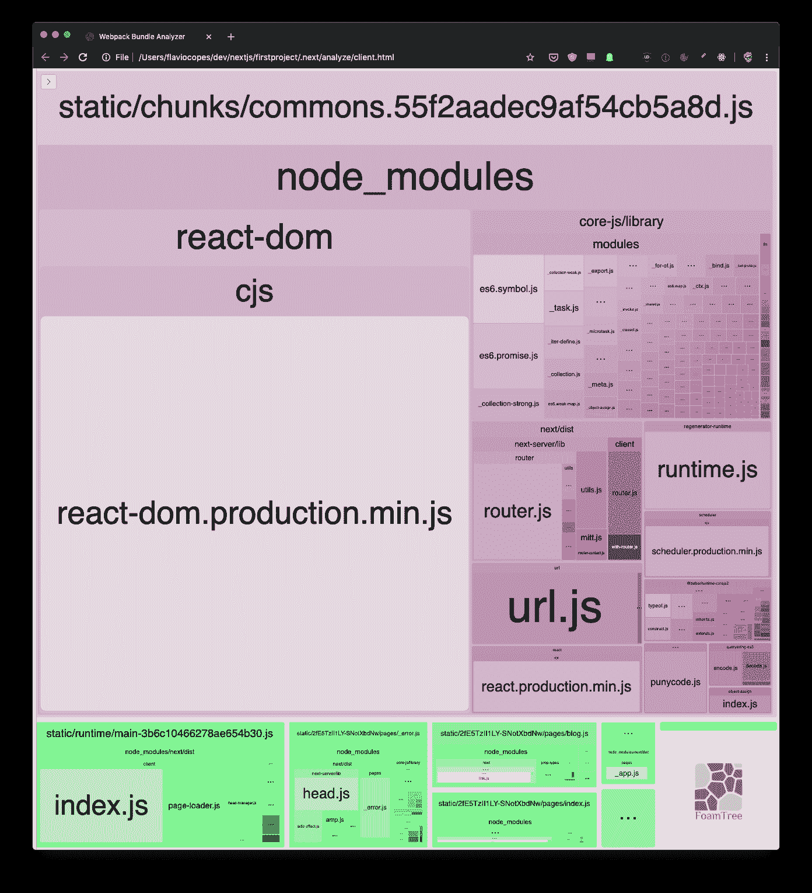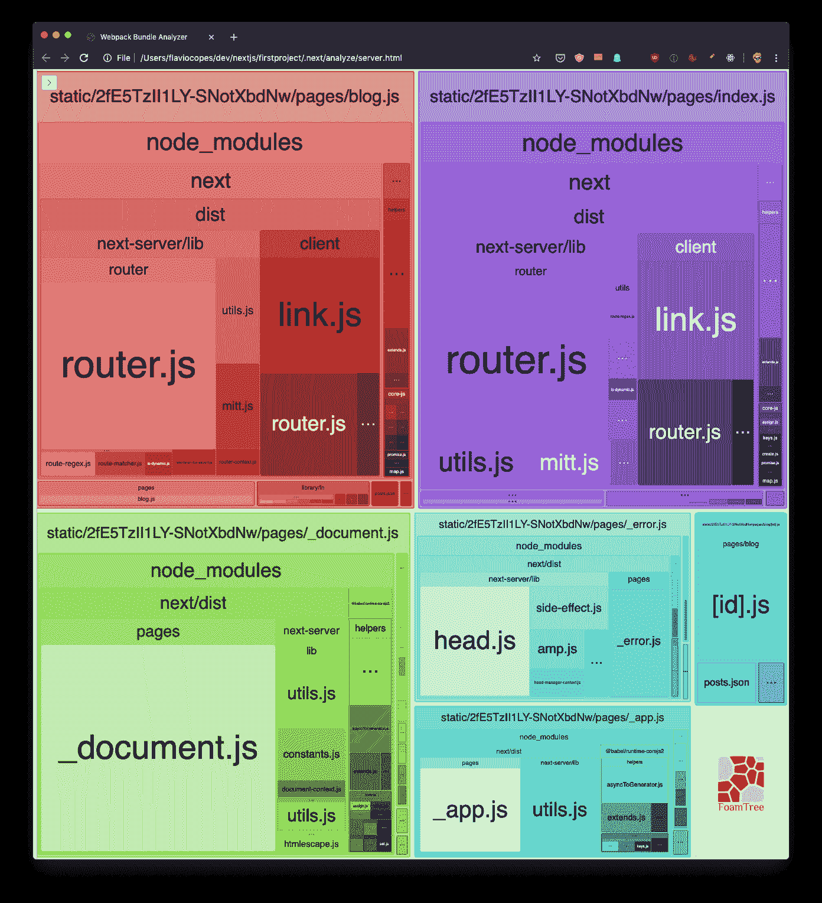

这非常有用。您可以检查包中占用空间最多的部分，也可以使用侧栏来排除包，以便更容易地可视化较小的包:

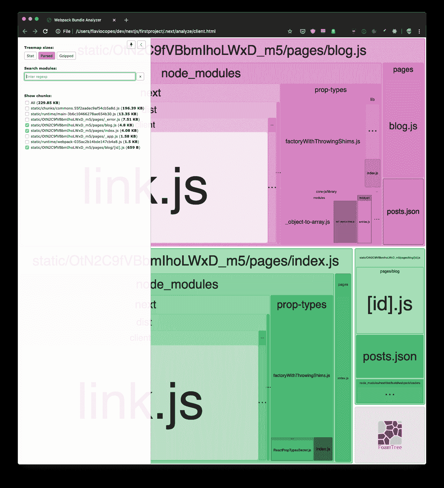

## 延迟加载模块

能够可视化地分析一个包是非常棒的，因为我们可以非常容易地优化我们的应用程序。

假设我们需要在博客文章中加载 Moment 库。运行:

```
npm install moment 
```

将其包含在项目中。

现在让我们模拟我们在两个不同的路线上需要它的事实:`/blog`和`/blog/[id]`。

我们在`pages/blog/[id].js`中导入它:

```
import moment from 'moment'

...

const Post = props => {
  return (
    <div>
      <h1>{props.post.title}</h1>
      <p>Published on {moment().format('dddd D MMMM YYYY')}</p>
      <p>{props.post.content}</p>
    </div>
  )
} 
```

我只是添加今天的日期，作为一个例子。

这将在博客文章页面包中包含 Moment.js，您可以通过运行`npm run analyze`看到:

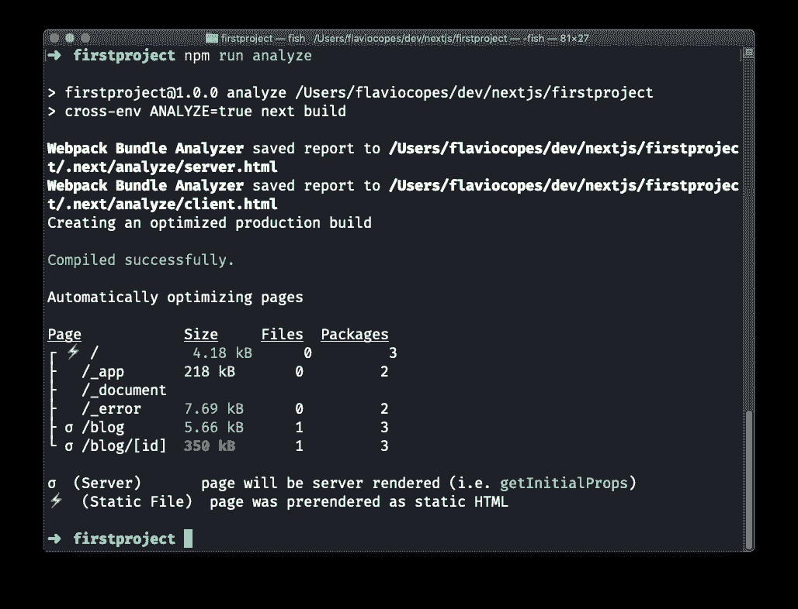

请注意，我们现在在`/blog/[id]`中有一个红色条目，这是我们添加 Moment.js 的路线！

它从大约 1kB 增加到 350kB，这是一个很大的变化。这是因为 Moment.js 库本身有 349kB。

客户端捆绑包可视化现在向我们展示了更大的捆绑包是 page one，这在以前是非常少的。而它 99%的代码都是 Moment.js。

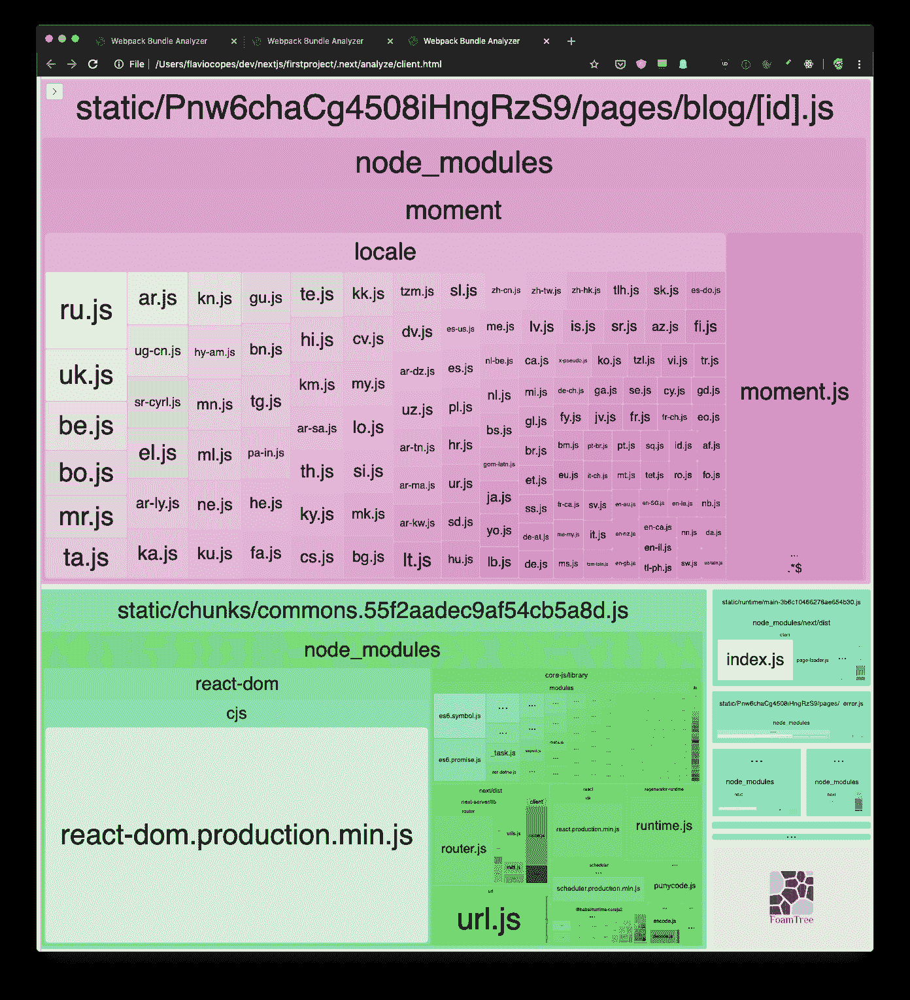

每次我们加载一篇博客文章时，我们都会将所有这些代码传输到客户端。这并不理想。

一种解决方法是寻找一个更小的库，因为 Moment.js 并不是轻量级的(特别是在包含所有语言环境的情况下)，但是为了这个例子，我们假设我们必须使用它。

相反，我们可以做的是将所有的矩代码分离成一个单独的包。

怎么会？我们没有在组件级别导入 Moment，而是在`getInitialProps`内部执行异步导入，并计算发送给组件的值。
记住我们不能在返回的对象`getInitialProps()`中返回复杂的对象，所以我们计算它里面的日期:

```
import posts from '../../posts.json'

const Post = props => {
  return (
    <div>
      <h1>{props.post.title}</h1>
      <p>Published on {props.date}</p>
      <p>{props.post.content}</p>
    </div>
  )
}

Post.getInitialProps = async ({ query }) => {
  const moment = (await import('moment')).default()
  return {
    date: moment.format('dddd D MMMM YYYY'),
    post: posts[query.id]
  }
}

export default Post 
```

看到那个在`await import`后对`.default()`的特殊调用了吗？在动态导入中需要引用默认的导出(参见 https://v8.dev/features/dynamic-import)

现在，如果我们再次运行`npm run analyze`，我们可以看到:

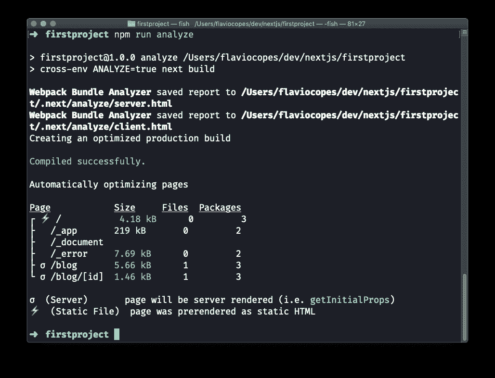

我们的`/blog/[id]`包也很小，因为 Moment 已经被移到它自己的包文件中，由浏览器单独加载。

## 从这里去哪里

关于 Next.js 还有很多需要了解的，我没有谈到用 login 管理用户会话、无服务器、管理数据库等等。

本手册的目标不是教你所有的东西，而是逐步向你介绍 Next.js 的所有功能。

我建议的下一步是好好阅读一下 [Next.js 官方文档](https://nextjs.org/docs)，以了解更多关于我没有谈到的所有特性和功能，并看看 [Next.js 插件](https://github.com/zeit/next-plugins)引入的所有附加功能，其中一些相当惊人。

你可以在推特上找到我。

也看看我的网站，[flaviocopes.com](https://flaviocopes.com/)。

[注意:你可以下载这个教程的 PDF / ePub / Mobi 版本，这样你就可以离线阅读了](https://flaviocopes.com/page/nextjs-handbook/)！