# 我在 Gmail 中的联系人在哪里？快速找到并访问它们。

> 原文：<https://www.freecodecamp.org/news/how-to-open-your-google-contacts-list-in-the-new-gmail/>

如果你还在习惯新的 Gmail，你可能想知道你的联系人去哪里了。不要害怕，一旦你知道去哪里找，就很容易找到它们。

在本分步指南中，我们将回顾:

*   如何进入 Gmail 并找到您的联系人
*   如何添加新联系人(两种方式)
*   如何管理您的联系人(检查重复项，创建标签/群组)
*   如何导入和导出您的联系人

所以让我们开始吧。

## 第一步:打开 Gmail

转到您的 Gmail 帐户并查看主页。在右上角，您会看到一个由九个点组成的正方形(这些是您的应用程序):

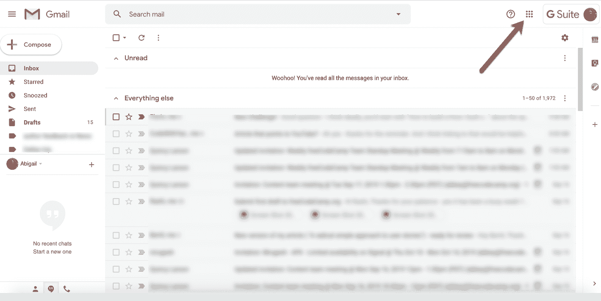

Welcome to Gmail :)

## 步骤 2:打开你的应用程序

点击那个方块，你会看到一个包含所有可用应用的下拉菜单。联系人应用程序可能不在顶部，但你可以将应用程序拖到你喜欢的任何位置。

如果您没有看到联系人应用程序，请点按底部的“更多”并添加它。

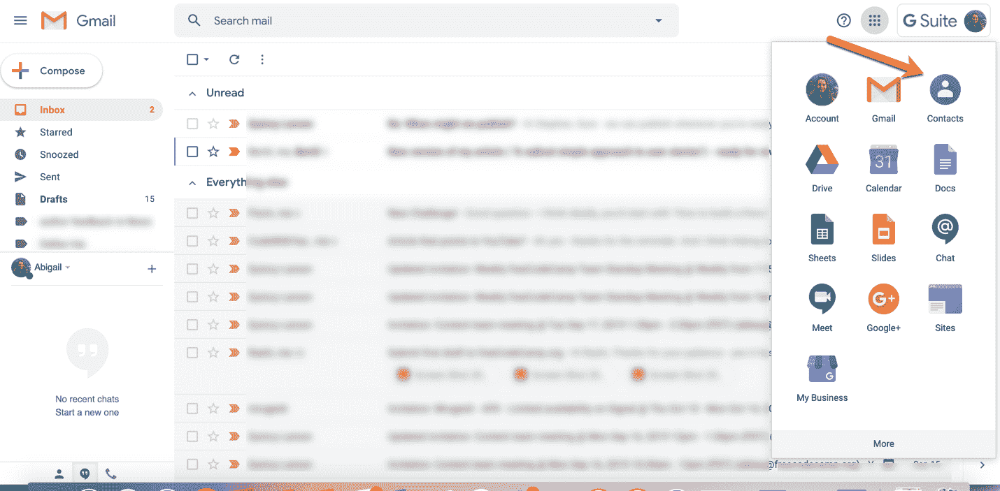

Your Gmail apps

## 步骤 3:单击联系人图标并管理您联系人

点击蓝色的“联系人”图标后，您将进入此屏幕(您可能有也可能没有多个联系人，也可能一个都没有):

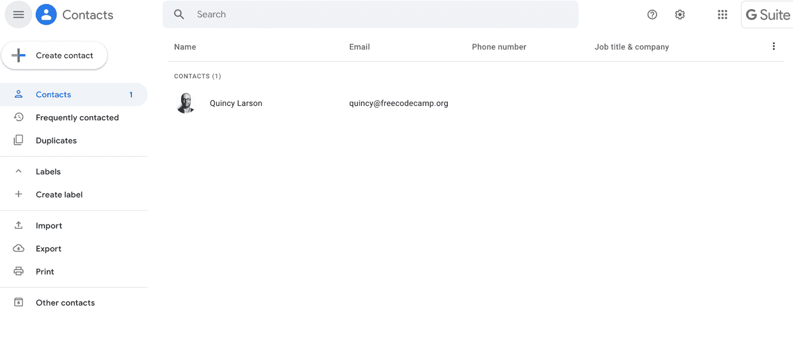

Gmail's contacts page

如果你已经有一堆联系人，他们会在这里。更多关于你能用它们做什么的信息在下面(第 5 步)。

### 如何创建新联系人

如果你还没有任何联系人，或者想添加新的联系人，这也是你的地方。

您可以通过多种方式创建新联系人。创建联系人的第一种方法是点击“创建联系人”按钮，如果您尚未向您要添加的人发送电子邮件，可以使用这种方法:

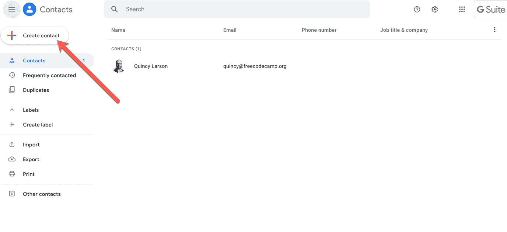

One way to create new contacts in Gmail - click the "create contact" button

当您使用该按钮创建新联系人时，它会要求您提供一些信息来完成联系人条目。你可以根据自己的喜好填写多或少——姓名和电子邮件通常很有帮助。

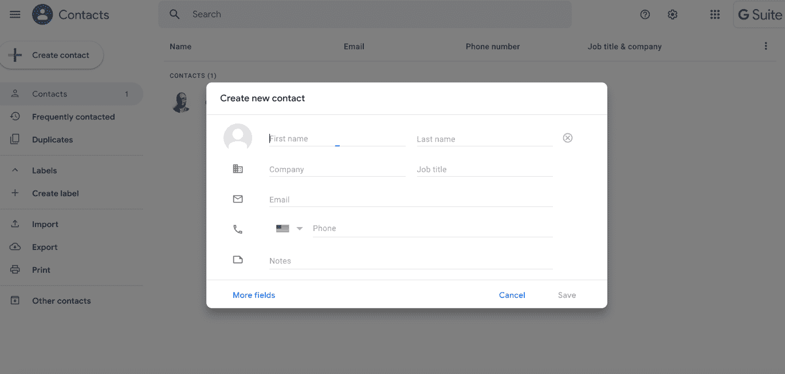

New contact information in Gmail

然后点击“保存”，就可以了！新联系人已创建。

但是有另一个超级简单的方法来建立联系——如果你已经有了这个人的电子邮件。只需将光标悬停在收件箱中的电子邮件地址上，等待框弹出，如下所示:

A second way to create a new contact in Gmail - hover over the email address

然后，点击“添加到联系人”,瞧——你会被带到同一个创建联系人屏幕(见上文)。

如果您已经将该联系人添加到您的通讯录中，您将看到“编辑联系人”而不是“添加到通讯录”

**注意**:当你以这种方式添加了一些新的联系人后，你可能需要刷新你的浏览器来显示这些联系人。

## 第五步:探索你还可以用你的联系人做些什么

在联系人页面上，您还可以做更多的事情。让我们仔细看看。

### 经常联系和重复

首先，在左侧边栏菜单的“经常联系”标签下，你可以看到你发邮件最频繁的人。

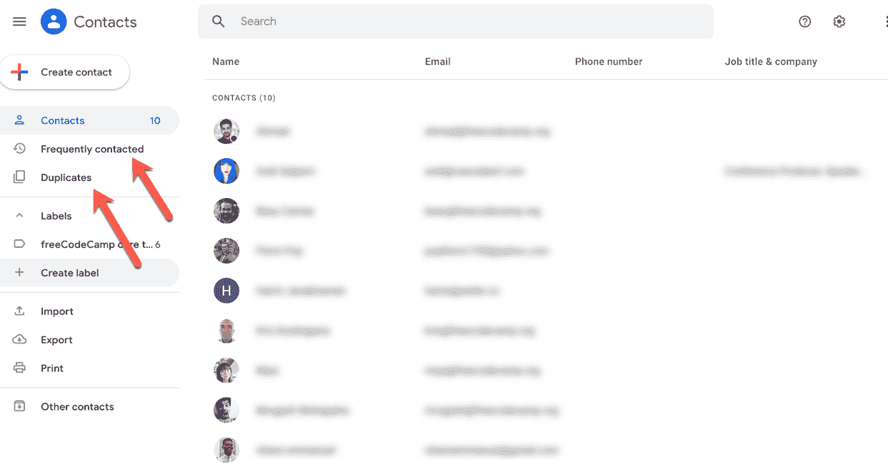

Other ways to manage Gmail contacts - "frequently contacted" and "duplicates"

接下来，您可以在“重复”选项卡中检查任何重复的联系人。Gmail 会帮你清理重复的联系人，这样就不会弄乱你的联系人列表，但你可以在这里找到这些重复的联系人。

### 标签

您还可以创建经常发送电子邮件的联系人组，如您的工作团队、家庭成员、好友等。

要创建一个带标签的群组，进入左侧边栏菜单的“标签”标签，点击“创建标签”，然后给它起你想要的名字。比如 freeCodeCamp 独角兽 er 核心团队。那就省省吧。

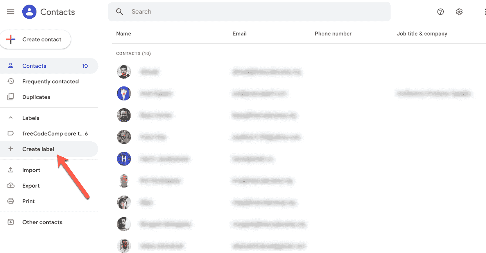

The label tab in Gmail contacts

现在，当您转到您的联系人并将鼠标悬停在联系人的个人资料图像上时，它会变成一个复选框。如果您想将该联系人添加到组中，只需选中该框。

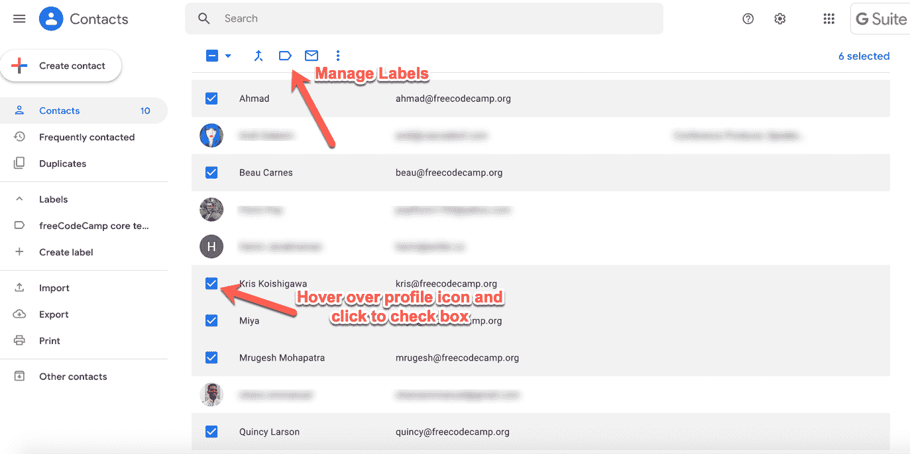

How to create a label (like a group) in Gmail contacts

接下来，单击顶部的“管理标签”选项卡，并选择您想要使用的标签:

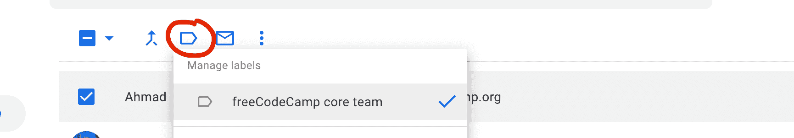

The "manage labels" tab in Gmail contacts

一旦您选择了该标签，所有选中的联系人都将添加到标签中，以便您将来发送电子邮件。

### 删除联系人

如果出于某种原因，你想从你的联系人中删除某人，这很简单。只需将鼠标悬停在该联系人/行上，然后单击右侧出现的三个垂直点:

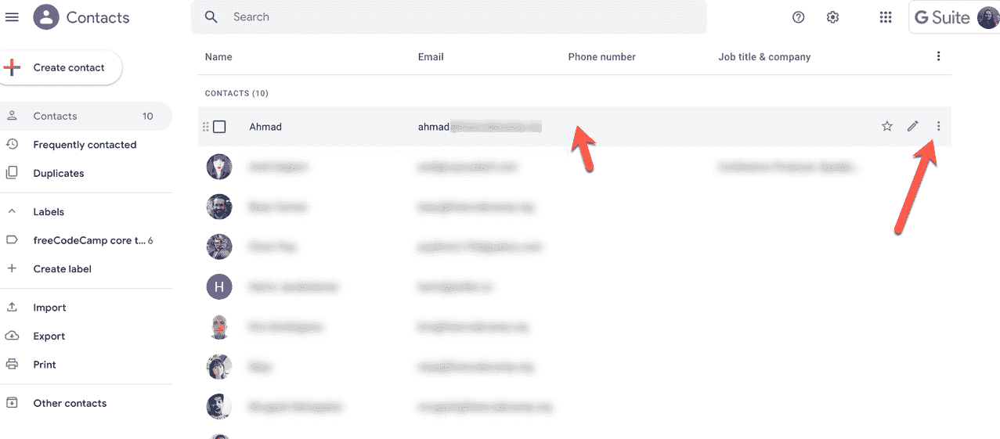

How to delete a contact in Gmail contacts

然后点击“删除”选项并确认。再见。

### 导入和导出联系人

您可能想要一起导入新联系人，您可以使用导入功能(在同一个左侧工具栏菜单中)来完成此操作。

只需点击“导入”按钮，然后选择您想要导入 Gmail 的联系人列表(CSV 或 vCard 格式):

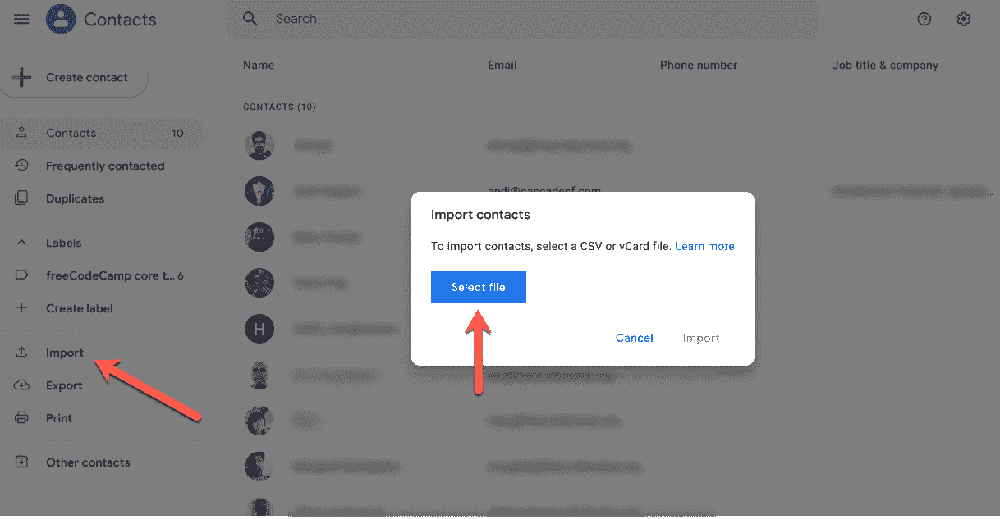

How to import contacts in Gmail

如果您想将 Gmail 联系人导出为 CSV 或 Outlook 文件，请遵循类似的流程:

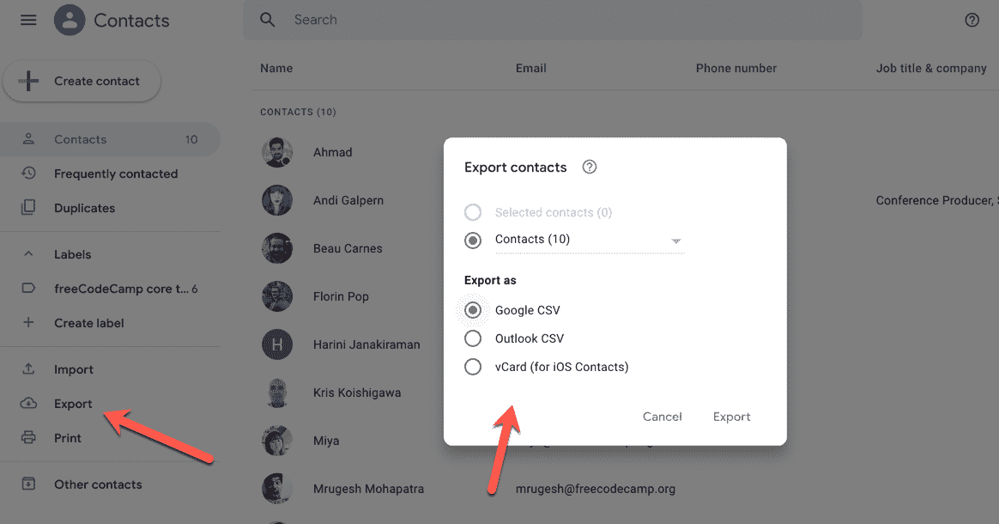

How to export contacts in Gmail

就这么简单！

如果您需要以任何其他方式管理您的联系人——更新条目、删除条目或您想做的任何其他事情——只需回到联系人列表并编辑即可。

### 快捷指令

有几个超级快速简单的方法可以找到你的联系人。

1.  如果您还没有使用 Gmail，只需在浏览器中访问。您甚至可以将它加入书签，以便于访问。
2.  如果您已经在 Gmail 中，您可以使用键盘快捷键(如果您启用了快捷键，请查看您的设置菜单)。只需输入 G，紧接着输入 C，联系人页面就会打开。

### 您现在是 Gmail 联系人向导

或者至少是聪明得多的哈比人。