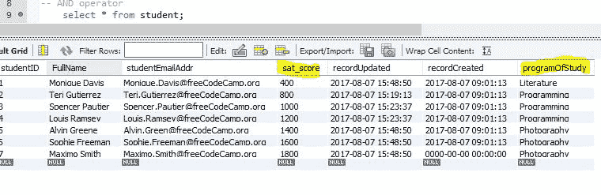
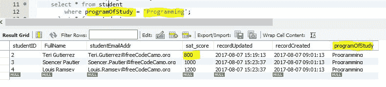
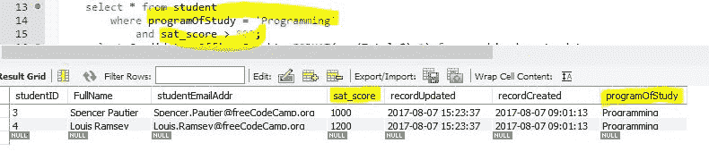

# SQL 和运算符用语法示例解释

> 原文：<https://www.freecodecamp.org/news/the-sql-and-operator-explained-examples/>

用于 WHERE 子句或 GROUP BY HAVING 子句中，以限制从已执行语句返回的行数。当需要满足多个条件时，使用 AND。

我们将使用学生表格来展示示例。

下面是没有 WHERE 子句的学生表:

```
select * from student; 
```



现在添加了 WHERE 子句以仅显示编程学生:

```
select * from student 
where programOfStudy = 'Programming'; 
```



现在，WHERE 子句更新为和，为 SAT 分数也高于 800 的编程学生显示结果:

```
select * from student 
where programOfStudy = 'Programming' 
and sat_score > 800; 
```



这是市场活动捐款表中的一个更复杂的例子。此示例有一个 GROUP BY 子句，其中的 HAVING 子句使用 AND 将返回的记录限制为 2016 年的候选人，其捐款总额在 300 万美元到 1800 万美元之间。

```
select Candidate, Office_Sought, Election_Year, FORMAT(sum(Total_$),2) from combined_party_data
where Office_Sought = 'PRESIDENT / VICE PRESIDENT'
group by Candidate, Office_Sought, Election_Year
 having Election_Year = 2016 and sum(Total_$) between 3000000 and 18000000
order by sum(Total_$) desc; 
```

