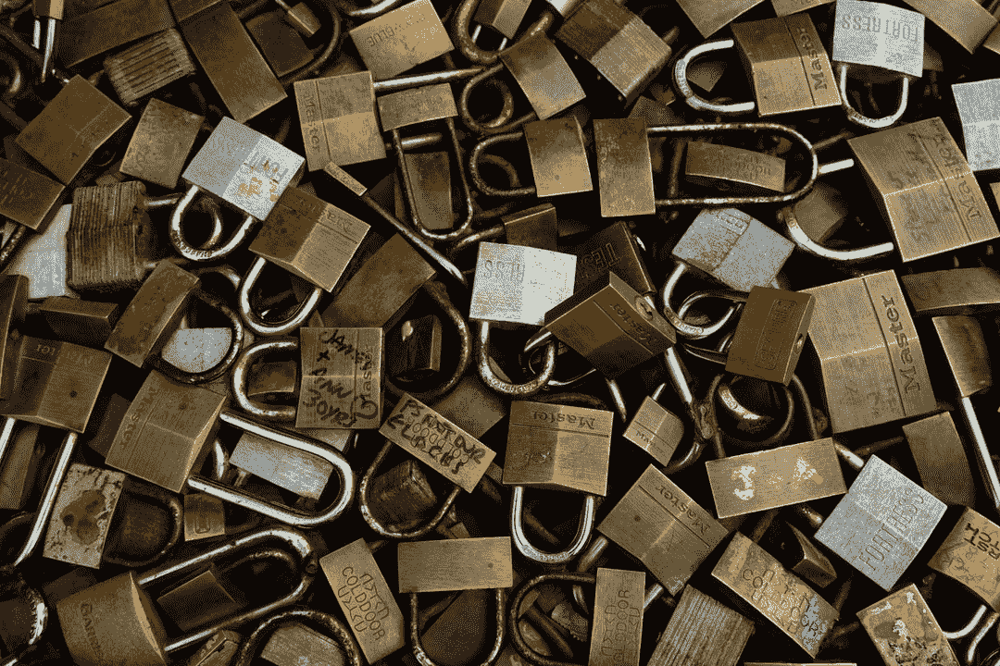
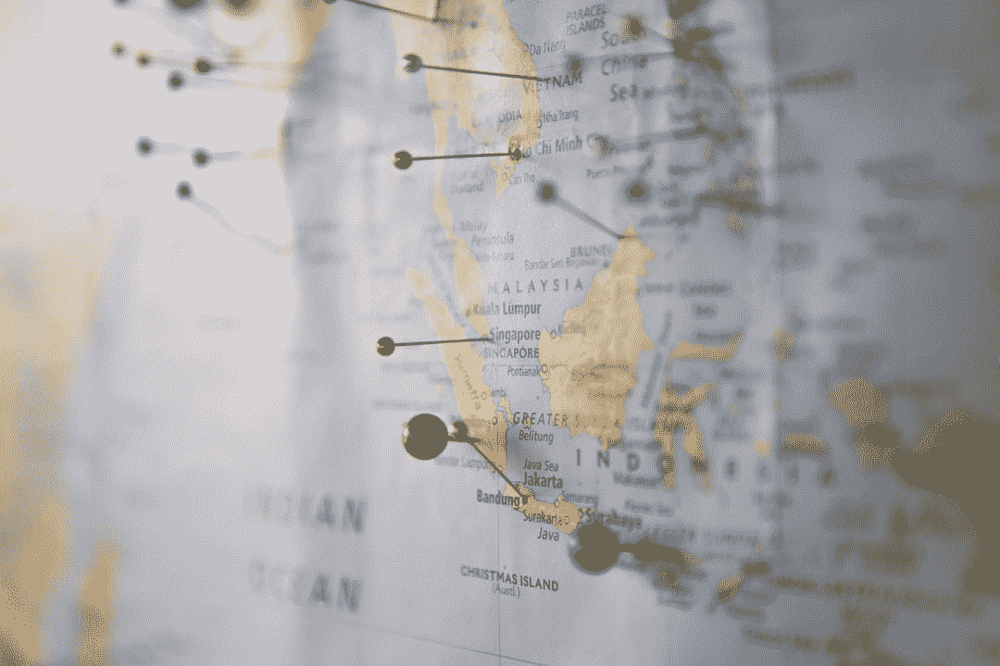

# VPN 是做什么的，它是如何工作的？虚拟专用网指南

> 原文：<https://www.freecodecamp.org/news/what-does-a-vpn-do-and-how-does-it-work-a-guide-to-virtual-private-networks/>

当你在网上冲浪的时候，安全应该是你最优先考虑的事情，尤其是当你不在家的时候。

如果你经常旅行，在有公共 wifi 的咖啡店工作，或者处理敏感数据——或者即使你使用网上银行——你应该考虑采取一些额外的预防措施。

保护你的个人数据和任何你可能通过互联网发送的敏感信息的一个好方法是使用 VPN。当你使用互联网时，虚拟专用网络增加了一个重要的安全层，并且在几分钟内得到并设置好它并不困难。

让我们来看看什么是 VPN，它是如何保护你的，以及当你使用它的时候你可以期待什么。

Photo by [Mackenzie Marco](https://unsplash.com/@kenziem?utm_source=ghost&utm_medium=referral&utm_campaign=api-credit) / [Unsplash](https://unsplash.com/?utm_source=ghost&utm_medium=referral&utm_campaign=api-credit)

## 什么是 VPN？

VPN 是一种允许您更加安全和匿名地浏览网页的服务。这是一种连接方法，本质上是将您自己的专用网络置于公共网络之上，以便您的计算机或设备可以连接到其目的地，就像通过该专用网络直接连接一样。

## 它是如何工作的？

VPN 接收您通过互联网发送的数据，对其进行加密，通过它自己的服务器传递，然后将其发送到目的地。

这里发生了几件重要的事情。

### VPN 会加密您的数据。

这意味着黑客、政府或您的 ISP(互联网服务提供商)看不到您发送或接收的内容。是的，所有这些实体都有可能以不同的难易程度访问您的数据。

基本上，VPN 获取要发送的数据包，将它们包装在一个额外的安全层(=加密层)中，并通过加密隧道发送加密的数据包。只有一种方法可以解密数据:使用 VPN 提供的密钥对中的唯一密钥。

因此，如果有人截获了这些数据，他们只会看到乱码，没有密钥的话，超级计算机要花很多很多年才能解密。

### VPN 使用自己的服务器

除了使您的数据对黑客和其他人不可读之外，VPN 还在将数据发送到目的地之前通过它自己的服务器传递数据。这使得数据看起来像是来自那台服务器，并使它几乎不可能连接到你。

为什么这很重要？嗯，试图窃取你的数据的人可以从你的 IP 地址(这是你的电脑独有的)获得大量信息。但是如果它是隐藏的(黑客只能看到 VPN 的 IP 地址)，黑客就不能从中获得太多关于你的信息。

## 为什么你应该得到一个 VPN？

你可能认为你不经常发现自己处于需要关注网络安全的情况。但是 VPN 在很多情况下是有用的。

### 经常坐飞机的人

Photo by [Margo Brodowicz](https://unsplash.com/@margobr?utm_source=ghost&utm_medium=referral&utm_campaign=api-credit) / [Unsplash](https://unsplash.com/?utm_source=ghost&utm_medium=referral&utm_campaign=api-credit)

如果你经常旅行(甚至很少)，你可能会遇到一些粗略的或不安全的 wifi 网络。这意味着黑客可以利用这一事实，窥探你的在线活动。

如果你通过一个不安全的网络上网，你的数据会比平时更不安全。但是如果你用的是 VPN，你的数据是加密的，可以安全地传输。

### 处理敏感信息

Photo by [Fabian Blank](https://unsplash.com/@blankerwahnsinn?utm_source=ghost&utm_medium=referral&utm_campaign=api-credit) / [Unsplash](https://unsplash.com/?utm_source=ghost&utm_medium=referral&utm_campaign=api-credit)

你在网上银行吗？也许你需要检查一下你的账户余额。安排医生出诊或者给同事发电子邮件讨论重要的研究怎么样？

在很多情况下，你可能不希望其他人看到你在网上处理的数据。使用 VPN 可以确保没有人(你的雇主、政府机构、恶意黑客)能够获取这些私人信息并利用它们来伤害你。

### 隐藏/更改您的位置

Photo by [Capturing the human heart.](https://unsplash.com/@dead____artist?utm_source=ghost&utm_medium=referral&utm_campaign=api-credit) / [Unsplash](https://unsplash.com/?utm_source=ghost&utm_medium=referral&utm_campaign=api-credit)

某些国家限制某些网站(比如中国禁止脸书，但还有很多其他网站)，如果你正在旅行或已经搬迁到这样的地方，这可能会令人沮丧。

例如，如果你的 VPN 位于那些限制不适用的美国，你应该能够绕过那些限制，访问你最喜欢的网站，使用你最喜欢的流媒体服务。

记得为什么吗？因为 VPN 使用自己的服务器(位于美国或公司所在地),网站将这些服务器识别为设备的来源。所以你可以在中国通过你在康涅狄格州的虚拟专用网冲浪。

### 保护您的浏览

Photo by [Plush Design Studio](https://unsplash.com/@plushdesignstudio?utm_source=ghost&utm_medium=referral&utm_campaign=api-credit) / [Unsplash](https://unsplash.com/?utm_source=ghost&utm_medium=referral&utm_campaign=api-credit)

假设你想给你的女儿买一份生日礼物，但是你不希望这个礼物的广告出现在你的家庭桌面上。如果你使用一个 VPN，尤其是一个无日志策略的 VPN(下面会详细介绍)，这些数据将不会被存储。

注:如果你需要更多关于隐私浏览的信息，请查看[这篇关于匿名模式](https://www.freecodecamp.org/news/private-browser-how-to-use-incognito-mode-in-chrome-and-safari/)的文章。

## 不同的协议，不同的安全级别

不同的 VPN 服务提供不同的功能并使用不同的协议。这绝对是你在选择 VPN 之前要回顾的。

以下是一些需要注意和牢记的事情:

### 选择使用 OpenVPN 或 IKEv2/IPSec 的 VPN

VPN 使用许多协议，但 OpenVPN 和 IKEv2 是最好和最常用的。

**OpenVPN** 是使用最广泛的协议。它很安全，速度很快，而且是开源的。那么有什么不爱呢？

IKEv2/IPSec 还不是很常见，但是它的安全性、速度和响应能力使它成为一个很好的选择。

### 检查 VPN 的日志策略

Photo by [Maarten van den Heuvel](https://unsplash.com/@mvdheuvel?utm_source=ghost&utm_medium=referral&utm_campaign=api-credit) / [Unsplash](https://unsplash.com/?utm_source=ghost&utm_medium=referral&utm_campaign=api-credit)

当你选择一个 VPN 的时候，看看他们是怎么说日志的。日志是指 VPN 保存的关于您和您的浏览会话的数据。可能是这样的事情:

*   你的活动
*   您的 IP 地址
*   当你上线/下线时
*   您使用的是什么设备
*   支付历史

这些事情中的一些可能不是超级隐私，但它们几乎都可以用来了解你更多，这是你不想要的。

有些 VPN 会保留一些日志。有些人什么都没有(这是你最喜欢的)。底线:VPN 存储的关于你的信息越多，其他个人/机构可能发现的就越多。所以在你的 VPN 隐私声明中寻找“无日志”政策。

### VPN 不会让你不可战胜

Photo by [Yogi Purnama](https://unsplash.com/@yogipurnama?utm_source=ghost&utm_medium=referral&utm_campaign=api-credit) / [Unsplash](https://unsplash.com/?utm_source=ghost&utm_medium=referral&utm_campaign=api-credit)

你可能认为使用 VPN 可以让你完全免受在线攻击。不幸的是，事实并非如此。

VPN 的安全性取决于它的组成部分。因此，在您选择一个之前，请确保您检查了本文中讨论的所有功能，例如:

*   可靠、安全的协议(可能的话，OpenVPN 或 IKEv2/IPSec)
*   禁止伐木政策
*   VPN 使用的加密级别
*   他们是否记录了你的支付历史(以及潜在的身份信息)
*   VPN 所在国家的规则(一些国家可能会强制 VPN 保留/移交某些信息)

现在你有了更多的关于 VPN 的信息，你应该能够做出明智的决定，决定是否购买一个，以及如何选择一个适合你的。

快乐安全浏览！