# 如何在持续集成的 Google Cloud Run 上运行 Laravel 分步指南

> 原文：<https://www.freecodecamp.org/news/how-to-setup-laravel-6-on-google-cloud-run-with-continuous-integration-ci-step-by-step/>

在过去的几年里，Laravel 的人气飙升。Laravel 社区甚至说 Laravel 让编写 PHP 变得更加愉快，而不是痛苦。Laravel 6 有一些有趣的新[特性](https://laracasts.com/series/whats-new-in-laravel-6)。为您的应用程序获得一个超级可伸缩的工作 URL 需要几个小时，甚至几天。建立像 Kubernetes 这样的东西是一项巨大的任务。这就是 Google Cloud Run 大放异彩的地方:你可以在几分钟内为你的任何容器化应用程序获得一个有效的 HTTPS URL。

[Google Cloud Run](https://cloud.google.com/run/) 是无服务器的，完全由 Google 管理。你得到超级规模，按秒计费，HTTPS 网址，和你自己的域名映射。如果你想运行无状态容器，Cloud Run 无疑是最简单的方法。在这篇文章中，我将详细介绍如何让您的 Laravel 6 应用程序在 Google cloud run with Continuous Integration(CI)上运行。

## 先决条件

*   你熟悉 PHP/Composer 并知道 Laravel(如果你已经登陆这里，我想你是)
*   您知道如何从 CLI 使用 Git
*   您的代码托管在 GitHub for CI/CD 上，并且您熟悉 GitHub
*   了解相当多的 Docker，甚至可能是多阶段构建
*   拥有一个有效的谷歌云账户(他们会给你一年免费的 300 美元信用点数，没有理由不拥有一个账户)

## **为什么云跑是初学者的绝佳选择？**

有两个主要原因:

1.  了解 docker 和 CI/CD 等最佳实践和软件
2.  开始基本操作只需要点击一个按钮，选择 2 样东西，等待 5 分钟，你就会得到一个有效的 HTTPS 网址。还有比这更简单的吗？:)

## **部署步骤**

下面是在 Cloud Run 上设置和部署 Laravel 6 的步骤:

### **1。克隆 Laravel 或新 Laravel 项目**

按照官方[安装](https://laravel.com/docs/5.8/installation)指南中的指示，从克隆 Laravel 或使用 composer 或 Laravel CLI 开始。我正在使用 composer 来获得最新的 Laravel，如下所示:

#### **命令**

我运行以下命令来获取最新的 Laravel:

```
composer create-project --prefer-dist laravel/laravel laravel6-on-google-cloud-run 
```

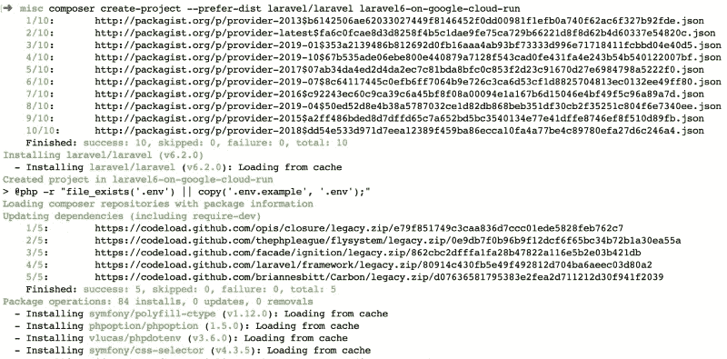

Creating a new Laravel Project with Composer

### **2。先在本地测试**

然后运行`cd laravel6-on-google-cloud-run`然后`php artisan serve`看看是否工作。对我来说，当我通过网络浏览器访问`http://localhost:8000`时，一切都很好。我在本地安装了 PHP 7.2。

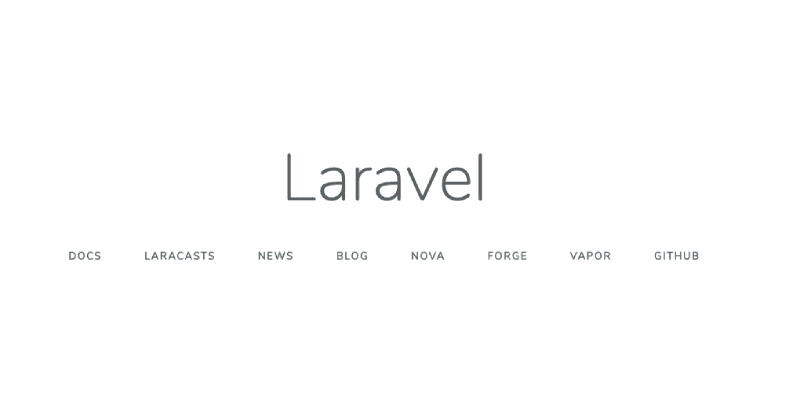

Laravel running locally without Docker

### **3。创建一个新的 GitHub repo**

在 Github 上创建一个新的存储库，如下所示:

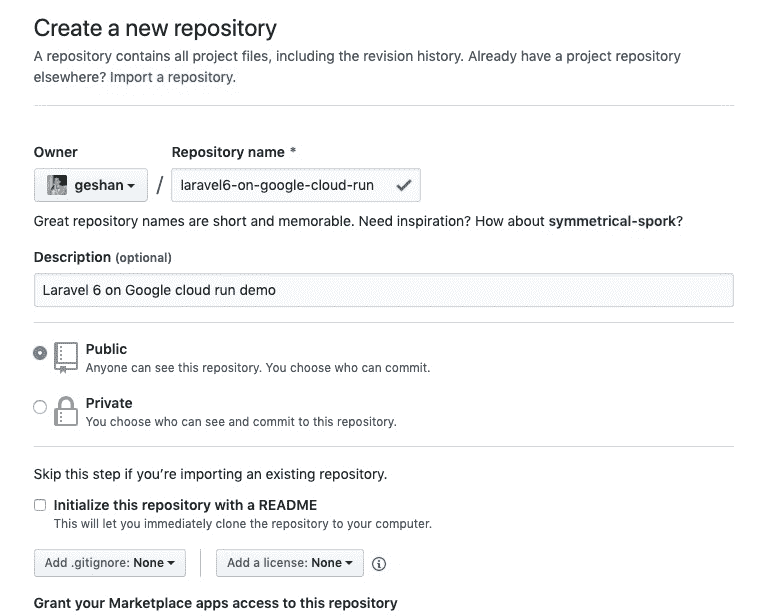

Create a new public repo on Github

您可以使用任何 git 托管提供商，但是对于这个例子，我将使用 [Github Actions](https://github.com/features/actions) 来运行测试(Github 是最流行的 Git 托管工具)。

### **4。添加回购，推送自述**

现在，在您创建了 repo 之后，将它添加到您的本地 Laravel 副本并推送 Readme 文件。为此，请在您的 CLI 上运行以下命令:

```
git init
code . # I used VS code to change the readme
git add readme.md
git commit -m "Initial commit -- App Readme"
git remote add origin git@github.com:geshan/laravel6-on-google-cloud-run.git
git push -u origin master 
```

#### **运行上述命令后，我在 Github repo 上有了这个**

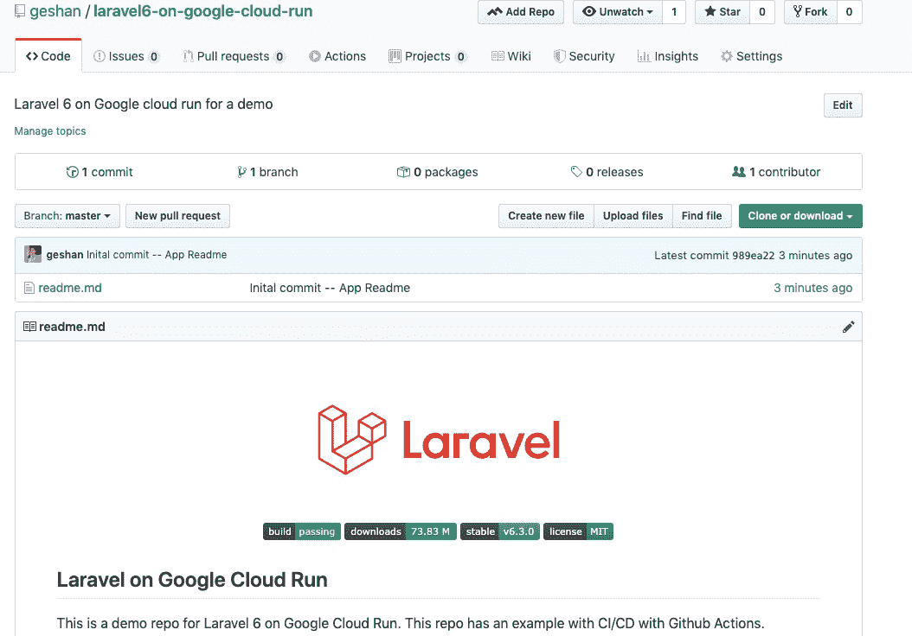

Repo after pushing the readme to master branch

### **5。添加完整的 Laravel，打开一个 PR**

现在，让我们通过执行以下命令将整个应用程序作为 PR 添加到 Github repo 中:

```
git checkout -b laravel6-full-app
git add .gitignore
git add .
git commit -m "Add the whole Laravel 6 app"
git push origin laravel6-full-app 
```

之后，在回购上打开一个拉取请求(PR)，就像[这个](https://github.com/geshan/laravel6-on-google-cloud-run/pull/1)一样。你可能会想，只有我一个人在做这件事，为什么我需要一个公关？嗯，做事有条不紊总是比较好的，哪怕只是一个人在做项目:)。

之后，合并您的拉取请求。

### **6。使用 [GitHub 动作](https://github.com/features/actions)设置测试**

现在有趣的部分是:在你合并了你的 PR 之后，Github 知道这是一个 Laravel 项目。点击您的回购页面上的`Actions`选项卡，您应该能够看到如下内容:

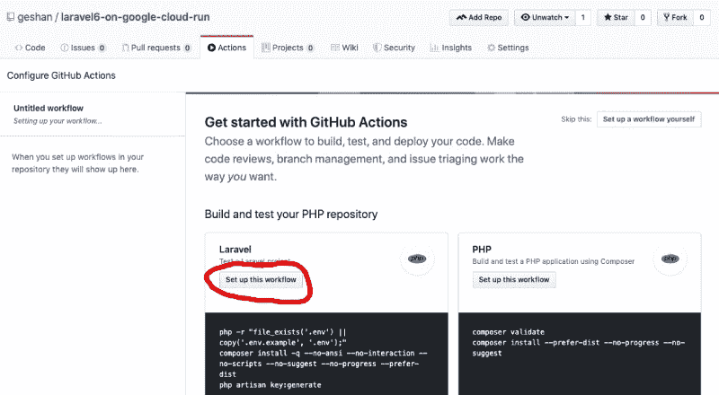

Setup the CI workflow for Laravel with Github Actions

点击`Laravel`下的`Set up this workflow`，然后在下一页点击右上角的`Start commit`按钮。之后，添加一条提交消息，如下所示，并点击`Commit new file`。

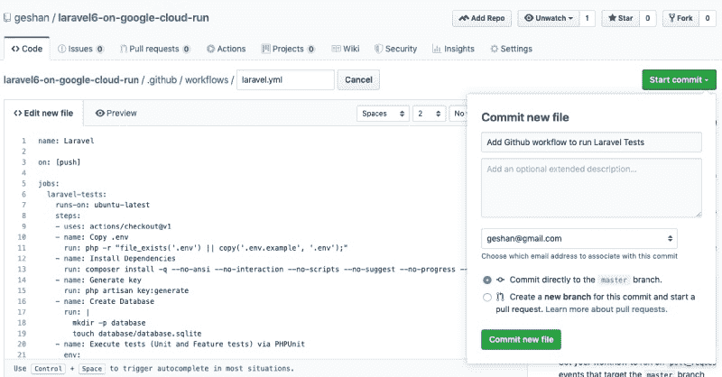

Steps to setup the CI workflow with Github Actions

这就对了，你有你的 CI 设置。Laravel 默认测试将在每次 git 推送时运行。那不是很容易吗？感谢 Github 的这一伟大智慧。不再创建`.myCIname.yml`文件:)

### 7 .**。添加 docker 和 docker-compose 在本地运行 app**

现在让我们添加 docker 和 docker-compose 来在本地运行应用程序，无需 PHP 或 artisan serve。

我们将需要容器来运行谷歌云运行 Laravel 了。这一部分的灵感来自 Nicolas 的关于 Google Cloud Run 的文章。如果你想了解更多关于[码头工人](https://www.docker.com/)和拉勒维尔的信息，请参考这个[帖子](https://geshan.com.np/blog/2015/10/getting-started-with-laravel-mariadb-mysql-docker/)。

当我们从 Github 界面添加了`workflow`文件时，首先运行以下命令来更新您的主文件:

```
git checkout master
git fetch
git pull --rebase origin master # as we added the workflow file from github interface
git checkout -b docker 
```

向`.env.example`文件添加一个密钥。从`.env`文件中复制如下:

```
APP_NAME=Laravel
APP_ENV=local
APP_KEY=base64:DJkdj8L5Di3rUkUOwmBFCrr5dsIYU/s7s+W52ClI4AA=
APP_DEBUG=true
APP_URL=http://localhost 
```

因为这只是一个演示，所以可以这样做。对于一个真正的应用程序，永远要小心保密。对于生产就绪的应用程序，请关闭调试和其他与开发相关的事情。

在项目根上添加以下`Dockerfile`:

```
FROM composer:1.9.0 as build
WORKDIR /app
COPY . /app
RUN composer global require hirak/prestissimo && composer install

FROM php:7.3-apache-stretch
RUN docker-php-ext-install pdo pdo_mysql

EXPOSE 8080
COPY --from=build /app /var/www/
COPY docker/000-default.conf /etc/apache2/sites-available/000-default.conf
COPY .env.example /var/www/.env
RUN chmod 777 -R /var/www/storage/ && \
    echo "Listen 8080" >> /etc/apache2/ports.conf && \
    chown -R www-data:www-data /var/www/ && \
    a2enmod rewrite 
```

然后在`docker/000-default.conf`添加以下文件

```
<VirtualHost *:8080>

  ServerAdmin webmaster@localhost
  DocumentRoot /var/www/public/

  <Directory /var/www/>
    AllowOverride All
    Require all granted
  </Directory>

  ErrorLog ${APACHE_LOG_DIR}/error.log
  CustomLog ${APACHE_LOG_DIR}/access.log combined

</VirtualHost> 
```

之后添加以下内容`docker-compose.yml`

```
version: '3'
services:
  app:
    build:
      context: ./
    volumes:
      - .:/var/www
    ports:
      - "8080:8080"
    environment:
      - APP_ENV=local 
```

#### 让我们归结到主要的事情上

如果你试图理解这里的一切，这可能会让人不知所措，所以让我总结一下主要部分:

1.  我们使用官方的 PHP Apache docker 镜像来运行 Laravel，它的 PHP 版本是 7.3。
2.  我们使用多阶段构建来获得 Composer 的依赖项，然后将它们复制到包含 PHP 7.3 和 Apache 的主 docker 映像中。
3.  因为 Google Cloud Run 需要网络服务器监听端口`8080`，我们使用`000-default.conf`来配置它
4.  为了使运行简单，我们使用了 docker-compose 命令。
5.  现在你已经读到这里了，在你的根上运行`docker-compose up`，然后在所有东西都运行之后，转到`http://localhost:8080`,看看 Laravel 6 正在 Docker 上本地运行。下面是我的`docker-compose up`接近尾声时的输出:

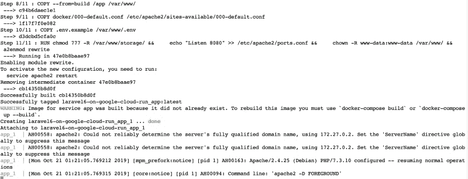

Docker compose running successfully on local machine

由于 Laravel 与 Docker 一起运行良好，让我们打开一个类似于 [this](https://github.com/geshan/laravel6-on-google-cloud-run/pull/2/files) 的 PR 来将 Docker 添加到我们的项目中。在打开 Pull 请求(PR)之前，我在项目的根目录上运行了以下命令:

```
git status 
```

它应该会显示如下内容:

```
On branch docker
Untracked files:
  (use "git add <file>..." to include in what will be committed)

  Dockerfile
  docker-compose.yml
  docker/

nothing added to commit but untracked files present (use "git add" to track) 
```

现在运行以下命令:

```
git add .
git commit -m "Add docker and docker compose"
git push origin docker 
```

另外，它将在推送时运行 Laravel 默认测试，如下所示:

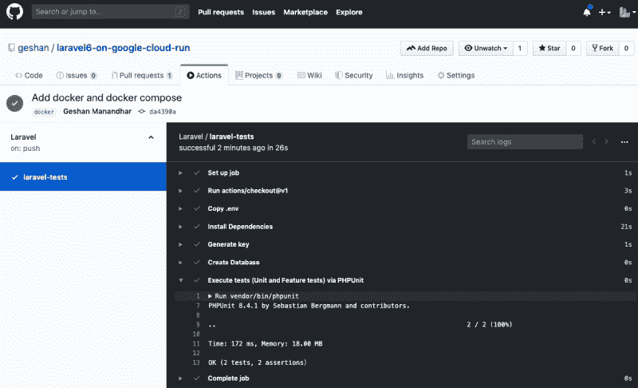

Default Laravel tests running with Github Actions

只有回购的所有者有权访问`Actions`选项卡，所以其他人不一定需要知道您的测试构建的结果:)。

### **8。添加部署到[谷歌云按钮](https://github.com/GoogleCloudPlatform/cloud-run-button)**

现在让我们以简单的方式将这个 Laravel 设置部署到 Google Cloud Run。假设您已经合并了来自`docker`分支的 PR，让我们运行以下命令:

```
git checkout master
git fetch
git pull --rebase origin master
git checkout -b cloud-run-button 
```

然后将以下内容添加到您的`readme.md`文件中:

```
### Run on Google cloud run

[](https://console.cloud.google.com/cloudshell/editor?shellonly=true&cloudshell_image=gcr.io/cloudrun/button&cloudshell_git_repo=https://github.com/geshan/laravel6-on-google-cloud-run.git) 
```

小心点，用你回购的`HTTPs` URL 替换最后一部分。例如，如果你的回购处于`https://github.com/ghaleroshan/laravel6-on-google-cloud-run`，它将是`https://github.com/ghaleroshan/laravel6-on-google-cloud-run.git`，然后提交和推送。你的公关应该看起来像[这个](https://github.com/geshan/laravel6-on-google-cloud-run/pull/3/files)的。

### **9。部署在谷歌云上运行**

在您合并您的拉式请求(PR)后，转到您的回购页面并单击`Run on Google Cloud`按钮。

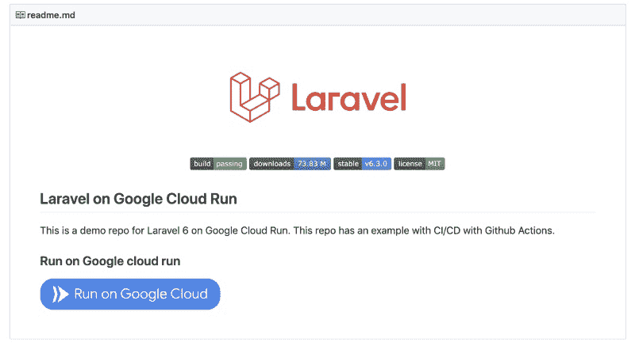

Github readme after adding the Run on Google Cloud button

之后，如果您登录到您的 Google 帐户，并使用 1 个项目设置了 Google cloud，请单击“继续”。那你可能需要等一会儿

1.  选择项目-`Choose a project to deploy this application`
2.  选地区——`Choose a region to deploy this application`，我一般选`us-central-1`
3.  然后等待容器被构建和部署。你可以在下面看到我的过程:

如果你的`Google Cloud Shell`一切正常，你会看到 HTTPS 的网址，点击它可以看到你的 Laravel 应用程序运行如下:

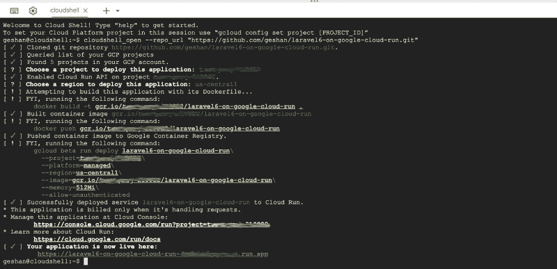

Deploy screen of Google Cloud Shell for Laravel 6 on Cloud Run

上面刚刚发生的是:

1.  选择区域后，脚本从 repo 中的`Dockerfile`构建了一个 docker 容器映像
2.  然后，它将构建的映像推送到 [Google 容器注册表](https://cloud.google.com/container-registry/)
3.  之后使用 [gcloud](https://cloud.google.com/sdk/gcloud/) CLI 将构建的映像部署到 Cloud Run，后者返回 URL。

### 10。万岁，你的应用正在工作

获得 URL 后，您应该会看到您的应用程序在 Google Cloud 上运行，如下所示:

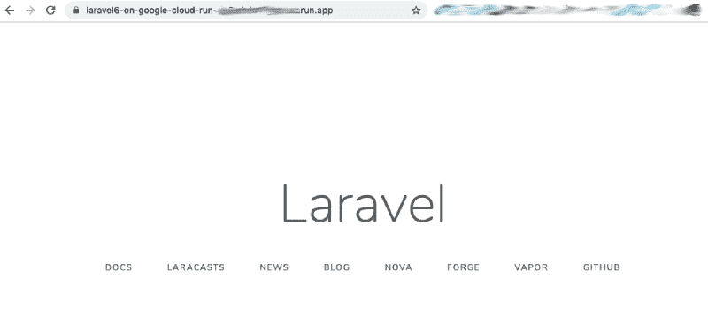

Laravel running on Google Cloud Run with Serverless HTTPS URL :) 

如果您想部署另一个版本，您可以将您的 PR 合并到 master，然后再次单击按钮进行部署。

## **关于 Google Cloud Run 的更多信息**

Google Cloud Run 的[定价](https://cloud.google.com/run/pricing)非常慷慨。你可以在 Google cloud run 上运行任何容器化的 app 或 web app。我运行了一个宠物项目，每分钟有大约 1 个请求，而我不需要支付任何费用。

在幕后，它正在使用 [Knative](https://cloud.google.com/knative/) 和 [Kubernetes](https://kubernetes.io/) 。它也可以在您的 Kubernetes 集群上运行，但是如果您可以推送并获得可扩展的无服务器完全托管应用程序，谁会选择管理 K8s 集群呢:)。

## **TLDR**

要在 Google Cloud Run quickly 上运行 Laravel 6，请按照以下步骤操作:

1.  确保您已登录到您的 [Google Cloud 帐户](https://console.cloud.google.com/)
2.  前往[https://github.com/geshan/laravel6-on-google-cloud-run](https://github.com/geshan/laravel6-on-google-cloud-run)
3.  点击“在谷歌云上运行”蓝色按钮
4.  选择您的项目
5.  选择您的地区
6.  等待并获得您的 Laravel 应用程序的网址如下，享受！


Deploy log of Cloud Run button to deploy Laravel on Google Cloud Run

* * *


Laravel Running successfully on Google Cloud Run

## **结论**

这就对了——在 Google cloud run 上运行 Laravel 应用程序非常简单。你甚至可以用 Github 动作在 Github 上运行测试。希望有帮助。要采用 CI/CD 方法，您可以查看这篇[帖子](https://medium.com/google-cloud/simplifying-continuous-deployment-to-cloud-run-with-cloud-build-including-custom-domain-setup-ssl-22d23bed5cd6)。它展示了使用云构建的部署。由于相同的容器在本地和生产(Google Cloud Run)环境中运行，因此您不需要学习新的框架来实现无服务器。

> 任何容器化的 web 应用程序都可以在 Google Cloud Run 上运行，这是一项非常棒的服务。你可以在 https://geshan.com.np 了解更多