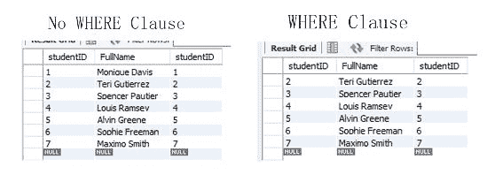
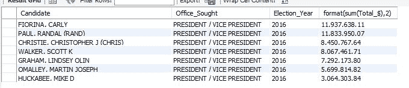

# 最佳 SQL 示例

> 原文：<https://www.freecodecamp.org/news/sql-example/>

SQL 代表结构化查询语言。它与各种关系数据库一起使用。

## 基本 SQL 语法示例

本指南提供了 SQL 语句语法的基本、高级描述。

SQL 是一个国际标准(ISO ),但是您会发现不同实现之间有许多差异。本指南以 MySQL 为例。如果您使用许多其他关系数据库管理器(DBMS)中的一个，如果需要的话，您将需要查看该 DBMS 的手册。

### 我们将涵盖的内容

*   Use(设置语句将使用的数据库)
*   Select 和 From 子句
*   Where 子句(和/或，在，之间，像)
*   订购依据(ASC，DESC)
*   分组依据和拥有

### 这个怎么用

这用于选择包含 SQL 语句表的数据库:

```
use fcc_sql_guides_database; -- select the guide sample database 
```

### Select 和 From 子句

Select 部分通常用于确定要在结果中显示哪些数据列。还有一些选项可以用来显示不是表列的数据。

此示例显示了从“student”表中选择的两列，以及两个计算列。计算列的第一列是无意义的数字，另一列是系统日期。

```
select studentID, FullName, sat_score, recordUpdated, 
3+2 as five, now() as currentDate 
from student; 
```


> Where 子句(and / or，IN，Between and LIKE)

WHERE 子句用于限制返回的行数。

在这种情况下，所有这五个都将被使用是一个有点可笑的 Where 子句。

将这个结果与上面的 SQL 语句进行比较，以遵循这个逻辑。

将显示以下行:

*   学生 id 介于 1 和 5 之间(包括 1 和 5)
*   或者 studentID = 8
*   或者在名称中包含“Maxmimo”

以下示例与此类似，但它进一步指定，如果任何学生具有特定的 SAT 分数(1000、1400)，则不会显示他们:

```
select studentID, FullName, sat_score, recordUpdated
from student
where
  (
    studentID between 1 and 5
    or studentID = 8
    or FullName like '%Maximo%'
  )
and sat_score NOT in (1000, 1400); 
```


### 订购依据(ASC，DESC)

Order By 为我们提供了一种按照 SELECT 部分中的一项或多项对结果集进行排序的方法。这是和上面一样的列表，但是是按照学生的全名排序的。默认的排序顺序是升序(ASC ),但是要以相反的顺序(降序)排序，可以使用 DESC，如下例所示:

```
select studentID, FullName, sat_score
from student
where 
  (
    studentID between 1 
    and 5 -- inclusive
    or studentID = 8 
    or FullName like '%Maximo%'
  ) 
  and sat_score NOT in (1000, 1400)
order by FullName DESC; 
```


### 分组依据和拥有

Group By 为我们提供了一种组合行和聚合数据的方法。Having 子句类似于上面的 Where 子句，只是它作用于分组数据。

这些数据来自我们在一些指南中使用的活动捐款数据。

这条 SQL 语句回答了这样一个问题:“2016 年，哪些候选人收到了最多的捐款(不是 number 美元，而是计数(*))，但只有那些捐款超过 80 笔的候选人？”

按照降序(DESC)对该数据集进行排序，将贡献数量最大的候选项放在列表的顶部。

```
select Candidate, Election_year, sum(Total_$), count(*)
from combined_party_data
where Election_year = 2016
group by Candidate, Election_year
having count(*) > 80
order by count(*) DESC; 
```


与所有这些 SQL 内容一样，它们比本入门指南中的内容要多得多。我希望这至少能给你足够的时间开始。请参阅数据库管理器的手册，并亲自尝试不同的选项。

## 常见的 SQL 面试问题

### 什么是 SQL 中的内部连接？

如果没有指定联接，这是默认的联接类型。它返回两个表中至少有一个匹配项的所有行。

```
SELECT * FROM A x JOIN B y ON y.aId = x.Id 
```

### 什么是 SQL 中的左连接？

左连接返回左表中的所有行，以及右表中的匹配行。即使右表中没有匹配项，也将返回左表中的行。左表中与右表中不匹配的行将具有右表值的`null`。

```
SELECT * FROM A x LEFT JOIN B y ON y.aId = x.Id 
```

### 什么是 SQL 中的右连接？

右连接返回右表中的所有行，以及左表中的匹配行。与左连接相反，这将返回右表中的所有行，即使左表中没有匹配项。右表中与左表不匹配的行将具有左表列的`null`值。

```
SELECT * FROM A x RIGHT JOIN B y ON y.aId = x.Id 
```

### 什么是 SQL 中的完全连接？

完全联接返回在任一表中匹配的所有行。因此，如果左表中有与右表中不匹配的行，这些行将被包括在内。如果右表中的行与左表中的行不匹配，那么这些行将被包括在内。

```
SELECT Customers.CustomerName, Orders.OrderID
FROM Customers
FULL OUTER JOIN Orders
ON Customers.CustomerID=Orders.CustomerID
ORDER BY Customers.CustomerName 
```

### 以下命令的结果是什么？

```
DROP VIEW view_name 
```

这将是一个错误，因为我们不能在视图上执行 DML 操作。

### 我们可以在使用 ALTER 命令后执行回滚吗？

不会，因为 ALTER 是一个 DDL 命令，而 Oracle server 会在执行 DDL 语句时执行自动提交。

### 在列级别实施规则的唯一约束是什么？

NOT NULL 是在列级别起作用的唯一约束。

### SQL 中有哪些伪列？举几个例子？

伪列是返回系统生成值的函数。之所以这样说，是因为伪列是 Oracle 分配的值，与 Oracle 数据库列在同一上下文中使用，但不存储在磁盘上。

```
ROWNUM, ROWID, USER, CURRVAL, NEXTVAL etc. 
```

使用密码 kmd26pt 创建用户 my723acct。使用 PO8 提供的用户数据和临时数据表空间，并在 user data 中为该用户提供 10M 的存储空间，在 temporary_data 中提供 5M 的存储空间。

```
CREATE USER my723acct IDENTIFIED BY kmd26pt
DEFAULT TABLESPACE user_data
TEMPORARY TABLESPACE temporary_data
QUOTA 10M on user_data QUOTA 5M on temporary_data 
```

### 创建角色 role *表*和 _ 视图。

```
CREATE ROLE role_tables_and_views 
```

授予前一个问题的角色连接数据库的权限和创建表和视图的权限。

连接到数据库的权限是创建会话创建表的权限是创建表创建视图的权限是创建视图

```
GRANT Create session, create table, create view TO role_tables_and_views 
```

### 将问题中的前一个角色授予用户 anny 和 rita

```
GRANT role_tables_and_views TO anny, rita 
```

使用密码 kmd26pt 创建用户 my723acct。使用 PO8 提供的用户数据和临时数据表空间，并在 user data 中为该用户提供 10M 的存储空间，在 temporary_data 中提供 5M 的存储空间。

```
CREATE USER my723acct IDENTIFIED BY kmd26pt
DEFAULT TABLESPACE user_data
TEMPORARY TABLESPACE temporary_data
QUOTA 10M on user_data QUOTA 5M on temporary_data 
```

### 创建角色 role *表*和 _ 视图。

```
CREATE ROLE role_tables_and_views 
```

授予前一个问题的角色连接数据库的权限和创建表和视图的权限。

连接到数据库的权限是创建会话创建表的权限是创建表创建视图的权限是创建视图。

```
GRANT Create session, create table, create view TO role_tables_and_views 
```

将问题中的前一个角色授予用户 anny 和 rita

```
GRANT role_tables_and_views TO anny, rita 
```

编写一个命令，将用户 rita 的密码从 abcd 更改为 dfgh

```
ALTER USER rita IDENTIFIED BY dfgh 
```

用户 rita 和 anny 对 SCOTT 创建的表 INVENTORY 没有 SELECT 权限。编写一个命令，允许 SCOTT 授予用户对这些表的 SELECT 权限。

```
GRANT select ON inventory TO rita, anny 
```

用户 rita 已经被转移，不再需要通过角色表和 _ 视图授予她的权限。编写一个命令，将她从以前给定的权限中删除，但她仍然可以连接到数据库。

```
REVOKE select ON scott.inventory FROM rita
REVOKE create table, create view FROM rita 
```

被转移的用户 rita 现在正转到另一家公司。因为她创建的对象不再有用，所以编写一个命令来删除这个用户和她的所有对象。

这里 CASCADE 选项是删除数据库中用户的所有对象所必需的。

```
DROP USER rita CASCADE

/* User rita has been transferred and no longer needs the privilege
that was granted to her through the role role_tables_and_views. Write
a command to remove her from her previous given priviliges except that
she still could connect to the database. */

REVOKE select ON scott.inventory FROM rita
REVOKE create table, create view FROM rita 
```

被转移的用户 rita 现在正转到另一家公司。因为她创建的对象不再有用，所以编写一个命令来删除这个用户和她的所有对象。

这里 CASCADE 选项是删除数据库中用户的所有对象所必需的。

```
DROP USER rita CASCADE 
```

### 编写 SQL 查询，从表中查找第 n 份最高工资。

```
SELECT TOP 1 Salary
FROM
  (
    SELECT DISTINCT TOP N Salary
    FROM Employee
    ORDER BY Salary DESC
  )
ORDER BY Salary ASC
```

## SQL Create View 语句

### 什么是视图？

视图是一个数据库对象，它显示一个或多个表中的数据。视图的使用方式与表类似，但它们不包含任何数据。它们只是“指向”存在于别处的数据(例如，表或视图)。

### 我们为什么喜欢他们？

*   视图是限制显示数据的一种方式。例如，人力资源部门的数据经过过滤，只显示非敏感信息。在这种情况下，敏感信息可能是社会保险号、员工性别、工资率、家庭住址等。
*   跨越多个表的复杂数据可以合并到一个“视图”中这可以让您的业务分析师和程序员的生活更加轻松。

### 重要的安全提示

*   视图由系统管理。当相关表中的数据发生更改、添加或更新时，系统会更新视图。我们希望仅在需要管理系统资源的使用时使用它们。
*   在 MySQL 中，创建视图后对表设计的更改(即新的或删除的列)不会在视图本身中更新。必须更新或重新创建视图。
*   视图是四种标准数据库对象类型之一。其他的是表、存储过程和函数。
*   通常可以像对待表一样对待视图，但是当视图包含多个表时，更新会受到限制或者不可用。
*   还有许多关于视图的其他细节超出了本入门指南的范围。花时间阅读您的数据库管理器手册，享受这个强大的 SQL 对象带来的乐趣。

### Create View 语句(MySQL)的语法

```
CREATE
    [OR REPLACE]
    [ALGORITHM = {UNDEFINED | MERGE | TEMPTABLE}]
    [DEFINER = { user | CURRENT_USER }]
    [SQL SECURITY { DEFINER | INVOKER }]
    VIEW view_name [(column_list)]
    AS select_statement
	[WITH [CASCADED | LOCAL] CHECK OPTION] 
```

*本指南将涵盖陈述的这一部分……*

```
CREATE VIEW view_name [(column_list) ] AS select_statement 
```

### 从学生表创建视图的示例

注意事项:

*   视图的名称末尾有一个“v”。建议视图名称表明它是一个视图，以使程序员和数据库管理员的工作更容易。您的 IT 部门应该有自己的对象命名规则。
*   视图中的列受 SELECT 限制，数据行受 WHERE 子句限制。
*   视图名称两边需要有“`”字符，因为名称中有“-”。如果没有它们，MySQL 会报告一个错误。

```
create view `programming-students-v` as
select FullName, programOfStudy 
from student 
where programOfStudy = 'Programming';

select * from `programming-students-v`; 
```

### 使用视图合并多个表中的数据的示例

数据库中添加了一个学生人口统计表来演示这种用法。该视图将组合这些表。

注意事项:

*   要“连接”表，表必须有共同的字段(通常是主键)，这些字段唯一地标识每一行。在这种情况下，它是学生证。(在 [SQL Joins](https://guide.freecodecamp.org/sql/sql-joins/index.md) 指南中有更多相关信息。)
*   注意每个表的“别名”(s 代表学生，sc 代表学生联系人)。这是一个缩短表名的工具，可以更容易地识别正在使用的表。这比重复输入长表名要容易得多。在本例中，这是必需的，因为 studentID 在两个表中是相同的列名，并且系统将显示“不明确的列名错误”,而不指定使用哪个表。

## SQL Between 运算符指南

由于 SQL 查询优化器，BETWEEN 运算符非常有用。尽管 BETWEEN 在功能上与:x <= element <= y 相同，但 SQL 查询优化器将更快地识别该命令，并优化了运行该命令的代码。

该运算符用于 WHERE 子句或 GROUP BY HAVING 子句中。

选择值大于最小值且小于最大值的行。

重要的是要记住，在命令中输入的值是从结果中排除的**。我们得到了他们之间的东西。**

**以下是在 WHERE 子句中使用该函数的语法:**

```
`select field1, testField
from table1
where testField between min and max` 
```

**下面是一个使用 student 表和 WHERE 子句的示例:**

```
`-- no WHERE clause
select studentID, FullName, studentID
from student;

-- WHERE clause with between
select studentID, FullName, studentID
from student
where studentID between 2 and 7;` 
```

****

**下面是一个使用活动资金表和 having 子句的示例。根据 GROUP BY part 语句中的 HAVING 子句，这将返回候选人捐款总额在 300 万美元到 1800 万美元之间的行。指南中关于聚合更多内容。**

```
`select Candidate, Office_Sought, Election_Year, format(sum(Total_$),2)
from combined_party_data
where Election_Year = 2016
group by Candidate, Office_Sought, Election_Year
having sum(Total_$) between 3000000 and 18000000
order by sum(Total_$) desc;` 
```

****

# **SQL Create Table 语句示例**

**表是存储在数据库中的一组数据。**

**要在数据库中创建一个表，可以使用`CREATE TABLE`语句。您为该表以及包含其数据类型的列列表提供一个名称。**

```
`CREATE TABLE TABLENAME(Attribute1 Datatype, Attribute2 Datatype, ...);` 
```

**下面是一个创建名为 Person 的表的示例:**

```
`CREATE TABLE Person(
  Id int not null, 
  Name varchar not null, 
  DateOfBirth date not null, 
  Gender bit not null, 
  PRIMARY KEY(Id)
);` 
```

**在上面的例子中，每个人都有名字、出生日期和性别。Id 列是标识表中一个人的键。您使用关键字`PRIMARY KEY`将一个或多个列配置为主键。**

**一个列可以是`not null`或`null`，表示它是否是强制的。**

# **SQL 插入查询指南**

**插入查询是向表中插入数据的一种方式。假设我们已经使用创建了一个表**

```
`CREATE TABLE example_table (
  name varchar(255), 
  age int
)` 
```

****示例 _ 表格****

```
`Name|Age
--- | ---` 
```

**现在，为了向该表添加一些数据，我们将以如下方式使用 **INSERT** :**

**`INSERT INTO example_table (column1,column2) VALUES ("Andrew",23)`**

```
`INSERT INTO example_table (column1, column2) 
VALUES ("Andrew", 23)` 
```

****示例 _ 表格****

```
`Name|Age
--- | --- 
Andrew|23`
```

**甚至下面的方法也可以，但是指定哪个数据进入哪个列总是一个好的做法。**

**`INSERT INTO table_name VALUES ("John", 28)`**

```
`INSERT INTO table_name 
VALUES ("John", 28)` 
```

****示例 _ 表格****

```
`Name|Age
--- | --- 
Andrew|23
John|28`
```

# **SQL 和运算符指南**

**用于 WHERE 子句或 GROUP BY HAVING 子句中，以限制从已执行语句返回的行数。当需要满足多个条件时，使用 AND。**

**我们将使用学生表格来展示示例。**

**下面是没有 WHERE 子句的学生表:**

```
`select * from student;` 
```

****

**现在添加了 WHERE 子句以仅显示编程学生:**

```
`select * from student 
where programOfStudy = 'Programming';` 
```

****

**现在，WHERE 子句更新为和，为 SAT 分数也高于 800 的编程学生显示结果:**

```
`select * from student 
where programOfStudy = 'Programming' 
and sat_score > 800;` 
```

****

**这是市场活动捐款表中的一个更复杂的例子。此示例有一个 GROUP BY 子句，其中的 HAVING 子句使用 AND 将返回的记录限制为 2016 年的候选人，其捐款总额在 300 万美元到 1800 万美元之间。**

```
`select Candidate, Office_Sought, Election_Year, FORMAT(sum(Total_$),2) from combined_party_data
where Office_Sought = 'PRESIDENT / VICE PRESIDENT'
group by Candidate, Office_Sought, Election_Year
having Election_Year = 2016 and sum(Total_$) between 3000000 and 18000000
order by sum(Total_$) desc;` 
```

****

## **如何使用 SQL Order By 关键字**

### **订购依据(ASC，DESC)**

**ORDER BY 为我们提供了一种按照 SELECT 部分中的一项或多项对结果集进行排序的方法。下面是一个 SQL 语句，按照全名降序对学生进行排序。默认的排序顺序是升序(ASC ),但是要以相反的顺序(降序)排序，可以使用 DESC。**

```
`SELECT studentID, FullName, sat_score
FROM student
ORDER BY FullName DESC;` 
```

```
`+-----------+------------------------+-----------+
| studentID | FullName               | sat_score |
+-----------+------------------------+-----------+
|         2 | Teri Gutierrez         |       800 |
|         3 | Spencer Pautier        |      1000 |
|         6 | Sophie Freeman         |      1200 |
|         9 | Raymond F. Boyce       |      2400 |
|         1 | Monique Davis          |       400 |
|         4 | Louis Ramsey           |      1200 |
|         7 | Edgar Frank "Ted" Codd |      2400 |
|         8 | Donald D. Chamberlin   |      2400 |
|         5 | Alvin Greene           |      1200 |
+-----------+------------------------+-----------+
9 rows in set (0.00 sec)` 
```

**这里是未排序的、最新的、完整的学生名单，以便与上面的进行比较。**

```
`SELECT studentID, FullName, sat_score, rcd_updated FROM student;` 
```

```
`+-----------+------------------------+-----------+---------------------+
| studentID | FullName               | sat_score | rcd_updated         |
+-----------+------------------------+-----------+---------------------+
|         1 | Monique Davis          |       400 | 2017-08-16 15:34:50 |
|         2 | Teri Gutierrez         |       800 | 2017-08-16 15:34:50 |
|         3 | Spencer Pautier        |      1000 | 2017-08-16 15:34:50 |
|         4 | Louis Ramsey           |      1200 | 2017-08-16 15:34:50 |
|         5 | Alvin Greene           |      1200 | 2017-08-16 15:34:50 |
|         6 | Sophie Freeman         |      1200 | 2017-08-16 15:34:50 |
|         7 | Edgar Frank "Ted" Codd |      2400 | 2017-08-16 15:35:33 |
|         8 | Donald D. Chamberlin   |      2400 | 2017-08-16 15:35:33 |
|         9 | Raymond F. Boyce       |      2400 | 2017-08-16 15:35:33 |
+-----------+------------------------+-----------+---------------------+
9 rows in set (0.00 sec)` 
```

**与所有这些 SQL 内容一样，它们比本入门指南中的内容要多得多。**

**我希望这至少能给你足够的时间开始。**

**请参阅数据库管理器的手册，并亲自尝试不同的选项。**