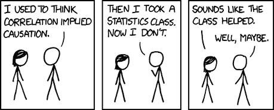
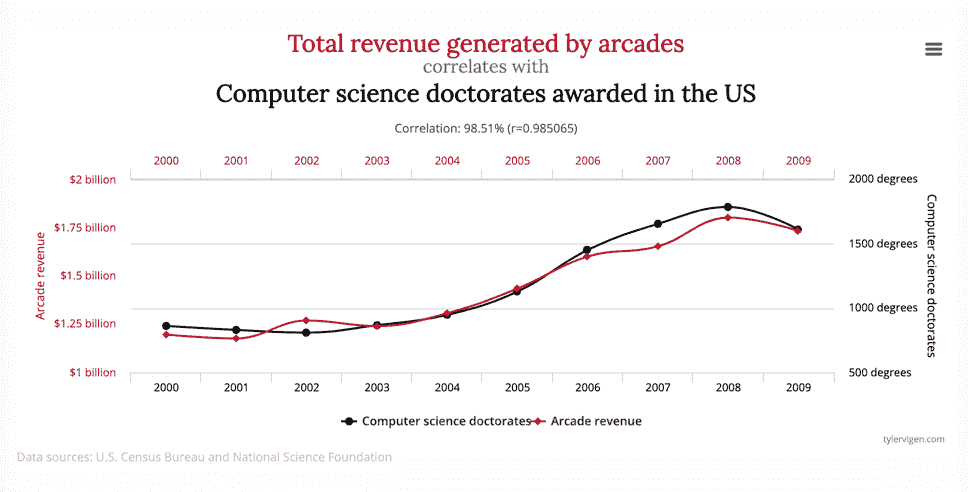
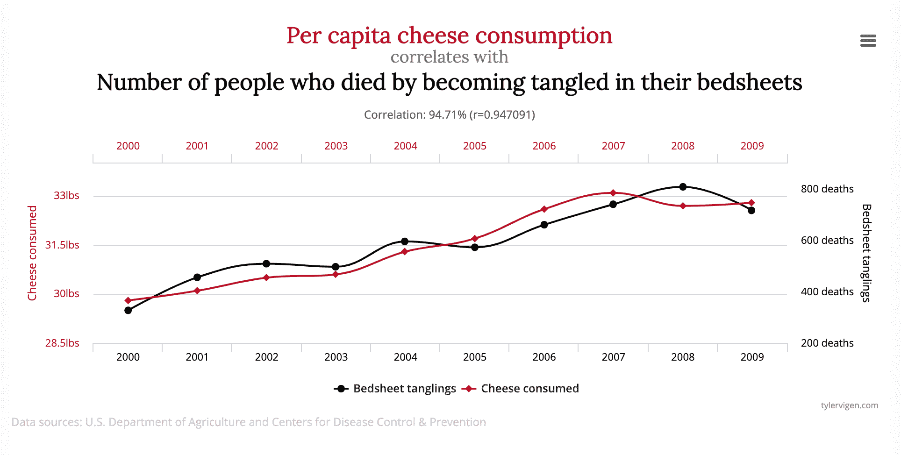

# 为什么相关不意味着因果关系——统计学中这句俗语的含义

> 原文：<https://www.freecodecamp.org/news/why-correlation-does-not-imply-causation-the-meaning-of-this-common-saying-in-statistics/>

你可能还记得统计课上的这句简单的咒语:

> "相关性并不意味着因果关系."

所以也许你认为你知道这个短语的意思。

就像，如果你非常努力地学习统计学，取得了好成绩，然后进了大学，那就意味着你进大学是因为你在统计学课上得了 a。

虽然那个分数，连同你学到的技能，可能会有所帮助，但你不能忽视其他起作用的因素——也不能说你的统计分数是你被大学录取的原因。

[Image Source: XKCD](https://imgs.xkcd.com/comics/correlation.png)

## 首先，为什么我们会把相关性误认为是因果关系？

人们很容易认为，仅仅因为两件事看似相关，其中一件一定是另一件的原因。但这可能是一个愚蠢且有时危险的假设。

例如，假设你正试图找出什么能让人不那么暴躁。你进行了一项研究，发现当人们每晚至少睡 x 个小时时，他们的脾气就不那么暴躁了。

但是你把所有的因素都考虑进去了吗？也许他们也因为休息好而开始更多的锻炼，这就是改变他们情绪的原因。

并不是所有的例子都是良性的，有些例子完全是荒谬的。

为了说明假设相关性意味着因果关系是多么误导人，请看泰勒·维根的[虚假相关性](http://www.tylervigen.com/spurious-correlations)中的下图:

So if you play more video games...you'll get a CS PhD??

虽然这两个因素之间碰巧有很强的相关性，但我怀疑你是否能有效地认为一个因素导致了另一个因素。也许这将是人们尝试和证明的一个挑战。

这是泰勒收藏的另一件珠宝:

If you eat more cheese...you'll be strangled by your sheets??

看看这美丽的关联。但是你很难争辩说，仅仅因为有人吃了更多的奶酪，他们就更有可能致命地缠住自己的床单。

### 统计学中的相关性是什么？

根据[字典](https://www.merriam-webster.com/dictionary/correlation)的解释，**关联**是两个或更多事物(或变量)之间的相互关系或联系——尤其是那些不仅仅基于偶然性的预期。

让我们把它用在一个句子中:我家种的巨大的西红柿似乎与今年夏天的多雨有关。

现在，我在这里假设，因为比平时多下了一点雨，我的番茄植株疯了，结出了巨大的番茄。

但这是唯一的因素吗？我在培育床中使用的营养丰富的堆肥怎么样？我从苗圃买的植物质量怎么样？那我精心的修剪和抚育呢？

正如你所看到的，虽然我的大番茄和我们多雨的夏天有关联，但这并不一定意味着因果关系。

### 统计学中的因果关系是什么？

是时候给出另一个定义了。根据字典的解释，因果关系是产生结果的行为或媒介。

让我们更具体一点。因果关系是指两个事件之间存在某种关系，其中一个事件会影响另一个事件。在统计学中，当一个事件或变量的值因为另一个事件或变量而上升或下降时，我们可以说有因果关系。A **导致了** B 的发生。

这个例子怎么样？也许你是一家按字数收费的杂志的自由撰稿人。故事越长(包含的字数越多)，你得到的报酬就越多。

所以你写多少字和你拿多少钱有直接的关系。但是也有因果关系(因为你写得更多，你得到的报酬也更多)。

## 为什么这么容易弄错呢？

为什么很容易认为相关性**意味着**因果关系？嗯，如果两件事看起来相关，我们倾向于将它们联系起来，并假设它们相互影响。天气寒冷时，人们在室内呆的时间更长。节假日前后，商场里人头攒动。当你服用一些布洛芬时，你的头痛就会消失。

虽然这些情况肯定是相关的——有些甚至可能意味着因果关系——但它们不一定经得起科学分析。

有几个原因会让我们错误地从相关性中推断出因果关系。

### 什么是混杂变量？

首先，你可能有一个**混淆变量**。这是一个既影响你关系中的自变量又影响因变量的变量——因此混淆了你决定关系性质的能力。

例如，如果一个新家庭搬到一个社区，犯罪率上升，该地区的居民可能会认为是因为这个新家庭。但如果与此同时，一个拘留中心在附近开张了呢？这更可能是犯罪率上升的原因。

### 什么是反向因果关系？

第二，你可能在处理**反向因果关系**。当你没有正确地假设 A 导致 B，而是把它们混在一起，并假设 B 导致 A 时，就会发生这种情况。

可能很难想象这是如何发生的，但是想想太阳能电池板是如何工作的。当太阳在天空中停留的时间更长时，它们会产生更多的能量。

但是太阳不会在天空中停留更长时间，因为电池板产生了更多的能量。因为阳光照射的时间更长了，电池板产生了更多的能量。

### 什么是巧合？

第三，一定不能忘记**巧合**的力量。当两件事同时发生时，很容易看出因果关系。但是就像上面那个愚蠢的图表一样，有拱廊和 CS 学位，很多只是巧合。

### 最终-我们为什么要在乎？

也许你正试图弄清楚某种新药是否会让病人感觉好些。或者你想知道是什么让人们购买某种产品。

无论你的动机是什么，弄清楚 A 是否导致 B，以及如何和为什么，通常是非常有用的。

但正如我们所见，这并不容易。你必须控制尽可能多的因素，减少混淆变量和巧合的可能性，把数据削减到相关的程度。

我们不会进入更深层次的哲学问题，即我们如何才能毫无疑问地真正确立因果关系。那是以后的事了。

至少现在你知道了——即使两个事件或变量看起来相关——这并不意味着一个对另一个有直接的因果影响。