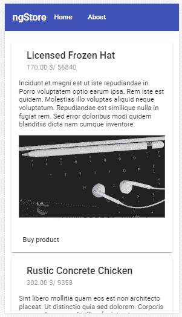
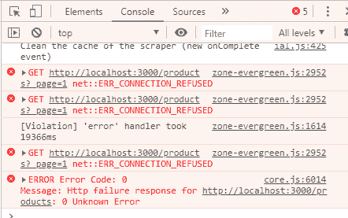
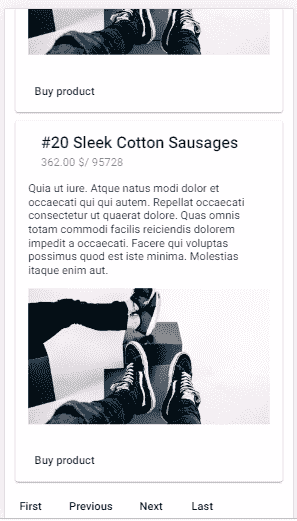

# 如何通过 11 个简单的步骤从零开始构建 Angular 8 应用程序

> 原文：<https://www.freecodecamp.org/news/angular-8-tutorial-in-easy-steps/>

Angular 是前端开发最受欢迎的三大框架之一，与 React 和 Vue.js 并列，最新版本是 2019 年 5 月 28 日发布的 Angular 8。

命令行界面和框架本身都有许多新的特性和增强，这带来了性能提升和更小的产品包。一个有趣的特性是 ng deploy 命令，它允许开发人员快速构建并部署他们的 Angular 应用程序到流行的主机提供商，如 Firebase 或 GitHub。

在本教程中，我们将带您一步一步地从头开始构建一个示例 Angular 应用程序，它使用了许多 Angular APIs，如 HttpClient 和 Material Design。

这里有一些我们要学的东西:

*   如何模仿使用 JSON 文件中虚假数据的 REST API 服务器
*   如何使用`Httplient`从我们的 Angular 8 应用程序中使用 REST API
*   如何使用 RxJS `throwError()`和`catchError()`操作符处理 HTTP 错误
*   如何在恶劣的网络条件下重试失败的 HTTP 请求，并使用 RxJS `retry()`和`takeUntil()`操作符取消挂起的请求
*   如何创建和利用角度组件和服务
*   如何在我们的项目中设置路由和角度材质，并使用材质设计组件创建专业外观的 UI
*   最后，我们将学习如何使用 Angular 8.3+中可用的`ng deploy`命令将应用程序部署到 Firebase。

您还将通过示例了解:

*   如何用真实世界的特性快速模仿 REST API，比如分页，您可以在应用程序准备好切换到真正的后端之前使用它。
*   如何设置角度 CLI
*   如何初始化你的 Angular 8 项目
*   如何设置有角度的材质
*   如何添加角度组件和布线
*   如何生成和使用角度服务
*   如何用 Angular HttpClient 消费 REST APIs
*   如何将您的 Angular 应用程序构建并部署到 Firebase。

本教程分为以下步骤:

*   步骤 1 —安装 Angular CLI 8
*   步骤 2-创建 Angular 8 项目
*   步骤 3 —添加 Angular HttpClient
*   步骤 4 —创建组件
*   步骤 5 —添加路由
*   第 6 步——用有角度的材料组件构建用户界面
*   步骤 7——模仿 REST API
*   步骤 8——用 Angular HttpClient 使用 REST API
*   步骤 9 —处理 HTTP 错误
*   步骤 10 —添加分页
*   步骤 11——构建 Angular 应用程序并将其部署到 Firebase

现在，让我们从先决条件开始！

> **注**:你可以免费下载我们的 **[Angular 8 书:用 Angular 8](https://www.techiediaries.com/angular-book-build-your-first-web-apps/)** 构建你的第一个 web 应用。

# 先决条件

如果您想学习本教程，您需要具备:

*   先前的打字知识。
*   安装了**节点 8.9+** 和 **NPM 5.5.1+** 的开发机。Angular CLI 需要节点。你可以去[官方网站](https://nodejs.org/downloads)下载你系统的二进制文件。您还可以使用[NVM](https://github.com/nvm-sh/nvm)——节点版本管理器——一个 POSIX 兼容的 bash 脚本，在您的机器上安装和管理多个 Node.js 版本。

如果您准备好了，让我们通过示例来学习如何构建一个使用 HttpClient 使用 REST API 的 Angular 8 应用程序。我们将实现真实世界的特性，比如错误处理和重试失败的 HTTP 请求。

# 步骤 1 —安装 Angular CLI 8

让我们从第一步开始，我们将安装最新版本的 Angular CLI。


Angular CLI 是用于初始化和使用 Angular 项目的官方工具。转到一个新的终端，执行以下命令:

```
$ npm install -g @angular/cli 
```

撰写本教程时，我们的系统上安装了 **angular/cli v8.3.2** 。

就这样，你准备好第二步了！

# 步骤 2-创建 Angular 8 项目

在这一步中，我们将使用 Angular CLI 来初始化我们的 Angular 项目。

转到您的终端并执行以下命令:

```
$ cd ~  
$ ng new angular-example 
```

CLI 将提示您并询问**是否要添加角度路由。**说好。然后它会问**你想使用哪种样式表格式。**选择 **CSS** 。

Angular CLI 将生成所需的文件和文件夹，从 npm 安装软件包，甚至在我们的项目中自动设置路由。

现在，转到项目的根文件夹，使用以下命令运行本地开发服务器:

```
$ cd angular-example  
$ ng serve 
```

您可以从`[http://localhost:4200/](http://localhost:4200/)`地址访问 Angular web 应用程序。


打开网络浏览器，转到`http://localhost:4200/`地址。您应该会看到这个漂亮的页面(从 Angular 8.3+开始):


您需要让开发服务器保持运行，并为后续步骤打开一个新的终端。

您现在已经准备好进行第三步了！

# 步骤 3 —添加 Angular HttpClient

在这一步，我们将把`HttpClient`添加到我们的示例项目中。

打开`src/app/app.module.ts`文件，进行以下更改:

```
import { BrowserModule } from '@angular/platform-browser';
import { NgModule } from '@angular/core';

import { AppRoutingModule } from './app-routing.module';
import { AppComponent } from './app.component';
import { HttpClientModule } from '@angular/common/http';

@NgModule({
  declarations: [
    AppComponent,
  ],
  imports: [
    BrowserModule,
    AppRoutingModule,
    HttpClientModule
  ],
  providers: [],
  bootstrap: [AppComponent]
})
export class AppModule { }
```

我们简单地导入了 [HttpClientModule](https://angular.io/api/common/http/HttpClientModule#description) ，并将其包含在`imports`数组中。

这就是全部——现在我们可以在 Angular 项目中使用`HttpClient`服务来消费我们的 REST API。

你已经准备好进行第五步了！

# 步骤 4 —创建用户界面组件

Angular apps 是由组件组成的。在这一步，我们将学习如何创建两个角度组件来组成我们的用户界面。

打开一个新终端并运行以下命令:

```
$ cd ~/angular-example  
$ ng g component home 
```

您将在终端中得到以下输出:

```
CREATE src/app/home/home.component.html (19 bytes)  
CREATE src/app/home/home.component.spec.ts (614 bytes)  
CREATE src/app/home/home.component.ts (261 bytes)  
CREATE src/app/home/home.component.css (0 bytes)  
UPDATE src/app/app.module.ts (467 bytes) 
```

我们有四个文件，都是组件所需要的。

接下来，生成 about 组件:

```
$ ng g component about 
```

接下来，打开`src/app/about/about.component.html`文件并添加以下代码:

```
<p style="padding: 15px;"> This is the about page that describes your app</p> 
```

你已经准备好进行第六步了！

# 步骤 5-添加路由

在这一步中，我们将学习如何向示例中添加路由。

转到`src/app/app-routing.module.ts`文件，添加以下路线:

```
import { NgModule } from '@angular/core';
import { Routes, RouterModule } from '@angular/router';
import { HomeComponent } from './home/home.component';
import { AboutComponent } from './about/about.component';

const routes: Routes = [
  { path: '', redirectTo: 'home', pathMatch: 'full'},
  { path: 'home', component: HomeComponent },
  { path: 'about', component: AboutComponent },
];

@NgModule({
  imports: [RouterModule.forRoot(routes)],
  exports: [RouterModule]
})
export class AppRoutingModule { } 
```

我们导入了角度组件，并声明了三条路线。

第一种方法是将空路径重定向到 home 组件，所以当我们第一次访问应用程序时，我们会被自动重定向到主页。

就是这样。现在您已经添加了路由，可以开始下一步了！

# 步骤 6-添加角形材料

在本教程步骤中，我们将学习在我们的项目中设置[角度材质](https://material.angular.io/)，并使用材质组件构建我们的应用程序 UI。

转到您的终端，从项目的根目录运行以下命令:

```
$ ng add @angular/material 
```

系统会提示您选择主题，所以让我们选择**靛蓝/粉色**。

对于其他问题——是否要**为手势识别设置 HammerJS】以及是否要**为有角度的素材设置浏览器动画**——按**输入**使用默认答案。**

打开`src/app/app.module.ts`文件并添加以下导入:

```
import { MatToolbarModule,
  MatIconModule,
  MatCardModule,
  MatButtonModule,
  MatProgressSpinnerModule } from '@angular/material'; 
```

我们导入了这些材料设计组件的模块:

*   MatToolbar 为标题、标题或动作提供一个容器。
*   MatCard 为单个主题的上下文中的文本、照片和动作提供内容容器。
*   [MatButton](https://material.angular.io/components/button/overview) 提供了原生的`<button>`或`<a>`元素，增强了材料设计风格和墨水波纹。
*   MatProgressSpinner 提供进度和活动的循环指示器。

接下来，将这些模块添加到`imports`数组中:

```
@NgModule({
  declarations: [
    AppComponent,
    HomeComponent,
    AboutComponent
  ],
  imports: [
    BrowserModule,
    AppRoutingModule,
    HttpClientModule,
    BrowserAnimationsModule,
    MatToolbarModule,
    MatIconModule,
    MatButtonModule,
    MatCardModule,
    MatProgressSpinnerModule
  ],
  providers: [],
  bootstrap: [AppComponent]
})
export class AppModule { } 
```

接下来，打开`src/app/app.component.html`文件，并更新如下:

```
<mat-toolbar color="primary">  
<h1>  
My Angular Store  
</h1>  
<button mat-button routerLink="/">Home</button>  
<button mat-button routerLink="/about">About</button></mat-toolbar><router-outlet></router-outlet> 
```

我们添加了一个顶部导航栏，带有两个按钮，分别带我们到主页和关于页面。

# 步骤 7——模仿 REST API

转到一个新的命令行界面，从在您的项目中安装 npm 的`json-server`开始:

```
$ cd ~/angular-example
$ npm install --save json-server 
```

接下来，在 Angular 项目的根文件夹中创建一个`server`文件夹:

```
$ mkdir server
$ cd server 
```

在`server`文件夹中，创建一个`database.json`文件，并添加以下 JSON 对象:

```
{
    "products": []
} 
```

这个 JSON 文件将作为 REST API 服务器的数据库。您可以简单地添加一些由 REST API 提供的数据，或者使用 [Faker.js](https://github.com/marak/Faker.js/) 自动生成大量真实的假数据。

回到您的命令行，从`server`文件夹往回导航，并使用以下命令从 npm 安装`Faker.js`:

```
$ cd ..
$ npm install faker --save 
```

在创建这个示例时，将安装 **faker v4.1.0** 。

现在，创建一个`generate.js`文件并添加以下代码:

```
var faker = require('faker');

var database = { products: []};

for (var i = 1; i<= 300; i++) {
  database.products.push({
    id: i,
    name: faker.commerce.productName(),
    description: faker.lorem.sentences(),
    price: faker.commerce.price(),
    imageUrl: "https://source.unsplash.com/1600x900/?product",
    quantity: faker.random.number()
  });
}

console.log(JSON.stringify(database)); 
```

我们首先导入 faker，接下来我们用一个空数组为产品定义一个对象。接下来，我们为循环输入一个*来创建 *300 个*假条目，使用类似`faker.commerce.productName()`的伪造方法来生成产品名称。[检查所有可用的方法](https://github.com/marak/Faker.js/#api-methods)。最后，我们将数据库对象转换为字符串，并将其记录到标准输出中。*

接下来，将`generate`和`server`脚本添加到`package.json`文件中:

```
 "scripts": {
    "ng": "ng",
    "start": "ng serve",
    "build": "ng build",
    "test": "ng test",
    "lint": "ng lint",
    "e2e": "ng e2e",
    "generate": "node ./server/generate.js > ./server/database.json",
    "server": "json-server --watch ./server/database.json"
  }, 
```

接下来，回到您的命令行界面，使用以下命令运行生成脚本:

```
$ npm run generate 
```

最后，通过执行以下命令运行 REST API 服务器:

```
$ npm run server 
```

现在，您可以像任何典型的 REST API 服务器一样向服务器发送 HTTP 请求。您的服务器将可以从`http://localhost:3000/`地址访问。

这些是我们将能够通过 JSON REST API 服务器使用的 API 端点:

*   `GET /products`为了得到产品
*   `GET /products/<id>`通过 id 获取单个产品
*   `POST /products`用于创造新产品
*   `PUT /products/<id>`用于按 id 更新产品
*   `PATCH /products/<id>`用于通过 id 部分更新产品
*   `DELETE /products/<id>`用于按 id 删除产品

您可以使用`_page`和`_limit`参数来获取分页数据。在`Link`标题中，您将获得`first`、`prev`、`next`和`last`链接。

让 JSON REST API 服务器保持运行，并打开一个新的命令行界面来输入接下来步骤的命令。

# 步骤 8——使用 Angular HttpClient 创建使用 REST API 的服务

在这一步，我们将学习如何使用 HttpClient 从 Angular 使用 REST API。

我们需要创建一个封装代码的角度服务，允许我们从 REST API 服务器中使用数据。

转到您的终端，运行以下命令:

```
$ ng g service api 
```

接下来，转到`src/app/api.service.ts`文件，导入并注入`HttpClient`:

```
import { Injectable } from '@angular/core';
import { HttpClient } from '@angular/common/http';

@Injectable({
  providedIn: 'root'
})
export class ApiService {

  private SERVER_URL = "http://localhost:3000";

  constructor(private httpClient: HttpClient) { }
} 
```

我们导入并注入了`HttpClient`服务，并定义了包含 REST API 服务器地址的`SERVER_URL`变量。

接下来，定义一个向 REST API 端点发送 GET 请求的`get()`方法:

```
import { Injectable } from '@angular/core';  
import { HttpClient } from '@angular/common/http';

@Injectable({  
	providedIn: 'root'  
})  
export class ApiService {

	private SERVER_URL = "http://localhost:3000";
	constructor(private httpClient: HttpClient) { }

	public get(){  
		return this.httpClient.get(this.SERVER_URL);  
	}  
} 
```

该方法简单地调用`HttpClient`的`get()`方法，向 REST API 服务器发送 GET 请求。

接下来，我们现在需要在我们的 home 组件中使用这个服务。打开`src/app/home/home.component.ts`文件，导入并注入数据服务，如下所示:

```
import { Component, OnInit } from '@angular/core';  
import { ApiService } from '../api.service';

@Component({  
	selector: 'app-home',  
	templateUrl: './home.component.html',  
	styleUrls: ['./home.component.css']  
})  
export class HomeComponent implements OnInit {
	products = [];
	constructor(private apiService: ApiService) { }
	ngOnInit() {
		this.apiService.get().subscribe((data: any[])=>{  
			console.log(data);  
			this.products = data;  
		})  
	}
} 
```

我们导入并注入了`ApiService.`接下来，我们定义了一个`products`变量，并调用服务的`get()`方法从 JSON REST API 服务器获取数据。

接下来，打开`src/app/home/home.component.html`文件，并更新如下:

```
<div style="padding: 13px;">
    <mat-spinner *ngIf="products.length === 0"></mat-spinner>

    <mat-card *ngFor="let product of products" style="margin-top:10px;">
        <mat-card-header>
            <mat-card-title>{{product.name}}</mat-card-title>
            <mat-card-subtitle>{{product.price}} $/ {{product.quantity}}
            </mat-card-subtitle>
        </mat-card-header>
        <mat-card-content>
            <p>
                {{product.description}}
            </p>
            
        </mat-card-content>
        <mat-card-actions>
      <button mat-button> Buy product</button>
    </mat-card-actions>
    </mat-card>
</div> 
```

当`products`数组的长度等于零时，也就是在从 REST API 服务器接收到任何数据之前，我们使用了`<mat-spinner>`组件来显示加载微调器。

接下来，我们对`products`数组进行迭代，并使用一个物料卡片来显示每个产品的`name`、`price`、`quantity`、`description`和`image`。

这是获取 JSON 数据后的主页截图:



接下来，我们将了解如何向我们的服务添加错误处理。

# 步骤 9 —添加错误处理

在这一步，我们将学习在示例中添加错误处理。

转到`src/app/api.service.ts`文件，按如下方式更新:

```
import { Injectable } from '@angular/core';
import { HttpClient, HttpErrorResponse } from "@angular/common/http";

import {  throwError } from 'rxjs';
import { retry, catchError } from 'rxjs/operators';

@Injectable({
  providedIn: 'root'
})
export class ApiService {

  private SERVER_URL = "http://localhost:3000/products";

  constructor(private httpClient: HttpClient) { }

  handleError(error: HttpErrorResponse) {
    let errorMessage = 'Unknown error!';
    if (error.error instanceof ErrorEvent) {
      // Client-side errors
      errorMessage = `Error: ${error.error.message}`;
    } else {
      // Server-side errors
      errorMessage = `Error Code: ${error.status}\nMessage: ${error.message}`;
    }
    window.alert(errorMessage);
    return throwError(errorMessage);
  }

  public sendGetRequest(){
    return this.httpClient.get(this.SERVER_URL).pipe(catchError(this.handleError));
  }
}
```

这是浏览器控制台上一个错误示例的屏幕截图:



在下一步中，我们将看到如何向我们的应用程序添加分页

# 步骤 10 —添加分页

在这一步中，我们将学习使用从 REST API 服务器收到的 HTTP 响应的链接头来添加对数据分页的支持。

默认情况下，HttpClient 只提供响应正文。但是在我们的应用程序中，我们需要解析链接头来提取分页链接。所以我们需要指示`HttpClient`使用`observe`选项给我们完整的 [HttpResponse](https://angular.io/api/common/http/HttpResponse) 。

HTTP 中的链接头允许服务器将感兴趣的客户机指向另一个资源，该资源包含关于所请求资源的元数据。[维基百科](https://www.w3.org/wiki/LinkHeader)

打开`src/app/data.service.ts`文件，导入 RxJS `tap()`运算符:

```
import { retry, catchError, tap } from 'rxjs/operators'; 
```

接下来，添加这些变量:

```
public first: string = "";  
public prev: string = "";  
public next: string = "";  
public last: string = ""; 
```

接下来，添加用于解析链接头的`parseLinkHeader()`方法，并填充前面的变量:

```
 parseLinkHeader(header) {
    if (header.length == 0) {
      return ;
    }

    let parts = header.split(',');
    var links = {};
    parts.forEach( p => {
      let section = p.split(';');
      var url = section[0].replace(/<(.*)>/, '$1').trim();
      var name = section[1].replace(/rel="(.*)"/, '$1').trim();
      links[name] = url;

    });

    this.first  = links["first"];
    this.last   = links["last"];
    this.prev   = links["prev"];
    this.next   = links["next"]; 
  } 
```

接下来，更新`sendGetRequest()`如下:

```
 public sendGetRequest(){
    // Add safe, URL encoded _page and _limit parameters 

    return this.httpClient.get(this.SERVER_URL, {  params: new HttpParams({fromString: "_page=1&_limit=20"}), observe: "response"}).pipe(retry(3), catchError(this.handleError), tap(res => {
      console.log(res.headers.get('Link'));
      this.parseLinkHeader(res.headers.get('Link'));
    }));
  }
```

我们在`get()`方法的 options 参数中添加了带有`response`值的`observe`选项，这样我们就可以得到带有报头的完整 HTTP 响应。接下来，我们使用 RxJS `tap()`操作符解析链接头，然后返回最终的可观察值。

由于`sendGetRequest()`现在返回一个带有完整 HTTP 响应的可观察对象，我们需要更新 home 组件，因此打开`src/app/home/home.component.ts`文件并导入`HttpResponse`,如下所示:

```
import { HttpResponse } from '@angular/common/http'; 
```

接下来，更新`subscribe()`方法，如下所示:

```
ngOnInit(){

this.apiService.sendGetRequest().pipe(takeUntil(this.destroy$)).subscribe((res: HttpResponse<any>)=>{  
	console.log(res);  
	this.products = res.body;  
})  
} 
```

我们现在可以从接收到的 HTTP 响应的`body`对象中访问数据。

接下来，返回 src/app/data.service.ts 文件并添加以下方法:

```
public sendGetRequestToUrl(url: string){  
	return this.httpClient.get(url, { observe: "response"}).pipe(retry(3), 			
	catchError(this.handleError), tap(res => {  
		console.log(res.headers.get('Link'));  
		this.parseLinkHeader(res.headers.get('Link'));
	}));  
} 
```

这个方法类似于`sendGetRequest()`，除了它接受我们需要发送 HTTP GET 请求的 URL。

返回到`src/app/home/home.component.ts`文件并添加定义以下方法:

```
 public firstPage() {
    this.products = [];
    this.apiService.sendGetRequestToUrl(this.apiService.first).pipe(takeUntil(this.destroy$)).subscribe((res: HttpResponse<any>) => {
      console.log(res);
      this.products = res.body;
    })
  }
  public previousPage() {

    if (this.apiService.prev !== undefined && this.apiService.prev !== '') {
      this.products = [];
      this.apiService.sendGetRequestToUrl(this.apiService.prev).pipe(takeUntil(this.destroy$)).subscribe((res: HttpResponse<any>) => {
        console.log(res);
        this.products = res.body;
      })
    }

  }
  public nextPage() {
    if (this.apiService.next !== undefined && this.apiService.next !== '') {
      this.products = [];
      this.apiService.sendGetRequestToUrl(this.apiService.next).pipe(takeUntil(this.destroy$)).subscribe((res: HttpResponse<any>) => {
        console.log(res);
        this.products = res.body;
      })
    }
  }
  public lastPage() {
    this.products = [];
    this.apiService.sendGetRequestToUrl(this.apiService.last).pipe(takeUntil(this.destroy$)).subscribe((res: HttpResponse<any>) => {
      console.log(res);
      this.products = res.body;
    })
  }
```

最后，打开`src/app/home/home.component.html`文件并更新模板，如下所示:

```
<div style="padding: 13px;">
    <mat-spinner *ngIf="products.length === 0"></mat-spinner>

    <mat-card *ngFor="let product of products" style="margin-top:10px;">
        <mat-card-header>
            <mat-card-title>#{{product.id}} {{product.name}}</mat-card-title>
            <mat-card-subtitle>{{product.price}} $/ {{product.quantity}}
            </mat-card-subtitle>
        </mat-card-header>
        <mat-card-content>
            <p>
                {{product.description}}
            </p>
            
        </mat-card-content>
        <mat-card-actions>
      <button mat-button> Buy product</button>
    </mat-card-actions>
    </mat-card>

</div>
<div>
    <button (click) ="firstPage()" mat-button> First</button>
    <button (click) ="previousPage()" mat-button> Previous</button>
    <button (click) ="nextPage()" mat-button> Next</button>
    <button (click) ="lastPage()" mat-button> Last</button>
</div>
```

这是我们应用程序的屏幕截图:



# 步骤 11——构建 Angular 应用程序并将其部署到 Firebase

回到你的命令行界面。确保您位于 Angular 项目的根文件夹中，并运行以下命令:

```
$ ng add @angular/fire 
```

这将为您的项目添加 Firebase 部署功能。

截至本教程撰写之时，将安装 **@angular/fire v5.2.1** 。

该命令还将通过添加以下部分来更新我们项目的`package.json`:

```
 "deploy": {
          "builder": "@angular/fire:deploy",
          "options": {}
        } 
```

CLI 将提示您**将授权代码粘贴到此处:**，并打开您的默认 web 浏览器，要求您授予 Firebase CLI 权限来管理您的 Firebase 帐户。

当你使用与你的 Firebase 账户相关联的 Google 账户登录后，你会得到一个授权码。

接下来，会提示您**请选择一个项目:(使用箭头键或键入进行搜索)**。您之前应该已经创建了一个 Firebase 项目。

CLI 将创建`firebase.json`和`.firebaserc`文件并相应地更新`angular.json`文件。

接下来，使用以下命令将您的应用程序部署到 Firebase:

```
$ ng deploy 
```

该命令将生成应用程序的优化版本(相当于`ng deploy --prod`命令)。它会将生产资产上传到 Firebase 主机。

# 结论

在这个循序渐进的教程中，您学习了使用最新的 Angular 8.3+版本从头构建一个 Angular 应用程序。

您学会了用几乎零行代码来模拟 Angular 应用程序的 REST API 后端。

您学习了如何使用 Angular CLI 创建一个项目，添加`HttpClient`和 Angular Material 来发送 HTTP 请求到您的模拟 REST API 后端，并使用 Material Design 组件设计 UI。

最后，您学习了从 Angular 8.3+开始使用`ng deploy`命令将 Angular 应用程序部署到 Firebase。

查看我们的其他[角度教程](https://www.techiediaries.com/angular)。

您可以通过作者的以下地址联系或关注作者:

*   [个人网站](https://www.ahmedbouchefra.com/)
*   [推特](https://twitter.com/ahmedbouchefra)
*   [LinkedIn](https://www.linkedin.com/in/mr-ahmed/)
*   [Github](https://github.com/techiediaries)