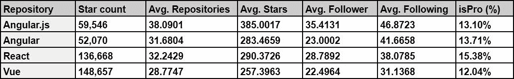
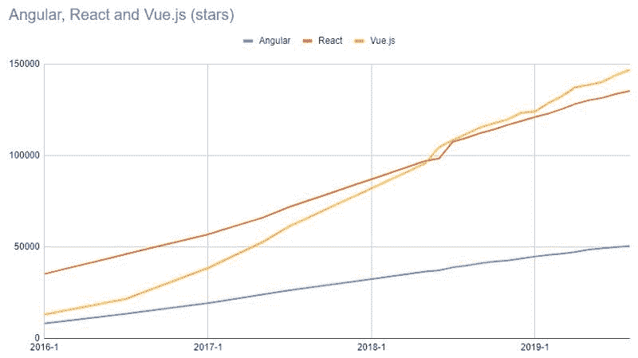
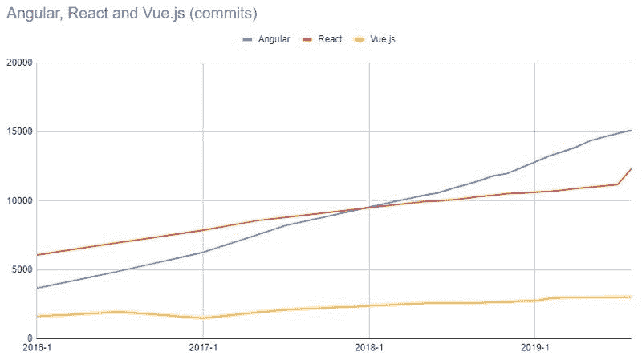
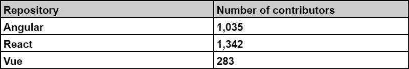
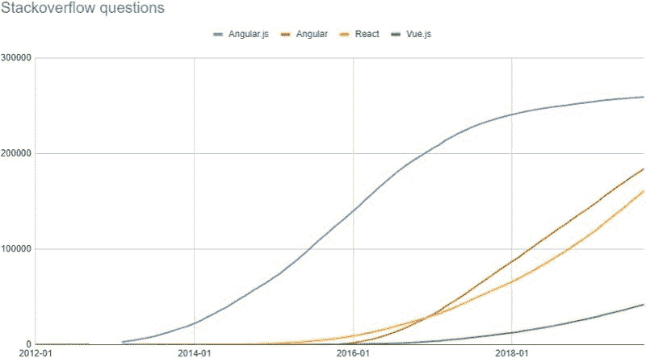
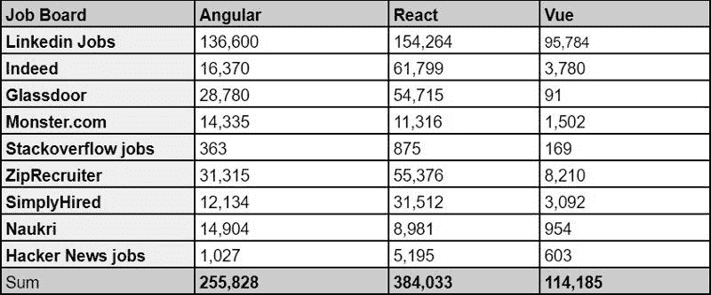

# 反应、角度和 Vue 的统计分析

> 原文：<https://www.freecodecamp.org/news/angular-react-vue/>

许多人在决定信任和使用一个开源项目时会看 GitHub stars。而且有些人很容易根据一个存储库的星级数来比较或判断项目。但是，仅仅根据 GitHub stars 做决定并不总是最好的主意——你应该把你的需求、框架特性和架构放在第一位。

这些框架或库没有一个是“坏的”我们应该始终意识到，许多专家投入了无数的时间来开发这些项目。所以，如果你是一个特定框架的狂热爱好者，放松几分钟，放松，平静地继续。

> 我们都在朝着同一个目标努力，所有这些框架的作者都试图为你提供一些东西，帮助你尽可能高效地构建 web 应用——尤雨溪(Vue.js 的创始人)

### 这篇文章到底是关于什么的？

这篇文章不是对这三个 web 框架的比较。这是因为大多数时候，比较是由那些想要宣传他们喜欢的框架的人进行的。或者他们是由那些不真正理解创建一个框架需要什么的人做的，所以他们看不到这些框架的不同方面。

这篇文章只是对 Angular，React 和 Vue 以及它们多年来的运动进行了统计。以下是我们将要了解的内容:

1.  随着时间的推移，角度、反应和 Vue 的 GitHub 存储库
2.  Stackoverflow 问题/答案
3.  工作统计
4.  结论

那么，让我们开始吧。

## Angular、React 和 Vue 的 GitHub 库随时间的变化

**291，934 个唯一 GitHub 用户**有在 Angular、Angular.js、React、Vue 的仓库中至少有一个打了星。出于统计和人口统计的目的，我花了大约两周时间爬取所有这些用户页面(你可以在 GitHub 上访问这些收集的数据[)。那么，我们能从这些收集的数据中学到什么呢？](https://github.com/m98/react-angular-vue-starers)

### 什么是存储库平均值？

下表显示了 GitHub 的一些主要指标的平均值。正如你所看到的，这些平均值之间有一个短暂的差距。我只是试图提供信息，我不会解释任何事情。

为了更好地理解这些存储库在过去几年中的增长率，我在下面的图表中准备了它们的星计数。

### 常见启动器

下图和下表显示了在多个存储库中打上星号的用户数量。正如你所看到的，React 和 Vue 有更多的共同点，Angular 在 React 和 Vue 之间有几乎相同的共同用户数。

### Git 随时间提交

提交的数量是了解项目开发活跃程度的一个好方法。

下面的条形图显示了一段时间内提交的数量。与 Vue 不同，Angular 和 React 贡献者对他们的库做了很多贡献。

[https://public.flourish.studio/visualisation/795427/embed](https://public.flourish.studio/visualisation/795427/embed)

Number of commits per time

这是相同数据的另一个图表:

Angular, React and Vue’s number of commits

### 贡献者人数

贡献者的数量是使存储库更强大的因素之一，因为有更多的人知道如何开发和改进框架或库。他们可以简单地推进项目，这意味着有更大的机会发现和修复更多的错误和问题，并更快地改进它们。

事实上，这对社区也有好处，因为更多的参与者可以解决程序员提出的具体问题。也可以是主要贡献者开放的标志。

### 堆栈溢出问题/答案

毫无疑问，在过去的几年里，堆栈溢出已经成为开发人员用来学习和解决编码问题的最重要和最强大的平台之一。

栈溢出问题的数量代表了使用或学习特定技术的人数。我使用了 StackExchange 数据浏览器，并编写了一个 [SQL 查询](https://data.stackexchange.com/stackoverflow/query/1126512/tag-question-count-history)来获取按年份和月份分组的每个标签的计数。以下图表显示了一段时间内每个标签的提问次数。

[https://public.flourish.studio/visualisation/783473/embed](https://public.flourish.studio/visualisation/783473/embed)

Number of asked questions on Stackoverflow over time

### 工作统计

就业市场显示了公司正在使用什么技术。软件工程师和工程经理通常会比较框架或库，以选择适合他们需求的。他们还关心找到一个精通特定平台的开发人员有多容易。因此，框架或库越受欢迎，就越有可能被选择。

Angular, React and Vue jobs in some popular job listing websites

## 结论

这是一篇短文，希望能帮助你从不同的角度审视这些优秀且流行的 web 框架。

不幸的是，有些软件工程师只根据 GitHub 的明星来比较框架或库，而不是根据它们的架构和特性。尽管我认为这些统计数字在现实生活中的项目中几乎没有价值。

我唯一的愿望就是在帮助结束框架之间的战争方面有所作为。我希望我能帮助说服那些为自己喜欢的工具而争斗的人，让他们考虑到其他框架一点也不差。他们都做得很好。

学习是美妙而愉快的。选择一个新的框架，试着在你的项目中使用它。或者就用自己喜欢的框架，不要让那些数字让你失望。

可以 [**关注我**](https://medium.com/@kermani) 获取更多技术文章❤️？