# 如何在笔记本电脑或台式机的网络浏览器中在线查看 Apple iCloud 照片

> 原文：<https://www.freecodecamp.org/news/how-to-view-your-apple-icloud-photos-online-in-your-laptop-or-desktops-web-browser/>

想象一下:你刚从一个美丽的假期回来，想把所有这些华丽的照片展示给你的家人。但是你的手机刚刚没电了。因为你在参加家庭晚宴，你的笔记本电脑不见了。

你是做什么的？

iCloud 照片拯救世界！

如果你需要拍摄照片，但手头没有任何可靠的设备，本指南将告诉你如何操作。

## 入门指南

你可能对 iPhone 上的照片应用程序很熟悉。我知道当我拍摄或寻找我可爱的拳击手的照片时，我一天要访问它好几次。

但是，如果你处于上面提到的那种不幸的情况，并且无法使用你的手机(或者平板电脑或笔记本电脑)，该怎么办呢？有一个简单的答案:iCloud 照片。你可以从任何电脑或设备上访问这些照片，只要你有互联网连接和你的苹果登录信息。

所以我们去找你的照片吧。

### 前往 iCloud.com 并登录

打开任何网络浏览器，进入[icloud.com](https://www.icloud.com/)。如果您尚未登录，系统会提示您登录:

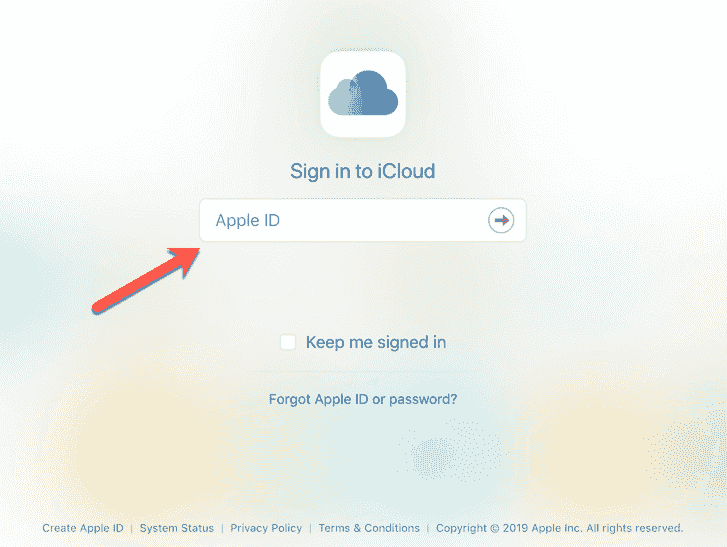

### 找到照片应用程序

登录后，你会看到一个满是应用程序的屏幕。在那里的某个地方，你会看到照片应用程序图标:

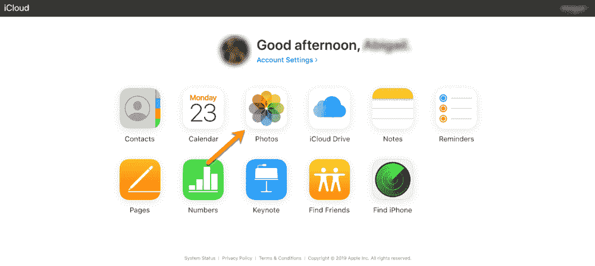

Look for the colorful photo app

第一次以这种方式访问照片时，可能需要一段时间来加载。尤其是如果你像我一样有超过 19000 个。在 iCloud 准备它们的时候，请耐心等待(在等待的时候，请随意去做其他事情)。

### 浏览、分享和享受乐趣！

一旦它们都被加载，看起来会有点像这样(当然是你自己的照片):

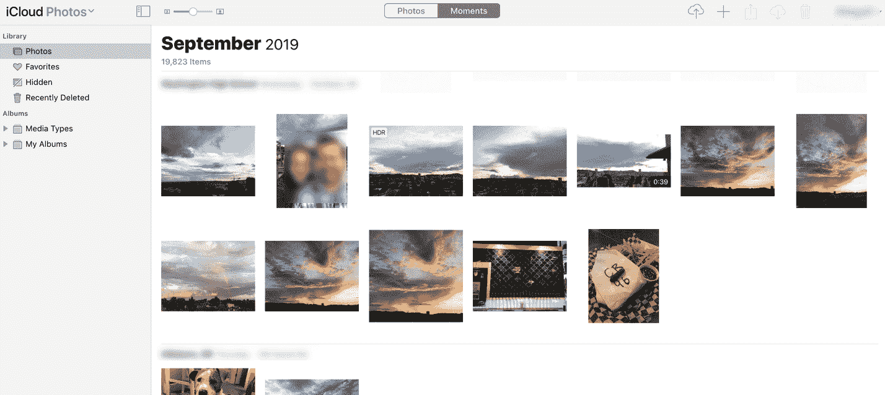

Voilà! Your photos are there for the taking.

现在你可以向你热切的家人展示你在回家的飞机上准备的 45 分钟幻灯片...很可能是它耗尽了你的手机电池。

## 了解 iCloud 照片

但是现在你又可以访问你的照片了，你还能做什么呢？您可以整理它们、创建个人收藏、删除不喜欢的或重复的捕获，等等。让我们看一看。

### 管理收藏夹

啊，在海滩/山/你最喜欢的酒吧的最后一晚。还记得那张你迫不及待想给所有人看让他们嫉妒的超甜照片吗？您可以将它设为个人收藏，这样您就再也不用在所有照片中寻找它了。

只需双击选择该照片，它就会打开。右上角会出现一个图标小菜单可供选择:

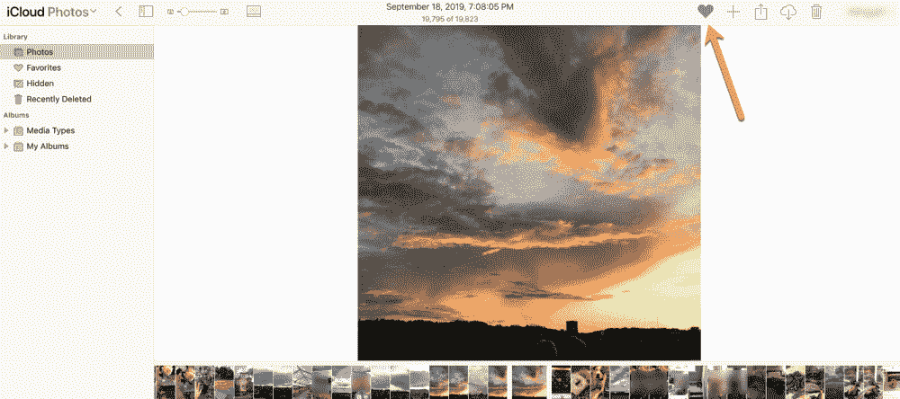

点击心脏。现在该照片已在您的收藏夹中。

如果您想进一步管理您最喜爱的照片，只需点击左侧边栏菜单中的“收藏夹”选项卡。

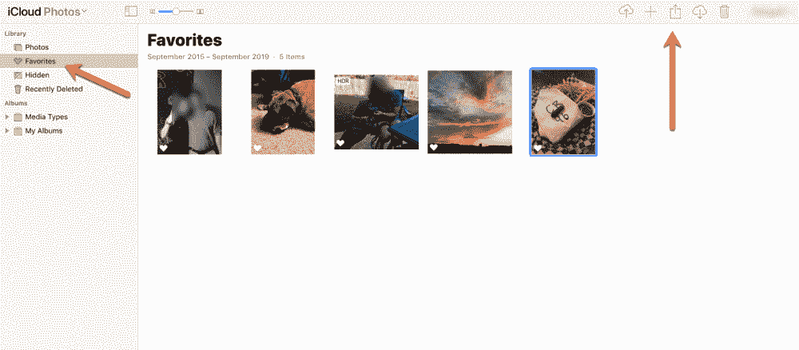

Under favorites, you can do all sorts of fun things

当你点击任何一张照片时(如你所见，最后一张照片以蓝色突出显示)，右上角的菜单将再次可用。

这些菜单图标允许您上传照片、将您选择的照片添加到相册、共享照片、下载照片或删除照片。

提示:删除项目时要小心。你不只是从你的收藏夹中删除了那张照片，而是从你的所有设备中删除了它。

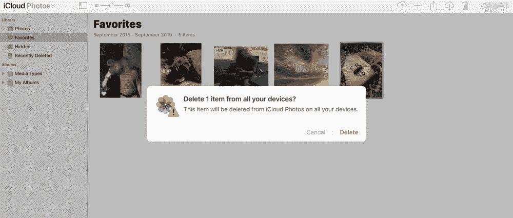

Delete carefully!

然而，万一你误删了一张照片，你可以恢复它。只需访问左侧边栏菜单中的“最近删除”标签。在那里，您将看到您刚刚删除的照片，以及它在消失前还剩多少天。永远。

So you're tellin' me there's a chance...

### 创建新相册

如果您想与家人分享特定的照片，但保留某些其他人的隐私，该怎么办？

你也可以这样做！只需在左侧边栏菜单中查找“我的相册”标签:

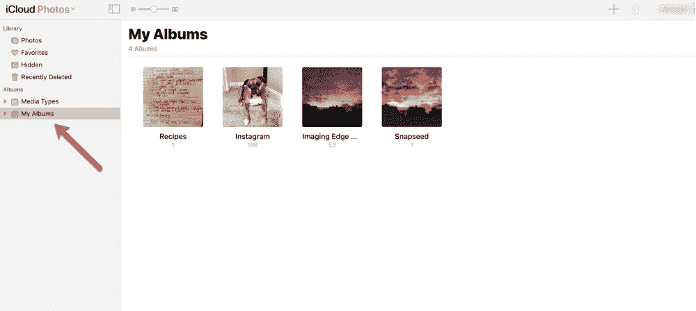

Just click once on "My Albums" and your albums (if you have any) shall appear.

如果您想创建新相册，只需点击右上角的“+”:

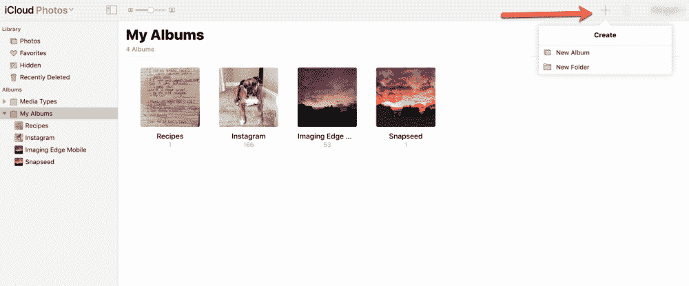

系统会要求您为相册命名，命名后，您可以通过点按右上角的上传照片图标来添加照片:

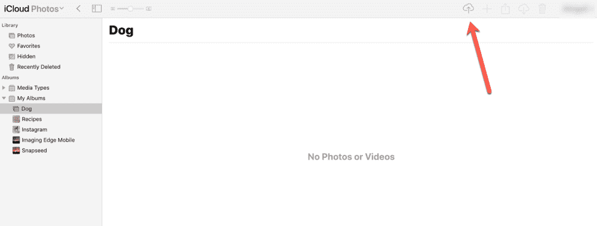

Upload away!

您还可以在浏览照片时将照片添加到新相册中。只需选择一张照片(或拖动选择多张照片)，点击右上角的“+”。

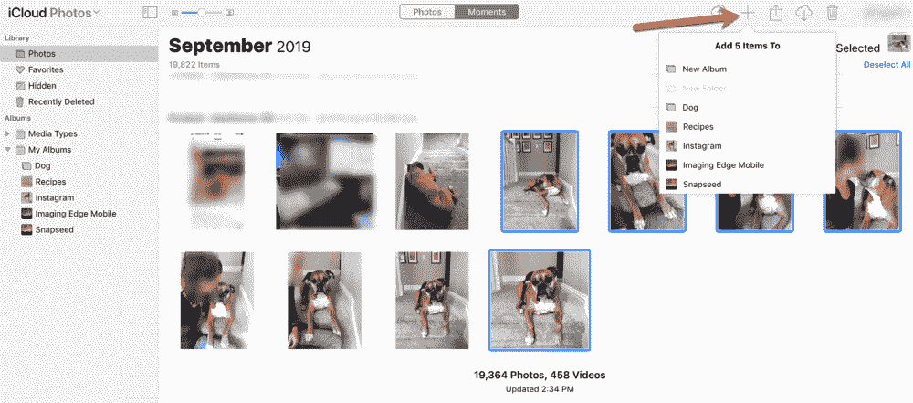

Add one or many photos to the album of your choice.

然后，只需选择相册，你想要的照片去，和 presto！您的相册中有可爱的狗狗照片(或您选择的任何照片。还有其他种类的照片吗？).

### 管理您的相册

在相册中，您可以像在收藏夹中一样管理照片。只需双击相册，选择(点击)一张照片，然后编辑即可。

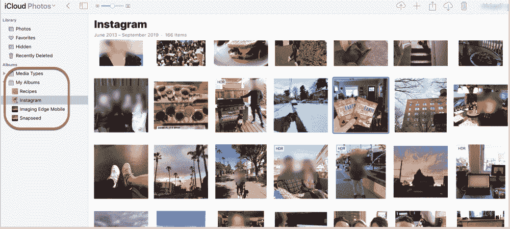

So many options, so little time...

现在你需要做的就是制作下一个令人惊叹的幻灯片。

## 如果我看不到任何照片怎么办？

如果您登录 iCloud 后看不到任何照片，可能是您没有选择将照片存储到 iCloud。

要解决这个问题，只需进入手机中的设置，选择照片，然后打开 iCloud 照片:

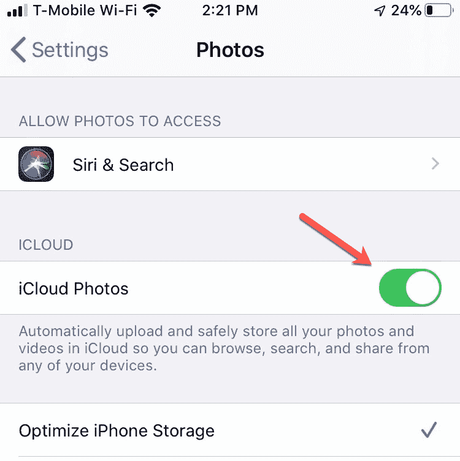

这将自动上传照片并将其储存在 iCloud 中，以便在您需要时可以使用。

小贴士:如果你不能打开开关，可能是因为你的手机/设备没有足够的空间来存放它们。如果是这种情况，你只需要[升级你的 iCloud 存储计划](https://support.apple.com/en-us/HT201318)。

现在你再也不会没有你的照片了。