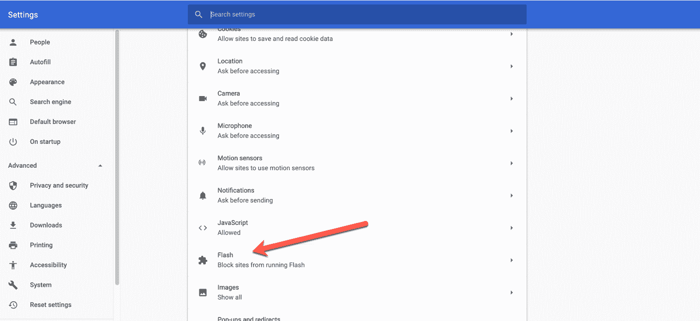
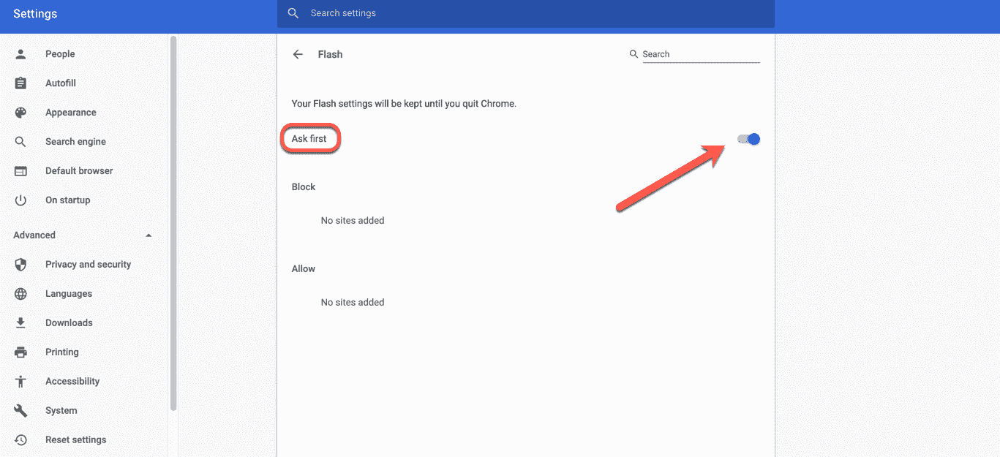
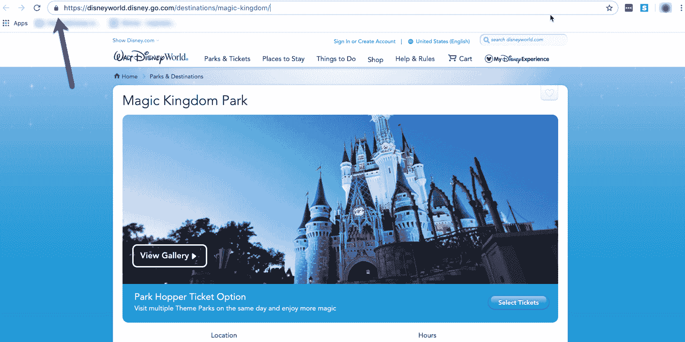
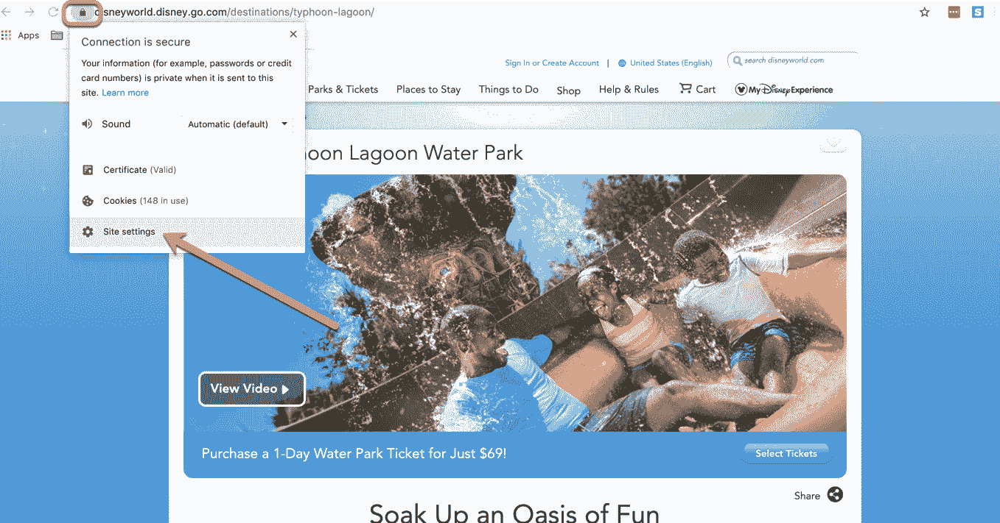
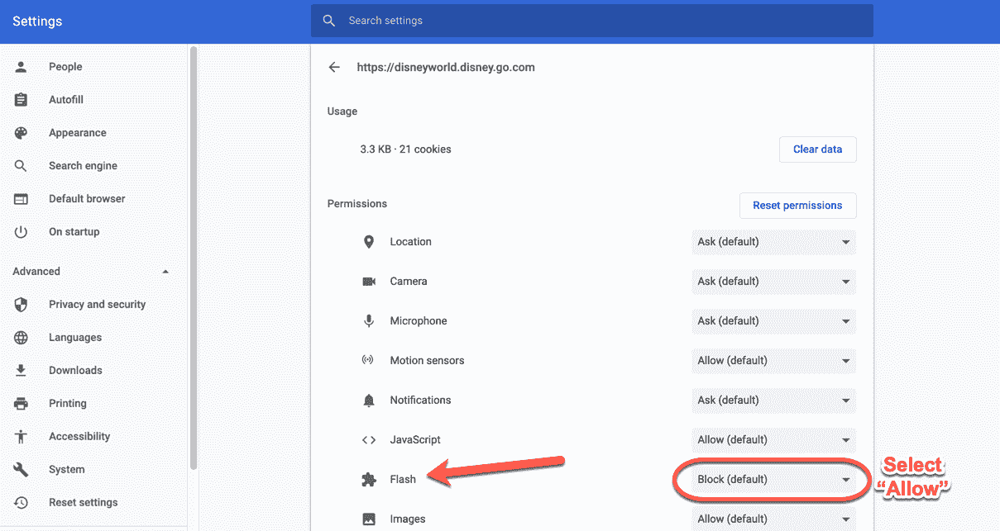
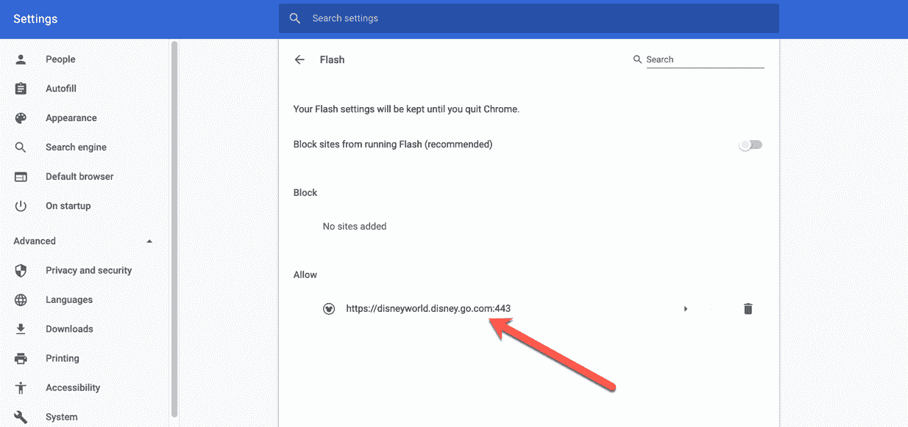

# 如何在谷歌浏览器中启用 Adobe Flash Player

> 原文：<https://www.freecodecamp.org/news/how-to-enable-adobe-flash-player-in-google-chrome/>

还记得 Adobe Flash player 吗？就是这个漂亮的软件让网站嵌入视频和网页游戏。整个网站甚至可以由 Flash 驱动。

尽管 Flash 的使用量在下降，Adobe 将在 2020 年淘汰该软件，但某些网站今天仍在使用它。如果你遇到这样的网站，你可能会想看看内容是什么。

在本教程中，我们将介绍在 Chrome 中启用 Flash player 需要遵循的步骤。

## 如何在 Chrome 中启用 Flash player

由于谷歌浏览器会自动禁用 Flash player，如果你想让它工作，你需要启用它。

### 访问内容设置

由于 Chrome 有自己的内置 Flash 版本，所以你不需要安装插件或任何东西。

而进入 Chrome 的设置最简单的方法就是访问[Chrome://settings/content](chrome://settings/content)。进入该页面后，向下滚动，直到看到 Flash player 的选项:

Scroll down to Flash, right below JavaScript

### 允许闪存运行

点击“Flash”，在显示“阻止网站运行 Flash(推荐)”的地方，打开开关。它现在会说“先问”:

Flash will ask whether you want to allow it to run

现在，当你访问一个使用 flash 的网站时，它会问你是否允许 Flash 做它该做的事情。仔细检查总是好的。

恭喜-你成功了一半。

## 如何授予特定站点运行 Flash 的权限

既然你已经允许 Chrome 请求你的许可来运行 Flash 网站，你需要告诉它允许哪些网站。

### 转到您最喜欢的 Flash 使用网站

让我们拥抱一个孩子般的奇迹和魔法，好吗？迪士尼的[魔法王国](https://disneyworld.disney.go.com/destinations/magic-kingdom/)网站使用闪光灯，我们希望看到所有闪闪发光的神奇美好。

导航到该站点后，在地址栏中寻找灰色小锁:

Disney sites certainly need pretty animation...

### 更新其闪光灯设置

点按它，然后选择底部的“站点设置”:

这将把你带到一个有许多选项的菜单。中途你会看到闪光。在右侧，您会看到一个下拉菜单，上面写着“Block”

要允许闪存，您必须单击下拉菜单并选择“允许”:

Find the Flash setting and select "Allow"

现在，如果你在 Chrome 中再次检查你的一般 Flash 设置，你会在你的“允许”列表中看到该网站:

返回到站点并重新加载页面。所有闪烁的内容都将消失。

注意:如果你正在使用一个你不知道的网站，请注意:Flash 容易出现安全漏洞，所以在启用它时要小心。

最后一点:如果你关闭了浏览器，下次你想启用 Flash 时，你必须再次经历这个过程。Chrome 正在积极劝阻用户允许启用 Flash，所以他们尽可能地让它变得令人恼火。