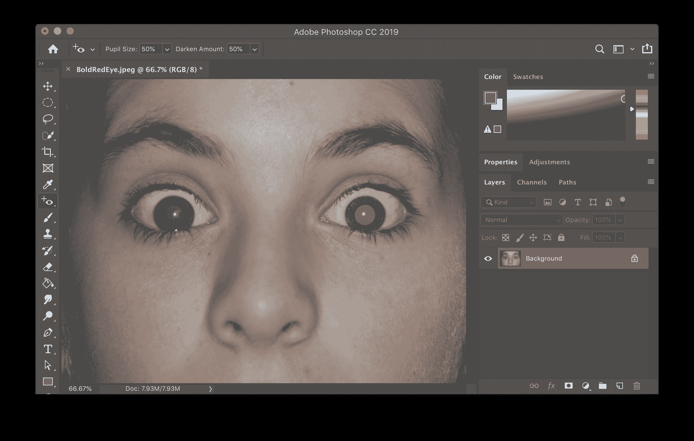
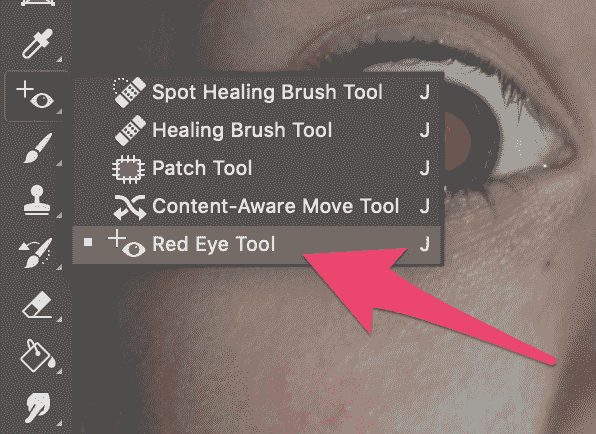
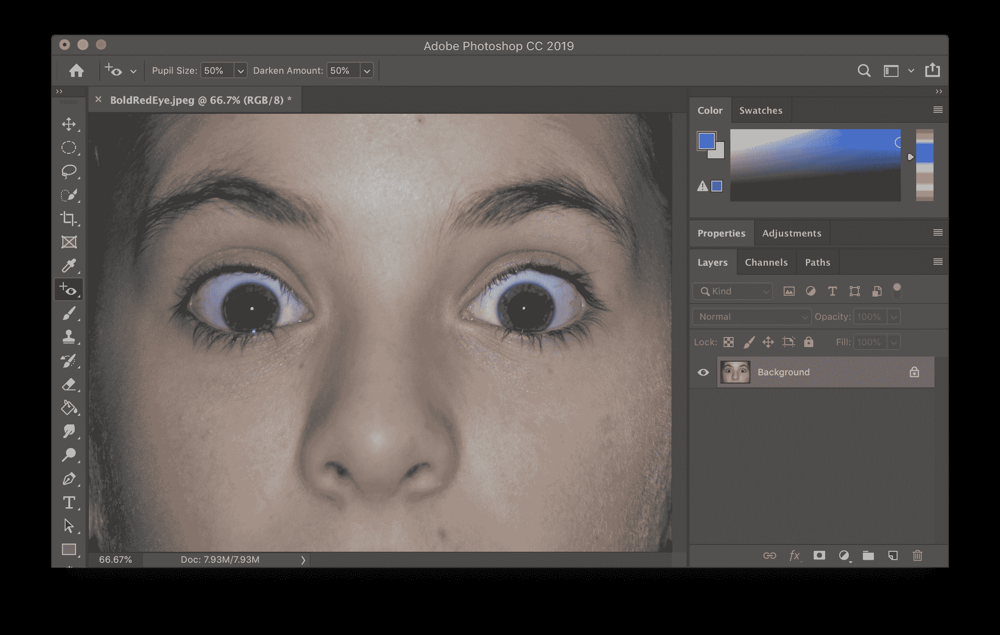
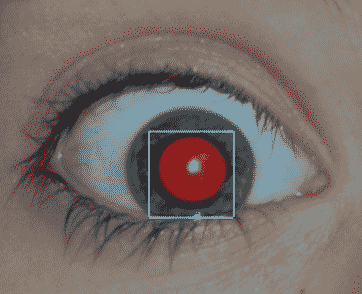

# 如何修复红眼-使用 Photoshop CC 去除图片中的红眼

> 原文：<https://www.freecodecamp.org/news/how-to-fix-red-eye-use-photoshop-to-remove-red-eye-from-pictures/>

使用 Photoshop 去除照片中的红眼很简单。本教程将向您展示如何通过三个简单的步骤来消除红眼。

### 第一步:在 Photoshop 中打开你的红眼照片。

### 第二步:选择红眼工具。

### 第三步:用红眼工具点击每只眼睛的红色部分。

你完了！

## 不够好？

如果结果不是你想要的，你可以做一些事情来改善结果。

您可以修改瞳孔大小和变暗量设置。通常你不需要改变这些，但有时它会有所帮助。

瞳孔大小设置改变区域变暗的程度。变暗量设置将改变红色区域变暗的程度。

有时仅仅点击一个红眼不会使整个红色区域变暗。您也可以使用红眼工具点按并拖移来指示包含红色的整个区域。如果点按红眼不能正常工作，请尝试选择一个区域。

由于所有图片都略有不同，您可能需要试验设置，直到您获得想要的外观。您也可以尝试点按红眼的不同区域或选择不同大小的红眼。