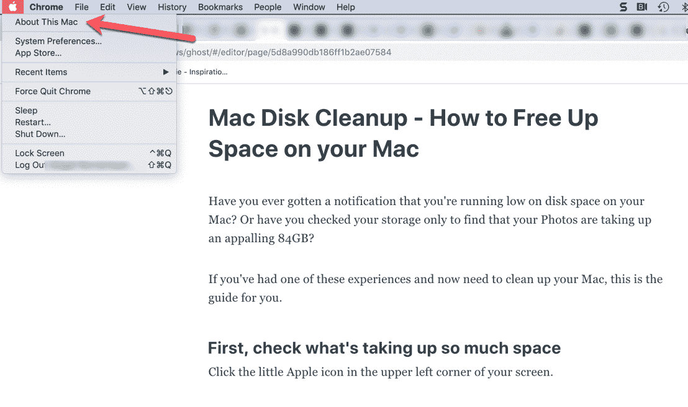
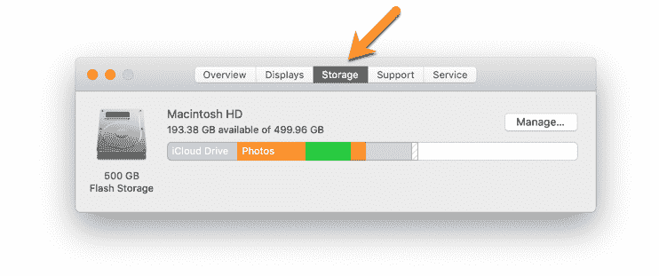
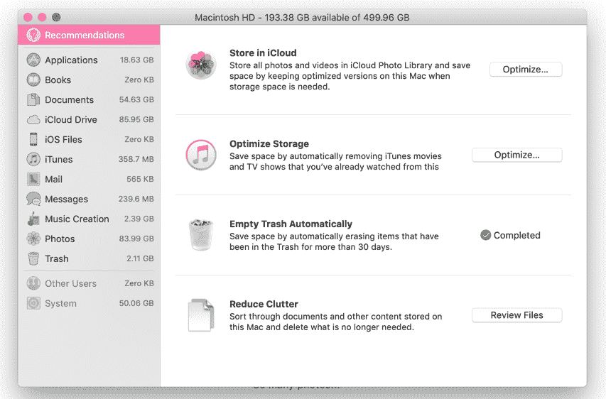
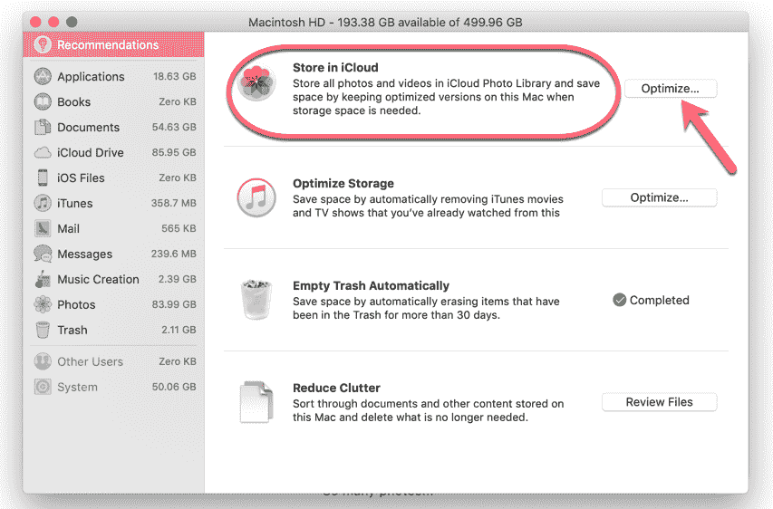
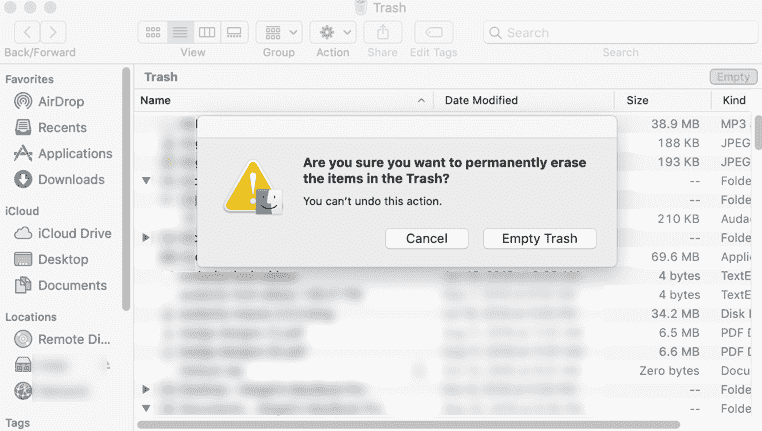
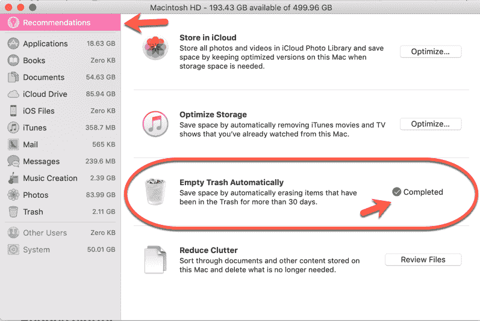
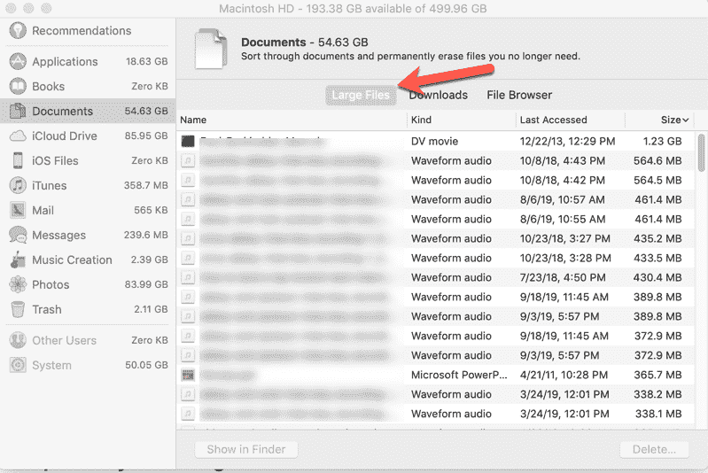
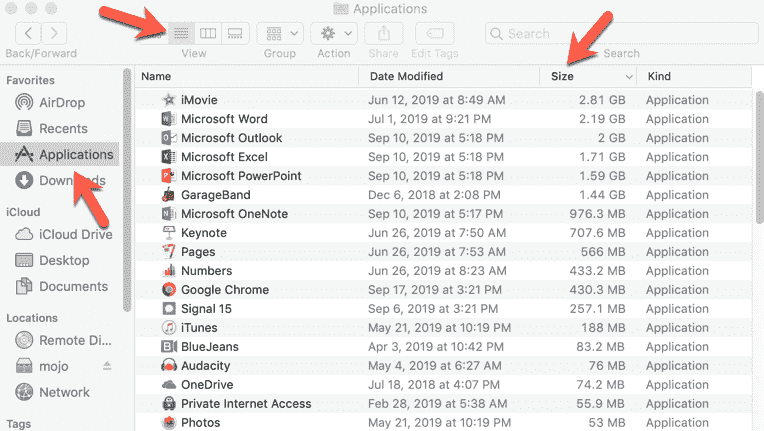
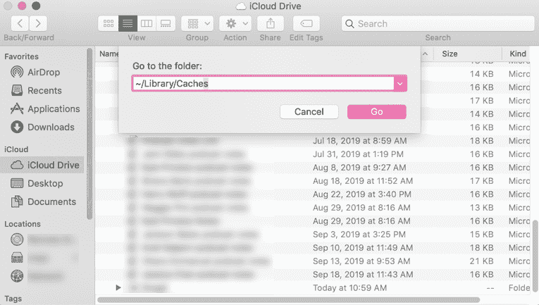

# Mac 磁盘清理-如何释放您的 Mac 上的空间

> 原文：<https://www.freecodecamp.org/news/mac-disk-cleanup-how-to-free-up-space-on-your-mac/>

你曾经收到过 Mac 上磁盘空间不足的通知吗？或者你有没有检查过你的存储器，却发现你的照片占用了惊人的 84GB？

如果你有过这些经历，现在需要清理你的 Mac，这是给你的指南。

## 首先，检查是什么占据了这么大的空间

点按屏幕左上角的小苹果图标。选择第一个选项“关于这台 Mac”，这样您就可以看到发生了什么。

一旦你到了那里，选择存储选项(在中间),看看是什么占用了空间。您可以将鼠标悬停在未命名的部分上，以查看它们是什么以及它们占用了多少空间。

So many photos...

如果你点击“管理”按钮，你可以看到苹果公司推荐什么来帮助你清理你的 Mac。现在，让我们更深入地探讨一下这些选项。

## 管理存储

首要任务是正确高效地管理您的存储。有几种方法可以做到这一点，苹果推荐几种:

### 将您的内容存储在云上

不要把你所有的旧照片、大学论文和项目都存储在你的电脑上，而是把它们转移到云端。这就是它存在的原因。

你知道什么最棒吗？你可以从任何设备访问云中的任何内容，只需使用你的 Apple ID 登录即可。就像魔法一样！

管理存储时，只需点击“云存储”选项旁边的“优化”即可。

### 优化您的存储

假设你下载了一部电影，但你已经看过了。大概 5 次(没有判断)。

但是你真的还需要它在你的 Mac 上吗？不要！五次就够了，即使是《公主新娘》和《星球大战》这样的宝石(好吧，不是这样的)。但是，还是要摆脱它。如果你真的需要重新观看，你可以再下载一次。

你会在“存储在 iCloud”选项的正下方找到“优化存储”选项——只需点击右边的“优化”按钮。

### 自动清空垃圾桶

确保把所有不需要的文件(尤其是大文件)都扔到垃圾桶里，然后经常清空垃圾桶。

How to manually empty your trash

如果你把东西丢在垃圾桶里，它们仍然会占用空间。如果您将废纸篓设置为自动清倒，它会在 30 天后删除项目(例如，将它们从您的电脑中移除)。

只要回到你的储存管理建议(苹果标志->关于这台 Mac ->储存->管理，然后看看“建议”，左上角的标签)，并点击“自动清空垃圾桶”旁边的按钮

### 减少混乱

你的 Mac 上肯定会有你不再需要的旧文档和其他杂物。其中一些项目可能会占用相当多的空间。这样你就可以进行分类并去除干扰。

Some of those files are pretty big! Maybe they can be removed...

它将按文件大小排序，并告诉你最后一次访问该文件的日期。这应该更容易决定什么可以去。

可以直接删除一些文件。其他的要求你进入应用程序并删除那里的文件。不管怎样，你都可以摆脱他们。

### 将文件移动到外部驱动器

这里有一个上面没有列出的小奖励选项。您还可以删除大型项目(如电影)并将它们储存在外置硬盘上。

## 删除重复文件

你的电脑上可能有大量重复的文件，而你甚至没有意识到这一点。

麻烦的是，手动搜索并找到它们真的很费时间。

所以找个 app 帮你做。一些常见的推荐选项有[重复清扫器](https://www.wideanglesoftware.com/duplicatesweeper/)、[双子座 2](https://macpaw.com/gemini) (免费试用应该可以)或者 [CleanMyMacX](https://cleanmymac.macpaw.com/21?campaign=cmmx_search_text_brand_us&ci=105095406&adgroupid=61566635689&adpos=1t1&ck=clean%20my%20mac%20x&targetid=kwd-508136427499&match={if:p}&gnetwork=g&creative=293082789816&placement=&placecat=&accname=cmm&gclid=EAIaIQobChMIi7vw77zs5AIVFR6tBh1LtQ-kEAAYASAAEgLRdPD_BwE&utm_expid=.yWG7qtCEQX2Y2AQKpYCnBQ.0&utm_referrer=https%3A%2F%2Fwww.google.com%2F) 。

## 卸载未使用的应用

当你得知你的应用程序占用了相当多的空间时，你会感到惊讶吗？其中一些文件可能非常大。

但我打赌你不会用你电脑上的每一个应用。这意味着你可以浏览并删除那些浪费空间的内容。

打开 Finder 并在左侧边栏菜单中选择“应用程序”标签。点按顶部的四条小水平线，以列表形式查看应用程序。然后点击右边的“大小”标签，按大小对应用程序进行分类。

Have a look at your apps - you might be surprised how many you don't use.

然后你可以滚动浏览并删除那些你不用的应用程序(希望其中一些相当大！).只需将该应用程序拖到垃圾箱中即可将其清除。

然后清空你的垃圾:)

## 删除 iTunes 备份

iTunes 备份是有用的——你肯定不想丢失你从 90 年代开始收集的所有令人焦虑的 90 年代音乐。哦，只有我...？好的。

不管怎样，这是很有价值的东西。但是你可以把它们都备份到 iCloud 上，而不是把你设备上的大量备份保存在电脑上。

### 如何启用 iCloud 备份

要设置手机自动备份到 iCloud，只需进入设置，选择你的名字，向下滚动到“iCloud 备份”。只要打开它，你珍贵的歌曲/照片/等就会被备份到云端。

然后你可以进入你的 Mac 电脑，删除你储存在那里的任何备份。只需打开 iTunes，前往偏好设置，选择设备，然后删除那些不再需要的备份。

## 删除临时文件(清除缓存/cookie)

您可能知道缓存。它允许站点更快地加载，因为像图像这样的资源密集型文件存储在本地机器上。这样，如果你经常访问一个网站，你就不必每次都坐在那里等待加载大量的图像文件。他们已经在那里了。

但是如果你不经常清理它们，它们真的会让你的机器变慢。请注意:即使你现在删除它们，下次你访问该网站或使用该应用程序时，它们也会被重新添加。

### 如何清除缓存

打开 Finder，从屏幕顶部的菜单中选择“前往”向下滚动到“转到文件夹”，选择它，然后在对话框中输入~/Library/Caches。

从那里你可以清除任何你不需要的缓存文件。

## 还需要更多空间吗？以下是一些额外的尝试:

*   删除不需要的电子邮件
*   删除下载
*   删除日志
*   删除语言资源
*   压缩文件
*   重新启动您的 Mac

现在去清理那台电脑！