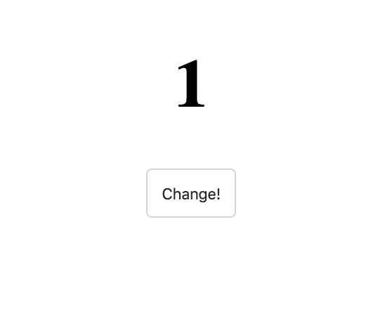

# 在 5 分钟内学会 React 钩子-初学者教程

> 原文：<https://www.freecodecamp.org/news/react-hooks-in-5-minutes/>

有时候你只有 5 分钟。所以在本文中，我们将只涉及 React 中最常用的两个钩子:`useState`和`useEffect`。

如果你不熟悉钩子，这是 TL；DR:因为有了钩子，几乎不再需要基于类的组件。钩子允许您“钩入”功能组件中组件的底层生命周期和状态变化。不仅如此，它们通常还能提高组件的可读性和组织性。

如果你想对这个主题有一个适当的介绍，你可以加入我的[即将到来的高级 React 课程](https://scrimba.com/g/greact?utm_source=freecodecamp.org&utm_medium=referral&utm_campaign=hooks_article)的等候名单，或者如果你仍然是一个初学者，请查看我在 React 上的[介绍课程。](https://scrimba.com/g/glearnreact?utm_source=freecodecamp.org&utm_medium=referral&utm_campaign=hooks_article)

## `useState`

让我们从一个功能组件开始。

```
import React from 'react';

function App() {
  return (
    <div>
      <h1>0</h1>
      <button>Change!</button>
    </div>
  );
} 
```


如你所见，目前没什么特别的。我们只是渲染一些文本和一个(无用的)按钮。

现在让我们导入我们的第一个钩子，`useState`来学习如何在我们的功能组件中处理状态。

因为这个钩子是一个函数，所以让我们来看看我们从它那里得到了什么。

```
import React, { useState } from 'react';

function App() {
  const value = useState();
  console.log(value);

  return (
    <div>
      <h1>0</h1>
      <button>Change!</button>
    </div>
  );
} 
```

在控制台中，我们得到一个数组

```
> [null, ƒ()] 
```

当我们传递一个参数给`useState`

```
const value = useState(true); 
```

在控制台中，我们得到一个数组，我们的值作为第一个成员。

```
> [true, ƒ()] 
```

现在，在我们的组件中，我们可以在`value[0]`访问我们的状态，并在`<h1>`中呈现它，而不是硬编码的值。

```
import React, { useState } from 'react';

function App() {
  const value = useState(0);
  console.log(value); // [0, ƒ()]

  return (
    <div>
      <h1>{value[0]}</h1>
      <button>Change!</button>
    </div>
  );
} 
```


我们可以通过使用数组析构来存储来自`useState`钩子的值，从而改进我们的代码。这类似于对象析构，后者更常见一些。如果你不太熟悉对象析构，这里有一个快速回顾:

```
const person = {
  name: 'Joe',
  age: 42
};

// creates 2 const values from person object
const { name, age } = person;
console.log(name); // 'Joe'
console.log(age); // 42 
```

数组析构几乎相同，但是使用方括号`[]`代替花括号`{}`。

快速提示:在对象析构中，所创建变量的名称必须与对象中属性的名称相匹配。对于数组析构来说，情况并非如此。一切都是为了秩序。这里的好处是我们可以随意命名这些项目。

使用数组析构，我们可以从`useState()`钩子中得到状态的初始值。

```
import React, { useState } from 'react';

function App() {
  // remember, there's a second item from the array that's missing here, but we'll come right back to use it soon
  const [count] = useState(0);  

  return (
    <div>
      <h1>{count}</h1>
      <button>Change!</button>
    </div>
  );
} 
```

好了，我们已经得到了初始状态值。我们如何用钩子改变状态中的值？

记住`useState()` hook 返回一个有 2 个成员的数组。第二个成员是更新状态的函数！

```
const [count, setCount] = useState(0); 
```

当然，你可以随意称呼它，但是按照惯例，它通常用前缀“set-”来命名，然后我们希望更新的任何状态变量都被调用，所以`setCount`就是这样。

使用这个功能很简单。只需调用它并传递您希望该状态拥有的新值！或者，就像类组件中的`this.setState`一样，可以传递一个接收旧状态并返回新状态的函数。经验法则:当您需要依靠过去的状态来确定新状态时，请随时这样做。

为了调用它，我们将把它传递给`onClick`事件监听器。就像在基于类的组件中使用常规的`setState`一样，我们可以将状态更新传递给`setCount`。

```
function App() {
  const [count, setCount] = useState(0);

  return (
    <div>
      <h1>{count}</h1>
      <button onClick={() => setCount(prevCount => prevCount + 1)}>
        Change!
      </button>
    </div>
  );
} 
```

我们可以通过将状态更新提取到一个单独的函数中来稍微清理一下。

```
function App() {
  const [count, setCount] = useState(0);

  function change() {
    setCount(prevCount => prevCount + 1);
  }

  return (
    <div>
      <h1>{count}</h1>
      <button onClick={change}>Change!</button>
    </div>
  );
} 
```

太好了！现在，当我们点击按钮时，我们可以看到计数器在上升。



当然，`useState`可以比这复杂得多，但是我们只有 5 分钟的时间，所以现在让我们进入下一个钩子。

## `useEffect`

与基于类的组件相比，钩子简化了很多事情。以前，我们需要了解一些生命周期方法，以及哪种方法最适合哪种情况。`useEffect` hook 简化了这种情况。如果您希望执行副作用、网络请求、手动 DOM 操作、事件监听器或超时和间隔。

`useEffect`钩子可以像`useState`一样导入。

```
import React, { useState, useEffect } from 'react'; 
```

为了让`useEffect`做一些事情，我们传递一个匿名函数作为参数。每当 React 重新渲染这个组件时，它都会运行我们传递给`useEffect`的函数。

```
useEffect(() => {
  /* any update can happen here */
}); 
```

这是整个代码的样子。

```
import React, { useState, useEffect } from 'react';

function App() {
  const [count, setCount] = useState(0);

  function change() {
    setCount(prevCount => prevCount + 1);
  }

  useEffect(() => {
    /* any update can happen here */
  });

  return (
    <div>
      <h1>{count}</h1>
      <button onClick={change}>Change!</button>
    </div>
  );
}

export default App; 
```

例如，我们将使用一个漂亮的`npm`包来生成随机颜色。当然，如果你愿意，你可以自由地编写你自己的，但是对于本教程，我们将只安装它，`npm i randomcolor`，并导入。

```
import randomcolor from 'randomcolor'; 
```

现在让我们利用我们关于`useState` hook 的知识在状态中存储一些随机颜色。

```
const [color, setColor] = useState(''); // initial value can be an empty string 
```

然后，我们可以分配我们已经拥有的计数器的颜色。

```
<h1 style={{ color: color }}>{count}</h1> 
```

现在，为了方便起见，让我们在每次点击`Change!`按钮时改变计数器的颜色。`useEffect`会在每次组件重新渲染时运行，每次状态改变时组件都会重新渲染。

所以如果我们写下面的代码，它会让我们陷入一个无限循环！这是`useEffect`的一个常见问题

```
useEffect(() => {
  setColor(randomcolor());
}); 
```

`setColor`更新状态，重新呈现组件，调用`useEffect`，运行`setColor`更新状态，重新呈现组件...呀！

我们大概*只有*想在`count`变量改变的时候运行这个`useEffect`。

为了告诉`useEffect`要跟踪哪些变量，我们给出了这样一个变量数组作为第二个参数。

```
useEffect(() => {
  setColor(randomcolor());
}, [count]); 
```


这基本上是说“只有当的状态改变时，才运行这个效果**。这样，我们可以改变颜色，而不会导致我们的效果无限运行。**

## 结论

关于钩子还有很多东西要学，但是我希望你喜欢这个 5 分钟的快速窥视。

要了解更多关于 React 挂钩和 React 的其他强大功能，您可以加入我的[即将到来的高级 React 课程的等候名单。或者如果你正在寻找一个更友好的初学者，你可以看看我在 React 上的](https://scrimba.com/g/greact?utm_source=freecodecamp.org&utm_medium=referral&utm_campaign=hooks_article)[入门课程。](https://scrimba.com/g/greact?utm_source=freecodecamp.org&utm_medium=referral&utm_campaign=hooks_article)

快乐编码？