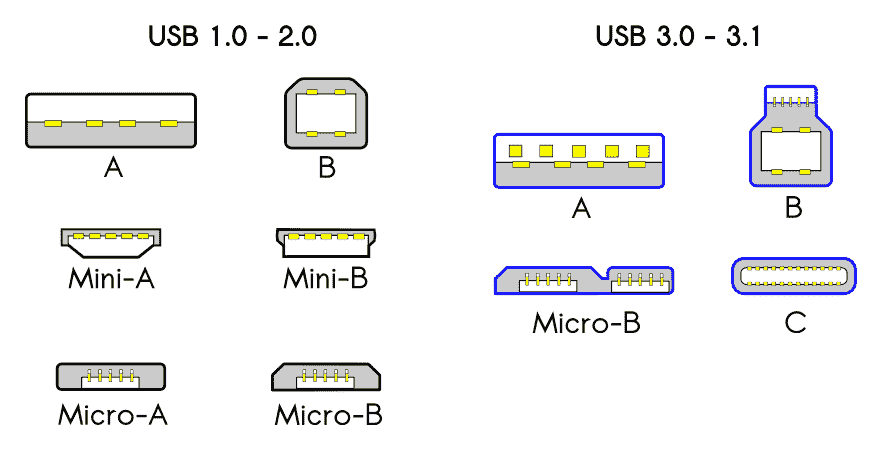

# USB C 端口解释 USB C 型如何不同，它有多快

> 原文：<https://www.freecodecamp.org/news/usb-c-port-explained-how-usb-type-c-is-different-and-how-fast-it-is/>

你可能听说过 USB Type C——毕竟，USB 端口在科技和电子世界中无处不在。

但你知道为什么 USB C 与众不同，为什么它有点牛逼吗？在本文中，我们将简要介绍不同类型的 USB 端口的特性，然后深入探讨 USB Type C。

## 一点背景知识

你知道 USB 代表通用串行总线吗？这种“即插即用”的接口最初是在 1996 年 USB 1.0 发布时开发的。它允许计算机与各种其他设备和外围设备连接和通信，如计算机鼠标、照相机、音乐播放器等等。

USB 及其电缆不仅可以给设备充电，还可以通过电缆传输数据。所以它不仅仅是一根电源线。这就是我们关心数据传输速度的原因，您将在下面看到。

在接下来的十年里，更新(更快)的 USB 版本不断发布。

*   2001 年，我们有了 USB 2.0 或“高速 USB”，它可以处理高达每秒 60 兆字节(Mbps)的传输速度
*   2009 年，USB 3.0 或“超高速 USB”问世(创意命名系统，我知道)。它不仅提供了更快的传输速度(高达 640 Mbps)，而且还支持两条单向数据路径，允许您同时发送和接收数据。
*   终于在 2013 年发布了 USB 3.1(“super speed+”)。这是 USB 协议的最新版本，可以以惊人的 10 Gbps(是的，千兆字节，不是兆字节)传输数据。由于命名惯例与 3.0 非常相似，USB 3.0 现在被称为 USB 3.1 Gen 1。再次，创造力！

不同的公司发布了这些不同版本的 USB，但有一个整体机构致力于开发更好、更快的 USB 技术:USB 实现者论坛(USB-IF)。这是一个由大约 700 家公司组成的联盟(包括像苹果、戴尔、惠普、微软、三星这样的大公司)。这对普遍采用的潜力是有好处的(下面会有更多的介绍)。

**注意事项** : USB 端口都是向后(和向前)兼容的。所以如果你想在 1.0 端口使用 USB 3.0 设备，可以。但是你会被限制在 1.0 的速度。

关于数据传输速度，要记住一件重要的事情:速度较慢的端口/电缆总是胜出。以下是更多相关信息。

所以在我们谈论为什么 USB C 变得如此流行之前，让我们多了解一下每一种类型。

## 不同类型的 USB 端口

### a(扁平矩形插头)

USB A 通常被认为是一个简单的数据端口，用于将鼠标(或其他外围设备)连接到计算机。你可以在过去几十年的大多数电脑上找到它。

### b(形状奇怪的那些)

你通常会在像打印机这样的大型设备上找到 USB B 端口。

### c(新型“可逆”插头)

USB C 是最新一代的 USB 端口，最近受到了很多关注。它的默认协议是 USB 3.1(最新版本，如上所述)，最大速度是 10 Gbps。

从智能手机到笔记本电脑，你都会发现这个更新的端口。

### 微型和迷你

这些较小的端口通常将相机、智能手机和其他较小的设备连接到您的电脑。

迷你 USB 已经不怎么用了，但 micro 仍然经常用在智能手机、视频游戏控制器等设备上。

### 关于电缆长度(和速度)的说明

连接 USB 端口和设备的电缆只能有这么长，否则在传输过程中可能会丢失一些数据。高速设备的最大长度为 16 英尺 5 英寸，低速设备的最大长度为 9 英尺 10 英寸。

此外，当您使用设备附带的电缆时，请确保您使用的电缆支持您的设备/端口支持的速度。例如，如果你有一个 USB 3.0，确保你有一个支持 3.0 速度的电缆。否则你会被限制在较低的速度。

请记住:一切都与电缆有关。

## 为什么 USB C 好

Photo by [Shiro hatori](https://unsplash.com/@shiroscope?utm_source=unsplash&utm_medium=referral&utm_content=creditCopyText) on [Unsplash](https://unsplash.com/s/photos/fast?utm_source=unsplash&utm_medium=referral&utm_content=creditCopyText)

好了，让我们再讨论一下 USB C，并展示一下它的所有优点。

首先，USB C 提供了更快的数据传输速度(如果你有正确的电缆/端口组合，最高可达 10 Gbps)。

第二——也许是每个人最喜欢的功能——没有正面朝上，这使得使用起来不那么令人沮丧。如果你用的是 USB 类设备，你可以用你喜欢的任何方式插入。不要再说“好了，别想太多了。我总是插错，但我通常会先把它翻过来(怀疑自己),所以该死的，我要在拿起它的第一时间把它插上...废话。还是错误的方式。”相关吗？

我见过这个功能被称为“flippability”，我很喜欢。

沿着同样的路线，它的两端都有相同类型的连接器——所以你可以抓住一端并将其插入，无论你抓住哪一端。还是那句话，没那么沮丧。这次我就不写内心独白了。

最后，USB C 正在被许多不同的制造商采用，这可能意味着我们正在走向一个真正的“通用”USB(毕竟它被称为“通用串行总线”)。那不是很好吗？

但是这也有点令人困惑，你会在下面的术语部分看到。

## 霹雳呢？

Photo by [Jari Hytönen](https://unsplash.com/@jarispics?utm_source=unsplash&utm_medium=referral&utm_content=creditCopyText) on [Unsplash](https://unsplash.com/s/photos/thunder?utm_source=unsplash&utm_medium=referral&utm_content=creditCopyText)

Thunderbolt 技术(由英特尔开发)使 USB C 端口能够提供高达 40 Gbps 的速度，是最快的“常规”USB C 的两倍。雷电 3 连接器(最新版本)结合了 Thunderbolt、USB、电源和 DisplayPort，以实现超快的传输速度。

更好的消息是——它还是可翻转的，可以以任何方式插入(没有正面朝上)。也可以用在任何 USB C 口(两个插头看起来一模一样)，任何 USB C 都可以插在 Thunderbolt 口。然而，USB C 将仅限于自己的速度，无法与 Thunderbolt 的速度相匹配。

所以基本上，Thunderbolt 只是一个特别快速、奇特的 USB C 设备。

## 最后...

如果你有机会使用 USB C 设备，那就去用吧。你将获得更快的速度，更令人满意的体验，而且更容易使用。

只是一定要检查你是否有正确的电缆，让你的设备充分利用所有的 C awesomeness。

### 关于 USB C 命名的进一步说明

如果你真的想埋头学习各种名称、速度以及它们是如何变化的，这里有一个纲要:

*   混淆:3.1 端口也可以有旧的/原始的形状。这些被称为 USB 3.1 Type A(这些现在在台式机上最常见。)
*   更令人困惑的是:还有 USB 3.1 Gen 1(速度较慢- 5 Gbps)和 Gen 2(速度较快-10 Gbps；理论上可以达到 Thunderbolt 的一半速度，但是端口和设备都必须支持 Gen 2 标准)
*   展望未来:最令人困惑的——USB 3.2 将取代所有以前的命名法。所以老 3.0，5 Gbps，会叫 USB 3.2 Gen 1。速度更快的 USB 3.1 (10 Gbps)将被称为 USB 3.2 Gen 2。
*   USB 3.2 端口有时能够达到 20 Gbps 的速度，这将被称为 USB 3.2 Gen 2x2(比 Gen 2 快 2 倍)，这是因为电缆中有两倍多的数据通道，可以更快地传输数据。尽快去找他们。