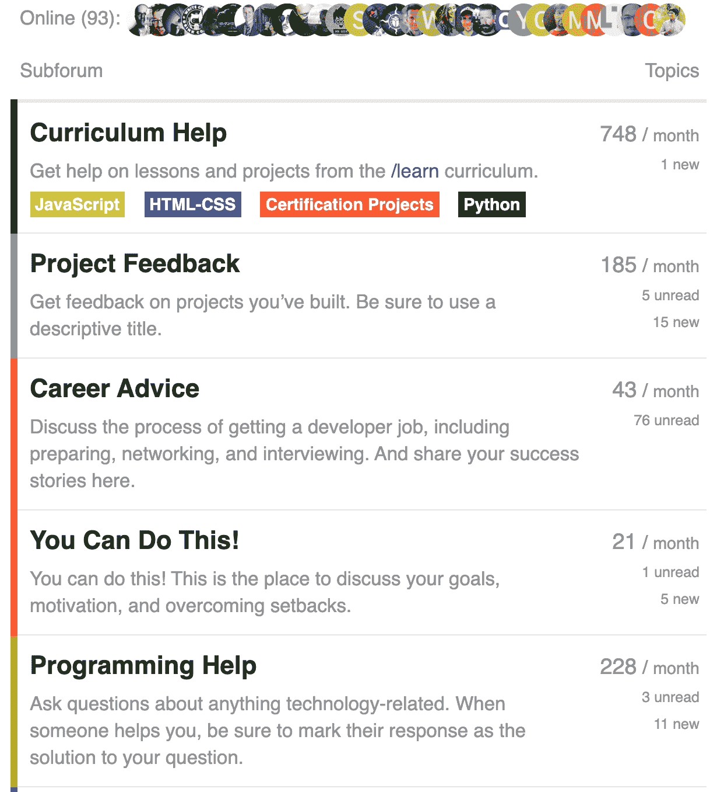
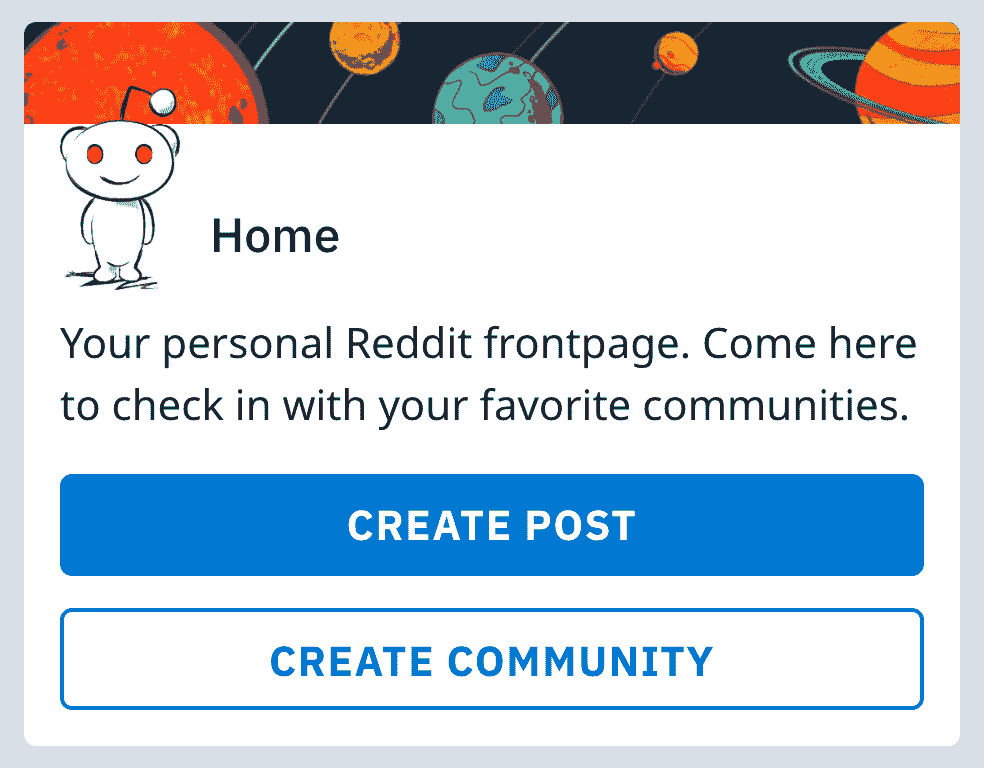
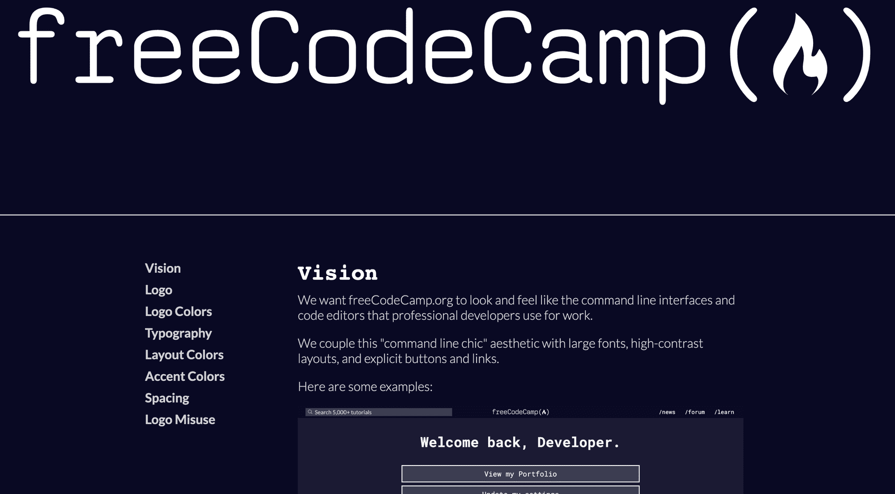

# 自由代码营论坛的未来

> 原文：<https://www.freecodecamp.org/news/the-future-of-the-freecodecamp-forum/>

4 年前，我们启动了 freeCodeCamp 论坛，这样每个人都有一个支持性的地方来获得编程帮助。

当时，Stack Overflow 因关闭初级程序员的“重复”或“跑题”问题而臭名昭著。

我们有意识地决定与众不同。我们放松下来，让人们平静地提出他们的问题。人们需要遵守的唯一规则是我们 200 字的行为准则。

快进到 2019 年，我们的方法非常有效。这现在是互联网上最大的编程论坛之一，每月有 500 万次浏览。这一切都是免费的，没有广告。

A screenshot of some of freeCodeCamp subforums.

但是开发者社区现在面临着一个新的挑战。再说一次，我们必须挺身而出。

# Reddit 排挤了网络上的其他开发者社区

如今，大多数论坛都消失了，转而支持 Reddit。

例如，如果你在谷歌上搜索`angular forum`，最上面的结果不是一个有角度的论坛。相反，这是[自由代码营论坛](https://www.freecodecamp.org/forum/t/angular-community/245934)上的一个帖子，有人在这里问他们在哪里可以找到一个好的角度论坛。

过去，几乎每个话题都有专门的论坛。现在连 Angular 这么流行的工具论坛都没有了。

与此同时，[角子旋涡活跃而良好](https://www.reddit.com/r/angularjs)。

你可能认为这没什么大不了的。Reddit 是一个有趣的网站。子编辑易于创建和维护。其他人会为托管买单。

但是当你把整个全球开发者社区集中到一个网站上，肯定会有问题。

首先，Reddit 是一家私人公司所有。它的运作几乎没有透明度。

Subreddits 相当于一个 land run。

在 Reddit 上创建一个社区很容易。例如，当 Node.js 的创建者 Ryan Dahl 宣布他的新 Deno 项目时，我去创建了一个 Deno subreddit。

我上传了一段 Ryan Dahl 演讲的视频，然后很快就忘记了 subreddit。几个月后，我回来时才意识到这个社区已经发展了这么多。我自己对社区的领导没有起到任何作用。它的成长是因为人们会在 Reddit 上搜索“Deno”，因为它的名字而发现我的 subreddit，并开始发帖。

我想同样的效应解释了 r/编程、r/机器学习和其他以软件为中心的子领域是如何成为开发人员社区事实上的核心的。控制这些社区的人不一定是这项工作的最佳人选。他们只是第一批点击 Reddit 侧边栏“创建社区”按钮的人。

Reddit encourages everyone to create communities. But few people have the time and energy to see a community through.

谁注册了这个子编辑，谁就拥有它。他们可以指定他们的朋友做版主。

这些版主可以完全控制帖子的出现(和消失)。他们可以随时以任何理由禁止任何人进入他们的子网站。

更糟糕的是，Reddit 账户是伪匿名的。这意味着我们不知道谁在管理这些子街道，也不知道他们的议程是什么。

例如，r/LearnJavaScript 是由旧金山编码训练营的一名员工发起的。但是我永远也不会知道这一点，除非那个编码训练营的人给我指出来。

几年前，r/webdev 禁止了我。我不知道为什么。我经常在 r/webdev 上看到关于 freeCodeCamp 的问题——有些问题甚至提到了我的名字——我无法回应。我给 subreddit 的版主发了信息，要求恢复，但他们都懒得回复。

其中一些问题只是 Reddit 最初设计的产物。Reddit 的创始人设想 Reddit 是一个在线内容的协作过滤器。有点像 Digg 和 SlashDot。Reddit 并没有考虑到实质性的讨论。更多的是点击向上投票和向下投票箭头。

Reddit 的协同过滤平台非常擅长找到最好的猫咪照片供你欣赏。这对维持全球社区不太有利。

哦，Reddit 在中国和印度尼西亚也被屏蔽了。虽然这不是 reddit 的错，但这确实意味着世界上近四分之一的人无法参与这些 Reddit 社区。

# 对于开发者社区来说，Reddit 是阻力最小的途径。但是我们已经看到了这条路通向何方。

你可以在几秒钟内在 Reddit 上创建一个社区。点击工具条上的“创建社区”按钮。Reddit 会帮你搞定一切。你所需要的只是为你的社区取个名字，然后你就可以开始了。

在雅虎群组上建立一个社区也很容易。但是这个月，雅虎宣布它所有的 1000 万个社区都将被扔进历史的垃圾箱。

这只是一长串已经死亡的社区平台中的最新一个——不是因为人们不再使用它们，而是因为它的企业霸主不想再为它们付费了。只需轻轻一按开关，数百万个社区就消失了。

> “互联网不是一个友好的地方。不相关的东西甚至没有留下废墟的奢侈。他们消失了。”-马克·扎克伯格在他的“红宝书”中写道，他在 2012 年强迫每个脸书员工阅读

在未来的某个时候，这也会发生在 Reddit 上。它所有的子网格都会消失。他们甚至不会留下废墟。

当然，你可以对任何网站这么说。或者任何社区。或者任何东西。[没有什么是永恒的](https://www.freecodecamp.org/news/a-realists-guide-to-exponents-f832420e8726/)。

但我要说的是:在 Reddit 完成在私人股本基金之间的易手之后，freeCodeCamp 将继续存在很长时间，直到它结束运营。

我可以自信地说。有两大原因。

### 原因 1:所有权

freeCodeCamp 是一个 501(c)(3)免税的非营利组织。我们是公共慈善机构。你拥有自由代码营。每个人都这样。我们是平民。

另一方面，Reddit 是一家市值 30 亿美元的公司，在其 14 年的历史中已经多次易手。

一旦 Reddit 的所有者将其视为投资组合中的累赘，他们就会剥离任何有价值的东西——包括用户数据。他们会把这个卖给出价最高的人，然后扔掉剩下的。

### 原因 2:可持续性

freeCodeCamp 运营起来并没有那么贵。我用自己多年的积蓄经营了整个社区，总花费只有 15 万美元。(当然，对我个人来说，这是一大笔钱。但我只是一个人。我们现在是一个拥有数百万开发者的社区。)

Reddit 有数百名员工。他们购买了数百台甚至数千台服务器。当 Reddit 陷入困境时，他们会关闭这些子网站。

从某种角度来看，Digg 曾经比 Reddit 大得多。最终，一家金融公司以 50 万美元的价格收购了 Digg。

目前，Reddit 可能每天花费超过 50 万美元。虽然我不能确定，因为 Reddit 是私有的，没有透明度。

# 为什么 freeCodeCamp 论坛如此成功:版主，版主，版主

freeCodeCamp 论坛很特别。人们自愿贡献他们的时间和专业知识来互相帮助。我们正在成长，因为越来越多的人想要一个支持性的地方来获得编程帮助。

主要原因是:版主是真正的好人。

我亲自检查了我们所有的改装。我观察了他们如何与其他人互动，并仔细考虑了他们的气质。他们不仅都阅读了我们的[版主手册](https://www.freecodecamp.org/forum/t/the-freecodecamp-moderator-handbook/18295) -他们中的许多人还帮助编写了这本手册。

这些年来，我和每个版主都见过面，讨论过他们的责任。在某些情况下，我甚至有机会在纽约、香港和都柏林等城市与他们面对面交流。

确定社区领袖并帮助指导他们需要时间。但绝对值得。

# freeCodeCamp 子论坛如何成为子论坛的替代品

传统上，freeCodeCamp 分为几个分论坛:

*   课程帮助
*   项目反馈
*   职业建议
*   我个人最喜欢的是:你能做到！

今天，我宣布 7 个新的分论坛。每一个都致力于人们已经在论坛上讨论过的编程领域。不同之处在于:现在这些领域都有自己的专用社区。

以下是新的子论坛的完整列表:

*   数据科学
*   设计
*   DevOps
*   信息安全
*   机器学习
*   移动应用程序开发
*   Web 开发

你可以在这些分论坛提问。您可以共享您的项目。可以分享相关的新闻故事。本质上，这些子论坛的功能就像 Reddit 上的等价子论坛一样。

主要区别是你知道谁是版主。这些人是我特意挑选的，因为他们支持我，给我帮助。

另一个不同之处是，每个人都在遵循同样简单的 200 字行为准则。

我已经在 freeCodeCamp 论坛中找到了几十个人，我认为他们是帮助领导这些新论坛的优秀人才。

但这是一项长期的努力。我们需要尽可能多的帮助。

如果你对这些主题中的一个非常感兴趣，并且认为你会成为这个分论坛的优秀版主，我鼓励你申请成为一名版主。所有你需要的是一个论坛帐户和至少 3 个你在论坛上帮助别人的例子。

如果我认为你非常适合我们的版主团队，我会安排一次与你的视频通话，这样我可以更多地了解你，并向你介绍这些工具。

你可以[在这里](https://freecodecamp.typeform.com/to/XJQMig)申请成为其中一个新论坛的版主。

# 此外，快速更新论坛的视觉设计

你可能已经注意到 freeCodeCamp.org/learn 和 freeCodeCamp.org/news 现在都有“命令行时尚”的重新设计，基于我们新的[设计风格指南](https://design-style-guide.freecodecamp.org)。

A screenshot from freeCodeCamp's Design Style Guide

我们也差不多完成了对 freecCodeCamp 论坛的重新设计。它应该很快就会上线，在黑暗模式下看起来会特别酷。

同时，我鼓励你在这些新的子论坛上创建主题。每个人都应该学习编程的基础知识。但是你从哪里选择专业最终取决于你自己。